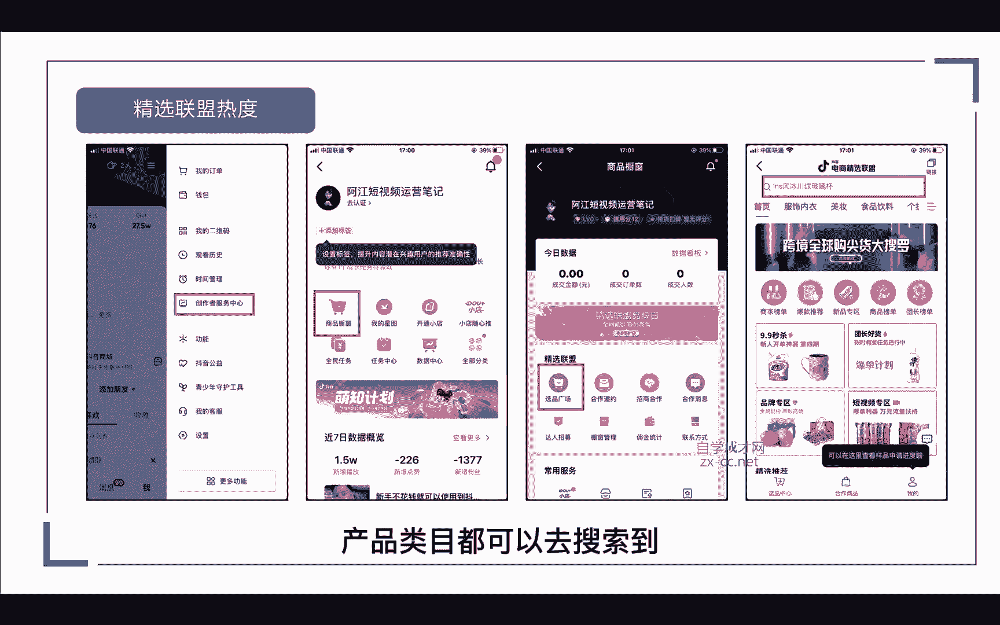
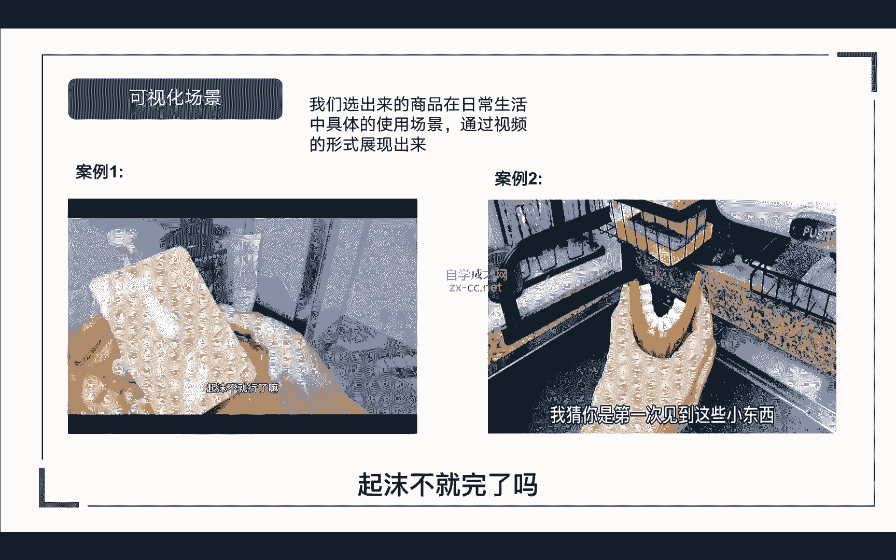

# 【2024强到无法呼吸】从最根本的起号／涨粉说起，抖店运营保姆级教学，全程实操不讲废话！ - P6：抖音小店运营营销技巧 - 决战桃花江 - BV1oLe4ejE3J

嗨大家好，我是阿张，继续进入我们的第二节课，抖音小店开店准备及流程，这节课呢我们主要是讲怎么去开店，那在开店之前呢。

我们要了解抖音小店有哪几种类型，这里呢一共有四种店铺类型，第一种普通店，第二种是我们的专营店，第三种是专卖店。

第四种是旗舰店，那什么是普通店呢，就我们在抖音小店啊，或者是你买商品的时候，你会刷到一些日用百货啊或者精选啊等等，这种都是个人小店，都是普通的店，那普通电呢它是适合我们个人来做。

如果说你要做无货源的模式，我们就可以开通普通店，这里呢不需要我们去提供商标，也不需要去授权，简单的办理营业执照，就可以开通我们的普通小店，那这里要注意的是，如果我们办的是个体工商户。

那我们就只能选择普通门店入住，那如果你办的是企业的话，你可以入住普通门店，也可以入住专专卖店，专营店，旗舰店都可以的，我们再来看一下什么是专营店，那专业店呢它是指同一品类，可以经营不同品牌的商品。

那比如说我是卖服装对吧，那我可以去卖耐克的，阿迪的，七匹狼的，安踏的，他们的服饰类目呢，我们都可以去售卖。

只要你有他们的品牌授权，我们就可以开专营店，那第三个专卖店呢，专卖店是什么意思啊，是品牌授权给各个渠道，或者是某一个区域的专卖店，那品牌所有的品类都可以卖，那比如说这个巴拉巴拉的品牌。

授权给我们做专卖店，那他这个品牌里面的所有内幕，鞋子衣服裤子裙子啊，这些品类只要他有的。

我们都可以拿过来卖，这是我们的专卖店，那还有一种就是旗舰店，旗舰店简单来说就是一个品牌的官方直营店，那在抖音上呢，一个品牌是只能开一家旗舰店的，那这个品牌的所有品类呢，我们都是可以去经营售卖的。

那以上呢就是抖店的四种店铺类型，普通店，专营店，专卖店以及旗舰店这四种店铺类型。

那如果说你只想做无货源，我们开通普通店就可以了，接下来到了我们开通小店的操作流程，在开通小店之前呢，我们需要准备两个东西，一个呢是我们的手机，还有一个是我们的电脑，手机呢一机一卡。

我们去注册好我们的抖音号，抖音号注册来干嘛呢，方便我们后期开通橱窗，绑定我们抖店的商品，那电脑呢是方便我们登录后台管理，我们的后台更加便捷，准备好这两个硬件设备以后呢，我们还需要去准备我们的营业执照。

那这里营业执照分两种，一种是有营业执照，一种是没有营业执照，如果说你是一家大企业，你有自己的营业执照了，那我们可以用这个营业执照去开通小店，但是呢如果你觉得后期唉做账啊，或者是纳税成本比较高啊。

我们可以选择重新再去办理一个营业执照，都是可以的，还有一种就是个体营业执照，我们的一个身份证呢可以办理五个营业执照，那一个营业执照呢可以认证六个抖音账号，那么有了这么多营业执照和抖音账号。

我们是不是就可以去做账号的举证，做小店的举证，那做过天猫的人都知道啊，现在天猫有一个硬性的指标，就是说你要去注册天猫店，你的公司必须要注册一年以上，那才能去注册天猫店，甚至有可能你还注册不下来。

那么抖音，虽然说现在办理营业执照就可以开店对吧，但我们为了避免它后期会有这个硬性的指标，我们可以提前储备好一些营业执照，先把小店开通好，这样对我们来说是不是更好呢，那这里是营业执照的准备。

接下来就到我们开店的流程，在我们开店之前呢，我们要准备以下17种材料，大家对照这个表格去，准备好相应的信息就可以了，接下来进入我们正式的一个开店流程，首先我们需要在我们的电脑端。

在浏览器里面输入这个网址，也就是我们小店后台的网址。

这里呢我直接打开后台操作给大家看，那输入这个网址以后呢，就会跳到这个页面啊，这里会出现一个入驻抖音小店，如果说你还没有开通抖音小店，我们准备好一个没有注册过的手机号，那在这里呢输入我们的手机号码。

然后发送验证码。

点击立即进入，点击立即进入以后呢，会跳转到这个页面啊，就是我们注册的页面，这里会让你选择主体的类型，那这里呢有三种主体类型，一个是个体工商户，还有一个是公司和企业啊，第三个是跨境商家。

那我们只要选择前面这两种就可以了，你看你办的营业执照是个体的还是公司的，那我这里就以我们公司的营业执照，来给大家示范一下，那点击进来以后呢，我们会看到这个界面，第一个呢是让你上传你的营业执照。

这里呢我们只需要把营业执照拍一张照片，上传到你的电脑，我们再通过这里文件夹去把它添加进来啊。

比如说我随便拿来试一下啊，给大家示范一下，那上传以后呢，它下面的表格公司名称啊，社会信用代码它会自动的填入，我们只要去核对一下是否正确就可以了，然后这个营业执照这里呢它会自动勾选长期。

然后经营地址它也会自动给你选择上面，然后经营地址呢它也会自动给你填写上去，如果不正确的话，我们直接点进去修改就可以了啊，然后到下面的就是法定代表人的信息，也就是你这个营业执照的法人身份证。

那必须要跟你法人身份证是一致的。

然后这里我们点击上传我们的正面。

同样的是上传以后呢，它会自动识别出法人的姓名，身份证号以及有效日期，我们只需要去核对一下有没有错误的就可以了，然后点击下一步，然后第二步呢是填写我们店铺的基本信息，你这个店铺你要开普通店还是专营店。

或者是专卖店，还是说要开通旗舰店，那这四种店铺的类型呢，前面也给大家说过，如果说我们做无货源的话，我们开通普通店就可以了，选择完成以后，我们就到下一步输入你的店铺的名称，比如说诶阿江百货对吧。

什么日用啊，日用品啊，或者是什么阿江精选啊，都可以，如果说你没有店铺logo的话，他会系统在这里给你生成一个白底图的图片，比如说我们随便改一下啊，阿江哎精选，那系统这里看到没有。

就会自动给你生成一张店铺的logo，如果说你有自己设计好的，我们把它点击上传也是可以的，然后就是肖像授权书，如果说你的这个店铺啊没有涉及到明星代言，我们不用选择直接跳过，那大家要注意啊。

这种带有红色星号的啊，就是必填的项目，然后接下来到了我们的经营类目，建议内幕的话，根据你的那个营业执照里面的，经营范围去填写就可以了，你可以这里可以随便先填写两个啊，后期我们是可以去更改的。

然后接下来就到了我们管理员的姓名啊，比如说这个店铺你要由谁来管理，我们再把它输入进去，以及管理人的手机号，然后输入完成以后呢，我们点击啊，这个我已仔细阅读并同意提交审核就可以了。

那因为我这个营业执照呢它经营内幕比较特殊，我就不在这里给大家展示了，接下来第三步呢就到了我们的资质审核。

我们返回我们的PPT，那如果说你有行业特殊的资质啊，比如说选择一些特殊的主营类目，那必须要在他的相关信息里提交一些资质，那在这里的资质主体上呢，我们要与入住时保持一致，并且经营范围是包含所选的主营类目。

还有就是品牌的资质信息，如果说你这个店铺涉及到一些品牌，我们需要去填写一些商标的注册号，如果说以上两个都没有的话，我们直接跳过就可以了，然后这里简单给大家展示一下啊，一些行业资质所需要用到哪些。

比如说许可证，它可能需要食品的流通许可证啊，还有3C数码的或者是图书的，那他都会需要你提供这样的许可证，那还有一个呢就是质检报告啊，比如说你涉及到一些移动电源或者电源适配器，以及拉杆箱等等。

他会需要你提供一个质检报告，那第三个呢就是品牌授权，你要的店铺要卖品牌的，那你就要得到该品牌的一个授权书，我们把授权书上传上去就可以了，这些呢在后面都是可以再去操作的啊，都可以去修改的。

那当你这些啊信息填写完成以后呢，签署好合同协议，他就会进入一个资料的审核期，那一般呢是在1~3个工作日，如果说你想快一点，我们可以选择在下午的四点左右去提交，那么他审核通过的时间可能会短一点。

那审核通过以后呢，我们就需要去缴纳我们的保证金，它是根据我们的类目，那类目表在前面已经给大家放出来了，那什么样的经营范围，他的类目是多少啊，都有详细的写出来，那你选择完成以后呢，系统会自动跳出来。

要交要缴纳多少保证金，你这时候去充值缴纳就可以了，那么以上呢就是我们开通抖音小店的流程，如果说你在这期间遇到什么问题或者不懂的，都可以来问我啊，都可以来问我，我都会给你一一做解答，那小店开通完成以后呢。

我们要去开通我们的抖音橱窗，那抖音橱窗如何开通呢，这里涉及到两个板块，一个是1000粉的，如何开通橱窗，就说你这个账号本来就有粉丝，有作品了对吧，我想去开通橱窗，那还有一个就是我们新注册的账号。

没有粉丝，没有作品，该如何开通橱窗来，首先第一个，如果你的抖音号满足了以下四个条件，第一个实名认证，第二个作者保证金500块钱已经充值了，然后第三个是我们的视频数大于十条，一定是有效的作品啊。

不包括那些隐藏的或者删除的，那最后一个呢就是你的抖音粉丝账号，一定要有1000的粉丝，那满足以上四个条件以后呢，我们就可以去申请开通我们的抖音橱窗，那这是我们1000粉丝开通抖音橱窗的方法。

那在这里呢有一点要注意啊，就是说比如说你这个抖音账号有粉丝基础对吧，之前开通过抖音橱窗，也挂过小黄车对吧，那你这个抖音账号的手机号呢，你去开通抖音小店。

它会跳出一个这样的页面，当前账号资质为个人，那暂不支持使用个人身份证入驻开通抖音小店，那如需开店，请更换你的手机号对吧，那会很多人会遇到这个问题，他就是想用现在的抖音号去开通抖音小店。

但是呢平台出现了这个规则，那怎么办呢，这里呢就涉及到接下来我要讲的官方账号绑定。

来我们回到PPT，我们先看一下啊，零粉丝如何开通抖音橱窗，那在我们的抖店后台呢，会有这样的一个这样的一个界面，在我们的官方账号这里，可以去绑定一个抖音账号，但是要注意的是啊，这个官方账号一旦绑定以后呢。

就没有办法解绑的，那这里这个方法呢同样可以用到，刚才我们遇到那个呃，个人账号无法开通抖音小店的那个问题，那这里我们可以把我们的抖音小店，绑定到我们的那个抖音账号，把那个抖音账号绑为我们的主体。

那具体怎么操作呢，我打开后台给大家看一下。

进入到我们抖店店铺以后呢，我们点击右上角这里有一个我们的店铺名称啊，点击一下它会跳转到这个页面，在这里呢有一个官方账号绑定，那这里呢就只能去绑定我们一个抖音账号，而且是无法解绑的啊。

这里大家一定要想清楚，我们到底要绑定哪个账号，那这里呢就可以去绑定，刚才我们所面临的那个问题，个人账号无法开通抖音小店对吧，那我们可以把这个绑定到我们的那个，已经有粉丝基础的账号。

或者是绑定到我们新开的账号。

没有粉丝基础的，那这是一个方法，那还有一个呢就是绑定我们的直营账号。

那直营账号呢可以绑定五个，从哪里进入呢。

来我们看一下，在我们的营销中心，抖店的营销中心啊，点击进去，我们往下滑，找到最后这个账号管理，在这里面呢我们可以去绑定五个抖音账号，包括零粉丝的啊，都可以绑定，但是绑定了以后呢，每个账号180天内。

是无法进行解绑与换绑的，就是说一定要满足八一百八十天，我们才可以去把它解除绑定，或者是把它删除掉，那在这那在这期间呢我们是无法解除绑定的啊，一定要记住啊，这里可以绑定我们的五个账号。

以及我们前面讲的这个啊，官方账号总共的话一个小店可以绑定六个账号。

那抖音账号绑定成功以后，我们需要去抖音后台去缴纳我们的注册保证金。

在抖音后台我的界面找到创作者服务中心，下面呢会有一个作者保证金，我们点击进去，然后点击立即充值，我们把金额把它充进去就可以了，这里就完成我们的保证金交纳。

那我们前面小店和橱窗都已经开通了，接下来就到了我们的选品步骤对吧，那在这里呢分为两种人群，一种是有货源的，他有自己的供应链，一种是没有货源的，如果说你是有货源的啊，假如你的产品价格本来就卖的很高。

在抖音上对比同行的产品价格，你根本就没有优势，那我们就卖不动，那这个时候呢我们只能换产品，或者是调整你的价格，那还有一些做线下的，本来就卖不动对吧，那这个时候你是不是该放弃就把他放弃了呢。

我们重新去找品呀，那我有一个朋友，他原来就是做服装的，他供应链做的真的很苦逼啊，因为他没有合适的供应链，后面他换了，他就换了赛道去卖餐具，因为他后面找到了一个很强的供应链嘛。

在抖音小店一个月就卖了6000多万，所以有时候我们该变通就要变通对吧，那如果说没有货源的应该怎么办，那你要找货源，我们应该从哪里去找呢，那这里呢我针对没有货源的人群。

已经通过数据给大家整理出来三种热门的品类。

第一种生鲜水果农产品的，比如说苹果啊，葡萄梨子，哈密瓜这些水果或者山楂片等等，第二种日常百货生活用品啊，比如说我们的洗洁精，洗衣液，牙膏牙刷，床上四件套以及纸巾啊这些等等，那第三种呢是家居用品。

厨房用品啊，洗衣机，冰箱沙发电视机等等，那这三种为什么是热门产品呢，第一个它是不是快消品啊，我们吃了可能还会吃，那我们用了还会用的东西对吧，以及我们生活中日常必备的产品。

那这些都属于一些快消品或者是高频次的，那我们可以通过这三种品类去筛选，适合自己的产品，那我们再去筛选产品的时候呢，我们一定要通过这三个维度去选择产品，第一个主播是否带货频率高，如果说这个带货的频率越高。

就证明这个产品就很火爆，但第二个去各大电商数据的榜单，看一下有没有这个产品，如果连这些平台都没有的产品，我们一定不要去拓荒，第三个再去精选联盟搜索，看一下它的热度是否高，是否排在前面。

那精选联盟热度越高的达人更愿意去带货对吧，证明这款产品它是大众认可的，它的销量也高，那我们怎么去查看这些数据呢，这里呢我们可以通过两个数据平台去查看，一个是飞瓜数据。

一个是蝉妈妈数据，那这里呢我就打开飞瓜数据给大家演示一下啊，那我们从哪里去看主播是否带货频率高呢，我们可以从电竞选品啊去查看一下商品的榜单，比如说它这里面有日榜啊，周榜还有月榜啊，这三个榜单都能去看到。

那这里面有很多商品分类，服饰服饰，内衣啊，美妆啊，珠宝文玩，食品饮料啊，鞋服包包都可以看到，那根据我们自己的品类，前面说好了，筛选好的品类去选择啊，比如说我们看一下这个食品饮料。

那食品饮料现在排在前第一名的呢，诺特兰德的一个维生素片，那我们要怎么查看这款产品，带的达人是否高频呢，我们可以去直接搜索洛特兰德多维生素片，那我们在商品搜索这里去搜索一下，我们点击30天的销量来看。

来我们随便点一款进去啊，看一下，这里进来以后呢，我们会看到一个热度分析，以及他的带货视频，带货直播，带货主播成交画像，用户的评价和相似的产品，那我们怎么看主播呢，我们就点击带货主播，在这里面呢。

我们会看到带货的主播有多少人对吧，详细的列表以及这下面会有一个表单啊，近30天的一个数据表现，它的销售量是多少，164万，163万，然后热推的达人有1万2000多个啊，这个只是在飞瓜数据上。

当然我们还可以通过产妈妈去查看，那他具体的操作方法都是跟非刮都是一样的，去搜索关键词，或者是通过榜单去查询都可以看到，那通过这个数据呢，我们就可以看出给他带货的达人非常多是吧，那这是一个带货高频的产品。

那除了抖音商品榜呢，我们还可以通过实时的爆款去看一下哎，最近一到两个小时，或者最近24小时销量比较高的产品，那排在第一的呢是这个牛油老火锅对吧，他的24小时销售量达到了18。1万，那近两小时呢达到1。

6万单，那它关联的主播呢有600多个，证明这个产品也是非常高频的对吧，那下面还有很多很多的啊，我们可以去看一下有没有适合自己的品类啊，有没有符合自己的商品类目的去看一下，就知道自己该选什么样的产品。

那么除了通过数据平台去查询数据呢，我们还可以通过精选联盟去查看一下它的热度，是否排名在前面，然后佣金是多少啊，我们打开抖音创作者服务中心以后呢，这里会有个商品橱窗，点击商品橱窗以后。

这里会出现一个选品广场，我们点击选品广场就跳到这个精选联盟的页面，那在这里输入关键词，或者是啊产品类目都可以去搜索到。

那这里呢我们就以刚才这个产品来做案例，来搜索一下，那搜索出来以后呢，我们可以看到它的一个销售销售量啊，700多万单，然后它的售价是24块九，佣金率呢是20%，那还有另外的类似的产品啊，类似的产品。

但是它的销售量，还有他的佣金是不一样的，以及它的销售额，你看这个是返七七块二，那佣金是比较高的，那达人在选品的时候呢，他就会优先的去选择一些高佣金的啊，或者是高销量的产品，那还有一种呢。

同样的我们也可以去看一下他的排名，什么样的资金排在前面啊，他的佣金是怎么设置的，那这个我们是通过精选联盟去查看它的热度，那除了非瓜呢，这里还有一个蝉妈妈的一个数据截图，同样的我们同可以通过实时的爆品啊。

比如说直播间的商品榜，还有达人带货榜，今日直播榜等等，还有全天的销量榜，还有我们的抖音热推榜，通过这几个榜单去查看，每天或者是每一周，每一个月它的一个爆品是什么样的，它的产品属性啊，它的产品价格。

它的产品佣金以及带货的达人，还有它的销量以及它的转化率，我们都可以非常直观的去查看到，然后通过对比呢再去选择适合我们自己的产品，那我们除了通过数据去查看呢，我们同样可以通过视频去看看一下。

我们选出来的商品，在日常生活中，它的具体使用场景，可以通过视频的形式把它展现出来，我们先来看一下这两个视频，好多小伙伴说这东西太经用了，有点买多了，确实他出了名的吸油不沾油，同时还有一个最重要的油。

就是它不用的时候晾干就真的干了，干成饼干那样的，所以不容易滋生细菌，再加上不容易破，自然也就延长了它的使用寿命，但你们洗碗的时候，难道没发现还可以换一种用法吗，比如这样，反正在家用。

谁也不知道咱用啥打的沐浴液，对不对，起沫不就完了吗。

我猜你是第一次见到这些小东西，刷胡萝卜黄瓜土豆。

地瓜的刷子不用再用手搓土豆了，看看他刷出来的土豆，专门修包菜，甘蓝的剥丝器，用了它以后才知道，怪不得西餐厅的蔬菜沙拉都切得那么细，挂在冰箱里的收纳盒，7788的小料包都收纳在这里。

鸡蛋计时器有了它可以吃到嫩嫩的鸡蛋。

颜色变到半熟的时候，煮出来就是糖心蛋了，这叫一网打尽。

不用再用手抠这个脏水槽了，巨无霸大漏勺，实际比看上去还大，特别能装带握柄支撑。

不用担心它滑到锅里，吃玉米粒的一根玉米，几秒钟就能消下来。

不用再蘸油，直接就可以挤出油来的，油刷也不会漏油，还带专门的收纳盒，专物专用。

放鱼放肉的保鲜盒，能承受到零下20度，直接冷冻，有这层小隔板，解冻的时候也不用担心肉被水浸泡了，像这种长条蔬菜也可以放，不会漏米，又能把米淘到很干净的淘米盆，洗果蔬杂粮也没问题。

每次吃完饭还剩这么一丢菜扔了，可惜把它往里倒，这个容量刚刚好，这些实用的小东西快点收藏呀，那我们通过这两个视频是不是可以发现诶，这些产品都可以通过可视化的场景，展现给我们的用户对吧。

那我们在做精选联盟的时候，或者是我们要自己做内容的时候，就可以通过这种形式把你的产品给它体现出来。

那这是我们可视化的一个场景，那么我们还可以通过参考同行去看一下。

同行这款产品卖的是什么价格，然后我们来到飞瓜数界，那怎么去搜索呢，在商品搜索这里，我们去输入关键词，比如说哎我是卖洗碗机对吧，我们就去输入一下关键词，洗碗机，搜索出来呢这里会有个排序。

我们可以去看昨日的销量，或者30天以内的一个销量，那在这里呢我们可以直观的了解到我们的同行，他们的销量以及他们的定价，以及他们的佣金率是多少钱，我们都能明确直观的了解到，那比如说销量最好的啊。

就是这一款排在第一的嘛，那这个1。2万是他昨日的销量，那它先30天的销量是23。8万，那我们就要去看这款产品，它为什么会这么爆啊，为什么会卖的这么多，我们就通过前面讲的啊，查看他带货的主播有多少。

带货的直播有多少，通过这几个维度去看看这这款商品，那带货的主播，这里可以看到700多个人给他带货对吧，给他推那带货的视频呢也也有100多个，但是他的带货视频销量并不高啊，只有480多单。

那他是如何把这些产品销出去那么多呢，我们再看一下直播带货诶，这里是不是就可以看到他的直播，带货数据还比较好诶，3000多场的直播带货，然后销量呢基本上都在这里，它是通过直播带货出去的。

那这里也可以看到给他带货的主播有哪些啊，看了一下，基本上都是同一个主播，那说明他这个产品呢这个达人是给他主推的啊，基本上都是他在卖，那这个时候如果说你有相同的产品，然后你的价格也有优势。

我们是不是可以去找到这些主播，让他帮我们带货呢，那关于怎么去对接达人，怎么去谈合作的方法呢，在我课程的第四节课会详细给大家讲到。

那除了参考具体数据以外呢，我们还可以通过去关注一些易出单的商品，比如说卫生纸啊，洗洁精，洗衣液，沐浴露等等对吧，这些都属于什么快消品，高品质的产品啊，家家户户都需要用到对吧，他没有标签的之分。

那这种产品就比较容易出单，以及刚才我们所说的洗碗机对吧，它是需要定时定期换的，用久了它可能就吸水性不好，那这些产品呢都是容易比较出单的产品，那如果我们刚好有这样的供应链对吧，我也能找到这样的货源。

我们是不是就可以去做这种品类，做这种商品，那以上呢就是我们去选品的一些方法和技巧。

我们除了去看数据呢，我们还要去分析这个产品，第一分析他这个产品是否热卖，那意思就是，比如说刚才我们对比了常妈妈和飞瓜对吧，还有淘宝拼多多等等这些平台进行查看以后，看看它的销量怎么样，热度怎么样，对吧啊。

销量高的热度热度比较好的，那说明这个产品很容易爆啊，也也是一个爆品，那第二个就是是否高频，就是你选择这款产品在现实生活中唉，大家使用的频率高不高，消耗的快不快，像纸巾啊，洗洁精啊，洗衣液这些等等。

那第三个就是是否应季，那你选择的这款产品呢，它是否是当下比较容易让人接受的，那比如说现在是夏天，当然现在夏天已经过了，现在是秋天，那比如说夏天别人都在穿短袖，你是不可能去卖长袖对吧，那我们一定要切记。

不要去卖一些反季节性的产品，那第四个就是是否好评，那选择一款好的产品呢，最好的方法就是看一下最新的好评，如果说你选的这款产品它比较差对吧，那差评比较多，可可能就会导致你到时候如果爆单了。

那会有很多的售后的问题需要你去解决，所以说前期我们选择一个好的产品。

看好评是至关重要的，刚刚没有给大家看到好评，怎么看啊，那我们回到这里啊，我们回回到数据这边来，在左边这个地方呢它也会会有一个评分，那这里呢它有一个评价啊，就是这个产品的评价，好评率中频率。

差评率有多少，我们也可以点进去详细的查看一下，这里呢就会跳到商品的一个评价页面，这里就会出现一些好评差评，我们都可以去看一下这个产品它好在哪里，它差在哪里啊，这是我们查看好评的一个方法。

接下来就是我们选品的重要指标，这里呢有三个重要指标，第一个是关联达人，第二个是关联视频，第三个是关联直播，那什么是关联达人呢，其实在前面给大家演示的时候，我已经给大家讲过了。

就是看这个产品它关联的主播数啊，有多少人有多少人给他带货，比如说这张图给他带货的达人呢，有578位，其中销量最好呢就是我们排名第一的啊，这个二牛厨具它的预估销量呢是30万，那其中呢包括视频的销量1。

9万，和他的直播销量28。1万，那通过这个数据呢，我们可以看到这款牛油火锅，给他带货的达人是相对比较高的，证明这个产品呢它是比较容易让人接受的，低价的产品，一块5~1块八，就这个价格真的是非常的低。

那它的转化指数呢也是非常的高，都是七八十七八十，证明这款产品啊是符合大众需求的，那如果说你有相类的产品或者类似的对吧，我们可以去开发一款啊，或者是去找到一款同样的产品，去找达人帮你带货。

那第二个呢就是关联的视频啊，刚才也说了，他的带货视频有多少个，我们主要看一下他的销量，是从带货视频呢还是带货直播铺出去的，一般都是通过直播销售出去的量更大一点，那以上三个呢就是我们选品的重要指标。

有的同学可能会说哎我们刚开始做抖音小店，没有达人资源，要怎么去找到合适的达人呢，前面我给大家说了，我在第四节课呢会详细的给大家去讲到，怎么对接达人，怎么去洽谈，怎么去合作好吧。

那接下来我们讲一下产品上架的一些细节，在产品上架之前呢，我们会有一个数据包对吧，里面呢包含了主图详情页，有的可能甚至会有一些宣传的短视频，还有我们的产品标题描述以及产品价格等等。

那这里着重讲一下我们的产品标题和主图，那在这里呢大家一定要去注重产品的标题，未来抖音呢一定是注重搜索的一个电商平台，现在抖音上的所有的用户，都已经培育成了搜索的买家，他就会自然的去抖音搜索他想要的东西。

比如说我们平时打开抖音对吧，我要买什么东西，我会去搜一些关键词啊，或者一些新闻等等，那于是未来呢抖音也会成为搜索电商。

所以我们一定要注重产品的标题，那现在呢有很多主播他是不注重产品标题的，那为什么呢，因为他们都不是靠自然流量来变现对吧，他们都是通过直播啊去进行一个，他们很多都是通过直播去进行卖货。

比如说设置一些秒杀等等对吧，那我们不同，如果我们做抖音小店，如果想要靠自然流量来变现，就需要去优化我们的标题对吧，那趁大家还不重视的时候，别人不做，那你去做了，那你是不是就有机会，那这就是你的优势对吧。

我们看下这两张图，他们的他们的标题呢都没有去优化，都加了一些什么英文加数字啊，这个可能就是这件衣服的货号等等，这也是他们为了方便去发货。

那这个时候如果他们注重产品的标题，比如说有个用户他去主页搜索关键词对吧，比如说我们搜索这个泡泡群，那通过泡泡群呢，这三个词它会在我们的抖音界面，出现一个商品的综合界面里面，就包含了我们产品的一些信息。

那这个分类呢是平台给他推荐的产品分类，比如说下面的连衣裙，盲盒公主裙，秋款网纱连衣裙对吧，它是通过我们搜索这个关键词系统，再给你匹配的一些分类，那除了这个综合界面呢，还有一个就是我们的商品界面。

它同样可以展示出我们搜索这个关键词，它所包含的产品，那如果说刚才前面这两个主播，他们的这个衣服里面都有包含这个关键词，是不是就可以在我们的这个搜索界面展示出来，就可以获得一个免费的流量对吧。

这也是我们为什么要去注重这个关键词搜索，因为我们要去拿免费的流量嘛对吧。

我们就一定要注重这一个，我们除了通过综合页面和商品页面呢，我们还可以通过商品页面里面的直播中，去搜索到这款商品，比如说你搜索这个关键词。

它正在直播当中，我们同样是可以搜索到的，那我们再来看一下这个案例，这个主播呢他就非常懂得去优化标题了，这一看就是做过淘宝的人对吧，因为做过淘宝的人，他有个先天的优势，他非常懂得平台的算法。

还有如何去窃取到一个免费的流量，那他不开播的时候呢，他这些产品同样可以把它卖出去，用户呢可能会通过搜索T恤或者余文乐同款，他就会搜索到这个产品，看到这个价格还比较满意，他是不是就购买了。

那我们要怎么样设置我们的标题，才能最大化的获得免费流量呢。

那设置标题呢还是很有讲究的啊，如果做淘宝的，他就会知道怎么去优化标题，这里呢就给大家拿一个案例出来讲，那我们标题的字数呢它是限制在30字以内，那标题里面呢我们可以包含吸金词，核心词。

长尾词以及品牌词或者是泛词，那我们看一下这款商品它里面包含了哪些词，我们先把标题给它打出来，爆款森马连衣裙泡泡袖，2021秋款星际荷叶边裙，那这里面是不是包含了一个吸金池，也就是我们的爆款。

那里面还包含了我们的核心词，秋季新款2021，以及它还加了两个长尾词，荷叶边裙，泡泡袖，那它这个产品呢还涉及到我们的一个品牌，那就是我们的品牌池可以把它放进去，如果说你的产品没有品牌。

我们一定不要去加品牌词，除非你有这个品牌的授权，否则的话会涉及到违规，你的产品可能会被下架，那在这里有一点要注意的是，如果说你做的是无货源对吧，因为后期我们涉及到会用批量上传的软件。

把一些产品给它上架上来，那在这里的时候呢，我们就要去注意，或者是如果说你的店铺没有授权，品牌里面是否有品牌词，如果有的话，我们要及时去把它修改了，把它删掉啊，这是我们要注意的一点。

那这个是我们标题的设置，以及我们前面讲的标题，搜索标题的以及我们前面讲的标题的重要性，我们尽量的把标题的数字给它填满。

那第二个主图，那组图的目的是为了什么，肯定是为了吸引注意力对吧，比如说右边这三张图片哎，买两份送十包，30包只要九块九，有它谁还用洗碗布，对不对，这些图片是不是就很能吸引用户的注意力。

那同样的我们在做无货源的时候，我们在上传产品一定要注意主图，还有详情图里面不要留有水印，还有品牌词，我们要去选优选一些高清的图片啊，那这个组图呢我们一定要重视一点，就是你现在去淘宝搜索。

你会发现很少会有这种像这种牛皮癣的主图啊，为什么呢，那是因为在以前淘宝的商品主图，有很多乱七八糟的图片，当时为什么会有这么多牛皮癣图片呢，就因为当时大家都要为了博眼球对吧，要点击率。

有点击率他们才能进店嘛，所以说就会有人，故意在主图上做各种各样的奇葩图，那最早呢在淘宝上它是OK的，但是当商品多了以后呢，整个平台是不是视觉感就不好，那这个时候呢淘宝就开始严厉打击，不准出现一些促销的。

或或者是各种很low的图片对吧，就像现在这种图片什么有它谁还用喜欢播，这些都是淘宝以前很早的玩法了，但是目前呢在抖音还是个机会啊，只要你的产品足够好，想象力足够丰富，你的主图，只要在不违规的情况下。

平台都是允许的啊，只要你想要对吧，在抖音上都是可以展示的，但是我敢打赌啊，再过一年，所有的这些牛皮癣图片你都会找不到的，因为平台的发展就是一个趋势对吧，现在的一个过程就是捡钱谁牛逼。

谁懂谁入局了谁就能赚到钱，那这就是我们组图的重要性，那这里讲完了产品的上架注意的细节，我们这边跳转到后台，给大家看一下我们的产品该如何去创建。

我们在抖店的后台呢，在左侧的功能栏我们找到商品，这里呢会有一个商品的创建，那如果说你是有自己的货源，我需要上传自己的商品，我们就可以从这里去创建我们的商品，根据类目呢去选择你的商品啊，比如说卖女装。

我们就选择女装啊，随便选一个啊，半身裙，点击下一步，然后这里呢会出现一个商品的标题，这里呢就是刚才给大家讲的标题啊，能打满30个字，我们就把30个字给它填满，那如果说你有品牌的话。

我们这里可以点击使用品牌，没有就算了，这里呢会要求你上传五张主图啊，也没有说非要一定上传五张，但是呢如果你想要获取自然流量，这里上传五张，把它上传完是最好的，是最好的，然后上传完成以后呢，如果你有视频。

我们可以上传视频啊，这里还有一个素材图，比如说你有白底图啊对吧，我们可以上传白底图，那到下面就是商品详情页，你可以把它复制过来，复制过来以后呢，还可以进行编辑来啊，发货的模式。

现货发货一般我们都是选择这个，如果说你没有预售款，我们就不要去选这个现货，发货的时间，我们可以选择48小时，24小时，那这里呢我建议大家去选择24小时，因为用户在购买商品的时候，他会看你这个发货的时间。

如果你的发货时间48小时诶，有点等不及，他就不想要买了，那我这里我们选择24小时是最好的，然后接下来就到了添加商品的规格啊，你的商品它是什么尺码对吧，因为我们这里卖的是衣服，他就是尺码啊。

如果说你是卖其他产品，它的规格是不一样的，然后这里是价格与库存，这些带有星号，红色星号的都是必须要填的，价格与库存，这里呢可以进行批量的设置，就是你这里有多种规格，多种属性的，我们这里可以批量设置。

比如说售价99对吧，那这里还有一个划线价，划线价呢就是说你这个产品，比如说原价就是你衣服上面那个吊牌价，比如说吊牌价199对吧，哎那我们这个99，那这样呢我们的价格就设置好了。

然后这里有一个订单库存技术，一个是下单减库存，一个是付款减库存，那这两个区别呢都很好理解对吧，一个是用户下单以后唉它可以减库存，一个是用户下单以后付款减库存，这两个区别啊，一个是下单还没有付款。

一个是下单以后付完款才减库存的，然后到下面呢是我们的运费模板，如果说你没有自己的运费模板啊，你可以选择标准的包邮，如果说你有自己的运费模板，你有合作的快递，合作的商家，我们可以自己去新建啊。

这里就不给大家一一去展示了，那售后服务这里呢是必须勾选的啊，系统默认勾选的，这里面还有一个详细的啊，比如说上架的时间啊，同商同店商品推荐，系统推荐或者手动配置等等等等啊，自己去设置就可以了。

然后在下面呢是一个商品资质，比如说前面我们说的涉及到一些3C数码呀，比如说一些移动电源啊，或者是箱包啊等等，它可能需要一些商品的资质，那这里就需要我们去上传，上传完成以后呢，我们再检查一遍这些星号啊。

有没有出现这种红框的，如果说有出现红框，证明这里没有填写对哦，我们去把它填写完，或者是把它填写正确，然后再发布商品就可以了，那这是我们商品的一个创建和上架，那对于那针对于做无货源的。

我们的产品上架该怎么上架呢，在第四节课会详细给大家讲到，我们都不用像这样一步一步的去手动添加，我们都是批量化的。

来，我们继续讲一下截流选品，那什么是节流选品，简单来说就是通过低价格截取同行产品的流量。

那我们应该怎么去选呢，我们要从这两个维度。

一个是销量，一个是利润，那销量呢，我们可以通过非关数据去查看一个实时的爆款，通过这里面去看一下有没有自己品类的产品，那我们选择的时候呢，最好是选择那种销量，1000以内低于200是最好的。

因为如果说它的销量已经很高了，很爆了对吧，那你很那你会很难突破这个流量池，很有可能截取不到他的流量，那我们去选择一些销量比较低的，那我们后期补单呢可以更加的轻松对吧，那我们看下这个，比如说这款火锅底料。

他现在已经卖的很火爆对吧，卖的很火爆，这款我们不用去考虑了，我们可以再往下看一下，哎比如说这个100多的这个手机支架，看下这个是否适合你自己的品类，你的经营内部里面有没有这一款，然后再看看这个水蓝对吧。

那你是不是做日用百货的，那如果刚好我们也有这个供应链的渠道对吧，我们就可以通过低的价格，高的佣金来截取到它的流量，那这里同样会涉及到去对接达人，对接达人的课程呢，在我的第四节课。

那这里我们要注意的就是一些季节性的产品，比如说一些过季的或或者是反季节性的产品。

我们就不要去选择了，那第二个维度呢就是利润，同样的产品对吧，我们的拿货渠道和我们的售后售卖渠道，那我们的利润最好是控制在30%，到50%就可以了，这个呢就要根据你自己去控制了。

为什么我们要留30%到50的利润空间，因为在后期如果说你要做精选联盟的话，你必须要给达人预留。

20%到30%的佣金，那这是我们截流选品的方法，接下来我们讲一下产品该怎么定价，那在产品定价之前呢，我们要搞清楚你的产品是要自产自销，还是要找达人带货，如果说你要自己卖，那我们可以剔除掉中间的差价。

把整体的价格策略往下调，那如果说你要找达人卖货，我们要分销对吧，我们只做供应链，做精选联盟，那你只需要给达人留足够的利润空间就可以了，做服饰类的啊，达人的佣金一般在20%到30%，食品类的5%到10%。

珠宝的20%到30%，剩的有甚至有的还会到50%，那这个呢，我们可以根据同行的佣金来进行一个设置，后面都会讲到，那如果说你做自产自销呢，你就要想清楚，比如说我有一支钢笔。

那这个钢笔在平台上适合卖什么样的价格呢，对吧，原来我是想在抖音上卖49块九，然后我去抖音查看了一下诶，最高的才卖29块九，那你如果说我还卖49块九，一个销量都没有，那是不是自己就把自己作死了。

所以这个时候呢，你就要根据市场的行情来进行调价，那实在不行的话，我们就换一个屏对吧，这也是很多人为什么让他去做线上，他不敢去做，因为他过去卖线下卖高利润，卖习惯了，因为他卖高利润是因为他量少啊。

他必须活下来对吧，但是在这个平台呢不一样，这个平台流量很大，我们也不用担心流量，我们可以薄利多销嘛对吧，赚的少一点，那我们把价格往下调一调就可以了，那这里呢还有几个定价的技巧啊。

我们可以通过非整数定价法，心理价格定价法，差异定价法，A加B定价法来进行一个产品的定价，第一个什么是非整数定价化，就是指这个商品的价格，它是处于一个整数和零头的中间。

那比如说六块九，九块九，19块九，这样用零头定价的一个产品，让用户看起来是不是感觉诶好像还便宜一些，比你用这个七块钱，十块钱，20块钱，看起来要舒服的多对吧。

那第二个呢就是心理价格法，通过客户的心理价格去定价，我们要去了解到客户对于这个产品。

它的一个心理价位是多少，比如说我们这个卖一块钱的，和这个卖0。9元的，这两个是不是看起来差不多对吧，那我们如果说再改成0。39元呢，那是不是站在用户的心里来看，唉这个价格好低啊。

好便宜啊，哎就想买这个对吧，那这是心理价格法，第三个差异定价法，差异定价法呢是指在同行产品的价格上，定价的更高，差距显得比较大，比如说别人卖一块八，我卖六块九对吧啊，我卖六块九，我还卖的比他好。

那我卖了24万单，为什么，因为现在很多人他都有从众的心理嘛，他觉得诶这个一块八看起来好像对吧，是很便宜，但是它的质量我不敢保证，那这个六块九的不一样啊，他相差的还是比较多的对吧，可能这个质量会比那个好。

这就是很多人的心理啊，他就觉得这个价格差异还是蛮大的，那我宁愿选择贵一点的对吧，就觉得贵的产品才是好产品，那第四个呢A加B定价法，比如说一件十块钱的衣服啊，我们两件15元或者是买一送一，买二送二等等。

让用户感觉到了便宜啊，而不是看起来很便宜，知道吧，有的时候用户呢他看到这个价格，他觉得可能并不便宜，但是在看到你这个买一送一哎，或者是这个两瓶到手99，他就觉得诶我赚到了，我占到了这个便宜。

那这就是A加B的定价法，那么不管你是做无货源的，还是你是有供应链的，我们都可以用到以上四种定价的法则，好的，第二节课就到这里结束了，有关于小店开通的问题，如果说有哪里不明白。

有不懂的或者遇到什么问题都可以来问我，那第三节课呢，我们是关于抖音小店运营的一些技巧，我会去讲一些工具的使用，以及我们店铺的新手考核期，以及我们怎么样才能去解除1000单的限制啊。

还有店铺的一些规则啊等等，还有团队该如何搭建啊，人员该怎么分工啊。

在下节课呢都会详细的给大家讲解到。