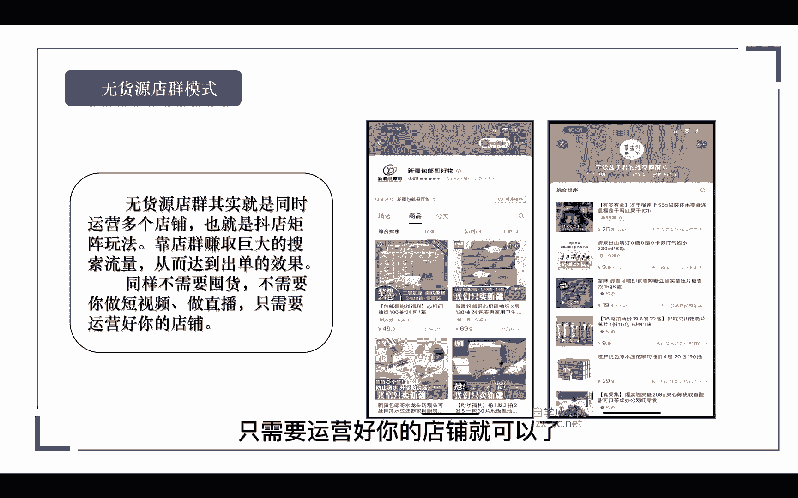

# 【2024强到无法呼吸】从最根本的起号／涨粉说起，抖店运营保姆级教学，全程实操不讲废话！ - P7：抖店四种玩法-自播玩法 - 决战桃花江 - BV1oLe4ejE3J

接下来进入我们的第四节课，那么在课程开始之前呢，我们要知道抖店有哪几种卖货的玩法。

这里呢给大家整理出了，我们抖店的三种卖货玩法，第一种店铺直播，第二种无货源店群，第三种精选联盟，那么除了这三种玩法以外呢，我们还可以去获取一个免费的自然流量，那就是猜你喜欢。

首先我们先看一下什么是店铺自播模式。

在未来的企业都必须要走直播的这条赛道，店铺直播呢是所有企业必须要生存的技能，为什么这么说，现在目前我们在抖音上，看到那些卖的好牛逼的人都是谁，是不是几乎都是达人对吧，那店铺直播呢是在疫情过后。

企业才慢慢入驻进来，那么在更早的时候呢，更多的是达人在带货，因为抖音它本来就是做泛娱乐的嘛，更多的是达人模型，那么现在你看到的那些卖的很好的，比如说罗永浩啊等等这些大主播的数据，他们都还是达人对吧。

达人说白了就是二道贩子嘛对吧，以他的个人IP，以他的个人流量去帮别人卖货，那么他也是需要去链接产品方的，那如果你本身就是供应链，自身就是品牌方，那你本身的优势就是大于他们的对吧，所以说在未来。

所以说在未来，所有的企业都是必须要走淄博这条赛道的，你看现在这些达人虽然卖得很好，但是呢这些达人都是存在不稳定的因素，因为在未来呢，抖音不会把流量倾斜给哪一位主播，他更多的是希望把流量分散给到所有人。

那于是呢这个平台才能健康的发展，如果当下你有自己的产品，你有自己的生产，有自己的供应链，所以说你做直播是必备的，当然直播的时候你会思考诶，直播我不会搭建团队怎么办。

那末节呢录制了一套非常完整的直播带货课程，你们可以去看一下，哪怕是一个小白，从0~1怎么去取号啊，甚至是团队怎么搭建啊，团队怎么培养啊，团队岗位应该做什么，全部都讲的很仔细。

那么你们是不是，就可以形成一个自己的商业帝国，我们再来看一下无货源店群模式，无货源店群呢，其实就是同时去运营多个店铺对吧，可能你一个人可以运营五个，运营十个，那也就是抖电的矩阵玩法。

靠抖电赚取巨大的搜索流量，从而达到出单的效果，那么同样呢我们是不需要去囤货的，也不需要你去运营短视频，也不需要运营短抖音号对吧，只需要运营好你的店铺就可以了。

那么具体的玩法呢，我会在后面给大家详细的讲解到，那我们再来看一下精选联盟模式，如果说你玩抖音小店不会直播，也不会拍短视频，那怎么办呢，我们是不是可以找达人带货，那这也是最好的方法。

通常情况下呢我们会把商品发布到精选联盟，然后呢，会有一些达人主动添加我们的商品去推广，去售卖，那如果说你作为一个新店铺对吧，你的又没有销量，又没有评分，那达人来找到你，那是很少的，所以这个时候呢。

我们就只能主动的去寻找到达人。

那关于这个竞选联盟的玩法呢，我也在后面会详细的给大家讲解，到最后一个呢就是基于在我们的智播啊，无货源，还有我们的竞选联盟三种模式之上啊，我们都可以去玩的一种叫猜你喜欢，那抖店的猜你喜欢呢。

就是去获取平台的一个免费流量，根据我们店铺的体验分值和产品的销量，平台呢会给我们分配流量，而且是持续稳定的，但最难的是什么，就是我们前期起电的时候对吧，我们需要大量的去补单，提高我们的基础销量。

才能去获得这么一个免费的流量。

那么关于补单的流程呢，我在后面也会详细给大家讲到，那么第一种店铺自播的玩法有哪些玩法。

我们可以去玩呢，啊，第一种，我们可以通过抖店后台绑定一个官方账号，那如果说你的账号没有打算拍视频，只是纯粹的想要绑定一个抖音小店进行直播，那如果说你的产品有优势，那么你要去播的话。

我们可以去拉屎长去播对吧，我们可以组多个的团队轮流的播一个账号，比如说别人一天播六个小时，那你一天播12个小时对吧，你再牛逼一点，你可以播24个小时，只要是你有足够的团队主播呢。

我们可以每两个小时换一个，这样子呢把我们的直播时长给他拉到极致，不然你以为那些官方账号啊，他们直播的怎么做起来的，都是靠这种拉时长慢慢慢慢积累起来的，所以我们要做的话，就一定要坚持的去做。

那第二种呢就是绑定我们的执行账号，那这里呢你就可以搭建多个的小，我们就不要去拨一个号拉时长了，我们可以分为几个号，抖店呢可以绑定五个直营账号吗，我们可以在五个抖音账号里面呢。

链接到我们同一个小店的商品对吧，那我们就可以组成五个团队一起上了，我们就做成了一个直播账号的矩阵了对吧，这样也是可以的。

