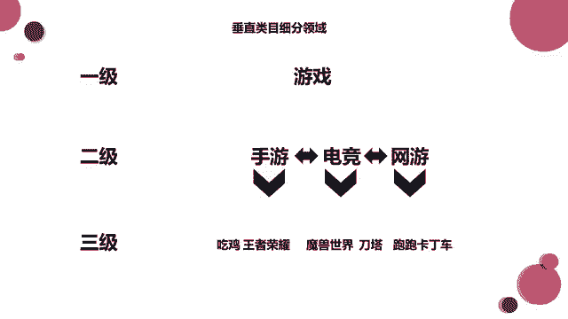
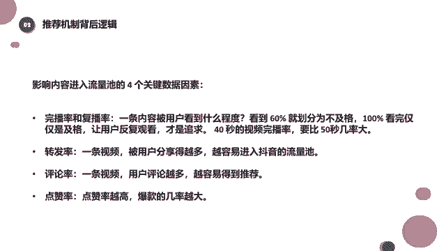

# 【2024强到无法呼吸】起号／涨粉／运营／变现一步讲到位，抖音自媒体运营保姆级教学，全程实操不讲废话！ - P14：垂直类目细分领域 - 花猫的春天 - BV1cEW2eDEBd

好了，这一块我们就不再讲了，就简单给大家讲几个啊知识点，讲几个知识点哈。啊，那么这个时候还想跟同学们说的是什么呢？好像说的就是刚才我们不是讲到啊内容标签这一块嘛，就是希望同学们做东西的时候。

做视频的时候都做的比较垂直，做的比较垂直。那么其实账号的垂直度也是有级别划分的。哎，刚才在讲的时候也给大家提到过，所以这个垂直的这个分级。我们来看一下。😊，就简单的同学们举了一个例子啊。😊。

我们经常说做账号要做垂直，那么肯定我同学间紧紧的就想到了，我要做美食，我就一直做美食呗，我要做游戏，我就一直做游戏呗，对不对？可能就认为美食和游戏就是我们的垂直领域了。其实这个也没错。

但是这个仅仅属于一级垂直领域。那么除了一级垂直领域之外呢，我们还有二级垂直领域，以及三级垂直领域。大家可以看一下啊，我以游戏为例子，比如说我决定了我要做游戏，这个是一级的垂直领域。

如果说我只是在这个垂直领域里去做的话，那么我可以去做啊什么呀？我做手游也可以，我做网游也可以，对不对？游戏呢？😊，我甚至是什么线下游戏都可以，对不对？这是一个大的垂直分类啊啊，里面游戏多种多样。😊。

对吧啊，那么呃一级垂直分围下还有二级垂直分类，因为游戏下面有手游，有电竞，有网游，对不对？非常多。那如果你做游戏分类下的手游的话，这又是一个二级分类。那么手游里还有什么呀？有吃鸡，有王者荣耀。

有什么啊什么第第第第五人格是吧？还有什么我的世界，对吧？这些都属于手游啊，那这些游戏你全都可以做。那如果你做电竞的话，可能有什么魔兽世界dota，什么魔兽争霸什么的，你做网游的话，可能更多了。

什么啊叫什么网游有什么？😊，网游啊，英雄联盟对吧？啊，其他的我都不太清楚了啊，那这些你你做了二级分类里面，里面的这些游戏你全部都可以做。然后除了二级这个这个垂直类目之外。

还有一个三级三级的话就要细分到游戏本身了。😡，比如说你做手游啊，你做吃鸡，或者是做王者荣耀，你选择一个，你做电竞，你做魔兽世界还是刀ta。你做网游，你是做跑跑卡丁车，还是做这个英雄联盟，对不对？

这个细致下来的划分划分一级二级三级，甚至这个三级你还能再往下细分。比如说我玩吃鸡，玩吃鸡的话，我玩哪就是哪个模式，对不对？我只玩哪个模式？王者荣耀我只玩哪个模式，这是王者荣耀，我只玩哪个英雄，对不对？

😊，玩王者荣耀里，我只玩那个叫谁嗯。安琪拉，不是王者荣王的，我只玩安琪拉，那我这个啊就是叫叫什么？我这个视频或者我这个账号里面就是全部都是关于安琪拉的一些游戏视频，对不对？😊，是不是啊，我玩吃鸡。

我可能只去同一个就是地图上。对不对？那我的视频全部都是在这个地图上，或者我玩吃鸡，我只玩剧情类的，我只玩剧情类的那我这一整个视频，或者这这一整个就是账号里的视频全部都是剧情类的对吧？这个能理解吧？

所以说垂直类目的细分领域呢，它有一级、二级、三级、4级。其实大家啊大领域小领域都是可以去做选择的，这个也是根据你们自己来自自己来决定的，大家能懂吧？😊。

所以在这里给大家补充一个小的垂直类目这样的一个细分领域。因为我记得第一节好像第一节课上课哦，第二节上课的时候，还有同学不知道什么是垂直啊，不知道这个垂直领域的一个概念啊。

所以今天稍微给大家再细化的讲一讲。因为今天有些内容呢也会涉及到这一部分。😊。

好吧，然后我们接着再往下讲，接着再往下讲。😊，啊，这块呢就啊不用看了啊，这就是我们刚才看到的那几个数据。就不给大家再讲，大家应该都知道了，因为不给大家反反复复的再去讲了，好吧。😊。

