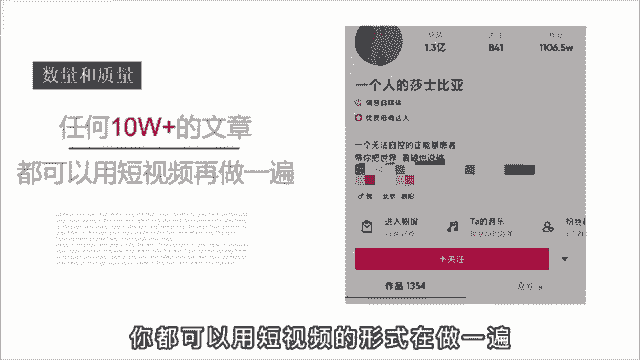

# 【2024强到无法呼吸】起号／涨粉／运营／变现一步讲到位，抖音自媒体运营保姆级教学，全程实操不讲废话！ - P18：短视频文案怎么找 - 花猫的春天 - BV1cEW2eDEBd

🎼说啥也不做抖音了，做短视频最崩溃的就是写文案啊，群里有个伙伴刚做短视频一个月，说什么也不去去干了。😡，🎼天天写800字的文案稿，还没啥人看，说自己都快成精神病了。😊。

🎼然后呢，他就问我有没有一种输出方式可以不这么累。在自己一个人做的时候呢，也能保持作品的数量和质量。🎼我说啊有是有，但是手段呢有点不齿啊，我是不太推荐的。

🎼但是呢有一个大V就是靠这个办法积累到了上千万的粉丝。🎼这个办法是什么呢？其实啊有一句话就可以说明白。😊，🎼任何一个图文平台出现过的10万家内容，你都可以用短视频的形式再做一遍。

🎼什么意思呢？啊？比如说啊你在朋友圈看到了1个10万家的文章，大家呢都在转发。说明啊这篇文章已经被至少10万个人认同，而甚能产生情绪共鸣、高质量内容。啊，就比如说这个讲拼夕夕砍价的文章。😊。

🎼普通人呢就是满腔的愤怒，而觉得终于有人发声给出了口热气。🎼然后呢，你也想从这个热点，但是啊你自己说三言两语，肚子里就没货了，怎么办呢？哎，你就去某号某户啊，搜索相关的话题。😊。

🎼你用口播的形式再拍一遍就好。🎼要做其他领域呢也是一个道理啊，比如说你觉得健身减肥啊是一个好的项目赛道。🎼卖清卡零食或者减肥代餐什么的，有搞头。🎼但你是门外汉啊，不懂，那这个呢还是有这个办法啊。

你就去找爆款的门案，就这么讲3个月。😊，🎼看的多了说的多了，粉丝呢也就觉了，你呢也成了行业的专家。😊。

🎼这个呢是第一个阶段，通过转换输出的方式来帮助自己快速起好。🎼因为曾经火过的内容，一定可以再火。🎼那第二个阶段呢就不能这么用了。🎼万一让人发现啊，你都没有自己的观点，迟早啊口碑人设会崩溃。😡。

