# 【2024强到无法呼吸】起号／涨粉／运营／变现一步讲到位，抖音自媒体运营保姆级教学，全程实操不讲废话！ - P20：内容的三有原则 - 花猫的春天 - BV1cEW2eDEBd

可能在不提到这个的时候，大家就不会想到顺序问题。😡，对不对？好了，那么说了这么多啊，这个时候我们就回来了。那内容定位到底怎么确定啊啊，就是说用户他到底喜欢什么样的作品，对不对？😊，对。

一秒钟让素人变女神的打光方式，你的这个标题比前面那个标题好100倍。😡，真的。

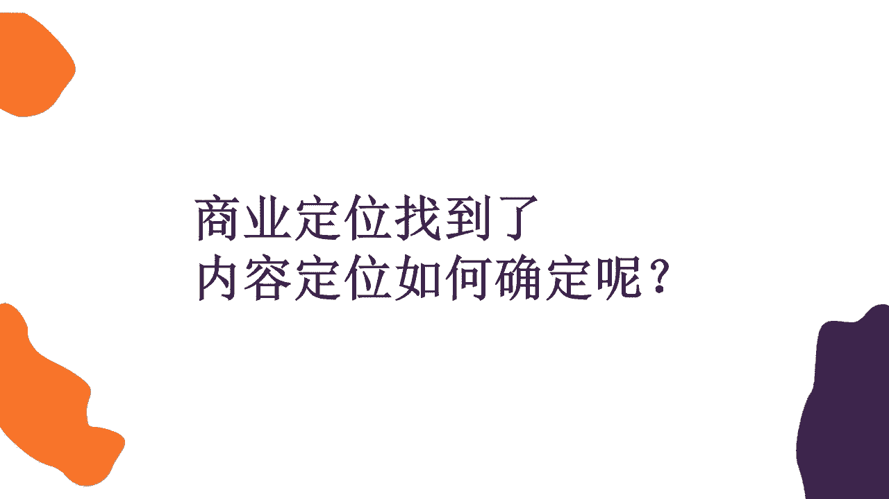

好了，那么我们接着来看啊，我们看几个视频。😊。

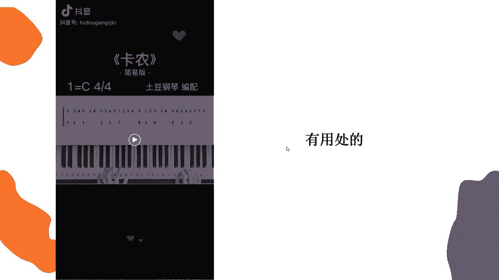

好了啊。好，这其实就是一个钢琴弹奏。这个卡农有一个简易版的这样一个钢琴的乐谱，对不对？简谱啊，它是可以啊私信拿到的。那么这个我们看上去它是一个什么呀？对于对钢琴有兴趣的或者初学钢琴的人来说。

它是一个比较有用处的一个内容。😊。

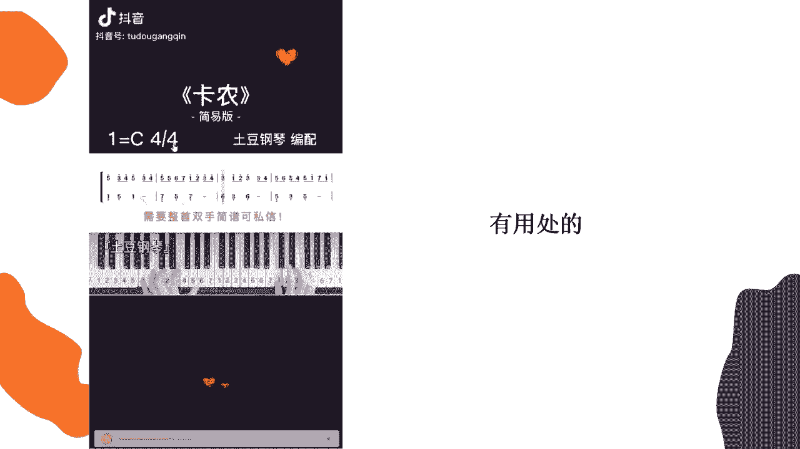

对吧我们再接着来看啊。

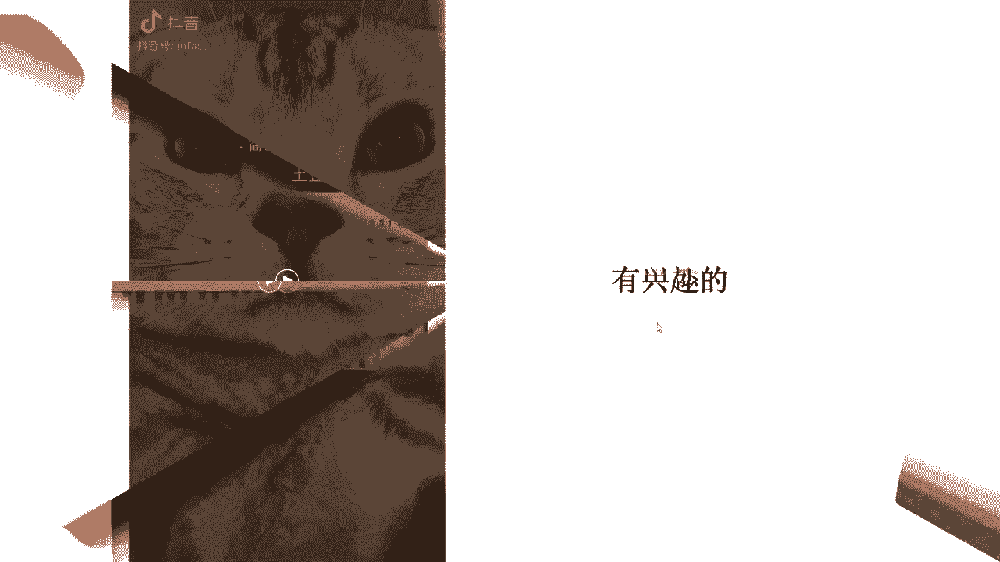

🎼小芳。🎼流长的。🎼小声一点，喊你的时候，你就说嗯，这的那个人。

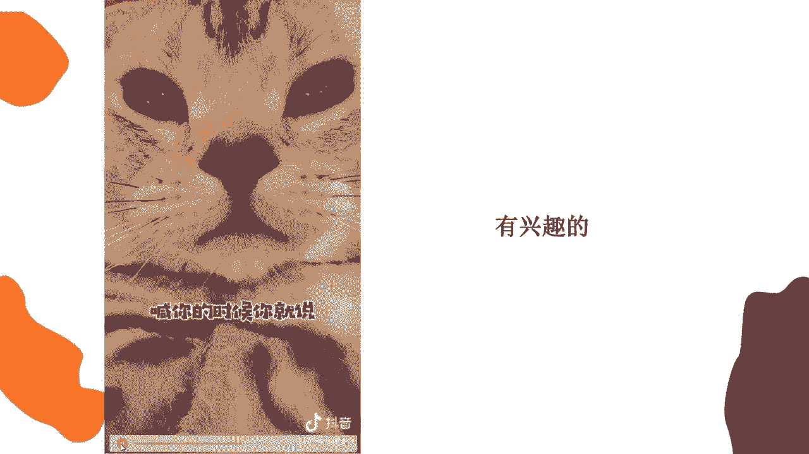

好，这是一个小蛙，对不对？它是一个小喵子，它是一个宠物。那么宠物的话有人喜欢宠物，有人不喜欢宠物。你像我就比较喜欢宠物，那它就是我感兴趣的一个内容。我看到之后呢，我会想点赞。那我再往下看再看一个视频。

😊。

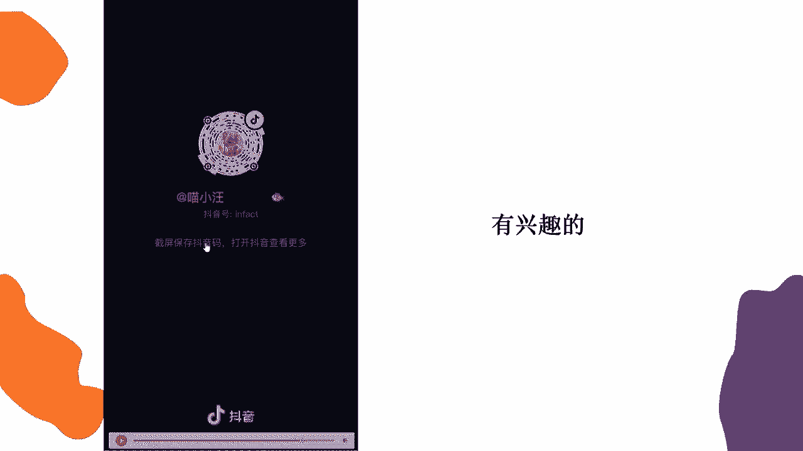

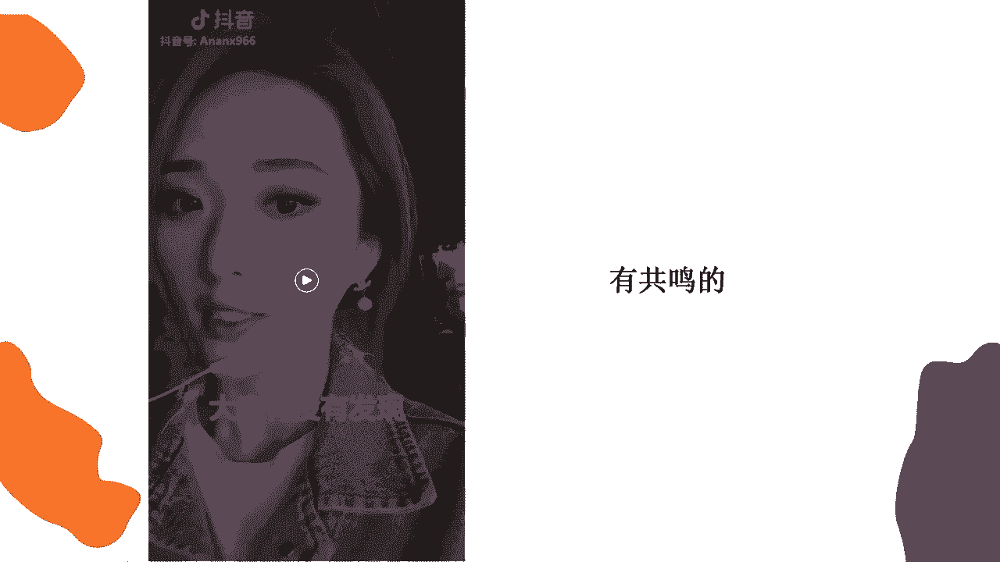

🎼大家有没有发现身边的男孩子长大之后，话变得越来越少？🎼大多数时候都是自己默默的在做事情。🎼一开始以为是性格的原因。🎼后来才知道他们不是不想说，而是不知道怎么开口。

因为他们早就已经习惯了身边都是需要依靠他的人，而他想依靠的人却没有。🎼所有事情都得自己默默承受。

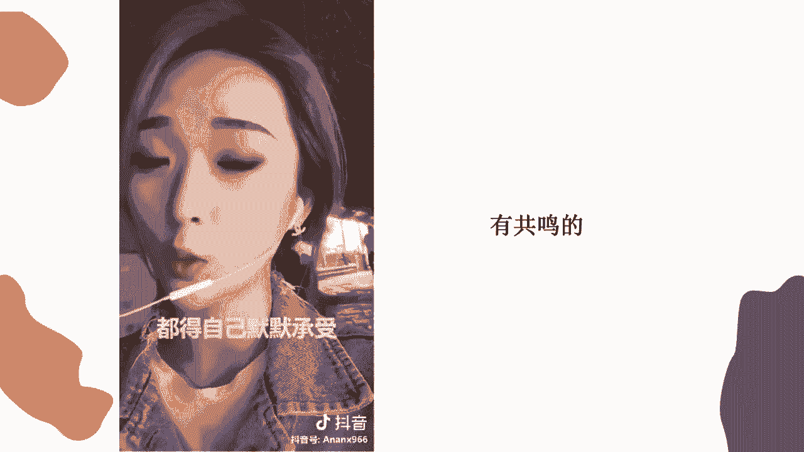

来直播间的男孩子们啊，有没有这么坚强让人心疼的男孩子，这个美颜是不是有点过分了啊，这个关注点是不是有点跑偏了？猪头。😊，而，我们直播间有没有这么啊坚强的男孩子，看完了之后呢，有点共鸣，说到我的心坎里了。

这个人是谁，我得关注他，对不对？是不是？这就是我们说啊我们简单总结一下这个叫做三有原则。我也不给你们卖关子了。那这个三有原则呢，目前是全网通用的一个内容被喜爱的三有原则，叫做有用处，有兴趣，有共鸣。😊。

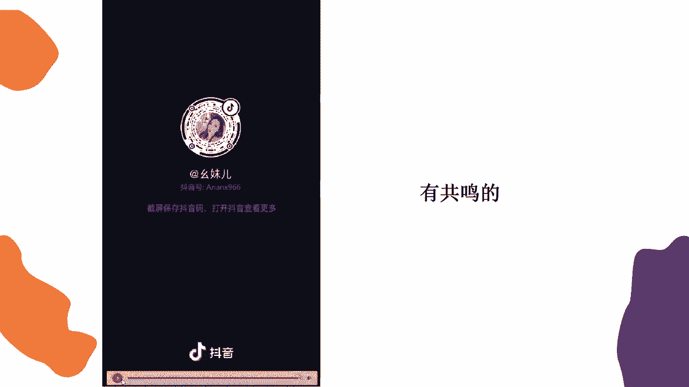

那其实讲到这儿，大家可能还不太理解啊，给大家看一个表。😊，那么我们目前啊在抖音上看到的一些视频的内容，它基本上都符合有用处啊，有兴趣有共鸣这三个点啊，这个字数我打错了啊，这里应该是有兴趣。好吧。😊。

基本上都符合这几个点。你像啊教程类的推荐类的，它都属于干货类嘛，它就是属于有用处，还有一些美好的剧情、颜值、萌宠啊，以及比较炫酷的炫技。然后还有恶搞情景剧，它就属于比较感兴趣的。有一些私人领域的。

对不对？这一类。那么再往下看啊，可能还有什么呀？啊就是励志类鸡汤类，无论是鸡汤还是反鸡汤还是伪鸡汤还是毒鸡汤，对不对？它都属于这种就是有共鸣类的，有共鸣类的，就像刚才给大家看到的啊。

那个美颜过头的那个小姐姐在讲男孩子心酸历程的，对不对？它就会让人产生有共鸣的感觉。那么其实啊我讲完之后，大家哎，似乎好像有点明白了，无论什么内容，我们可以从这三个点先往外延伸。😊，是不是啊。

那大家看到这么一串啊内容之后可能又有点懵了。那美好类、推荐类、教程类、炫酷类九大类，我到底要做哪一类呢？😡，到底哪一类才能适合我的商业定位，才能适合我的内容定位啊，大家先不用想啊先不用想。😊。

先不用想你现在要做哪个类型的内容，还有点太早。我们先来看一看就行。好吧。那么接下来的话呢，我们还是要先去看一个视频。

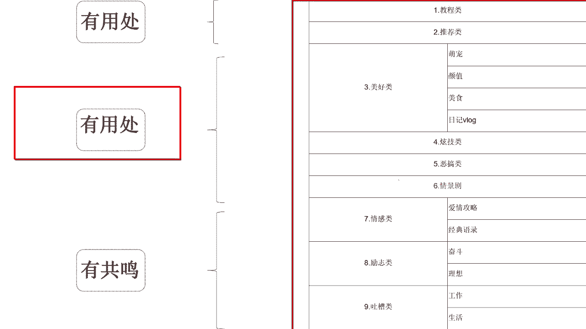

🎼来，我们先要再看这个视频啊。

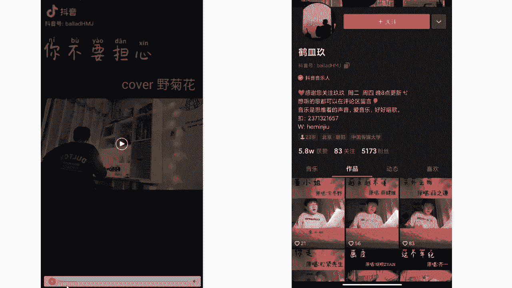

🎼아무 고ち 하지 말해요。🎼우리海て。🎼눈래하시 되。

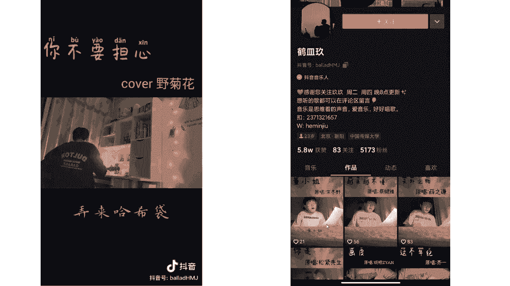

好了。这个视频看完了，大家觉得这个视频好不好？😊，还不错，是不是？😡，是不是啊画面啦，然后唱的啦，整个感觉还不错，不是说那种粗制滥造的视频。😡，对吧而且这个视频呢它的点赞还可以。😊，然后呢。

哎我们来看一看他的账号。这个账号叫做贺鸣酒。哎，感觉差点什么老还感觉差点什么，但差点什么呢？我也不知道。来，我们来分析一下啊，这个账号啊有一个很大的问题。来我们来到主页之后，发现他的货赞5。8万。

但是他的粉丝只有5173个。😊，说明什么呀？其实说明他的作品做的还可以，有人点赞，还有喜欢的5。8万点赞呢，但是他不涨粉丝呀。😡，然有粉丝。你的货赞比你的货赞和粉丝去给他除一下，你可以得到一个比例。😡。

可得到一个比例。你可以得到一个他多少个赞才能得到一个粉丝，这样的一个比例，他稍微的有点不太正常。那这是什么问题呀？同学们。这什么问题？可能有同学说，老师，我知道什么问题。😡，哎，作品可以。

但是没有持续关注的，是不是它不垂直呀？老师。😡，啊，10比1是吧，他10个粉丝，10个赞才得到一个粉丝。是吧大家可以看一下。😊，你以为粉丝刷的，大家可以看一下啊，有的人说他不垂直。

但是我们一看这个封面啊全是唱歌的，它好像也挺垂直的呀。那他是什么问题呢？是什么问题导致了他不涨粉丝。因为有同学啊肯定会面临这种问题啊，老师我的作品垂直啊，我觉得我的作品也很用心啊。然后我给别人看。

他们都说我的作品还行啊，都不是什么垂直乱造，垂直是啥呀？垂直呢就是。😊，嗯。我做唱歌，我就一直做唱歌。哎，如果我做唱，今天做唱歌，明天做美食，后天做旅行，我这就不叫垂直。😡，对不对？

垂直呢就相当于什么呀？同一个领域一直做到底。因为我们在想定位的时候，可能会想刚才会想什么教程类，什么美食类，什么剧情类，对不对？就只专注于一个领域。没错，是的，这就是我们垂直的意思。因为你不垂直的话。

别人他很难去关注你。除非这个人，除非观众喜欢的是这个人。😡，大家懂不？那有时候你你你关注一些美妆博主也好了，关注一些大网红也好了。那他这个人可能发他去旅行，他去吃饭，你都想看。但如果你这个人吧。

他不是特别的就是有吸引力，那别人也不是很喜欢你。那你要想把这个东西做的好，你就得专注于一个领域。你做美食就一直做美食，然后别人关注你的话，他才有关注的欲望，对不对？😡，那这是我们垂直的意思。

一般我们普通人去做这种视频的话，都做垂直类的账号。好吧啊，刚才讲到哪儿了啊讲哪儿啊，刚才讲到就是有很多同学会遇到这种问题，就是老师我的作品做的也不差呀。啊我的这个领域垂直呀，为什么我不太涨粉丝呢？

我觉得我有些作品别人还挺喜欢的。😡，这是为啥？我这长不动。😡，来他是什么问题哈？我们说。😊，它一个问题是主题IP的问题，一个是账户搭建的问题是这两个问题啊，那么我们一点点来看，首先我们来看啊。

什么是主题IP呢？

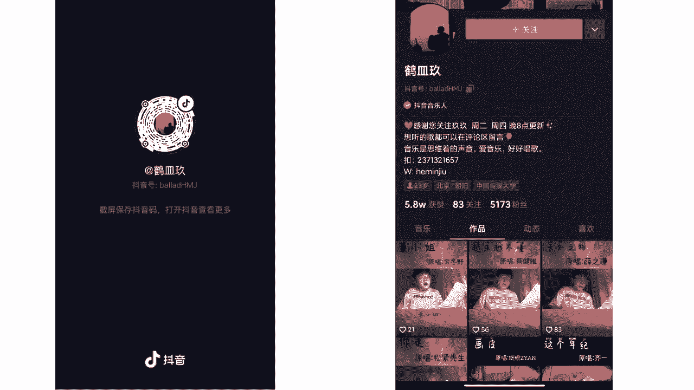