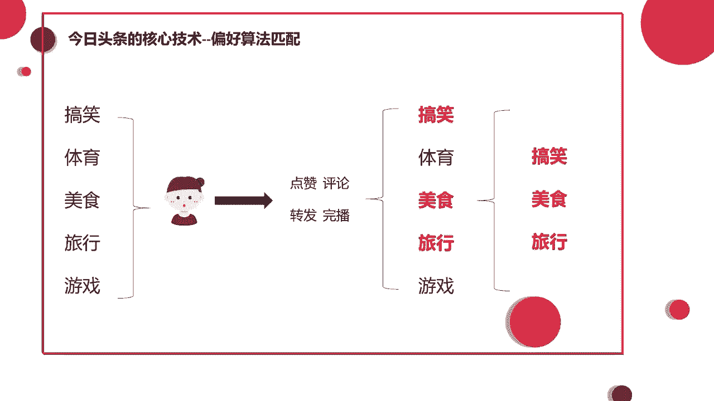
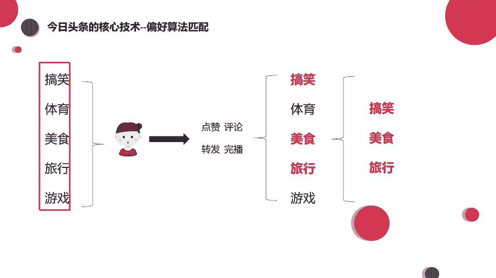
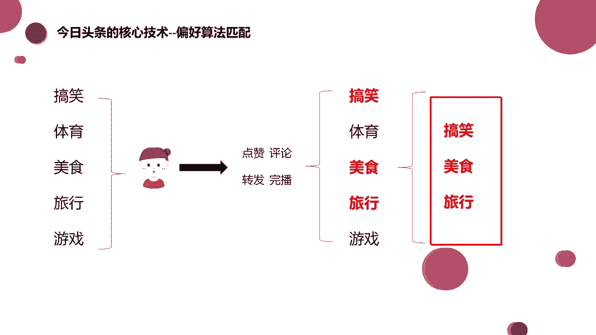
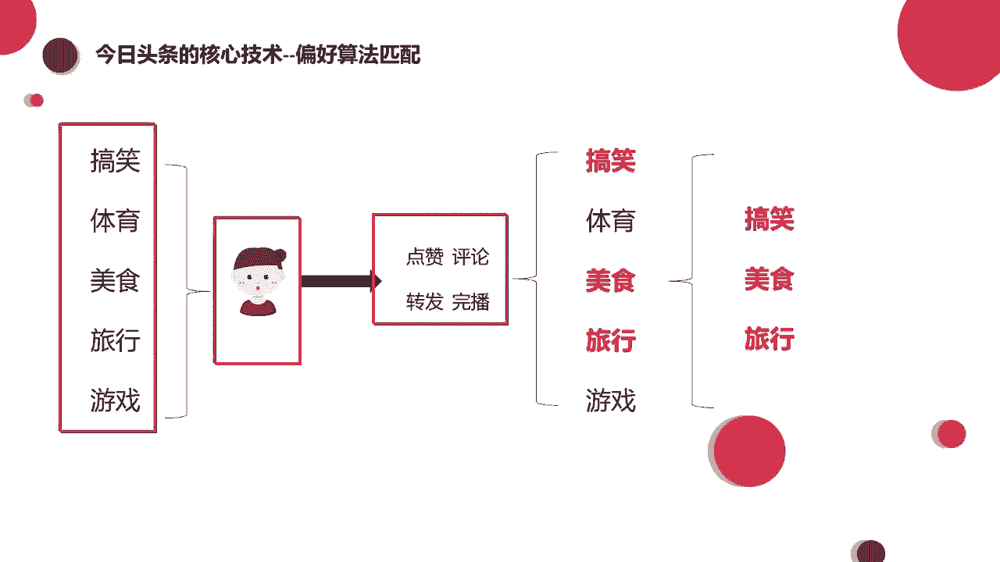
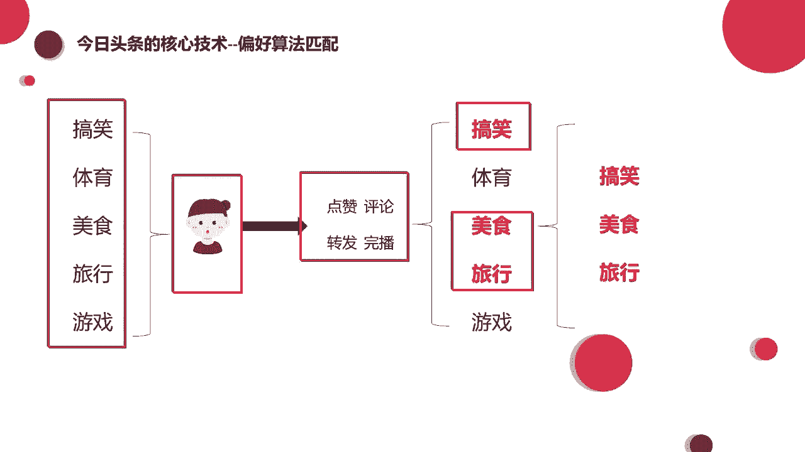
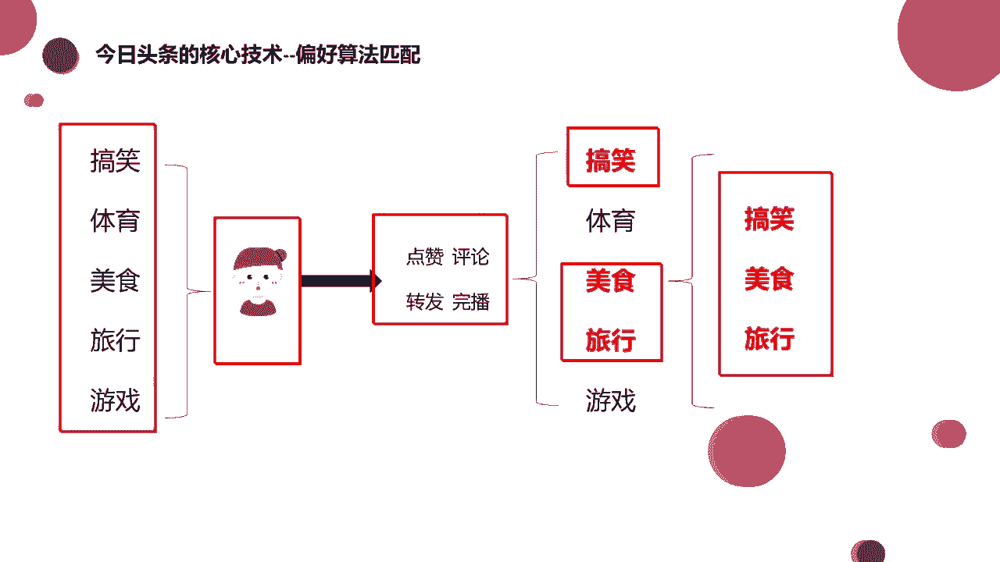

# 【2024强到无法呼吸】起号／涨粉／运营／变现一步讲到位，抖音自媒体运营保姆级教学，全程实操不讲废话！ - P21：偏好算法匹配 - 花猫的春天 - BV1cEW2eDEBd

我们今天来讲一下，就是呃抖音它的一个推荐机制，一个算法的机制。也就是同学们经常会问的。老师为什么我的作品发出去之后，它的流量不高？为什么我没有流量，别人都有，是哪里出现了问题啊。

今天呢我们就着重来讲一下这部分的内容。好吧，那么我们现在呢在这个PPT上能够看到的叫做今日头条的核心技术偏好算法匹配，能看到吧？这这里有个示意图，那么这是什么意思呢？大家再想一下啊。

你刚刚去注册抖音的时候啊，在刚开始是一个新号，什么都没有的情况下，也就是说你的行为轨迹都没有被标注的情况下，是不是平台会根据我们的注册信息啊，给我们发不同的内容让我们去看是吧？

那这些内容呢可能包括这些有搞笑的，有体育赛事，可能有美食教程，可能还有一些户外旅行。

以及还有一些游戏的录制视频，对不对？那这些都可能会存在出现在我们刷到的视频列表里面。但是这些内容呢有一部分是我们喜欢的，有一部分呢是我们不感兴趣的，对不对？那打个比方啊，我们刚注册的时候。

这几类它都给你推荐过来了。那么我们呢就会从用户的角度做出几种不同的行为。比如说啊我就是喜欢特别沙雕的视频，喜欢特别搞笑的视频。那么呢我就会给搞笑的视频进行一个点赞评论，甚至是把它分享给我的朋友去看。

对不对？😊，那么除了搞笑的之外，我可能对于美食制作，对于户外旅行啊比较美好的事情也很感兴趣啊，那我也可能给他点赞、评论、转发，对不对啊？这些都是有可能的。那么但是说啊因为我是个什么呀？我是个女生。

对不对？那我可能对于这个体育赛事，对于这个游戏录播，我就不是特别的感兴趣，对吧？你可能推给我一个体育赛事，什么足球比赛，篮球比赛，那你推给我一个王者荣耀的录屏，我可能不感兴趣，就直接划过去了，对不对？

甚至呢给他啊长按点了一个不感兴趣，这都是有可能的。😊，好，那么我们在这些内容看过之后啊，那么我们可能做了下面的这几种行为，点赞评论、转发，然后看看完了，甚至看完了之后呢啊乐呵呵的又多看了几遍。

看了好几遍，对不对？那么最终在这些内容里面呢。😊。

哎，我们选择好了自己喜欢的这些内容。😮。

对吧像体育游戏呢就被就被我们不感兴趣，就给它划过去了，我就快速划走了，对吧？那我们刚才做的这所有的行为，无论是点赞评论，你是转发还是说快速划走，以及说长摁点了一个不感兴趣。这所有的行为呢。

咱们都会被抖音的后台抓取到。😡，大家知道吧，那么抓取完了之后呢，他就知道了哦，原来卷心蔡老师你喜欢的是这样的内容，对吧？那么他以后呢就会多给我推这些内容。

哎，这就是他以后会给我推荐的一个类型。这个呢就是关于抖音的一个偏号算法的匹配推荐。

大家能懂吧。那从最开始他不了解你给你啊，就是推送了这么多内容。那么在经过你看过之后啊，对于喜欢的内容进行了点赞评论，对于不喜欢的快速划走了。那么最终呢哎我们留下了搞笑的美食旅行的啊。

把体育游戏的给他划走。哎，最后呢这个抖音说我知道了，你喜欢这个我以后就多给你推荐这个呗，对不对？你喜欢啥我给你啥，你不喜欢，我就让他永远不要出现在你的视线里了，是不是啊？那这个就是他的一个偏好算法。

所以说会有一个现象出现啊，就是我们会出现刷抖音停不下来的现象。😊。

是不是啊我们经常说我想要刷5分钟再睡觉，我就看5分钟，看着看着可能就睡着了。但是哈往往出现的情况就是我刷着刷着一个小时过去了，两个小时过去了，对不对？

所以抖音的平均停留时间啊之前出现过这么一个数据平均每个人在抖音有90分钟的停留时间啊，91分钟吧，具体的数据是也就相当于一个半小时左右，对不对？啊，5分钟变成一个半小时。😊，因为抖音这样的一个偏好机制。

所以说他推荐的流量是更精准的。你喜欢搞笑，他就给你推搞笑，你喜欢美食，他就给你推美食啊，永远都陷在自己喜欢的那个领域里出不来，是不是？好，那么这个大家都明白了之后，那么就有问题了。有同学问哈。

人家说这种算法它是永恒不变的嘛，我选择了这几类，他就永远都会给我推这几类嘛啊，当然不是哈，比如说打个比方，有一个小姐姐，可能他啊刚刚失恋，失恋了之后就心情很郁闷，就去刷抖音。

那抖音上可能就会出现那种很伤感的文案啊，什么失去的人你就不要再抓住了什么手里的沙越卧啊，越卧就是什么啊消失的越快，是不是类似于这样的话，那他看了之后就特别有感触，仿佛每一条都在说他。

然后他就看一条点赞一条，看一条收藏一条，对不对？所以呢在这个失恋的时间段里呢，他可能会收到特别多的啊疼痛文学，什么伤感文学，这样的一些文案啊，那再再过了一个星期啊，再过一个星期有点短，可能再过了一个月。

那小姐姐呢又遇到了一个比较帅气的小哥哥，那么这个小哥哥呢就给他的生活带。😊，来了光亮啊，他的青春又回来了，他又美好了。那么跟这个小哥哥可能又谈恋爱之后呢，他会关注一些情侣的视频。

他可能还会关注一些什么宠物的，对不对啊，因为心情愉快了嘛，看什么都想点个赞啊，是不是那些伤感的话呢就远离他了，伤感的视频他就刷不到了。所以在这个过程中啊，其实你喜欢的视频。

或者你点赞视频然抖音给你推的视频，他是根据你的心情，哎，根据你这段时间的喜好去进行一个更改的。当然说如果你非常的就是说我不带任何感情色彩，我就是要养号，我就是单纯运营这个号。

我不带感情色彩的时候去刷抖音，可能就会出现你刷这几类永远都是这几类。😊，因为我看见搞笑的，我就点赞，看见美食的，我就点赞，我看见游戏的时候，我永远都不给他点赞。无论我喜不喜欢玩游戏，我都不给他点。

那当然这几类呢，你就永远都只能看到这几类了，它就不会有其他的类型在出现了，好吧，就简单的跟你们说一下啊，那么我们刚才说抖音它日活4亿，每个人平均的停留时间大概是91分钟。那么这么多流量给到我们。

因为这么多流量一定会有很大批的流量看到我们的作品，对不对？其实我们知道有很多平台都有所谓的那种大V，还有网红头部流量非常的大，像微博它比较早的时候，因为微博很早很早它就出现了。

那个时候还没有快手也没有抖音，所以说啊最早的一批大网红，它都是集中在微博里的。当时大网红的流量是非常大的。因为流量是平台可以控制的，媒体可以控制流量，对吧？买流量啦，是不是啊？😊。

像热搜了什么的对吧？啊，但是抖音它是不太一样的不太一样的。大家其实可以想一下，我们经常遇到的那种情况啊，或者说经常看别人的抖音号啊，比如说这个人他发了10条作品还可以，十条作品也不算少了啊。

但是呢他的粉丝不多，这十0条作品里面数据好的作品也不太多。但是其中可能有一条视频就爆了。😊，可能其中有一条它就有个啊几十万的播放，几万的点赞比其他视频的数据要好很多。对不对？这种情况其实就代表说。

无论你这个账号多少的粉丝，我们就是拿作品来说话的。😡，是不是其实抖音算是比较公平的一个平台了。比起其他的那些所谓的有流量控制的平台。

它是一个比较公平的平台。

