# 【2024强到无法呼吸】起号／涨粉／运营／变现一步讲到位，抖音自媒体运营保姆级教学，全程实操不讲废话！ - P23：视频创意 - 花猫的春天 - BV1cEW2eDEBd

来开始我们本节课的这个具体的内容了哈。本节课的话呢我们不再去讲这个脚本套路了。因为说知识点太密集的话，我们吸收不了。这节课就讲一讲这个搬运或者是就是不是自己拍素材的话，怎么去制作我们的视频，好吧。😊。

那给到大家入手的几个方面啊，我给大家放大一下去看看。啊，今天我们就直接使用这个啊思维导图的形式了哈，就不给大家再做这个PPT了。😊。

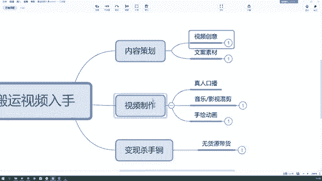

来，首先我们看一下。我们无论是搬运视频还是原创视频，首先都得有一个内容策划，对不对啊，就是我们的选题以及我们素材的收集。那在这里再讲一下，因为想给同学们再去啊就是呃延伸不同的一些素材网站或者是创意网站。

首先我们看啊我们在做这个内容策划的时候，要找到这个视频的创意，也其也就是我们所说的选题，对不对？我们这这个内容，这一期内容我要拍摄什么，我要怎么选择。那当然选题法是能够确定出我们选题来的。

上节课我们讲的九宫格选题法。但是最大的主题我们要选择出来，比如说我这期是要讲励志故事呢？😊，还是要讲产品故事呢。😡，对不对？那么这个最大的选题要选择出来啊，那么这个创意是怎么来的？创意是怎么来的？

当而我们说你可以自己去延伸一些创意，可以自己想。但是当你自己没有想法的时候，你想要去蹭热点的时候，你去哪里找到这样的热点。在这里给同学们去推荐一个呃创意网站。😡。

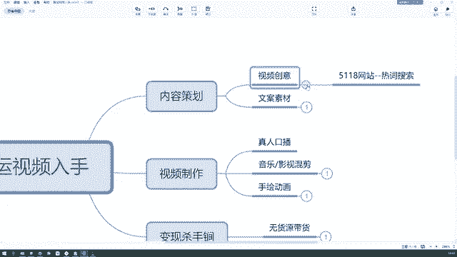

叫做5118网站，它是一个热词搜索的网站。嗯，大家可以看一下，我给大家打开一下5118网站。如果你们现在手边有浏览器的话，可以跟着我一起搜索，好吧。

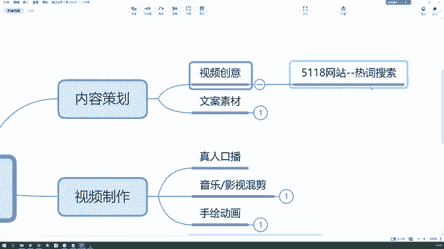

哎，打错了，55118。

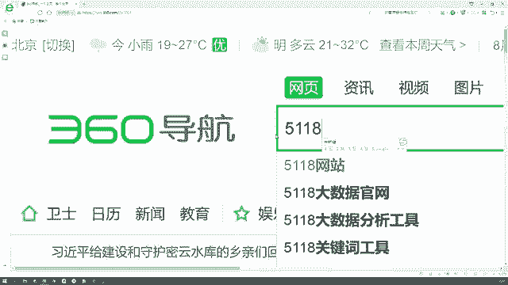

它是一个大数据搜集的网站。你看这个5118打开之后呢，我们就能看到第一个就是它的一个营销大数据的网站。下面写着快照的话，是一个正常的官网啊，我们给它点击进去。

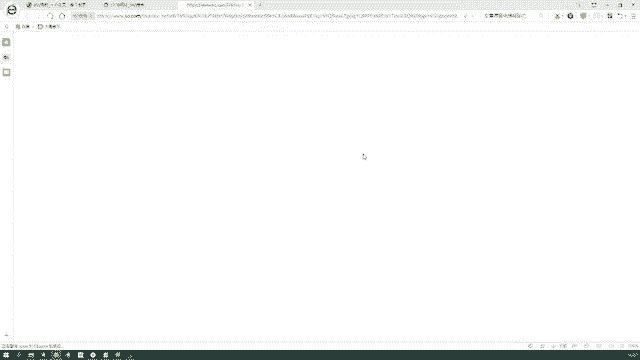

我们来到这样的一个界面，这是它的首页。😡，你们可以都打开一下，如果手边有浏览器的话，你看你现在打开的话呢，是这样的一个它的首页，我们可以看看上面这一部分啊，上面这一部分。可能第一个你看不懂排名的效果。

它是一个呃其他的一个概念了，一些百度竞价啦，或者是那个SEOSEM了，这一块咱们没涉及到啊，你们不懂也没有关系啊。第二个挖掘流量这一块也是啊它会涉及到一些呃流量的变化啊，相关这个关键词啊，流量词啊。

竞价词的一些查询。你像前两个吧，咱们用到的不多，用到的不多，除非你涉及到这个行业了。就是我刚才说的搜索引擎的竞价或者搜索引擎的排名。😊，这块咱用不到，咱可以用到的是哪个，是这个。第3个。

后边写着新媒体运营，是不是这块才是运营要用到的一些东西。首先我们可以看一下，当你不知道你想写什么主题的时候，或者你仅仅有一个大的方向。比如说我想写一个什么励志故事之类的对吧？😊。

那我可以在这里搜一个励志。😡，做一个荔枝。搜完了之后，它就会跳到这样的一个需求图谱啊，这里有一个词屏脑图。经过数据分析，得到词频最高的是励志故事，对不对？因为你如果是确定励志这个选题的话。

你可以写励志故事啊，也可以写其他的励志的东西。你像这个的话就是一个啊词频比较高的啊，其次还有什么励志名言、励志句子、励志语录等等。😡。

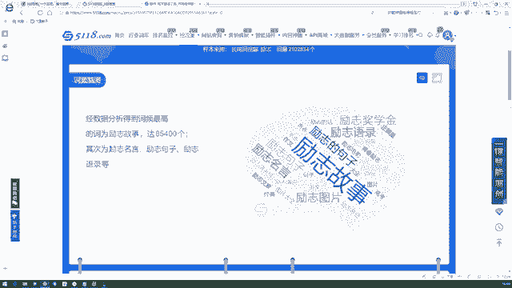

对吧那我们再接着往下看，还有一些放射图。😡，啊，这边的话呢，它全部都是什么励志奖学金啦，励志申请啦，励志，这叫什么励志奖学金的名单公布啦啊，励志小故事100字。😡，啊，等等。

这些呢咱们都可以去挖掘的这里面的任何一个东西，你延伸出来，它都是一个具体的选题。你可以根据这个选题去寻找素材了。大家能懂吧？再往下看，还有一些关系的脑图啊，就是涉及到一些名人一些作文啊，其他的这些脑图。

它都有这种相关的线去连接，它可以拓展你的思维。😡。

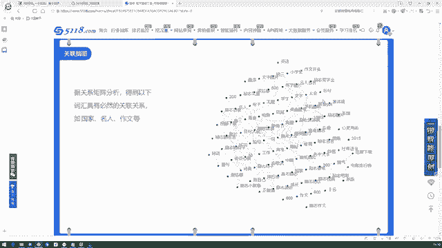

啊，包括一些疑问词的脑图。啊，怎么样，哪里哪个多久国家如何啊等等。

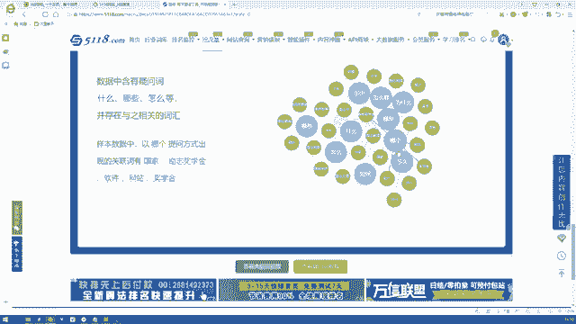

这都是通过一个词去联想出来的一些高频词汇以及高频需求。

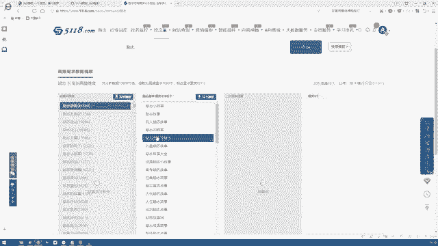

你看这边还有一些高频需求。😡，这些高频需求呢全部都是用户的需求，大家能懂吧？啊，我们去看一下哈，下面有一些什么。😊，励志故事，这是多少个？个1百千万，41849个什么视频3067个啊。

励志故事视频相关的有3067个。那这些数据呢都是可以导出的。😊，当然有些功能呢，它可能会需要你开通会员啊什么的啊，这些的功能可能会需要开通会员，你不用它就可以了。你只看一下相关的一些高频词汇啊。

高频的需求就可以。你知道啊大概是励志故事这个啊比较吸引人励志小故事啊，100字的小故事和励志故事大全是我可以去做的一个方向，我确定确定什么我今天嘴老瓢啊，我确定下来一个这样的方向，一个主题之后。

我可以去其他的网站搜寻不花钱的素材，大家能懂吧？😊，我喝口水。因为像这种创意网站或者素材网站。他可能会给你很多相关的素材，但是导出数据的时候呢，他可能会呃让你花钱。这个是会出现这种情况的。嗯。

我们再回到它这个首页。

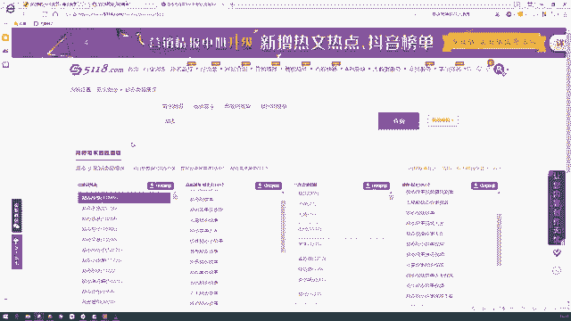

刚才我们用到的是需求图谱的一个分析，它下面还有一个素材搜索，素材搜索的话也可以直接在这里面搜索到素材相关的励志的话，它会去全网搜集一些励志故事的文章。

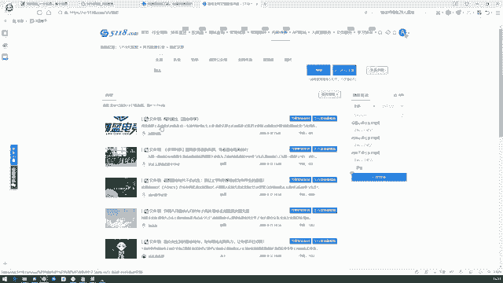

看到没有？还有一个我要智能原创。😡，看到没有？它就会把相关的呢啊进行相关的这个字眼啊进行一个搜集，还有原创度的检测什么的，就让你避免这种啊那个搬运的现象。😊，这个网站还是比较智能的。

这个叫做51185118网站。😡，大家可以记一下，好吧啊，一般我是用这个来进行一个创意的搜集，也就只会用到需求分析这一块。需求图谱这一块。好吧啊，那我呃大家看懂了这个网站没？5118啊。

它登录的话呢是需要用微信去扫个码的。这个我已经给大家登录好了。好吧。😊，下面有什么嗯新媒体的工具啊之类的，你可以多研究一下。这个是给大家的一个嗯就是热词的搜索啊，以及素材的搜索工具。😊。

版型最角化。😊，那么首先这是我们的第一步啊，就是我们的视频创意。我们可以从这个5118网站这个热词搜索的网站上去确定一下我们这个视频的创意啊，以及我们想做的一个大主题。

以及它的一些关联的脑图嗯脑词什么的，能不能联想出我们想要的那些创意。😊，其实，二次创作创作到如何程度才不算搬运呢嗯。这个问题的话呢呃其实它没有一个标准的答案，二次创作创作到如何程度。

实际上啊这跟那个审核的人员是有关的。因为它有机审，还有人工审嘛。你想同样的视频，你放在这个号上，他可能不会审核出是搬运。但如果放在另一个号上，可能会审核出搬运，这是为什么呢？因为就像我刚才说的。

我这个朋友啊，他不是现在面临着搬运这个问题嘛。😡。

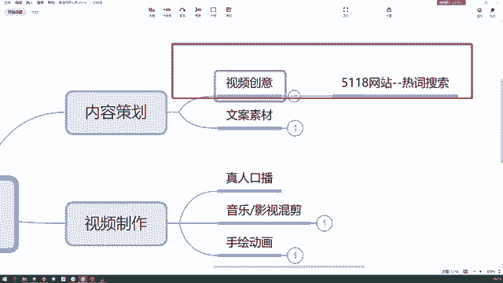

给大家说的这个朋友，他现在面临着这个搬运的问题，但是呢他只有三个视频被判定为搬运了。其他的视频呢跟这个视频剪辑的类型是一样的，内容也是差不多的。但是另外的视频就没有判定为搬运。

所以说其实结合到这个视频审核和人工审核的时候，这个不定性是非常大的。所以我们在啊就是很主观的。没错，它没有一个严格的判定标准。😊，所以我们在处理的时候呢，尽量是把一些主要的东西留下来啊。

其他的加上一点自己的观点，那甚至给它进行一个镜像的翻转啊，把它的这个视频给它换一换，方向换一换，尽量不让机器去审核出来。我们这是一个搬运的行为。对，还是相对主观的还是相对主观的。比如他之前发了几个视频。

流量都特别好，也没有被判定为搬运。但后来当流量好了之后呢，这个时候一定是人工审核介入了，所以他被判定为搬运了，而且还给了他一个处罚。😊，还给了他一个处罚。那包括说他在视频里面哈有那种广告的商标。

因为他是从腾讯视频录屏下来进行一个剪辑的，所以他一定会碰到那种呃商标的存在啊，包括说字幕上也会有一些那种商标啊，广告商家，他可能忘记处理了。那在这个时候呢，其实这个抖音官方也给他发了另一个通知。

就是啊他的视频存在营销的性质。😊，所以这个大家注意一下就行注意一下就行。所以其实做搬运的话呢，做搬运的话，不建议同学们现在啊就是再往以后越来越发展，就不建议同学们把现有的视频拿过来，直接去做一个处理。

所以咱们现在在教的呢啊就是。😡。

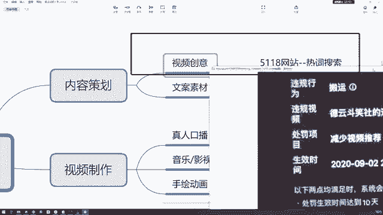

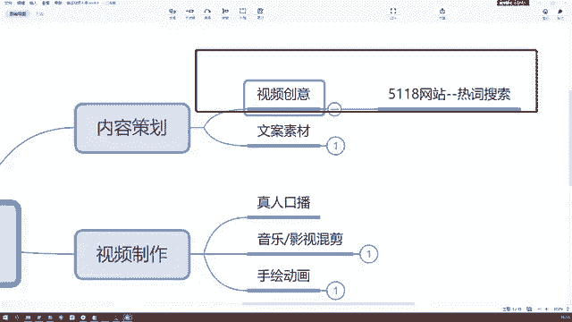