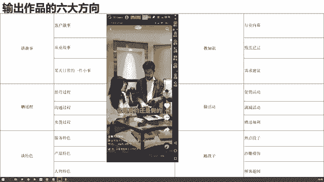
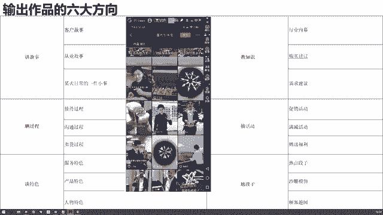
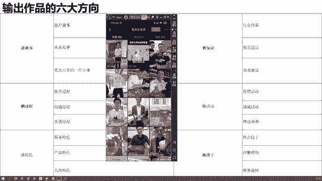
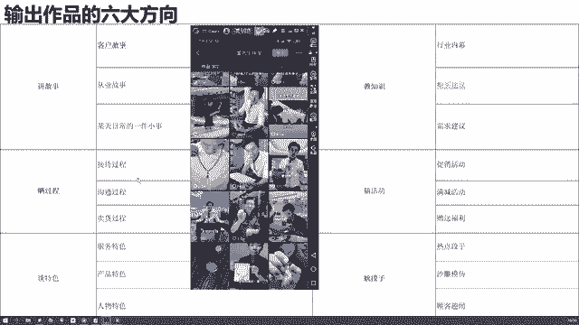
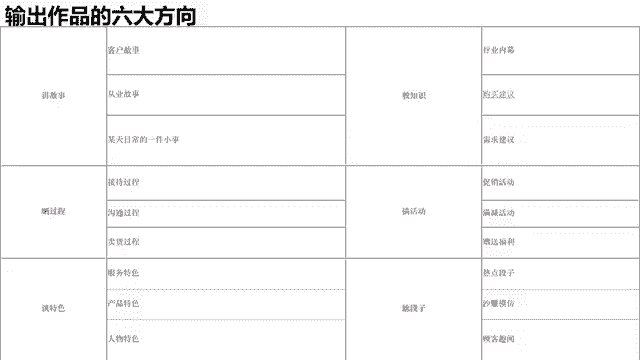

# 【2024强到无法呼吸】起号／涨粉／运营／变现一步讲到位，抖音自媒体运营保姆级教学，全程实操不讲废话！ - P24：输出作品的六大方向 - 花猫的春天 - BV1cEW2eDEBd

所以说在这里呢啊这节课后边部分再给大家讲一讲我们输出作品的一个6个方向。6个方向啊，我们说讲故事、筛过程、谈特色，教知识，搞活动、尬段子。这个呢基本上是所有行业都通用的输出作品的六大方向。那。

其实可以给大家先看几个案例啊，然后再针对不同行业，我们再讲几个不同的选题。

还是打开我的手机。3月份我就开跟。嗯，我们去搜索一下，搜一个做珠宝的。董先生。

好，我们去搜索一下啊，一个做珠宝的人。那么他在他的这个账号里面，他是如何产出内容的。哎，我们可以看几个他的视频，然后去总结一下啊。

来，首先呢我给你们讲一下哎。

首先我看我们你们挑一个什么。😡。

啊，我们讲我们找一个教知识的内容，我们看看啊董先生的这个作品里面，他有没有。

教知识。

好。🎼来像这个钻石定制为什么会这么便宜？其实对钻石有了解过的朋友就会知道钻石是不分品牌。

🎼定制的钻戒因为没有品牌溢价的部分，所以比商场里的钻石至少要优惠40%，一点也不夸张。定制的优势在于每一个钻石。

🎼那么挑选出来钻石。🎼来乎他，甚至于钻石的瑕疵位置。🎼都会仔细的挑选，因为钻石的造价成本太高，而且很容易就会被识别出来。所以现在市场上的假货。最后我想说的是。🎼无论从任何渠道购败，认准证书和4C。

钻石定制问好，那么这个视频我们看完了，其实他这个视频其实就是在教知识。他在说哎为什么定钻石定制这么便宜啊，就越来越多人悄悄选择了工厂定制。它里面说到了一些啊各种钻石的知识，对不对？那这个知识不重要哈。

但是它的内容方向比较重要，教知识，那可能揭露了一些行业内幕。😊，对不对？😡，啊，那是第一个。那么我们再看看他其他的作品都是什么类型的。

来再看这个男生女生都应该知道的七夕里物含义，千万别。啊，好，这个我们的呃作品就不看完了。我们只看它的标题就知道了。那它这个作品呢是告诉大家七夕礼物的一个含义，你别送错了，我告诉你七夕应该买什么。

对不对啊？他这里会给到一个什么购买建议，对不对？一个需求建议啊，这些呢全部都属于交知识这个大的。😊。

内容领域对不对？那么我们再接着往下看。

。来，我们再接着往下看。

他克拉的。

🎼我想记着。可拉的是。

他这一个门段价次大概。

巴克拉的好，喜欢吗？赶紧让你老公给你买一个啊，它其实呢也稍微有一点尬段子，这个稍微有点尬段子啊。另外呢他通过展示这个巴克拉的粉段，他在干嘛呀？他在谈它的产品特色，对不对？😡。

啊它有点相结合了段子的这个痕迹呢，不是特别的重啊，但是通过对于这个啊粉钻的一个拍摄，对于粉段的一个介绍，对不对？他在产谈他自己的一个产品，直接去展示产品啊。那么我们再接着来看他的作品还有什么。

で。好，其实这个也属于教知识了也属于教知识了。你会发现他的作品展现形式多种多样，我可以拍我自己，是不是我也可以呢用这种图片的形式。

来再往下看，来看这个。🎼大家知道钻戒是怎么做出来的吗？今天。

🎼去我们的工厂去看一下走。

🎼这台机器呢叫做3D打牙机。那我们设计的这个图纸，通过这个3D打牙机将这个模型就可以打出来了。

🎼清洗完之后呢，我们再进行最后一步就是电镀，电镀完之后，这个戒指就不容易被氧化掉了。那么整个戒指过程就是这样子。学会了吗？好了，你注意看他最后一句话了吗？整个戒指的制作过程就是这个样子了，对不对？

那么他这个视频内容在干嘛呀？他是不是在晒过程呀？他在晒它的什么呀？产品的制作过程，对不对？哎，那我们刚才说了，它的内容里面晒晒了过程，谈了特色，教了知识，稍微尬了一点段子，对不对？那他还有别的嘛？

我们再来看看。

来，我们再来看看还有没有别的。

来，我们再往下找一找啊，再找一找。

啊其实你就是可以找到一个比较好的这样的一个视频。然后呢，你自己可以去翻一翻，可以去翻一翻。

，还有什么呢？

我随便再点开一个。hello，大家好，昨天晚上。所有的字报。こっち。そ？大家发货。主包检测。あ稍等。我残。两个的检测。一しなと。另外是。至少检测。我检测完之后呢。🎼大家可以收到这样一个证书。那。

这个证书呢是可以在。哎，那么大家觉得他这样的一个视频内容，我们看了那么多，他这个视频的内容是在干嘛呀？是来干嘛呀？其实也是在谈特色，对不对？刚才我们讲了，他在谈谈他的产品特色，现在他在谈他的什么呀啊。

服务特色，对不对？他有这个证书，然后我们的机器都是特别好的。😊，对不对啊？我们是透明化的，我们给大家看到这其实也是在谈特色。😊。

来，我们再看啊啊，其实他之前有谈过一个。

有做过一个产品的故事。

给大家找一下啊。

后。

钻石定制为什么这么便宜？稍等一下，给大家找一个讲故事的。

如果。今天有一位重量级的粉丝带了一颗大货，走，我们一起去看一下。

这个就是斯克拉吧，怎么去克拉。

こちらは。おりちた。🎼200万。

よは。不ちよ。持す。

哇塞这个好。🎼给我点偏微黄，相一的展示。

能看得出来他。🎼真的还是假的吗？真假的好，不好说恨。

我现在没看到吧。おかさ。

🎼这个上面显示的一个4袋15吸收风。

あのよま。🎼啊，如果说你这个737这个地方有一个洗手报的话，干完了。

喝多少开吧。

300万。多花了至少100万。

不差钱不差气不差钱。

哎，不错。好，是不是它里面还有什么内容啊啊，就是我们说的晒过程啊，谈特色教知识，他还会讲一些客户的故事，对不对？还会有一些粉丝的故事啊，包括可能说什么呀啊顾客的趣蚊等等等等，这些内容都是有的对吧？😊。

钻石定制，今天有一位重量。

来，我们可以看一下啊啊，它里面的作品真的很多，然后类型呢也是比较多的啊。如果说你想要去了解的话呢，你可以多去看一看他的这个呃账号。好吧，那我们就先看到这儿，我们先不看了。那他其中我没有找到那个作品。

其中有一个作品呢，是给一个粉丝去定制的这么一个介指。然后在里面还讲了他的一个客户故事，就是讲他们俩是怎么从这个啊比较贫穷的时候，然后拼搏到比较有钱的日子，然后受了多少苦啊，依然恩爱如初。

像这种客户故事还是比较常见的。好了，那我给他缩小最小化啊，我们先不看了。

那我们从这一个账号里，我们看到了几个内容方向，大体去梳理一下啊，也就是这6个方向出不去这6个方向。所以说呢这是我们给大家总结整理的。如果说当你产出内容没有方向的时候，我们先给你六个大方向，你去讲故事。

你去教知识，你去晒过程，你去搞活动，你去谈特色或者是去尬段子，那么每一个大方向下面呢又有几个不同的细分，对不对？那这个表格大家大家如果想了解的话，可以先截一个图，先截一个图。

