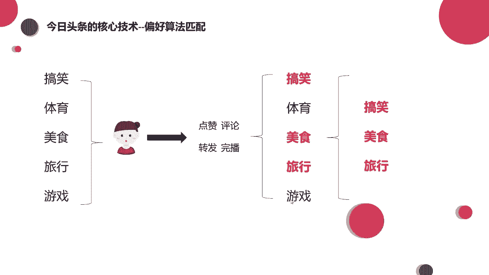
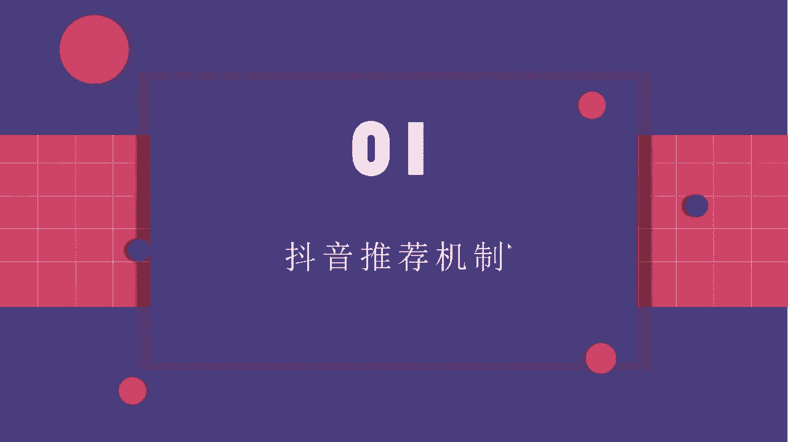
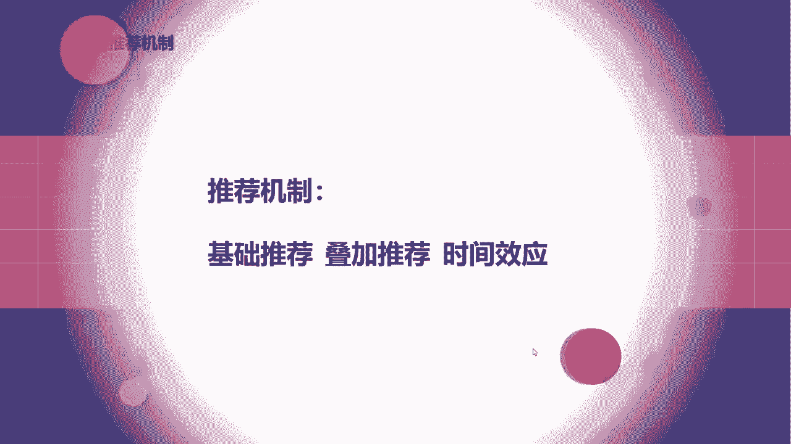
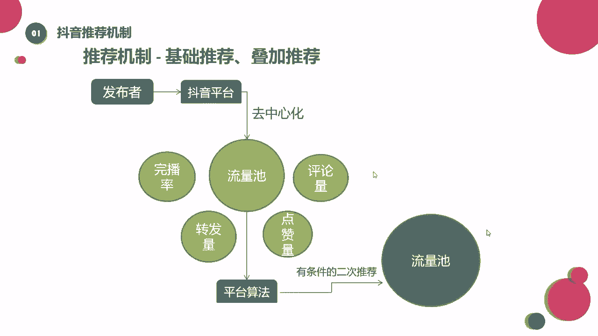

# 【2024强到无法呼吸】起号／涨粉／运营／变现一步讲到位，抖音自媒体运营保姆级教学，全程实操不讲废话！ - P25：推荐机制—基础推荐、叠加推荐 - 花猫的春天 - BV1cEW2eDEBd

那么啊接下来我们来看看一个作品在抖音上是如何进行分发的，这也就涉及到这个抖音的推荐机制了。我们可以看一下抖音的推荐机制呢，一般我给它分为三个，一个是基础推荐，一个是叠加推荐，一个呢是时间效应。我们一。

1点来看。

来，首先我们看到一个作品啊，他在这个抖音上发出去之后，它是通过一个去中心化的机制来到第一个流量池。那么这个去中心化的机制是什么意思？就是刚才我说的它是没有任何流量控制的，它的平台是不会给流量倾斜的啊。

我们这个叫做去中心化啊。大家简单理解就好啊。所以说只要你的作品还可以，它审核通过了，你的作品还算比较优质，没有什么大的硬伤，没有违规。那你发出去之后呢，基本上就会来到这个基础流量池。

当这个基础流量池里面呢会有200到500的一个播放量。画一下啊，基础流量池里就是有200到500的一个量。在这个流量区间内哈，用户会不会对我们的内容产生兴趣？如果说有兴趣的话呢。

他就会点赞评论、转发、收藏啊等等，对不对？等这些数据达到一个比较不错的水平之后，那么我们可能有机会进入到下一个流量池。那这个流量池可能啊有500到1000的一个流量。😊，来画一下500。到1000。好。

这些数据都不是固定的啊，只是举一个例子来给大家讲。那到了这个流量池之后呢，它会再重复上面的这个步骤，有一个流量池，一个流量池的往前走。那这个呢我们就叫做基础推荐，还有叠加推荐。大家应该能懂吧。

其实也是比较简单的。那么决定是否被推荐进流量池的这个主要的数据啊，就是这4个。来给大家框一下。像点赞、评论转发，这个我们就不说了啊。其中有一个呢叫做完播率，大家能看到吧。那么这个完播率是什么意思呢？

就是完全播放率。这个数据呢我们在抖音的后台是看不到的，它是不提供的。嗯给大家简单的举个例子去理解一下这个数据，好吧，那么这个完播率呢啊就是呃假设你去看这个视频，这个视频呢有50秒50秒钟。

那如果你只看了10秒，你就划过去了。那这个视频相当于你没有播放它，你只看了5分之1，对不对？那如果这个视频它是50秒，你50秒全都看过了。那相当于你的完全播放率就是之百，大家能懂吧。

能够满一个是25%的晚播率，一个是百分之百的播放率，那哪个更好呢？肯定是百分之百的晚播率更好，对不对？所以我们经常给到咱们同学的建议是哈，如果你是刚开始做做这个抖音号，你是新号的话。

最好刚开始发的这个视频的时长不要特别长。可能啊7秒钟往上十几秒钟，二十几秒钟就OK了。为什么？因为这样可以提高完播率嘛？如果你下发60秒的时候，你的质量不是特别好，你还没有做到特别顺手的时候。

那别人可能就不会把你这个视频看完，你就会影响到这些数据，影响完数据之后呢，你就进不了下一个流量池。😊，对不对？那这个大家都是能够理解的。那么这些量啊，我们把它加在一起，统称为互动率。

因为转发啊、点赞啊、评论啊啊或者收藏啊，这些呢都是用户跟我们作品的一个互动，对不对？我们把它统称为叫做互动率。那么这个概率达到多少才会进行一个流量池的再次推荐呢？啊，其实不同领域的互动率呢。

它是不一样的。我们可以来看一下。我们简单的把领域分为分为热门领域和冷门领域，也就是小众领域。其实我们可以看一下哈，像热门领域啊，热门领域有啥，有美食美妆服装，像搞笑啊，旅行种草这些，它对于这个年龄。

还有对于职业对于地域的要求都不是很高。因为吃的东西人人都吃衣服每个人都穿，搞笑的谁都爱看，对不对？那像这种呢它就是一个热门领域，也就是一个什么呀啊比较热门的类型。

像这种领域呢啊它的一个互动率达到8%到10%，就是比较好的一个互动率了。😊，啊，大家知道互动率怎么算吗？啊，比如说我算那个点赞，点赞量除以播放量，它得到的是一个点赞率。这就是我们的互动率或者评论量啊。

除以我们的播放量得到的也是一个评论率。大家能懂吧？啊，小学数学哈啊非常简单。😊，那这个是热门领域，那小众领域，也就是冷门的领域哈，它对于这个地域或者是男性女性啊，包括说这个年龄职业的要求就比较高了啊。

或者是推送给一些有需求的人，比如说像搞笑的，他没有需求，他也可以看，对不对啊？但是你说像婚纱摄影、家具装修的，他可能有兴趣了才会去关注到这里是吧？那像小众领域给大家列举到的有三农健身、新媒体营销。

像婚纱摄影、家具装修等等，还有很多哈，还有很多，那这个小众领域的互动率呢，大概达到3%到5%也就差不多了。😊，大知道，所以这个数据呢它不是具体的，没有具体，要根据你做的这个垂直领域去判断啊。

当然垂直领域也分为几级哈，一会儿给大家再看一下。好吧，这就是我们说的啊基础推荐，还有一个叠加推荐啊，再来看一下这个图，基本上都很容易理解。

