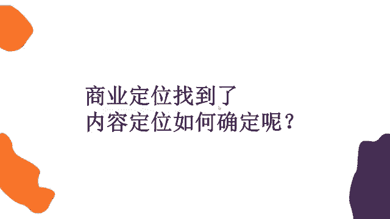
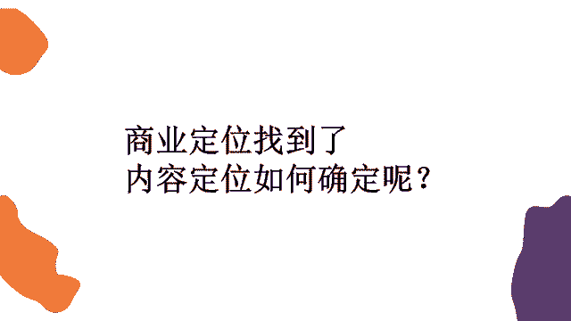

# 【2024强到无法呼吸】起号／涨粉／运营／变现一步讲到位，抖音自媒体运营保姆级教学，全程实操不讲废话！ - P28：用户思维 - 花猫的春天 - BV1cEW2eDEBd

怎么才能够达到这种引流的效果？哎，销售的效果。那我们可能以销售的思维我们去做的话啊啊，你会怎么做？以销售的思维去想。😡。

取决于客户的需求是吧？哎，没错哈，我马上就要讲到了。那取决于客户的需求。那我们怎么才能想到客户的需求呢？其实大家想一下，我们以销售的思维去做，我们想到大家喜欢啥用啥。那我们这些技巧，我们这些话术呢？😊。

你想单纯用销售的思维去想的话，我们可能会说我是医美，我能让你变美。你来到我的机构之后，我让你变成有一个蜕变。我们这里的就是这个医生特别的专业，特别的权威。那或者说我这本书特别好，只需要59块钱。

今天是七夕节，我还降了10块钱。你买吧，特别优惠。😡。

哎，但是这样的内容，它在淘宝上是可以的。我们说在抖音上是不可以的。😡。

为啥呀？😡。

为啥呀？大家喜欢啥用啥市场调研。没错，市场调研也是能够帮助我们去完成商业定位的。那么商业定位完了之后，我们就要再深入的去想了，我们要做内容。😡。

对吧。应该先是自己拥有资源，然后想客户的需求，最后想怎么用自身的需求啊，没错，所以我们第一步才是做的商业定位，对不对啊？首先啊我们自己拥有的一个资源，要么就是你自己有产品，要么就是你自己有店。

要么呢就是你的标签里面有你特别擅长的领域，特别特殊的领域，对不对？然后我们现在在想了，我们怎么才能抓住用户的心，让他买你的东西，让他能够引流到你的线下来。😡。

亮点不够哈啊，因为淘宝和抖音它有一个实质性的区别。我们说淘宝是电商平台，而抖音是一个娱乐平台。

是不是但凡你打开淘宝，就是因为你有什么的需求啊，购物的需求，或者是你做好了花钱的准备。😡。

对吧，所以在这个时候他怎么给你销营销啊，就他告诉你59块钱，现在七夕节还降10块，还打5折，你一看便宜啊，你就买了，对不对？但是抖音它是一个娱乐软件，你本来是去抖音找乐子的，是不是哎，老娘图开心的。

这个时候有人给你推销了，你是不是还挺烦的，就稍微有点烦是吧？你即实再便宜，关我什么事儿，我来是为了要干嘛的，我是为了娱乐的，哎，你老是跟我说这个打折那个打折，我不想要？😡。

对不对？所以我们要站在用户的角度上哦，刚才我也讲了，互联网思维有九大思维。我们先不管其他的8个思维是什么，而且现在市面上啊总是会流传出各种各样，可能十二大思维啊。

各种这思维内思维就是很多概念派的东西出现了。但是我们可以不用管其他的啊，我们永远记住，第一个是用户思维，永远都要想用户他喜欢什么。😊。

嗯，我给大家举个例子，好吧，就比如说我们肯定学习了拍摄剪辑，对不对？你们也学习了这种灯光打光的知识了吧，你们学了没有啊，我假设你们学了，比如说你们学会了之后啊，学的特别好了。

我想要把这个知识呢分享到抖音上。目的呢哦就是为了我要教别人这个知识，让别人也付费，也付费买我的知识。😡。

好吧，那么我假设这个可能呃视频中可能你有5个知识点，这5个知识点呢就是讲什么啊，小雪老师讲的是吧？啊，那我不知道你们学了什么灯光啊，我我也并没有小雪老师那么专业，我随便讲几个，而侧光怎么打。

打了有什么效果，底光怎么打，打了有什么效果，蝴蝶光怎么打，打了有什么效果，还有轮廓光怎么打，打了有什么效果。😊。

啊，是不是我们可能一个视频里有这四五个知识点。😡。

那么如果是你们把这个知识分享到抖音上，你们会怎么讲？😡。

或者说你们会按照什么顺序讲，是不是随便想到哪个讲哪个按测光我们怎么打，它可以让视频更清晰。那底光我们这样打，它可以让这个画面更恐怖。那蝴蝶光这么打，可以让我们整个呃人更美丽。😡。

我们是不是按照随机的顺序，就把这几种光的知识给讲完了？

你可以想一下。你们是不是会这样讲？😡。

然后啊你可能这样讲完之后，发出去，我要起个标题嘛。那你的标题会怎么讲？我说卷心菜今天教你三种打光方式啊，非常有用，赶紧收藏。😡。

你会这样起标题吗？😡。

大家可以就是真的去思考一下，是不是？😊。

这个思考一下。我们总说啊。

不会是吧，那你们会怎么样怎么样去完成这个视频呢？怎么样取这个标题呢？😡。

不这个东西都是需要思考的。我们真的在说用户他到底想看什么，用户他到底需要什么，那你就要具体到你的视频。即使你的视频只有7秒钟，只有8秒钟，你也要考虑到每一秒钟你的用户看完之后有什么样的反应。😡。

是不是？😡，那比如说刚才我讲到测光、底光、蝴蝶光，对不对？那大家可以想一下测光。😡。

人人必讳的三个打光神迹啊。好，我一会儿再讲这个标题的事儿啊，大家可以想一想，比如说测光我打，我可能让视频可以更清晰，底光我打，我能够更害怕。哎，其实我看了之后，我觉得哦，好像是这个样子哦，还有点用啊。

还行吧。然后最后我讲的蝴蝶光怎么打啊，可以让女生更漂亮。😊。

对不对？😡。

更漂亮，这个东西呢是利益，而底光打更恐怖，只是一个效果。大家能懂吧？所以你在展示给用户的时候啊，你要想一下怎么样才能吸引到他们。啊，比如说这几种打光方式，我可能会把蝴蝶光怎么打，有什么效果放在第一个。

我把女生更漂亮，可以把他的轮廓给打出来，对不对？因为我第一第一第一个就是前面几秒的时候，我好像给别人获得利益的感觉了。😡。

对，那么其他的几个你可能只是单纯的教他哦，这个工具是这么用的，用了之后能有这种效果。

对吧所以说我们可能把更吸引人的，哎，或者说能让别人有这种利益获得感的放在前面。😊。

是不是然后再讲到标题这个事情啊，标题这个事情是什么啊？就是人人避讳的三个打光神迹。有同学说了。😡。

对不对？那或者说啊教你三种打光方式。但是其实啊这种打光神迹，打光方式。😡。

那那别人会想看吗？哎，你打光关我啥事儿，对不对？关我啥事儿。😡。

就让我没有利益获得感。那你可以说什么啊，卷心菜教你能把姑娘变漂亮的打光方式。😡。

那这样的话啊，这个就是有一种利益获得感的标题。那当然我只是举了一个简单的例子，好吧啊，当然具体每个光啊到底打出来有什么效果啊，是不是光要叠加着使用啊，我也不太清楚，这个你们肯定是更了解的，对不对？

所以说每一秒都要考虑用户我们看到之后，它是一个什么样子的反应。😊。

