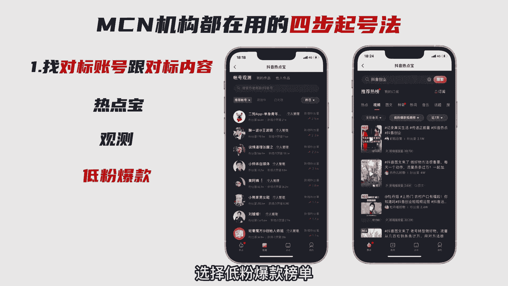

# 【2024强到无法呼吸】起号／涨粉／运营／变现一步讲到位，抖音自媒体运营保姆级教学，全程实操不讲废话！ - P2：抖音快速起号素材 - 娃哈哈滴娃 - BV1H9nZeyESU

99%的人都不知道的，抖音快速起号方法，很多博主告诉你，不要直接点击加号发视频纯属骗流量。

今天给大伙拆解做抖音真正的旗号方法。

学会之后，你也可以做出万赞爆款，首先我们要搞明白到底怎么样才算是起号成功。

请看图，抖音流量分为八个层级，起号的唯一目的就是突破流量层级，账号至少要达到第二个层级。

有大几千的基础播放才算是起号成功，接下来给大家拆解MCN机构都在用的四步，7号法，一找对包账号，跟对包内容，在抖音里搜热点榜。

选择观测，却找到你所在领域里，七天里涨粉最多的十个账号。

接着继续在热点榜搜你所在行业的视频，选择低粉爆款榜单。

去挖掘最近七天里上过热门的低粉高赞视频，二确定你的视频形式。

去研究对标账号的视频风格，选择一个现阶段你有能力模仿，并且可以超越的视频风格。

比如真人口播，又或是动画PPT等等，确定视频内容，从上述十个对标账号里找5~7个热门选题。

在抖音里搜这些选题内容，找到3~5个爆款视频下载并提取视频文案。

再根据自己的理解组织语言，写出5~7篇热门文案，四测试热门视频，确定了视频形式，有了文案制作，七个原创视频，每天发布一个，连续发一个星期，基本上会出一个爆款视频。

也可以买斗家具投达人相似，来加速整个过程，视频爆掉后，持续更新这个系列的内容。

执行完上述的操作后，基本上都能稳稳起号之后。