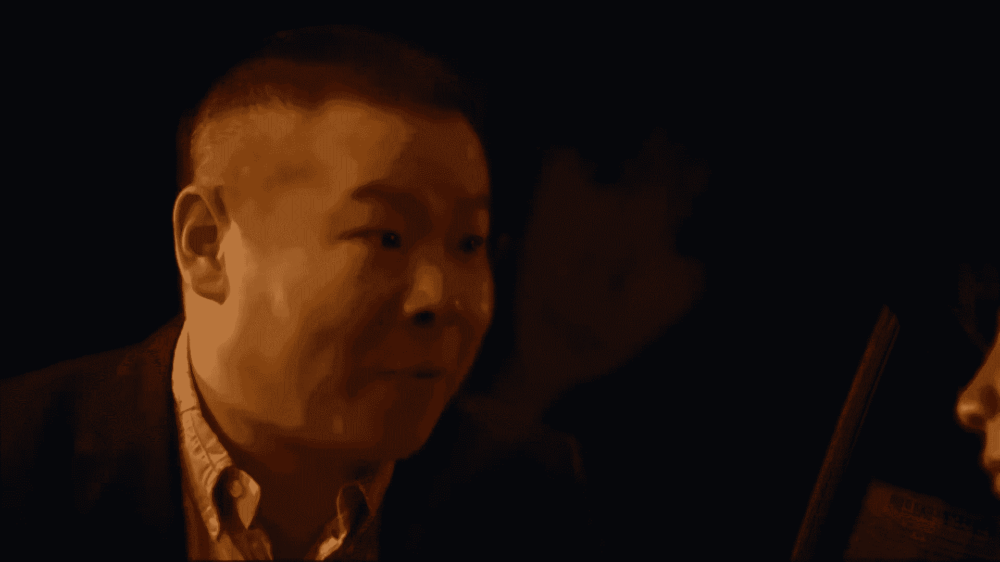

# 【2024强到无法呼吸】起号／涨粉／运营／变现一步讲到位，抖音自媒体运营保姆级教学，全程实操不讲废话！ - P3：新手如何做抖音 - 花猫的春天 - BV1cEW2eDEBd

。🎼B有。🎼你要点赞，你要投币。😡。

🎼好不好？点赞呢，投币刷下一个视频吧，你的B站以后刷不到我了，没关系，你要给别人投币啊，屁啊。😡。

🎼哎呀。🎼比奥，你为什么背着我怎么画？比奥。🎼你这个兵占有我。😡，あ。🎼气死我了，三彩艺，为什么别人的视频做的比你烂，却还是播放量比你高呢？根本原因啊在于运营的节奏出了问题。😡。

🎼我们从小接受的教育是要赢在起点。但其实呢回顾一下整个学生生涯，你会发现，即使当年最差的学生到了三四年级，也会拼于识字四自运算。所以啊当时间到了一定的阶段，很多曾经很难理解的知识，其实啊都能轻松的掌握。

只是呢我们太着急了。一个小学的数学考试都要会外语，更有家长把整个一年级的课程全部提前学完了，这就导致呢很多的孩子到了初高中后，后觉不足，而美国呢则恰恰相反，讲究的是书在起点赢在终点。😊。

🎼通过这件事啊可以看出来，我们被教育的做什么都追求快，心态浮躁，想要立马有结果，却忘记了坚持才是最重要的能力。😡，🎼对他做抖音来说，总共加起来没发10条作品，就焦流的不行啊，陷入深深的自我怀疑之中。😡。

🎼没发之前呢，感觉哪哪都满意。😡，🎼放完一看，20播放又感觉哪哪都不行，乱改一头再撒一遍。结果呢播放还那样，恨不得呀一条作品就上一个热门，殊不知，专业的团队也做不成那样。😡，🎼而且啊人一旦敏感过度。

根本没法把精力和时间集中到工作上，而是一直处于没有意义的内耗之中。所以记住做短视频和任何行业一样，是一个循序渐进的过程。你发到第100条，肯定和现在不一样。所以呢不要时不时的就让自己陷入到情绪漩涡之中。

把每一件事儿都放到长远的时间上去看过三个月后啊，你会发现这件事情对你的人生没有任何的影响，甚至呢可以忽略不计。😊，🎼而且那时啊估估计你的损失量和播放量都已不再是问题。你要继续克服新的难题。😡。

🎼现在啊所有的老师都在强调，你要学会这个技巧，学会那个套路，但没有人啊告诉你要学会坚持。🎼帮助你克服心理的焦虑。🎼作为一个初学者，你能做到60分的作品就已经超越80%的人。🎼所以呢你要相信自己。

你的作品就是很棒，无论别人怎么看有多少播放量，绝对不打乱自己的运营节奏，就是坚持更新。😡，🎼另外呢这些方法呀也不是说没用，但那些技巧不是灵丹妙药，不是使用了立马就会有播放。而是呀要学会这其中的运营逻辑。

🎼就像上学时候一样，你要学会举一反三。

