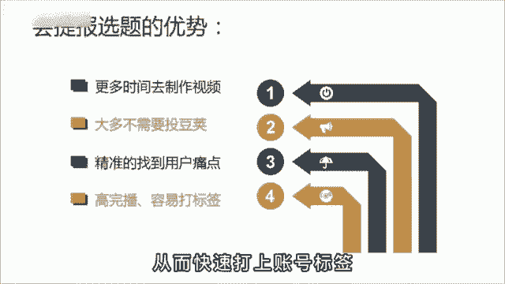
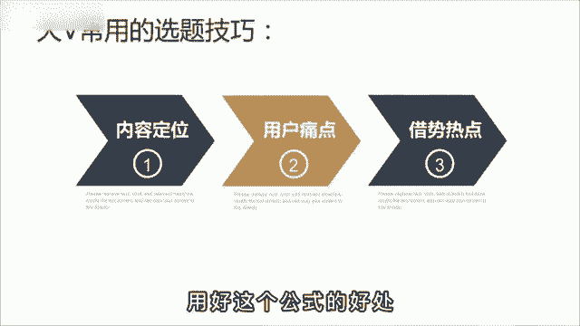
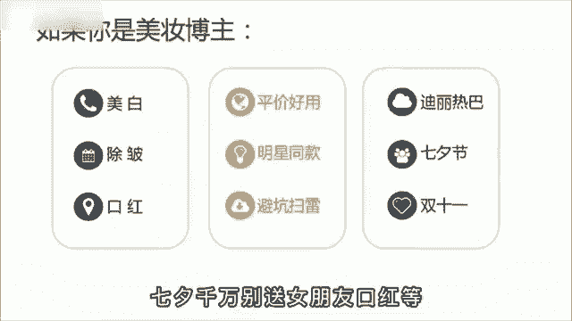
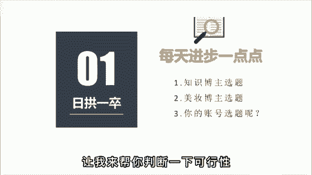

# 【2024强到无法呼吸】起号／涨粉／运营／变现一步讲到位，抖音自媒体运营保姆级教学，全程实操不讲废话！ - P6：抖音选题思路技巧 - 娃哈哈滴娃 - BV1H9nZeyESU

你现在做抖音流的泪都是定选题，是脑子里进的水，是不是想选题，想的头都秃了，不知道明天该发啥，今天啊教你一套公式，一分钟帮你解决这个苦恼。

会找选题的人呀，他会有更多的时间去制作视频，每天发三条，一个月就是90条，靠堆量都能卷死，根本不需要透豆加，而且会做选题的人啊，能比你更精准的找到用户的痛点所在，也更容易得到精准粉丝的驻足观看。

从而快速打上账号标签。

那有什么办法解决吗，当然有，这是一套呀，百万粉丝博主常用的选题技巧，为了方便理解，我把它总结成了一个公式，就是内容定位加用户痛点加借势热点，用好这个公式。

你的内容啊一定不会跑偏，比如你想和我一样做一个知识博主，就得去啊挖掘一些行业的关键词，像播放量，粉丝量，定位选题等等，这些都是关键词，没有任何的主观描述，然后呢在这个基础上去寻找用户的痛点。

比如像便捷高效技巧教学内容输出，最后啊去蹭近期的热点，把他们进行任意的组合就可以了，眼下这不马上就要春节了吗，你可以说如何用拜年的方式播，播放春节必火的选题内容，张同学快速涨粉的三个秘诀啊等等。

那我们呀再把这个公式套在别的行业里，再试一下，比如美妆行业内容定位是美白除皱口红，用户痛点呢是平价好用，明星同款避坑扫雷，最后啊借势热点进行排列组合，比如迪丽热巴同款美白面膜推荐。

七夕千万别送女朋友口红等等。

那以上啊，我已经举一反二了，至于反三就交给你了，你可以根据你的行业特性，把你的思考过程发出来。

