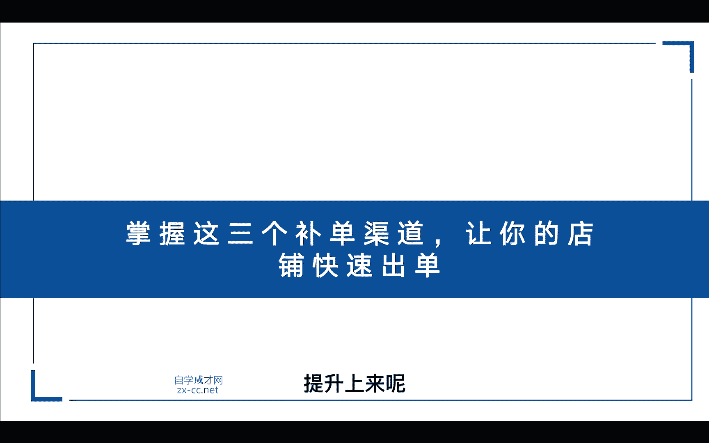
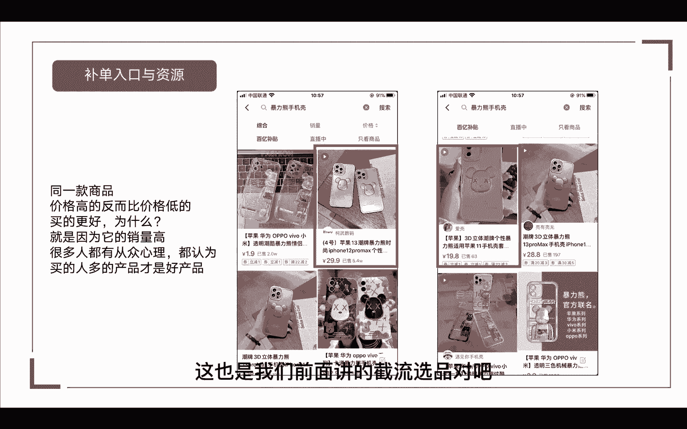
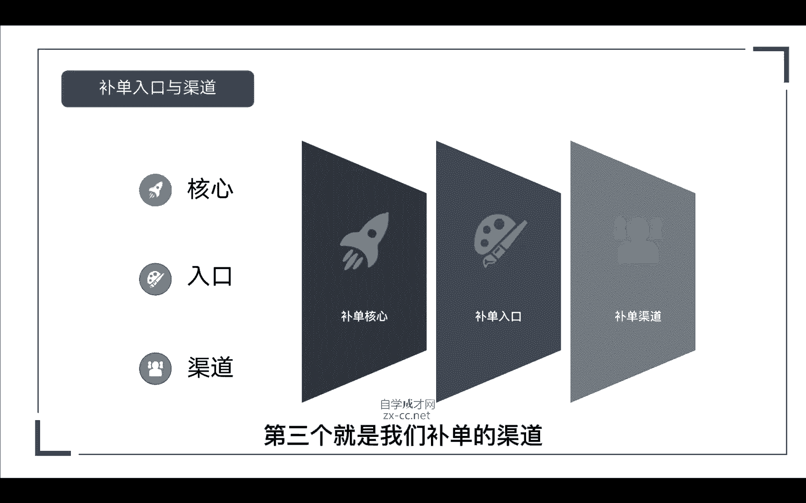
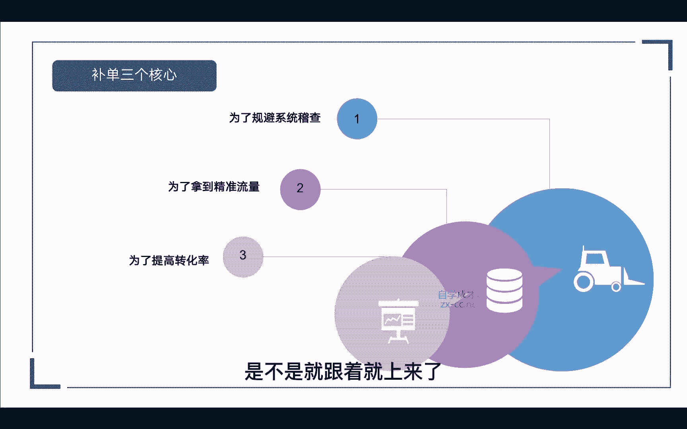
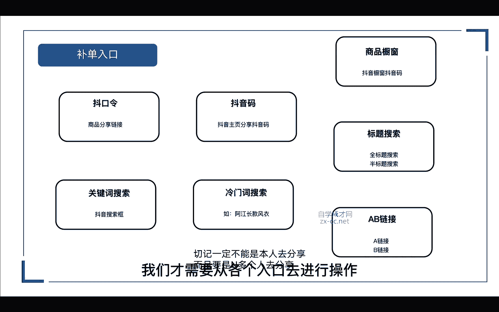
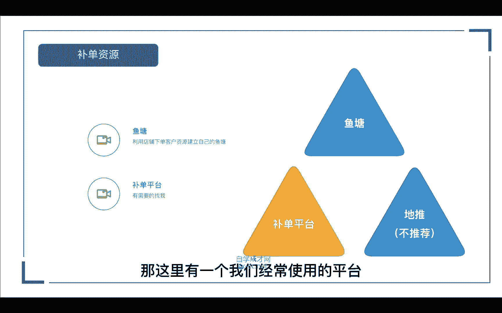
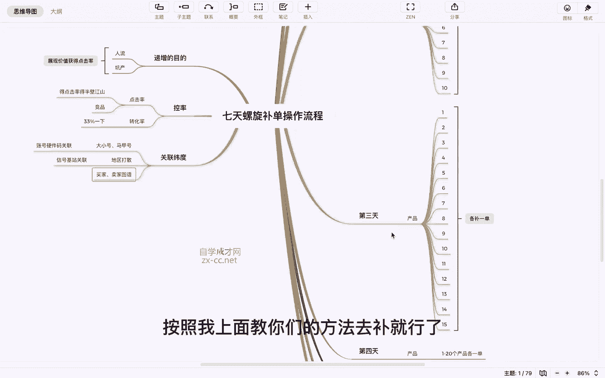

# 【2024抖音电商新手教程】-抖音小店官方完整开店教学！从新手开店到爆款店铺，零基础入门抖音小店运营教程！强烈建议收藏 - P10：7天螺旋补单 - 人生何处不相逢啊12 - BV15r42147Yp

我们为什么要去做这个数据呢，第一如果说你不去做这个数据，你的店铺冷冷清清的，本来还想买你的东西，结果一看你的销量零就不买了对吧，那第二如果说你没有销量的话，你可能连排名你都拿不到。

更不要去说获取免费的流量了对吧，那第三如果你店铺的体验分下去了，我们是不是可以通过这个，把我们的店铺体验分给他提升上来呢。

所以这就是我们为什么要去做基础销量的原因，给大家举个简单的案例来看一下吧，比如说这两张图，同一款的手机壳对吧，一个卖29块九，一个卖19块八，为什么29块九的卖的，比那个19块八的卖的还要好呢。

销量更高呢，就是因为它的基础销量高吧，那现在很多人都是有从众心理的，都认为买的人多的产品才是好产品，那当然贪便宜的人也有嘛，那第二个呢，他就是占据了那些爱贪便宜的人心理嘛对吧。

同样的也是通过低价格去截取流量嘛，也卖60多单，这也是我们前面讲的节奏。

全屏对吧，那我们怎么去找到入口和渠道呢，那这里有三个重要点，第一个呢就是我们补单的核心，第二个就是我们补单的入口，第三个就是我们补单的渠道。

我们先看一下补单的三个核心，第一个为了规避系统的稽查嘛，所以我们才要做一系列的动作对吧，去模拟一个真人购物的路径，那第二个我们为了拿到，我们为了拿到精准的流量嘛，就像就像我前面说的销量对吧。

你的产品销量高了，系统自然就会给你推送自然流量，第三个就提高我们的转化率吗，当你的商品转化率上来了，我们店铺的体验分是不是就跟着就上来了。

那就是我们补单的三个核心，那我们再看一下补单的入口，第一个我们可以通过斗口令，商品的一个分享链接对吧，第二个通过抖音码抖音主页的分享码，第三个呢，商品橱窗通过抖音橱窗抖音码分享出去，第四个呢关键词搜索。

去抖音搜索框搜索我们这个产品的关键词，第五个呢去设置我们的冷门词，去搜索冷门磁，比如说我有一款风衣，我可以设置为阿江长款风衣对吧，某某某风衣就是一个比较冷门的词啊，别人可能搜索不到的。

那我们可以通过这个去搜索，第六个呢标题搜索，标题搜索包含我们的全标题搜索，半标题搜索，也就是通过我们产品的标题啊，可以通过全标题整个标题去搜索，或者是一半的标题半标题搜索对吧，那最后一种呢就是AB链接。

通过我们的A链接进入小店，拍B链接，这叫做ab链接，那这里切记呢，一定是不能本人去分享这么多链接的啊，一定要是找多个人或者是N多个人去分享，那我们为什么要通过这些入口去补单呢，首先我们要思考一下。

一个正常人的购买行为对吧，有可能说同一个链接入口一直持续的去购买，肯定是不行的，对不对，那有可能我买了这个商品，我觉得很好，我推给了你，或者说是你一个人买了又推荐给了N多个人，那这些人都去买了。

那这就不现实啊对吧，系统又不是傻子，很多东西它有一个警戒线的，它是提前已经预设好的，所以说我们才需要从各个入口去进行操作。

那除了我们的补单入口呢，我们再看一下我们的补单资源，那补单资源的话有三种，一个是鱼塘，一个是补单的平台，还有一个就是递推，那么地推呢是以前玩微商的玩法，现在都很少了啊，都不会用到，那这里我们就不讲。

首先我们看一下第一个鱼塘，那如何自建自己的鱼塘呢，我们可以利用店铺真实下单的客户资源，去建立一个属于自己的鱼塘，就比如说有顾客在你的店铺购买了商品对吧，那我们可以通过后台飞哥去找到客户，去跟他联系。

就比如说哎我们最近上新了一款新的产品，那我们店铺为了回馈老客户呢，免费送给您体验一下，您看方便加一下我们的某信吗，对不对，那这样是不是就导入到我们的后端呢，后续我们还需要补单的时候。

我们是不是就可以从这里面去入手，第二个呢就是补单的平台，那市面上有很多的补单平台啊，当然也有些不靠谱的，可能你去补一两单店铺就被封了，那这里呢有一个我们经常使用的平台。

有想要的可以来找我，我发给你，接下来是我们七天的补单操作流程，这里呢我总共把它分为七天来操作，那前面我们讲了入口的渠道啊，补单入口从哪里进入，第一个商品的斗口令对吧，第二个抖音主页码，第三个橱窗抖音码。

第四个关键词搜索，第五个冷门词搜索，第六个啊标题搜索，第七个AB链接对吧，那么有了补单入口呢，我们就开始从第一天来操作，第一天我们操作的目的是什么，为了新品破零嘛对吧，你的新品要有销量吗。

第一天去我们店铺里面选四个诶，你认为还比较有爆款潜质的产品，那我们各补一单，那在第二天呢我们的目的是什么，单量递增不脱单啊，这里呢就不要去脱单啊，一拖一就可以了，第二天呢我们补十单。

加上前面的1234个品对吧，后面再加六个品，这十个品我们各补一单，那1234就有两单了对吧，那第三天呢同样的我们再去加五个品，就是15个品，123456789十，这十个品呢我们在第二天都补了一单了。

在第三天呢1234就有三单了，56789十呢就有两单了对吧，那第四天呢，我们按照以上操作步骤继续去增加就可以了啊，第四天就是20个品啊，第五天就是25个品，第六天呢是30个品，第七天呢就是35个品。

我们只需要去给产品做一个递增就可以了，那我们为什么要做递增呢，那如果说你要做猜你喜欢，我们就要展现价值嘛对吧，平台给你展现了谁能为平台提供更大的价值，谁就能优先拿到权重对吧，那怎么递增呢。

无非就是人流和坑产嘛，人流是什么，人流就是人气嘛，坑产就是我们的营业额对吧，那每一天我们的单量都在上升啊，是不是人气正在增加，每天的单量都在增加，我们的坑产是不是也在增加。

所以说我们只要去递增就完了对吧，展现价值或者我们的点击率嘛，那如果说我们递增也做了啊，坑产也递增了，但是没有流量怎么办，这个时候你要去看一下你的点击率啊，你的点击率高不高。

比如说给你1万个的展现点击率只有1%，那你就只能拿到100个搜索嘛，那人家那个点击率7%的，人家可以拿到700个搜索对吧，你点击率就输给别人了，所以说得点击率得半壁江山啊，得点击率得半壁江山啊。

把这句话记下来就可以了，那这个时候我们就去死磕点击率就可以了嘛，对吧，那还有的我点击率高了，搜索也高了，为什么猜疑喜欢还是不爆单呢，那赛马机制你懂不懂，你也在卖这条裤子，他也在卖这条裤子对吧。

你是这么递增，你点击率很高，但是他递增的单数比你猛啊，所以说他赛马就赢了你啊对吧，那这个时候，你是不是就得去关注我们的竞品了啊，关注你的竞品，同行的竞品，我们得去扒一下他的数据。

看看他是不是比你猛啊对吧，那转化率呢就是我们补单的时候，我们要注意我们的转化率，比如说你今天要补十单对吧，你找十个人来，那十个人都来拍了，你这个店铺马上就数据异常了，那数据异常就等于权重不更新嘛。

那这个时候我们就要去控制我们的转化率，那控制在多少合适呢，一般在33%以下啊，33%以上，就比如说今天你要补十单对吧，那我们至少要找30个人来点进这个商品啊，去你的店铺里面。

那这30个人里面有十个人下单就OK了，那我们的店铺数据就不会异常了对吧，我们以正常的思维去思考一下，都知道这个东西，那么我们还要注意一个关联的维度啊，里面包含了比如说大小号。

马甲号地区打散买家卖家的图谱对吧，那什么是大小号，比如说这个宝妈她是来挣佣金的对吧，她来做任务就是赚钱嘛，他用一个手机做一单可以赚五块钱，那他傻，他不会用十个号对吧，那他会不会买十台手机呢。

不会他会退出去重新登录另外一个账号，因为他十个号就可以挣50块钱对吧，那么硬件设备呢，每一台手机它就是一个设备对吧，那这个设备里面它有个硬件码，那他如果一直用这个手机登录账号，那这个设备的硬件码。

就等同于我们电脑的同一个IP了，所以当他换马甲号退出来再登录大小号的时候，那这个在反作弊里面去抓这个硬件设备码，关联的这个点都是很基础的，操作系统马上就去查你了对吧，店铺马上就异常了，那什么是地区打散。

就是我们把他的地区打散了，不要在同一个地方去下单对吧，这里就涉及到一个信号基站的关联，因为现在基本上每5km就有一个5G信号，4G信号的发射塔，那比如说你和你亲戚朋友住在同一个小区对吧。

你让你的亲戚朋友都来帮你补单，那这个时候反作弊抓你的信号基站关联的时候，你们的区域都是雷同的，它这些各种特征穿插起来证据确凿，你就是作弊的，所以我们就要错开地区嘛，把地区打散，那买家卖家图谱又是什么呢。

比如说这个群里面有500个人对吧，其实可能就只有50个宝妈在里面，那每一个宝妈可能都有十个小号在里面，他用他的大号介绍他的小号进来对吧，也就相当于这个群做完任务以后呢，又换鱼塘啊，我又换给他。

他又换一个鱼塘给我，那这里面本来就是大小号，马甲号一大堆对吧，做完A店又去做B店，哪有那么巧的，同样的一群人买了A店要去买B店，如如出一辙的，所以它形成的特征就是。

买家跟卖家的交易链就指向了一个作弊的行为，而且还是大规模的作弊，所以买家和卖家的图谱也要错开来，那只要你错开我前面说的这些关联维度，也就是平台不洗掉这条订单的权重，那我们前面做的补单流程。

对于小店的搜索，或者是对于小店猜你喜欢是百分百有用的，如果说你的地区没有打散硬件码，没有打伞，还有我们的这个啊入口渠道没有打散，那我们的订单被洗掉了，做了就等于没做嘛，对吧，就是在浪费我们的时间。

甚至还会面临罚款，那么这就是我们七天补单操作的一个流程，按照我上面教你们的方法去补就行了。

