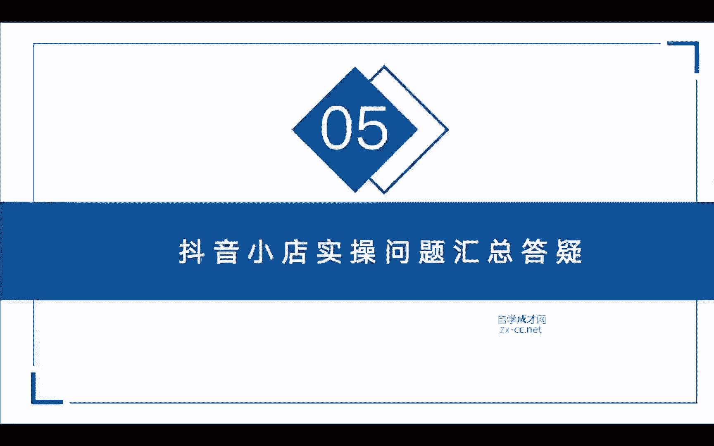
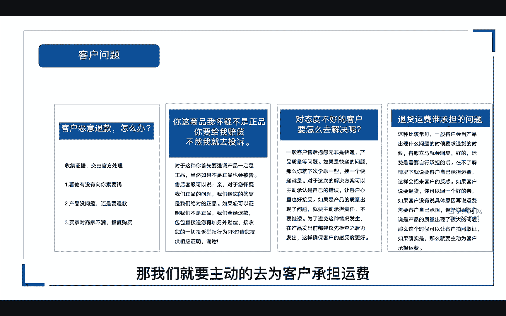
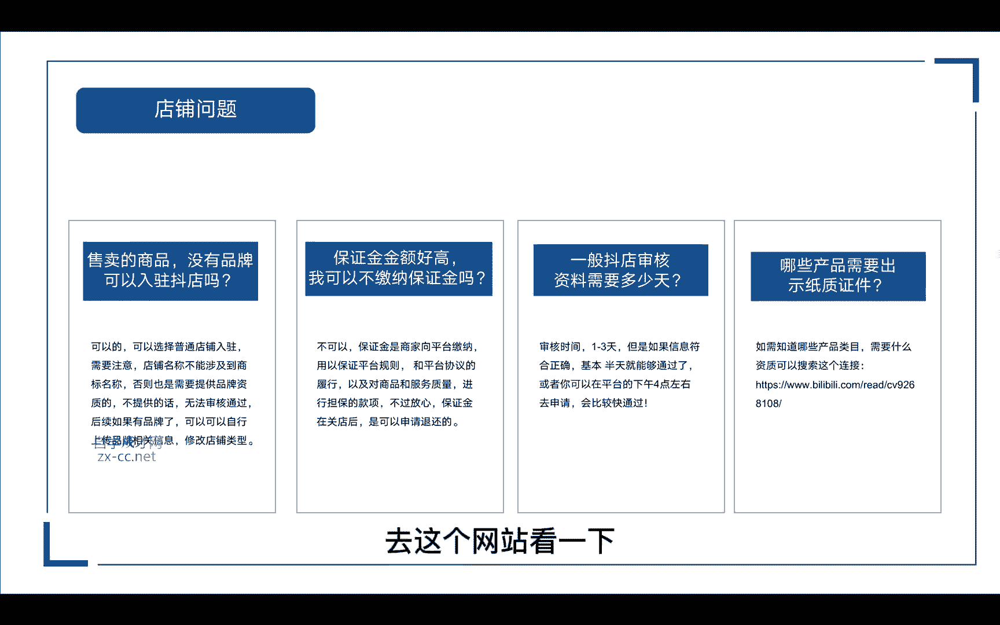
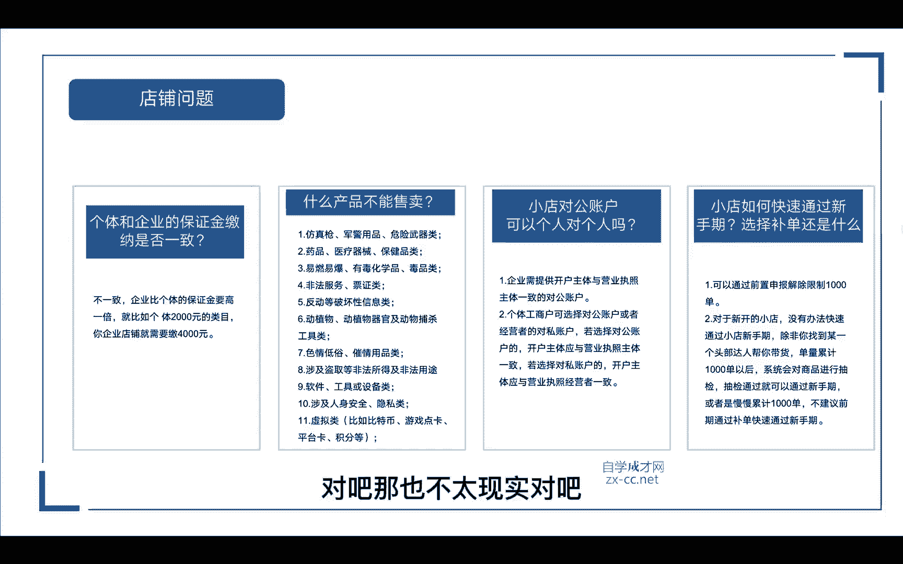
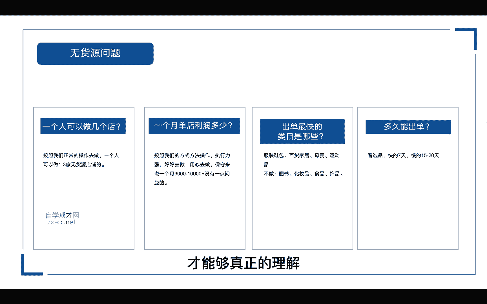
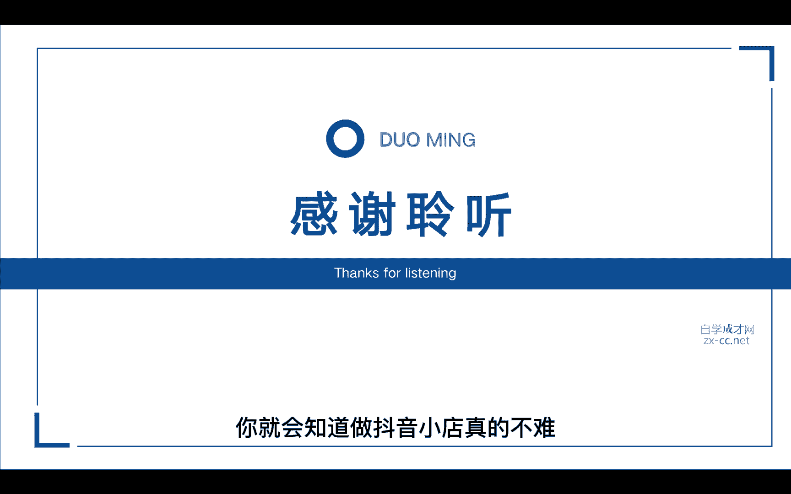

# 【2024抖音电商新手教程】-抖音小店官方完整开店教学！从新手开店到爆款店铺，零基础入门抖音小店运营教程！强烈建议收藏 - P11：抖音小店实操 - 人生何处不相逢啊12 - BV15r42147Yp

hi我是阿张，接下来进入我们抖音小店，实操问题的一个汇总答疑，首先第一个我们会面临客户的一些问题对吧，如果说有客户恶意退款，我们这个时候应该怎么办呢，首先我们先去搜集证据对吧，交给官方来处理。

第一个我们看他有没有向你勒索要钱，第二个我们看一下我们的产品是不是没有问题，如果说在没有问题的情况下，他还是要退款对吧，我们可以把聊天记录给它收集起来，第三个我们看一下，是不是因为他对我们商家不满意。

选择报复性的购买对吧，可能由于前面买过我们店铺的商品啊，我们的服务或者是哪里没有令他满意，他想要来报复我们，再次购买我们的商品，就是要给我们差评，那针对于这种情况呢，我们把它收集起来。

去找官方处理就可以了，那第二个有的客户他会说，哎你这个商品我怀疑不是正品，你要给我赔偿，不然我就去投诉你对吧，那对于这种人，你首先要强调我们的产品一定是正品，当然如果你的产品涉及到某个品牌。

不是正品的话，也会面临被告，那这个时候我们售后的客服呢可以说亲，对于您怀疑我们正品的问题呢，我给您的答复是，我们绝对是正品啊，如果你可以证明我们不是正品的，我们可以全额给你退款，包包呢我们直接送给你。

另外再加补偿对吧，接受你的一切投诉举报行为，不过请您提供相应的证明，谢谢这样客户一听一想哎，我这个东西又不值多少钱，我还要去鉴定一下，让浪费我的时间，浪费我的成本对吧，一想哎就算了。

那还有一些对态度不好的客户要怎么解决呢，就有的客户啊，他会来找你抱怨啊，什么呃，快递慢啊，比如说产品质量问题啊等等，他可能就想让你给他一些补偿，那这时候如果真的是快递的问题，那么下次你就学乖一点对吧。

我们换一个快一点的快递，那对于这次解决的方案呢，我们可以先主动承认是自己的错误，让客户的心理呢也比较好接受对吧，如果是产品的质量出现了问题，我们就要主动承担责任，不要去推诿，那为了避免这种情况的发生呢。

在产品在产品发出之前，都先检查一下颜色有没有发对，尺码有没有发对，先检查一下再发出，这样可以确保客户的感受度更好，那还有一个就是涉及到退货的时候啊，那个运费该谁来承担，那这种是比较常见的。

一般客户呢会当产品出现什么问题的时候，要求退货，那有的客服就会立马回复诶好的，但是运费呢需要自己承担的，那在不了解情况下，就说要客户自己承担运费，这样都会招来客户的反感对吧，那如果说客户要退货。

那你是不是可以先回一个好的亲，那如果说客户没有说具体的原因，那这个时候我们再来说哎，这个运费是要客户自己承担的，但是如果客户说是产品质量出现了很大的问题，那么这个时候呢可以让客户拍照取证对吧。

如果确实是产品问题，那我们就要主动的去为客户承担运费对吧。

我们再看一下店铺的问题，就在我们发货了以后产生了退款，该怎么办呢，这个时候我们要及时的去联系商家，问一下解决的方案对吧，就说我这边有一单客户在发货的时候，他他要申请退款，如果商家那边同意退款。

我们这个时候再去到我们小店后台去操作，那第二个呢就是去联系一下买家，是什么原因导致他退款，能不能私下去解决一下，第三个呢就是我们要及时的去跟踪这个订单啊，看他现在处于一个什么样的状态，看下快递物流啊。

已经到了哪里，能不能中途把它截取啊，只有一个营业执照，但是想开多个店铺是否可行，那抖音小店呢，一个营业执照只能开通一个店铺，如果说你想开通更多的店铺呢，我们需要使用其他没有入驻过。

抖音小店的营业执照来进行入驻，所以说一个营业执照只能开通一个小店，那店铺违规了应该怎么办，那我们违规的时候，我们可以去看一下到底是什么违规，如果是产品违规的话，我们要及时的去改进，是否有违规的图片。

那我们在批量上架的时候呢，比如说一些带促销的对吧，敏感词的我们就要去及时的修改，那还有一种严重一点的，遇到店铺封店了，怎么办呢，我们去申诉跟客服沟通一下，看下有没有解决的方案。

保证金不足会产生哪些影响呢，如果说抖店保证金金额低于应当缴纳的金额，那么商家的提现功能就会受到限制，你可能没有办法提现，那比如说原本应该交纳2000的保值资金对吧，但是你的店铺保证金余额。

比如说有些地方扣了分罚了款对吧，他从我们的保证金里面扣除以后只剩1500，那这个时候呢就会导致你卖出去的商品，得到了钱，还暂时无法提现，那如果说你开通了货到付款啊，当我们的保证金低于任意类目的时候呢。

这个时候呢这个功能就无法使用，那我们应该怎么办呢，我们可以去抖店的账户中心，去去去冲一下保证金，那么以上的问题都能够完美的解决掉，售卖的商品没有品牌可以入驻抖店吗，可以的，我们可以选择普通店铺入驻。

但是需要注意的是，我们的店铺名称不能涉及到商标名称啊，否则的话也是需要提供品牌资质的，如果说你不提供的话，就没有办法通过审核，后续如果说我们有了品牌，我们可以在小店后台去上传品牌相关的信息。

修改店铺的类型都是可以操作的，那还有的人说保证金金额太高，我可以不加纳保证金吗，这不可以的啊，保证金呢是商家向平台缴纳的，那我们是用于保证平台的规则，以及呢对商品和服务质量进行担保的款项。

不过你可以放心啊，这个保证金在我们关店的时候，是可以申请退还的，那抖店审核资料需要多少天，一般的审核时间是1~3天以内，但是如果你的信息符合正确的话，基本上半天就能通过。

或者说你可以在平台的下午四点钟左右去申请，他会通过的比较快，如果说想要知道哪些产品内幕需要资质的，可以搜索这个链接啊，去这个网站看一下。

它都会有详细的说明，个体和企业的保证金缴纳是否一致啊，这里是不一致的，企业呢比个体的保证金要高出一倍，比如说个体2000块钱的类目对吧，那你如果是企业店，那你就要缴纳4000块钱。

那什么样的产品不能在抖店上售卖呢，啊就是以下11种仿真枪啊，军用用品，危险武器类啊，药医药品或者是易燃易爆的，以及一些非法的服务证，证券票务类的，还有一些反动反动等破坏性的啊，还有一些植物类。

动物植物器官以及动物捕杀的工具啊，色情低俗的不用多说了，还有一些涉及盗取的，盗取非法所得的软件工具，还有一些设备涉及人身安全隐私的，还有一些虚拟类的，比如说比特币啊，游戏点卡，平台卡啊。

积分等等这些这些都是不能在平台上销售的，那小店的对公账户可以个人对个人吗，啊这里要注意两点啊，一个是企业的，一个是个人的，那企业的话需要提供开户主体，与营业执照主体一致的对公账户。

也就是说你用企业营业执照去开通的小店，那么你必须要开通一个对公账户，包括我们后期提现的时候，也是需要用到这个对公账户的，但是对公账户是不能对个人的，个人呢是可以选择对公账户的。

也就是我们第二个个体工商户，可以选择对公账户或者是经营者的对私账户，若选择对公账户的，那么开户主体应该与营业执照主体一致，就是说你要个人对公对吧，那你这个个体工商户的法人。

跟你这个对公账户的法人是一致的，那如果是选择对私账户呢，那你开户的主体应该是与营业执照经营者，是一致的，也就是你这个私人账号的户主，必须是与营业执照主体的那个法人是一致的啊。

这样才可以小店如何快速通过新手期，是选择补单还是选择什么，那第一二我们如果想要快速的通过新手期呢，我们有两前面讲了，有两种方法，就是前置申报解除限制1000单啊，具体的操作方法在前面的课程有讲。

那第二个呢对于新开的小店，我们是没有办法快速通过小店新手期的，除非说你是找到某一个头部的达人帮你带货，单量累积到1000单以后，系统会对商品进行一个抽检，如果说抽检通过了，那么你的新手机也就通过了。

或者是我们可以慢慢的累积到1000单嘛，不建议前期通过补单快速的去通过新手期，你一个新店刚开，你产品也不多，就那么十几20款，我们的产品都是每天去递增，除非说你有一个单品啊，真的是靠自然流量爆了。

那还好说，那如果说你通过补单的渠道啊，你一个单品就一上来就搞了1000多单对吧，那也不太现实对吧。

我们可以周期性来补嘛，我们以一个月为周期，那也是很快了，如果店铺审核不通过怎么办，那这里可能会遇到四个问题，一个是营业执照的问题，一个是店铺名字的问题，一个是资料的问题。

还有最后一个呢就是可能是系统的问题，那营业执照的问题就是我们店铺入住的时候，内幕呢一定要去选择营业执照经营范围内的，选错了会被驳回，那我们重新去选，选对了，提交就可以了，第二个店铺名字的问题。

那如果说你是个普通店对吧，我们就不能在我们的店铺名字里面加上旗舰店，专营店，专卖店，那除非是你得到这个品牌的授权，上传相关的资质以后，才可以带有这个店铺的名称，第三个资料的问题。

我们进入个人入驻页面以后呢，先填写个人信息的那一部分，根据自己的实际情况填写相关的身份信息，不能出现虚假的信息啊，银行卡的信息呢也要反复的核对是否无误，以免造成不必要的经济损失。

那最后一个呢是系统的问题，如果说我们没有什么错误，资料也填写完毕之后啊，可以申请提交，大约1~3天就可以申请通过，如果到时候还是不行，那我们就可以去联系一下官方的客服，具体的问题出在哪里。

最后我们再来看一下一些无货源的问题啊，一个人可以操作几个店，那么按照我们正常操作去做呢，一个人是可以做1~3家的无货源店铺，甚至可以做1~5个店，根据我们的时间去安排就可以了。

那一个月单店的利润是多少钱，如果说按照我们的方式去操作呢，执行能力强的，好好去做，用心去做的，保守来说，一个月3000到1万是没有问题的啊，做得好的34万都有可能啊，出单最快的类目是哪些。

服装鞋包百货家居母婴运动品，这些都是比较出单比较快的，这里不建议大家去做图书，化妆品，食品还有食品，为什么呢，图书的话它需要你提供出版的那个许可证，化妆品也是需要提供资质和质检报告的。

食品呢也是需要许可证的，那饰品呢售后比较多啊，不建议去做，多久能出单啊，这个根据我们选品来看，快的话七天，慢的话15~20天都能出单，那么这节课呢，主要是整理了一些比较常见的问题，当然我们做抖音小店。

还会遇到其他各种各样的问题啊，如果说有遇到一些什么不能解决的问题呢，我们可以去找客服去咨询啊，或者是来找我都是可以的，那么我希望你听完这堂课以后呢，能够根据我讲的这些步骤，去一步步的实操实践一下。

课程里面呢，可能还有些地方需要你去反复多看几遍，才能够真正的理解。

当你真正的去实操落地操作以后呢，你就会知道做抖音小店真的不难。

