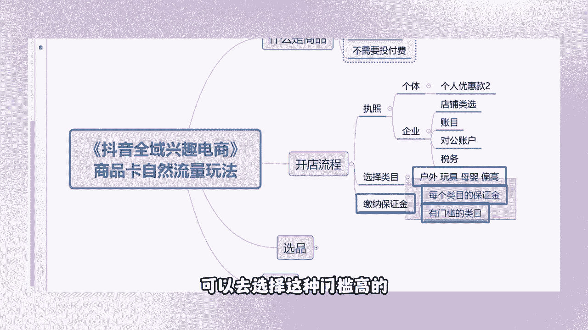

# 【2024抖音电商新手教程】-抖音小店官方完整开店教学！从新手开店到爆款店铺，零基础入门抖音小店运营教程！强烈建议收藏 - P3：抖音电商 - 人生何处不相逢啊12 - BV15r42147Yp

我点了兄弟们问一下你们啊，开过店的，你们扣个一把，你们正在做的类目发在评论区，如果说你们是那些没有开过店的，来朋友们给我扣个二，怎么对接供应链，那要看你的单量啊，那得看你的单量啊，你要单量十单20单。

哪个供应链会给你对接啊，来看一下，我统计一下第一个女鞋对不对，然后呢零食还有呢，啊母婴，家纺，啊我那几家品牌就是做的家纺水果，还有呢啊杯子，杯子是属于百货了吗，好户外来看一下做的类目还是挺多的啊。

是没有开过店的是吧，还是有几个朋友在说啊，我没有开过店。

那么我来跟大家讲一下你们的一个开通流程吧，不然的话他们听到后面是听不懂的。

先跟大家说一下我们的一个开店流程来，第一个步骤，我们首先需要准备什么东西，我们需要准备的呢是一张纸，照个体的就可以了，个体的执照就可以了，因为像你们的那些企业店没有品牌。

你是拿不到这个授权的，你也开不来，那在这边任意的浏览器当中，去搜索这个抖音小店，然后下滑，看到没有，一个入驻流程吧，在这边需要提交这个材料，好看，查看一下所需要的材料，那么像我们这个之前他就这两行。

一个开店主体，一个店铺类型，像你们去注册那种企业店，那么某某有限公司的，你们能够开通的店铺类型是非常多的，旗舰店，专卖店，专营店，旗舰店，官方旗舰店，但是这个官方旗舰店和旗舰店。

每个平台每一个类目只能存在一家。

那么我们只能够以这种个体工商户，然后现在是迎来了一个新的啊，可能是这个我也没有研究过，你们可以自己去看一下，我们建议大家呢就去注册一张这个。

个体工商户的执照，然后在选择完这个东西之后呢，你们选择自己想要去做的类目啊，服装啊，自己去选择好吧，这里还有一个类目啊，但是它能够经营到的东西是非常非常少的，看到没有男装短裤。

然后家居里面就那么一点点没，我觉得没有太多的必要做，要做就做这些，勇敢的去找个几千块钱的保证金。

这算什么，对不对啊，几千块钱的保证金。

如果说你连几千块钱的保证金都交不出来的话，你还是好好回去上班。

不要来做这个电商，这个是执照，然后我说一下企业和个体的区别是什么，刚刚看到了它们的区别是什么，第一个是开通的店铺类型。

对不对，店铺类型有区别，第二个呢就是他们的一个账户账户问题。

他们的一个资金流水，我们的企业店它只能够走什么对公账户，只能走这个对公账户，那么我们个体个体它可以是个人银行卡，啊就是这个点，然后那个企业点，它可能涉及到后期涉及到的那个。

税务问题是偏多的，所以说你们那些没有开过店的，刚刚接触电商行业不久的，你不要盲目的去追寻牛逼啊，牛逼限量买不到，你不要去追究这个东西，你去开一张这个体就OK了。

兄弟们，我们自己开了这么多家抖音小店，用的都是这个个体工商户的执照去注册的，同样的哪怕是我们这一家店400多万的车啊，400多万的流量也是用这个个体电池注册的好，那么我们在开店之后呢。

一些流程跟大家说一下啊，第一个是选择选择到你们自己想要去做的类目，跟大家说一个新手可以去做哪些类目啊，什么户外啊，玩具母婴这些东西你们都是可以去做的，而且它的利润它是偏高的，利润是偏高的。

而且他的售后问题呢不会说那么麻烦呢，那么复杂。

然后选择完类目之后呢，去缴纳一个保证金，兄弟们不要着急啊，我跟那些没有做过电的朋友。

简单的花个5分钟的时间跟他们说一下，然后呢，每一个类目当中，每个类目保证金是不一样的，有高有低，然后尽量去选择那些有门槛的类目。

尽量的去选择有门槛的类目，门槛越高，那么代表他的人情是越少，人越少，代表你们的竞争力度越小，竞争力度越小，代表你们的流量，知道吗，平台当中的流量是固定的流量，哪怕我现在十个人分100万的流量。

可能平均每个人分个10万，对不对，那么我们平台当中100万的流量，同样的有100个商家，一个商家，1万个商家，那么竞争力度就会偏大，所以说你们那些没有开店的，可以去选择这种门槛高的。

然后好入手的利润高的类目去做，缴纳完保证金之后呢，你们有一个顺序是错的，你不要先去开橱窗，你通过那个官方后台的一个官方账号，绑定绑定官方账号，这个账号绑定之后有什么好处呢。

假设说你们这个商品卡的流量非常牛逼，能够打爆一款单品，那么你们后期可以衍生出一些什么短视频啊。

我们抖音它是什么平台啊，短视频平台嘛后期也能够去演变出一个直播间。

那么我们这个账号在哪里去绑定呢，来看一下兄弟们在我们抖店的后台当中。

那抖店后台，然后下方有一个店铺，看到没有下滑，找到这个经营账号管理啊，这个看一下这个。

来点开店铺当中，然后下滑找到这个经营账号管理，下方是不是有个经营账号绑定，你们自己去绑定，一个能够帮你们免除600亿年的认证费用，能够帮你们免费去开通一个蓝V，第二个无门槛带货权限。

直播挂车的权限，看到没有啊，大家就是一个基础的东西。

我就不不多说太多了好吧，然后来这个点大家有什么问题没有。

开店的流程，想必大多数的兄弟应该是没有什么问题吧。

