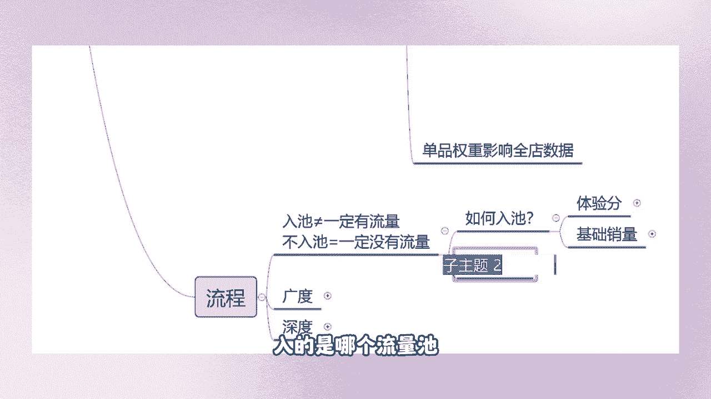

# 【2024抖音电商新手教程】-抖音小店官方完整开店教学！从新手开店到爆款店铺，零基础入门抖音小店运营教程！强烈建议收藏 - P4：抖音店铺起店 - 人生何处不相逢啊12 - BV15r42147Yp

我们的店铺当中应该如何去起点整体的流程，起电的整体流程，大家有没有听过入职这个入职这个关键词，有的人他就是认为啊我的产品，我的店铺当中体验分大于4。3分，我也有基础销量，就一定会有流量，不是的，兄弟们。

你们入职不等于一定有流量，但是你们不去入职，那么一定是没有流量的，是不是这个点大家要清楚啊，不是说你们店铺里面入了池就一定有流量，他不一定的，但是你们不入职，一定一定没有流量，对不对。

你天你想去找一个女朋友，但是你天天呆在家里，门都不出，你能够找到女朋友吗，同样的道理，但是你不出门一定没有女朋友啊，知道吗，你出了门不一定能够找到，但是你不出门，你不去跟外界联系，不去跟外界沟通。

你永远都找不到啊。

是这个点，那么我们怎么去入池呢，我们所说的一个入池入的是什么池。

来，我们所说的这个入池入的是哪个流量池。

商城推荐吗。

对呀啊，看来大家还是还是有所收获的啊，在之前听过我的老铁应该都知道自己做店的，老铁应该也都知道什么排行，如果他是排行池啊，录的是商城推荐，猜你喜欢吃啊。

猜你喜欢流量池，你自己你们那些说排行的。

说什么搜索的，说这个不吉岛的啊，自己去看一下。

点开这个平台的后台，你们来点开这个看一下商城，猜你喜欢整容物，兄弟们看到没有，猜你喜欢准入，猜你喜欢什么，猜你喜欢商品，吃商家商品满足入市门槛后，商品有机会看到没有，商品有机会通过商城页猜你喜欢。

购后猜你喜欢，商城推荐任务以及榜单等页面，给咱们的消费者去展示，看到没有，平台说的是吗，说的是有机会，就是我刚刚跟大家强调的，你们入职不等于一定有流量，但是你们不入职一定没有流量，我来给你们看一下好吧。

我说的没有流量，没的是商城推荐流量，听清楚啊，我说的没有流量，没有的是商城推荐流量，只要你们不去做这个激活的步骤，不去达到这个入市的标准，来给大家看一下，我们这一家店铺当中的一个流量情况，好吧。

是在20号啊，20号开始去操作的，14号去注册的店铺，有流量没有，有的他有的是什么流量，他有的是搜索流量啊，看到没有，如果说你们不去上架产品，你有搜索流量吗，我们这一家店铺8号有任何流量，没有没有。

对不对，来我们往后面去看一下。

9号也没有，对不对，我们来看一下13号也没有。

对不对，14号我们的产品一上架，他就会有流量的，那就是他的搜索流量，为什么我们在产品一上架之后，他的流量就这么高，有的人甚至出了分之后，他一定的曝光才700多，就是因为我们前期那个基础的步骤，商品优化。

标题优化那个步骤做到位了，才会出现这种流量情况。

来15号是不是再看一下后面的16号啊，来再看一下其他的17号。

18号是不是商城推荐激活了吧，18号出的体验分。

来什么时候出的天分。

是不是18号出的天分才会有搜索流量进入，看到没有，这个点，大家要清楚，我们怎么去做呢。

有的人说啊，我激活了体验分呢，我的单品都激活了呀，为什么还是没有流量。

你们什么都别管，你先把体验分干到04：08分以上再说。

你们先把体验分干到04：08分以上，你再跟我说为什么没有流量，再去针对单品找原因，再去针对标题，针对主图，针对数据找原因。

知道吗，为什么我们流量这么高，因为我们的体验分基础体验分做的很高啊，4。555586分，6。4分4。71分，4。2分，4。91分，来看一下我们04：91分的流量情况，来29，31号，28号的流量是多少。

来看一下兄弟们。

看到没有，流量从4300多涨到多少，27万，50万，29万，21万，106万，345万，怎么做到的，就是我们在拉他的体验分的同时，我们还在做其他的步骤，体验分是非常非常重要的，它跟传统电商不一样。

你的单品流量可能就是仅仅单品掉了权重，但是你们店铺当中，体验分影响到的是整个的店铺。

我们体验分可以由单品来决定，这个也是我跟大家说到的一个重点。

单品权重影响到我们全店的数据，我们这个体验分的高低，决定了我们这个流量的上限，也决定了我们店铺当中的一个推流状况。

好吧，那我们需要满足什么点呢，你们想要获得一个最基础的提分，很简单，只需要让你们店铺的销量大于30单，哪怕是30单都不行。

必须得大于30单，这是一个最简单的要求，那么我们想让这个体分越高。

那么我们怎么做，有的人他就是拿一个单品出来啊，做个30单，做个50单，他觉得这个是一个任务，他没有把它当成一回事。

反而这个是最重要的，会是被被所有人都忽略掉了，我们要做的是什么，我们可以把所有的单品的销量给他激活。

把它的顺序调换一下。

激活基础销量之后，我们的体验分是不是就随之出来了呢。

因为我们在做基础销量的时候，可能店铺当中上传了100个宝贝，我每个宝贝产生两到三个销量，店铺里面由零个销量变成了两到300单，两到300个销量，我是不是能够去做好评，是不是能够去催签收，好评上来了。

我们的物流体验上来了，我们的体验分是不是随之而来。

