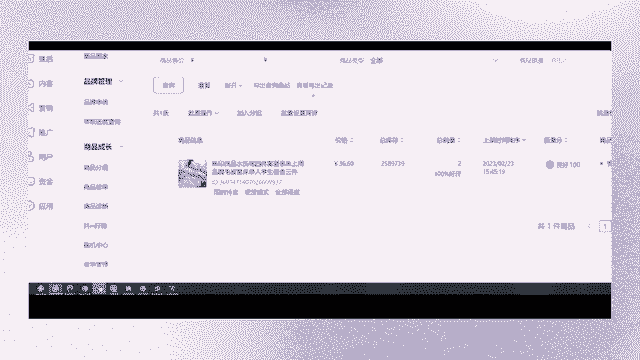

# 【2024抖音电商新手教程】-抖音小店官方完整开店教学！从新手开店到爆款店铺，零基础入门抖音小店运营教程！强烈建议收藏 - P5：如何获取流量 - 人生何处不相逢啊12 - BV15r42147Yp

好那么我们怎么去做呢，你们体验分不要着急，你不要先急着去把这个体验分给他激活。

你们可以去做一波什么，做一波全店动销来给你们看一下，为什么我们最近做动销，它的销量没有被惊喜，而且来跟大家说一下啊，什么是动销，什么是动销，我们做动销的目的是什么，我们去做这个基础销量。

第一个点，让全店的宝贝去获得到一个入职的流量，来我们点开看一下，在我们首页当中商城概览里面啊，猜你喜欢整容，是不是我们有第一个基础要求啊，基础的门槛是什么，体验分大于4。3分，对不对。

这只是你的店铺入了职，但是你的单品是否入职呢，是不是这个产品没有入职，没有获得到流量啊，看到没有，这些产品是不是为什么，因为你的销量没有上来，你没有一个基础销量，你如果说你想要获取到一个入职的标准。

来看一下是不是让你的历史销量大于零，但是我们不可能说我只做一单，只做一单的话，我们的体验分可能会很低，因为我的好评拉不上来，我的签收拉不上来，我的服务拉不上来，这三个点。

我们的体验分是依据哪些东西决定的呀，依据我们的商品体验分，对不对，就是你的产品的中差评吗，好评嘛，然后你们的物流体验分，你的这个东西的发货率，你这个东西的签收率，你给他去保证。

我们做动商的目的是什么，第一个点能够让我们的店铺销量大于30单，同样的他的目的能够让体验分，能够让基础体验分越高，基础体验分越高，那么相对应来说，你们店铺当中整体的权重就是越高的，第二个点。

它能够激活我们单品的基础销量。

达到一个全店入职的要求，第三个点，我们还能够去筛选宝贝，我们仙店当中上传100个宝贝，对不对，那么每个宝贝产生了两到三个销量之后，他们的起跑线是不是都是一样的呢。

对不对，但是你们做完销量之后，你会发现有一些单品它就是有潜力的，是不是像这个单商品卡流量当中。

啊这个有点卡。

啊这个老是卡啊，算了，重新登一下，等会，来我们看这个界面就可以了啊，这个网络卡了啊，来换一家店看一下。

像这一家店铺当中单商平台流量，是不是它是由这几个曝光高的单品来承载的，来决定的，像这些排名靠前的是吗，它是有潜力的，它是有价值的单品，所以说我们通过动销的步骤，能够在最短期的时间内将它就筛选出来啊。

这个点大家能理解吗，一个人拍一件呢，一个人拍一件啊，一个人拍一件啊，我跟你说了几次了。

好来跟大家说一下我们的动销方式啊，这个点给大家整理一下，我们在新店上架完产品之后。

优化完宝贝之后呢，动销去做一个全店动销，每个宝贝产生两到三个销量，取决于你们个人，你想让他的天分越高，那你就做三个销量，你想他一个达到一个4。8分，你就可以做两个销量啊，去测一下，慢慢的测一下。

然后来跟大家说一下我们的一个动销方式。

来先给你们看啊，在我们这一家店铺当中的订单里面，来去看一下我做的动销有没有被清洗的情况，大家最近做动销有没有被清洗，最近做动销被清洗的兄弟来给我扣个一，来兄弟们，你们现在近一个星期当中。

近半个月里面做过动销的，销量被清了的，给我扣个一，那很多兄弟都是被销量被侵蚀的，对不对，OK我们这个东西是什么时候做的，我们的陈来给你们看一下前面的数据啊，来这些数据是什么真实订单，对不对。

这些是真实订单，看到没有，真实订单，他是客单价比较高的，然后来我们第二页全部都是多少钱的，15块钱，15块钱，15块钱，15块钱，15块钱，这个是什么单，是动销单啊，对不对，一个人是不是拍了一单。

一个人拍一单，没有说一个人拍两个销量吧，有一个人拍两个销量的情况吗，没有好，我们来看一下这个销量有没有被清洗，你们关心不关心你们关不关心，天哥这一家店铺当中做了动销，它的销量有没有被清洗，关心嘛。

想不想看我这个销量有没有被清来，我们去看一下啊，哪怕你们不想，我要吹一下牛逼来看一下啊。

好把这个id复制一下，稍等一下啊，好来把这个id复制，我给你们看三个，我给你们看三个产品，可能你们觉得一个产品没有被倾销量，是运气问题，我随机去选，来点开商品管理，我们每个是做了两个销量，兄弟们。

我们每个单品做了两个销量，来查看一下，两个他的销量在不在销量在不在总销量，两个被清了没有，23号做的动销要清早被清了，好这是一个对不对。

好，来我们听歌再换一个，再点到订单往后面走啊，我们刚开始是第二页的，对不对，你们想我点几，第几页，兄弟们想我点第几页嗯，第二页，第三页，第四页，第五页要我点哪一页，好来想让天哥带你们去看哪个产品。

第三页开始好吧，啊第五页，OK来，好我就随便去找一个做漏洞箫的，好吧好，点开第一个好吧，来点开id复制一下，好我们再去到商品当中，查询销量在不在，我做的销量在不在吗，兄弟们，我做的这些动效，这些动效。

但它的销量在不在嗯，两个销量，两个销量对吗，为什么我们的动销单不会被清洗呢，为什么呢，第一个是方式，第二个是资源，没有其他的技巧，没有说什么运气问题，这就是你们动销资源的点，它能不能保证这个清洗率。

对不对，我花了钱，你给我办不成事，那我要你干嘛，他的方式对不对，我不关心，我，关心的是你这个销量能不能够存在，我的店铺里面，所有人都关心的是这个点，你哪怕是让别人直接进到我的店铺当中来。

只要能够产生销量，销量存在我的店铺里面，对不对，那么我们的动销方式我也知道，我的动销方式，天哥也是毫无保留的跟大家说，你们可以根据我的这个动效方式，到外面去找资源，这个是没有任何问题的。

我也不会在直播间当中给任何人去推荐，我自己正在做的动效单，不会给大家推荐我自己正在做的资源，也请你们免开尊口啊，因为我自己这个销量都有点供不应求，在那里好来动销方式是什么啊，第一个点来。

我重新跟大家说一下吧，重新一步一步跟大家打字啊，首先呢第一个步骤在你们的链接当中，加入一个，啊客单价15元以上的，我们一般都是15元啊，加入一个，15元，S qs qu，知道什么吧，规格来在哪里加。

哎呦，我带你们看一下吧，我怕你们这个不懂那个不懂。

好我们点开这个店铺当中的单品。