# 【2024抖音电商新手教程】-抖音小店官方完整开店教学！从新手开店到爆款店铺，零基础入门抖音小店运营教程！强烈建议收藏 - P6：选品方式上 - 人生何处不相逢啊12 - BV15r42147Yp

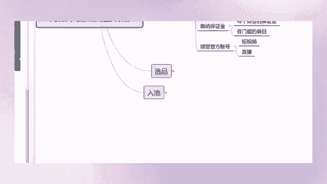

好我们今天呢先跟大家讲，今天晚上的第一个重点知识，我们的选品方式，选品方式是我们开店当中最为重要的一个点，可能很多兄弟呢他们去做一个玩具的类目，然后他们到其他的平台去找那些主图，点击高的销量高的产品。

这样没有错，但是我们要找的是什么，我们第一个点在选品方面呢，我们要去看那个类目的流量渠道，你不可能说你一个音乐生，你偏偏考到那个体育生的考场去了嘛，对不对，你哪怕你的音乐成绩再好。

你在体育考场你不可能考100分吧，来我们选品方式要针对哪一些细节点呢。

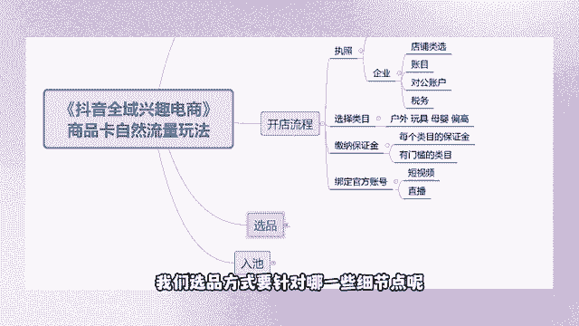

第一个根据我们这个流量的渠道，去选择相关的产品，我们根据这个类目当中的浏览渠道，去确定好我们想要去做的什么东西。

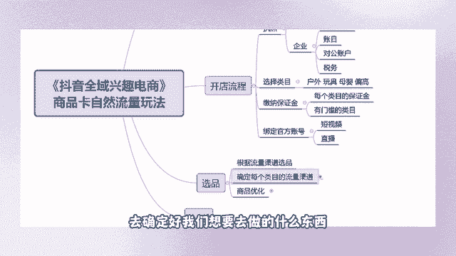

来，怎么去区分好我们这个类目当中的流量渠道呢。

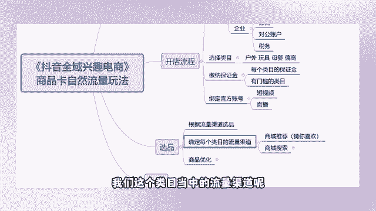

你们知道这些这些做这些内幕的女鞋，你知道你们的内幕是什么吗，你知道你们的流量渠道是什么吗，这些开过店的兄弟们，你们知不知道你们这个类目当中，最为主要的一个流量渠道，来不知道的，扣个一，兄弟们。

你们不知道的，扣个一，你们店铺当中的不代表平台里面的这个点，大家有知道的吗，来不知道的扣个一，很多兄弟，哪怕现在开过店的，他都不知道如何去确定好，这个类目当中的流量渠道，这个是令我感到很诧异的一个点啊。

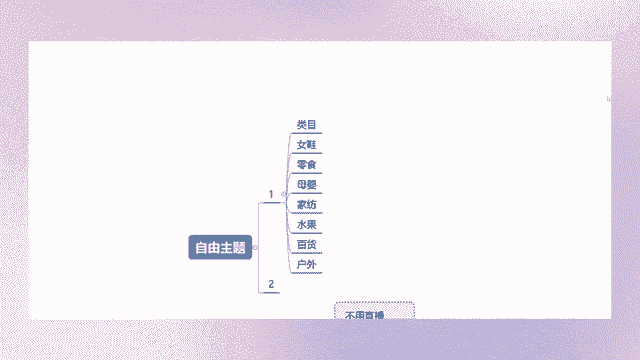

来天哥花个一分钟的时间教大家去确定好，你们所做的正在做的这个类目的流量渠道，怎么去区分，怎么去判断，首先呢这个电商罗盘进入到电商楼盘当中，然后这个上方有一个商城，看到没有，点开这个商城概览，好。

点开商城概览之后呢，这个下方能看到没有有一个黄色的界面，点开这个榜单，点开查看完整榜单，好，你们是做什么类目的，我就不问了吧，我就随机选择一款一个类目吧，来稍等一会啊，好我就拿这个女装去举例子来啊。

女鞋举例子，看见没有，来，兄弟们看一下我们这个女鞋，她的流量渠道是哪个，她的流量是直播间还是商城推荐嗯，还是商品卡还是店铺流量渠道啊，我问的是女鞋这个类目的流量渠道，美妆水果啊，这里有辆怎么干，小品牌。

一个一个点来，兄弟们，你不要在我说A知识点的时候，你去问B的知识点对嘛，商城推荐吗，是不是非常容易确定啊，在这个商城成交榜单当中呢，再带大家去看一下商城概览，然后呢点开这个榜单。

在选择商城成交榜单当中啊，你不要去选其他的选择这个商城成交榜单，这个成交榜单当中呢是不管短视频啊，直播间啊，商品卡呀，整个类目当中排名前200的店铺，哪怕他们的直播间这个是什么，也是自然流量啊。

兄弟们看到没有好，我们再换一个类目去选择，选一个美妆吧，好吧，来美妆护肤，他们是什么流量，兄弟们，这个美妆这个类目它是什么流量渠道搜索嘛，对不对，这两条流量渠道是非常容易去确定的，那么你们现在第一个点。

在选品之前一定要确定好的是，你这个类目所针对的流量渠道是哪个，在我们平台当中排名靠前的那些店铺，他们的流量渠道是什么，他们是什么，他们相当于是你们考场里面考百分的人，你为什么不能直接去抄呢，对不对。

你偏偏要去抄那些成绩差的啊，抄一个不及格，抄一个刚刚及格的分数有用吗，屁用没用，回家还是得挨骂好，这个点大家有问题没有，如何去区分好我们这个类目的流量渠道，来没有问题的，给我扣一个，没有问题啊。

他很容易去确定嘛，对不对，好来给大家看一下啊。

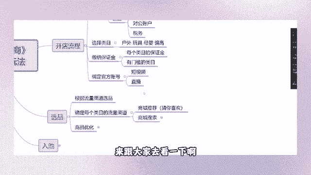

商城推荐这两个点，我跟大家说一下商城推荐和搜索流量，他们是依据什么去推荐给咱们用户的。

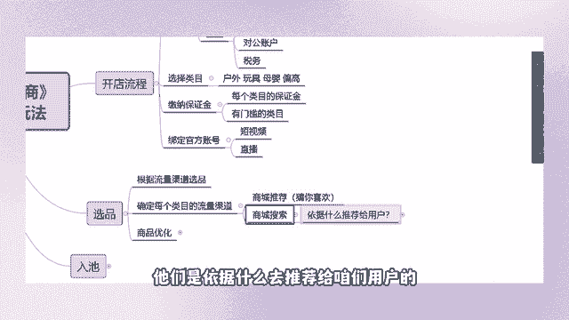

我们商城推荐推荐的什么，猜你喜欢流量，它是根据咱们的主图去推荐给咱们买家的，你这个主图点击率如何，取决于你的这个产品的整个流流量，那么我们的搜索呢搜索是依据什么。

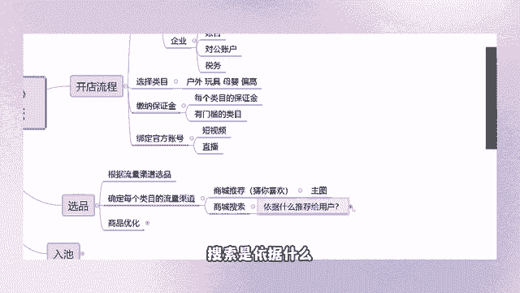

依据咱们的关键词，关键词出现的位置在哪里，在我们的标题当中，对不对。

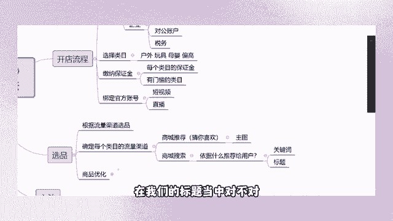

那么我们怎么去选择到相关性的产品呢，来也是今天晚上的第一个知识点好，我们随机去找一个产品吧，针对我们这个店铺当中，好鞋靴女鞋来我们去看一下啊，商城推荐，对不对，我们直接点开这个商城推荐渠道成交榜单。

然后呢看到没有，这都是直播间的，没关系，我们划到最后一页，去找出这种以商品卡为成交题材的，不要去找什么专卖店，兄弟们，你找这种以商品卡为成交题材的个体店，看到没有，竹林风女鞋工厂店，个体店好。

我们怎么去操作呢，我把屏幕放在右边啊，去搜索，竹林峰，女鞋工厂店个体店，OK点开他的店铺去看一下，好点开销量，去看一下他店铺当中那些卖的好的产品，符不符合你的一个产品的逻辑，你不用去管你这个产品。

你是否喜欢，兄弟们，有的人的误区是什么啊，我这个产品我不喜欢，我不去卖，但是你要了解的是我们买家的一个习惯，可能这个产品你是不喜欢，但是他就是能够在平台当中卖得好，看到没有，这个产品。

你给我看来丑的要死，对不对，但是他能够卖出2万单的销量，为什么呢，因为它符合咱们买家的兴趣机制啊，对不对，好，我们再看一下其他的店铺，好像这个家乐鞋业个体店，你还去找出家乐鞋业个体店啊。

好我们进店去看一下，看到没有，点开它的销量，他也能卖个什么，300单，300单的，是不是我们怎么去找，怎么去找出同样的产品呢，因为像这个产品，肯定是不符合我们这个季节性的，对不对。

我们在他的店铺当中去找出那些新品，新上架的产品有没有销量的啊，这些都没有销量，OK我们不要管，去找出一个符合我们接下来的季节性的产品，像这个还可以是吧，符合我们的季节性，你不用去管它好不好看。

只要看它的销量有没有去出单，那么我们去到哪里找呢，我们现在用这个1688啊，去找一下同款的产品来选择以图搜款啊，打开我们的这个相册来选择到这个这双鞋子，是不是我们同行卖多少啊，卖58。

我们的进货价才多少，45是不是一模一样的图片吧，主图是不是一模一样的，对不对，你们点开打开这个产品搬运这个链接，他也是直接抄抄这个主图的，学会了没有，兄弟们怎么去选择相关性的产品。

如果说你们觉得这个产品利润不行的话，我们在这个榜单当中，有这么多家店铺能够提供你们选择，直接去抄这种有成就的啊，有成绩的，有目标的东西，他们的店铺当中是符合我们的选品要求的，明白了没有嗯。

要知道我们不是说自己想去卖什么东西，就能卖得出去的，而是要去找到平台当中那些卖得好的产品，那些卖得好的产品，它出现在哪里，出现在我们同行的店铺里面，对不对，你直接去到同行店铺里面去找嘛。

找出这种以商品卡为成交记载的念念友好商品，对不对，去找出，找出那些卖得好的，销量高的，那些没有销量的单品就不用去管了，你们在那些用第三方软件去选择产品，它能够这么绝对吗，他们的数据是这么的准确吗。

不能够验证，对不对，他们第三方的软件选出来的产品，数据可能是造假的，但是我们抖音平台，你想要去做个几千几万的销量，很难的，兄弟们，我不知道你们有没有去做过啊，动销动不动就被清洗去补单，对不对。

你补了当天就被清洗完了，你想要去补充一款什么1000个，2000个销量的产品出来，那是相当不容易的，是不是啊，这是第一种方式，根据推荐去选择相关性的产品，第一个步骤啊，在榜单找出以商品卡为成交集资来的。

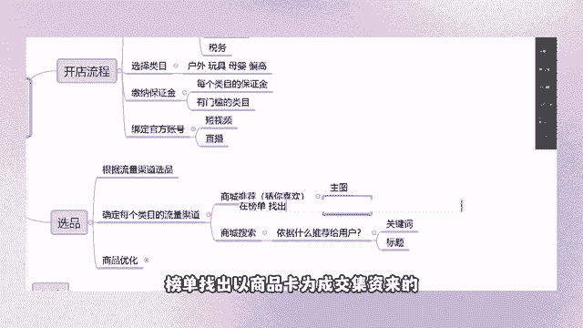

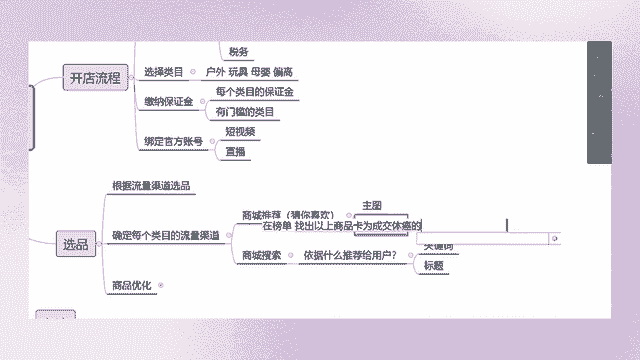

店铺第二步干嘛，找出他们店铺当中销量高的宝贝坐标呢，好这个点上有问题没有，来兄弟们，这个点学会了，没学会的，扣个一。

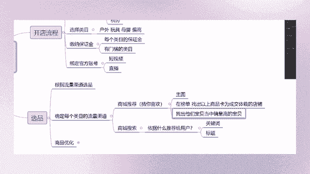