# 【2024抖音电商新手教程】-抖音小店官方完整开店教学！从新手开店到爆款店铺，零基础入门抖音小店运营教程！强烈建议收藏 - P7：选品方式下 - 人生何处不相逢啊12 - BV15r42147Yp

那么我们的搜索流量应该怎么去选择产品呢，这个点就简单一点啊。

我们的搜索选品是没有那么的复杂，相对来说是简单很多的，假设说我们现在是做一个好，我再从头到尾去确认一下，来，我们去选择一个做搜索这样的内幕，找一个家访吧，好吧，搜索流量对不对，排名第一的搜索搜索对不对。

不用管了，点开这个搜索行业搜索词，然后去找出那这些这些关键词，看到没有选择品类，搜品类，然后在这个右边，然后没有选择到我们相关性的类目啊，选择那个智能家居家纺类目，啊这个电商楼盘老是更新啊。

好来选择搜品类，然后呢根据这个搜索词详情，点开之后呢。

在这个下方有一个相关商品列表，看到没有，这个关键词，是不是我们平台当中排名第一的关键词，那么这个产品是不是我们这个关键词当中，排名第一的关键词啊，一个产品是不是这个产品你们觉得有流量吗。

你们觉得这种产品是有流量，还是你们觉得你们选出来的产品，会比这个产品的流量更高，兄弟们来，你们仔细想一想啊，为什么你们在选完产品之后，做了什么动销之后还是没有流量，因为你选的产品就本来就是不行的呀。

兄弟们，那么像这种选品方式能够选出来什么，选出来平台当中的一些自带流量的产品啊，搜索是相对来说简单一点的啊，而且它的顺序，可能每天会随着数据的变化而变化的，知道吗，今天假设说是这款产品。

可能过两天是这款产品，你要不断的去给他优化，不断的给他去上架，学会了没有，兄弟们来，还有一个点这个搜索流量搜索类目的，做搜索流量的任务的选品方式有问题吗。

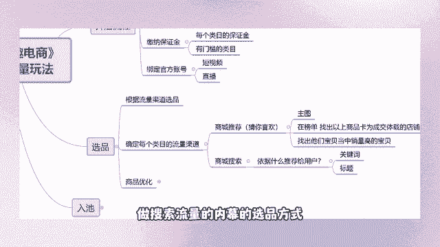

这两个选品方式都没有问题的，来兄弟们给我扣个一，有问题的，把你们不知道的点发在评论区啊，我帮你们去回答，帮你们去解答，学会的扣一啊，没有学会的，把你们哪个点不知道，哪个细节点不知道去告诉天哥。

天哥给你们解答，如果没有人说，那我们就来下一个点。

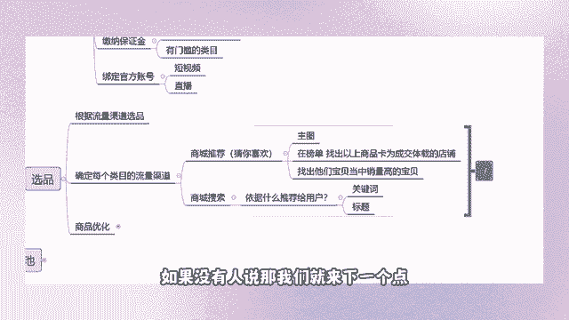

你们想不想听那个上架的方式，如何避免侵权，你拿个品牌就好了呀，你拿个品牌不可能侵权的，永不可能侵权的兄弟们。

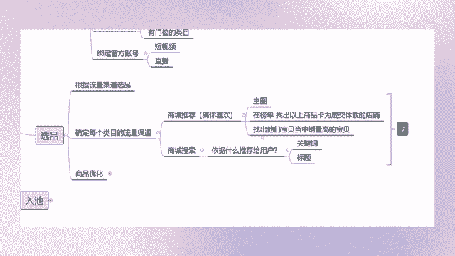

哎要压资金吗，你货款在有人在你店铺当中去拍单，肯定是要去拍单的呀，兄弟那不可能找不到，如果找不到同款商品，你就不找嘛，这很简单的一个点，找不到，你不找就可以了呀，如何上架，来问一下啊。

来看一下大家的问题没有，要不要压资金，我们现在在讲选品，你跟我说要不要资金，我们选出来的产品是把它上架到店铺里面，而不是让你选了之后，你自己去进货啊，兄弟知道吗，我们这个玩法不需要大家去囤货。

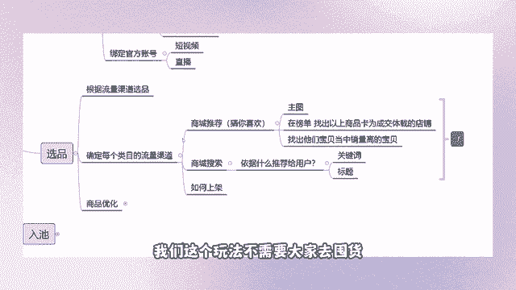

不需要囤货的，有人在你的店铺当中拍了单，那你就到上家里面去拍单，找不到有差价的，还要上架吗，如果说你找不到有差价的差价呢，你还上架干嘛，你亏本去卖吗，你怕胖虎货源你就不做嘛，很简单的一个点。

你怕你就不要去做就好了，撑死胆大的，饿死胆小的。

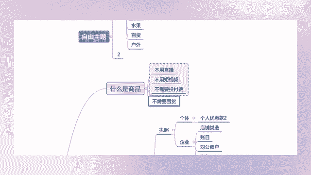

好来这个选品方式都没有问题了吧，天哥都教大家如何去上架产品。

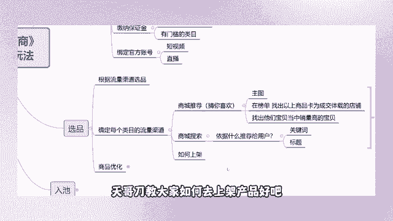

好吧嗯，天哥教大家如何去上架一款产品，像这个点一般的直播间一般都不会跟大家说的，除非那些什么线下的培训会，才会跟你们讲这种上架呀，活动开设标题优化呀，这些点好吧，来天哥在直播间当中免费的跟大家分享。

我们需要用到哪些软件，需要用到哪些工具，因为我之前看到有个兄弟在我的跟我说啊，天哥我一天上架三款产品，你说我一家新店要上100个，我得多久时间才能上的完，对不对，他又不问我。

我以为他知道他会去上架那个产品，没想到他这么笨，你们是什么，你们是现代人，你要学会使用什么。

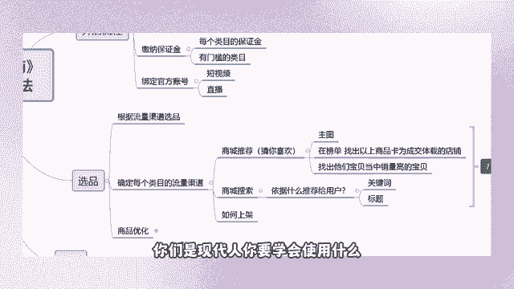

你要学会使用工具啊，兄弟们好，来教大家如何去上架一款产品啊，首先呢我们在这个抖店的后台当中，有一个服务市场，看到没有，点开这个服务市场，这边呢上方有个搜索，去搜索智能店长，我们用的是智能店长。

我自己用的是这个智能电厂上架产品。

它能够去帮我们上架那个1688的，去订购一个高级版的，三个月，你不要去舍不得花钱，就几十块钱，32块钱能够用你们三个月保管饱。

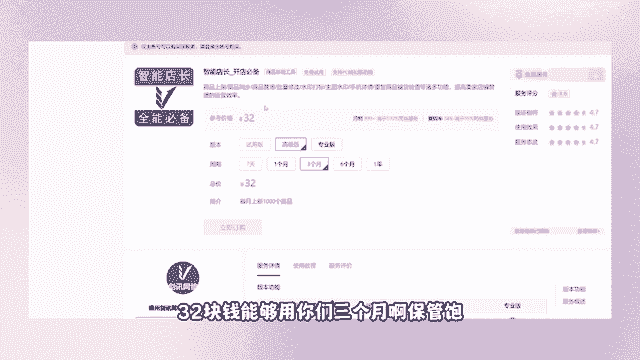

兄弟们好，我这边是已经订购好了的啊。

我们这边是已经订购好了的，来我们点开这个软件，然后我们怎么去上架产品呢，来我们在浏览器当中去搜一个，我们现在是用那个1688嘛，对不对，那么我们就在这个浏览器去搜索1688，然后点开他的官网好。

我们这个店铺呢做的是一个家纺类目，是四件套的产品，也是我们刚刚找出来的，那个搜索流量的关键词是四件套，对不对啊，我就不去选了吧，因为我要用又要用手机啊，又要登店啊什么的，太麻烦了。

我就直接教大家跳过那个选品环节，教大家如何去上架，来点开，这个，假设。

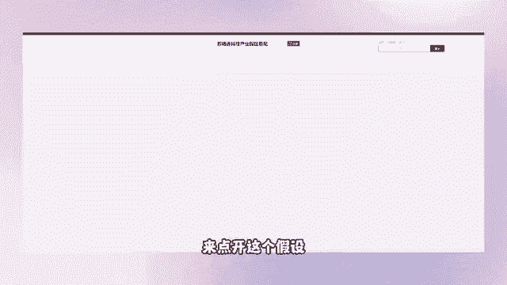

说，我们现在需要把这个产品，上架到我们的店铺里面去，OK这个上方有一个链接，看到没有，我们给它全部选择，然后呢给它复制下来，复制之后我们到智能电脑当中选择商品，上货好选择完商品商户之后呢。

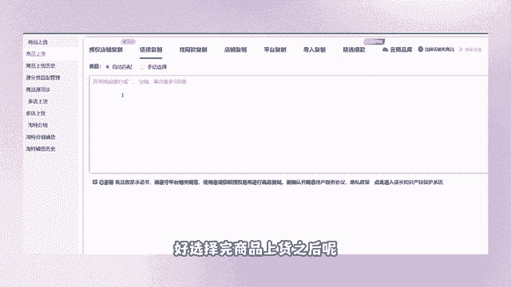

把刚刚复制下来的这个id给它粘贴进来，然后下方抓取生成并预览。

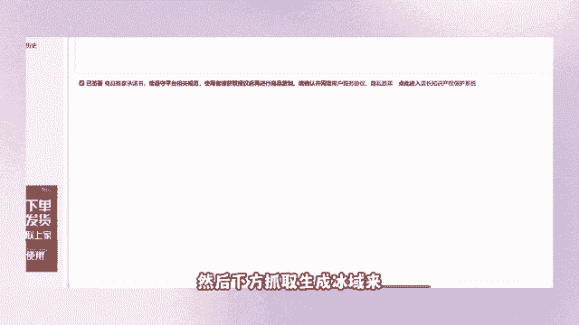

看到没有，是不是我们刚刚要去找的这个主图。

是不是我们所需要的产品，对不对，看到没有选择。

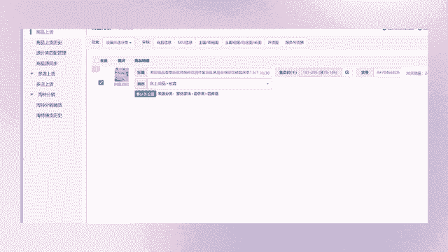

立即开始搬家，完了非常简单啊，兄弟们搜索麻烦再讲一遍啊，整个流程我就不讲了，哪个点我可以跟你讲好吧，你不可能说天哥，你从头到尾再给我讲一遍啊，我先给你们讲营业执照的注册店铺，开通的流程啊。

你觉得礼貌吗啊你觉得礼貌吗，不礼貌啊，耐心听，如果前面没有听到的，没办法，不能因为少数人去浪费大家的时间啊。

这个也是我们我在上学的时候，老师经常跟我说的一句话，不要去吵你一个人吵一分钟，对不对，一个班上40个人，50个人，每人浪费一分钟，浪费多久的时间好。

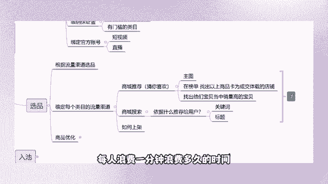

如何去上架啊，这个兄弟说我们这个价格没有修改啊。

不要P1下，看一下属性和白皮什么，我要去批什么。

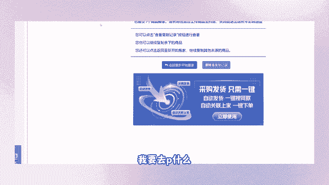

我劈他干嘛好，我们其实在这个软件当中呢，我们的一些基础设置都是已经设置好了的。

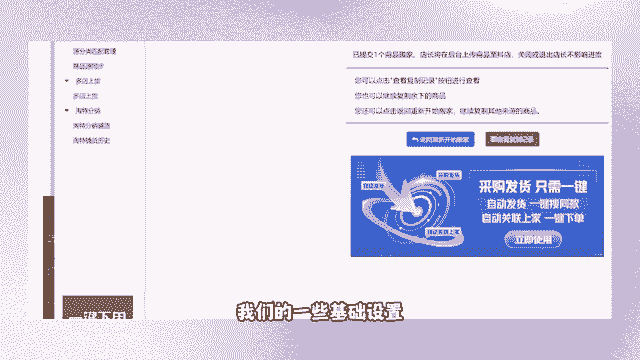

我们上架是按照那个两倍加五去上架的。

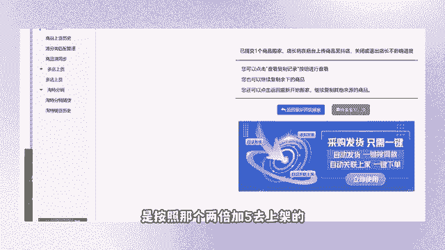

因为我们后期需要去获得平台的一些推荐流量。

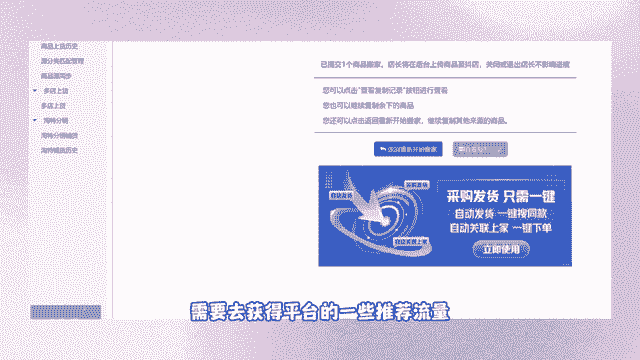

平台的推荐流量是依据什么去推荐的，是依据你的活动和优惠券，你不可能说你一个原价100块钱的东西，在你的1688当中，100块钱，你在多，你在这个抖音当中，你也去卖100块钱，知道吗，你没有任何的利润呢。

平台还要之前还要扣5%的服务费，对不对，现在商品卡能够帮你们免除这个佣金，免除这个服务费啊，这个点大家就今年相对去年来说，商品卡非常非常好做，兄弟们啊，这软件都有什么功能，这个软件。

你只要知道它能够帮你们去上架就OK了，兄弟们，你只要知道不需要知道太多，你只要知道这个软件能够帮你们去上架就OK了。

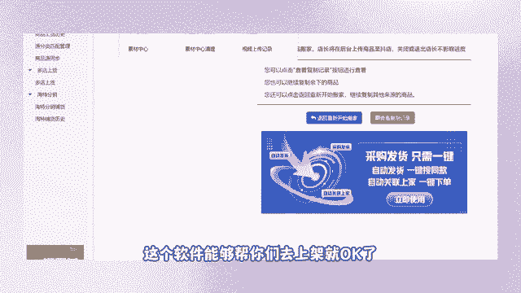

你们其他的功能自己去开发商品优化呀，批量修改呀。

去修改它的主图啊，修改它的白底图啊，都能够去做到的，知道吧，你们自己去研究。

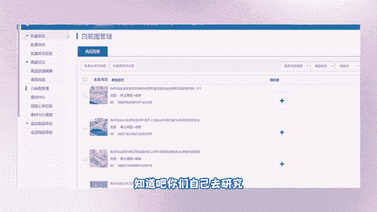

我教大家用什么方式，教你们如何去上架一款产品，听清楚我所说的商品卡是什么。

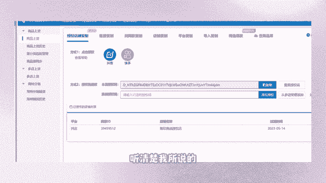

你看你又来说什么是商品卡，有没有兄弟能够回答一下的好。

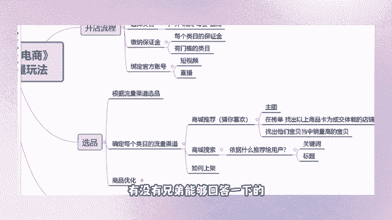

如何上架软上架产品，第一个订购软件，你们自己想去用什么软件，我不阻拦你们啊，订购一个，我是用的智能店长。

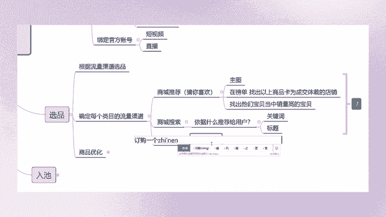

我是用的智能店长，然后呢去1688复制产品的链接。

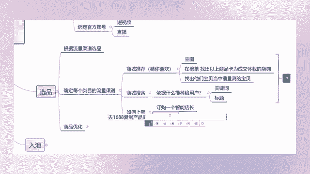

粘贴到店长当中啊，粘贴到软件里面吧，我就不打软件当中，他就能够帮你们自己去生成，自己去搬运，不要用多多，兄弟们不要去用多多了，好在我们选品之后呢，有一个更加细节的一个点，就是你们的商品优化。

我们商城推荐是依据你们的主图，去给咱们买家推荐的，对不对，我们的搜索流量是依据关键词，你的标题当中涵盖多少个关键词，那么你们就能够在平台当中获取到多少。

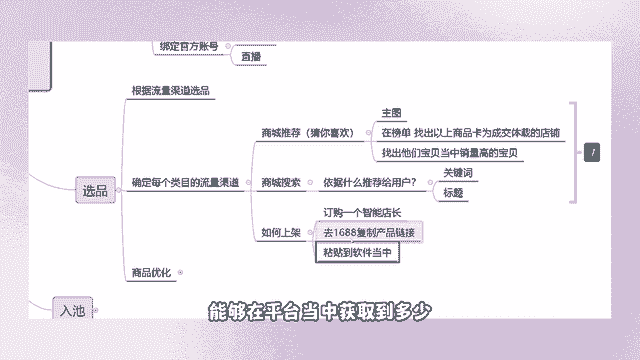