# 【2024抖音电商新手教程】-抖音小店官方完整开店教学！从新手开店到爆款店铺，零基础入门抖音小店运营教程！强烈建议收藏 - P8：商品优化 - 人生何处不相逢啊12 - BV15r42147Yp

在我们选品之后呢，有一个更加细节的一个点，就是你们的商品优化，我们商城推荐是依据你们的主图，去给咱们买家推荐的，对不对，我们的搜索流量是依据关键词，你的标题当中涵盖多少个关键词。

那么你们就能够在平台当中获取到多少，相关性的流量，是这个点我们一定要去做的。

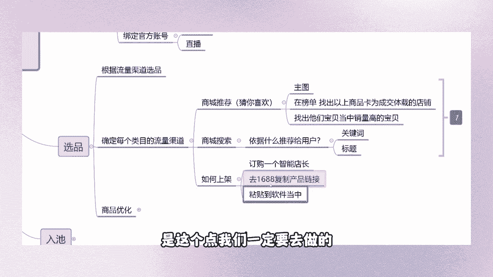

而且是整个的布局最重要的一个点，针对这个标题去优化，为什么我们的主图不需要去优化呢，因为我们选出来的产品，他们的主图都是平台当中能够获得流量推荐的，有点击，有销量的产品，你再去优化它的主图。

你这不就是画蛇添足了吗啊，我们只需要记住一点，在选完产品之后，我们要做的第一件事就是去优化它的标题，什么事情都没有这个重要，我们单品的权重它是影响到全店数据的，可能因为你的这个一个单品。

出现了某一个关键词，给你店铺当中一天带来几百甚至上千万的流量，会出现这种情况的，那么我们如何在前期就把这个点给它。

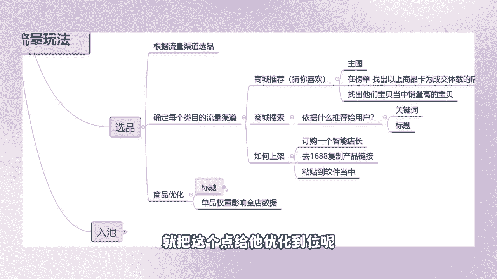

优化到位呢，来针对两个维度，我们针对第一个广度。

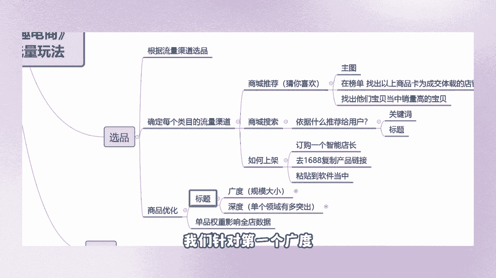

针对所有店铺当中，所有的宝贝，围绕全店宝贝去优化，而且我们这个优化方式呢，不会让你们去花非常非常多的时间，那么我们深度是针对单个领域，有做过突出贡献的产品，就是重点培养他吧，就是这么个意思。

广度是我们规模的大小，就是说我们现在去开一个公司，公司里面可能有餐饮啊，美啊，什么旅游啊，然后什么玩呢，对不对，酒吧呀开了很多个类目，那么我们在这家公司当中，哪一个类目它是做的最好的。

那么就延伸到咱们店铺当中的深度了，来先教大家一个点，如何在短时间内去优化好我们全店的产品啊。

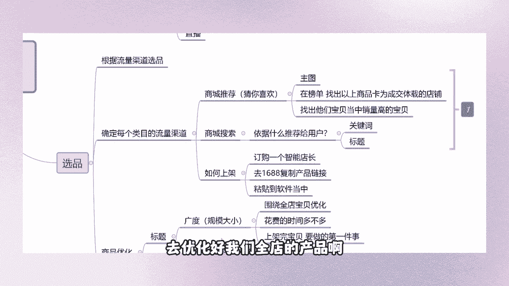

这是今天晚上第二个知识点啊，要听清楚啊，兄弟们要听清楚来，可以看看你是怎么复制的吗，我刚刚从头到尾给大家演示了一遍啊，如何上架产品，从头到尾演示一遍啊，就不要去浪费更多的时间，我每个点都会问你们。

你们这个点学会了没，有，哪个点不理解好吧，我现在已经讲到了下一个知识点，就不要穿插到下一个知识点去了，浪费的时间是大家的，来下一个点啊，我们教大家一个快速优化标题的方式。

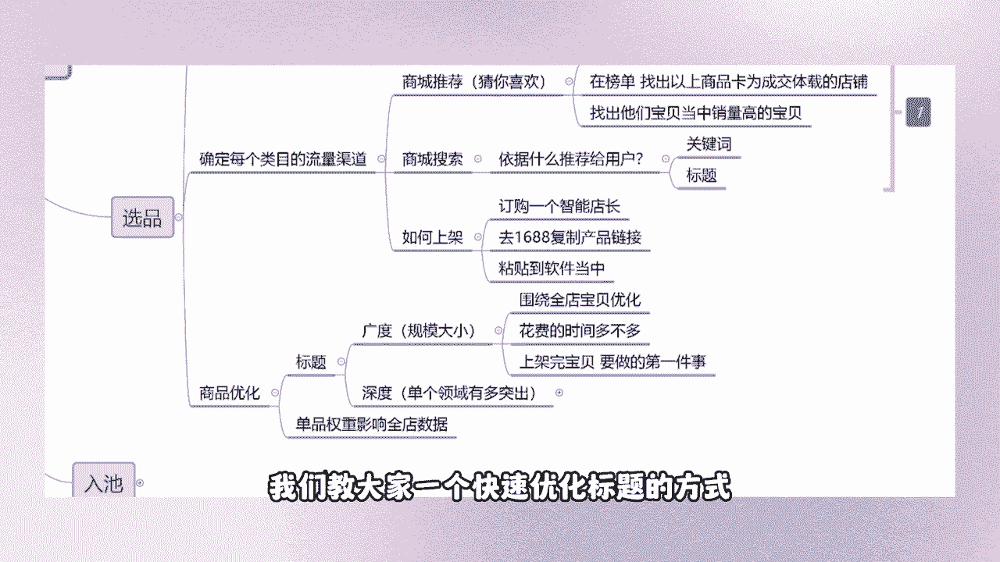

首先呢我们这个店铺都已经优化完了，我们拿这个店铺来给大家举个例子，来点开我们的搜索行业，搜索词详情。

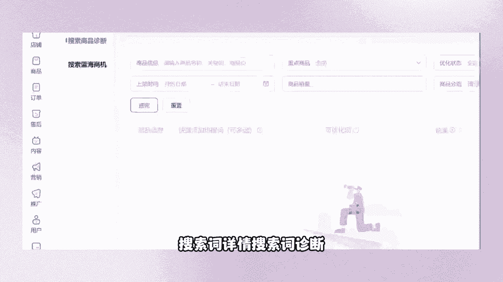

搜索词诊断在我们店铺当中，是不是嗯这是我们酒店的后台首页啊。

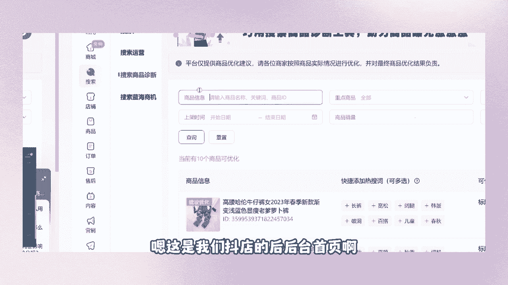

往往上去来看到没有，这是我们抖店后台的首页当中选择什么。

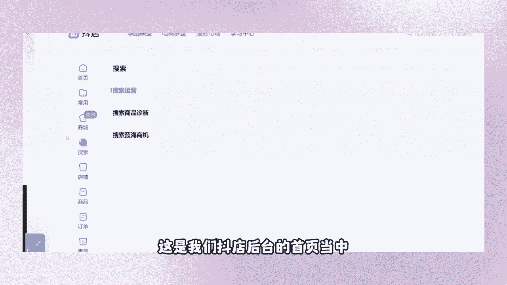

选择搜索搜索商品诊断，点开之后，这个下方有非常非常多的产品平台，给我们的建议是吗，可以去添加一些关键词标题，可补充热搜词，对不对，你们上架之后，你有没有注意到这个细节点，平台仅提供商品优化建议。

请各位商家按照商品的实际情况进行优化，并对最终商品优化结果负责啊。

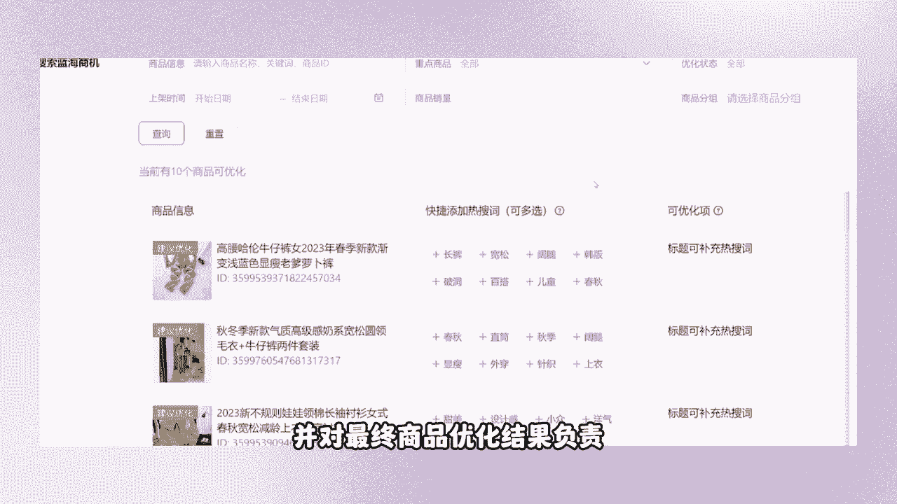

这是平台给了我们的建议，那么没关系，他既然是建议，那么我们就去做平台绝对是没有错的，记住一个点啊，平台给你的建议绝对不是让你卖不出产品好，来选择这个区域化，是不是我们这个标题符合吗。

符合SEO搜索逻辑吗，它是不符合的，而且呢我们这个关键词是非常非常乱的，我不知道它的某一款关键词，在我们平台当中有没有流量，对不对，你不要管，把这个下方平台给你建议的。

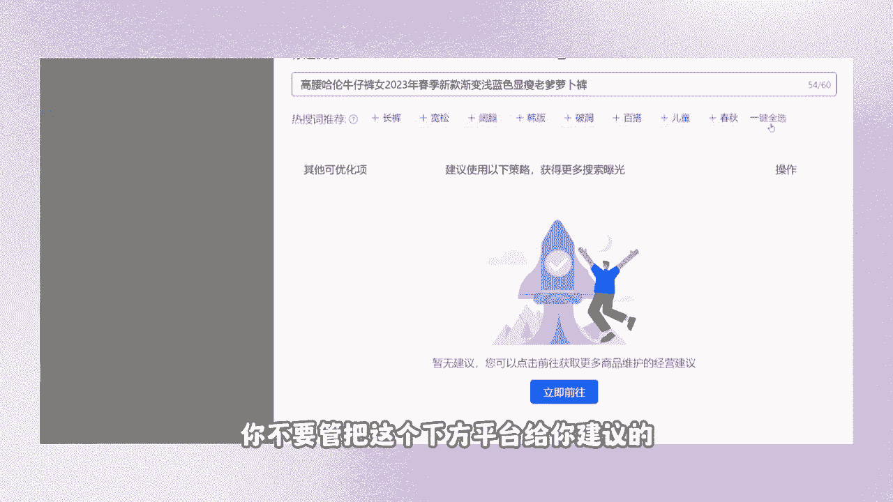

你给他一键全选上去，然后呢保存并更新，看到没有，保存并更新，完了吧，一款标题就优化完了，剩下的几款产品，你们按照我的这个顺序点击什么去优化，然后一键全选，标题一定一定要组满28~30个字，兄弟们。

你们的标题是一定一定要组满，28~30个字的，自己去检查一下，你们标题当中是不是符合这个点，标题涵盖的这些热搜词越多，这是什么热搜词，对不对，涵盖的热搜词越多，那么你们能够获取到的搜索流量就更广。

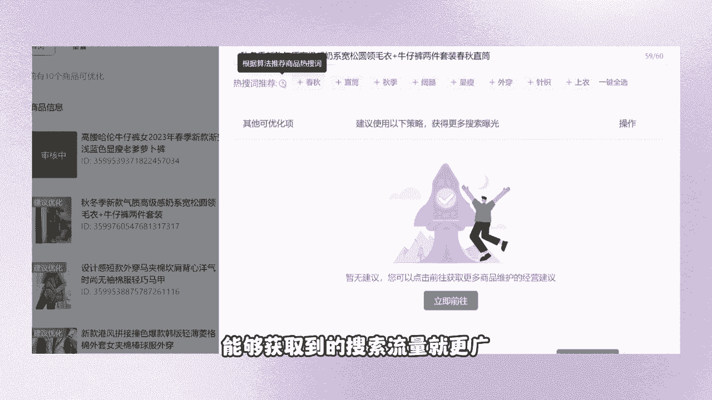

这是第一个点，兄弟们学会了没有，针对全店的宝贝啊，短时间内能够帮你们去获得更多的搜索，流量来源，但是这个流量的缺点是什么，他呢虽然说花费的时间不多，能够获取到搜索流量。

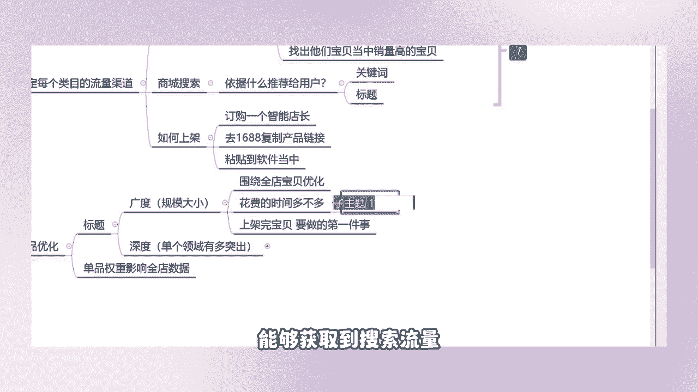

搜索流量，但是呢这个人群精准吗，这个搜索人群，精不精准，转化率高不高，我们不知道是不是，然后需要把全部删了。

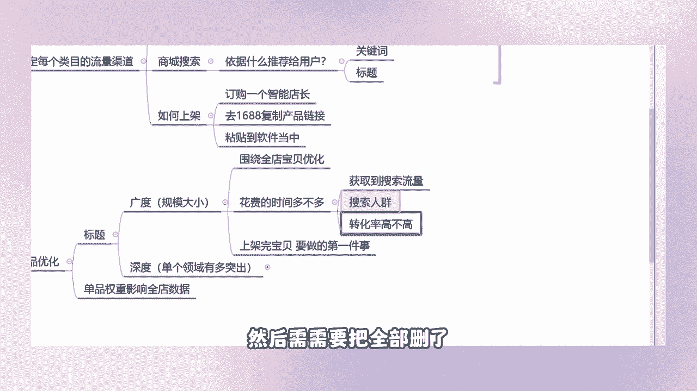

不用啊，不需要你们去把全部删了，你只要根据你的原始标题，去添加这个相关性的热搜词，知道吗，你根据你的标题添加这个相关性的热搜词，这是简单的操作，你不要把简单的事情复杂化好。

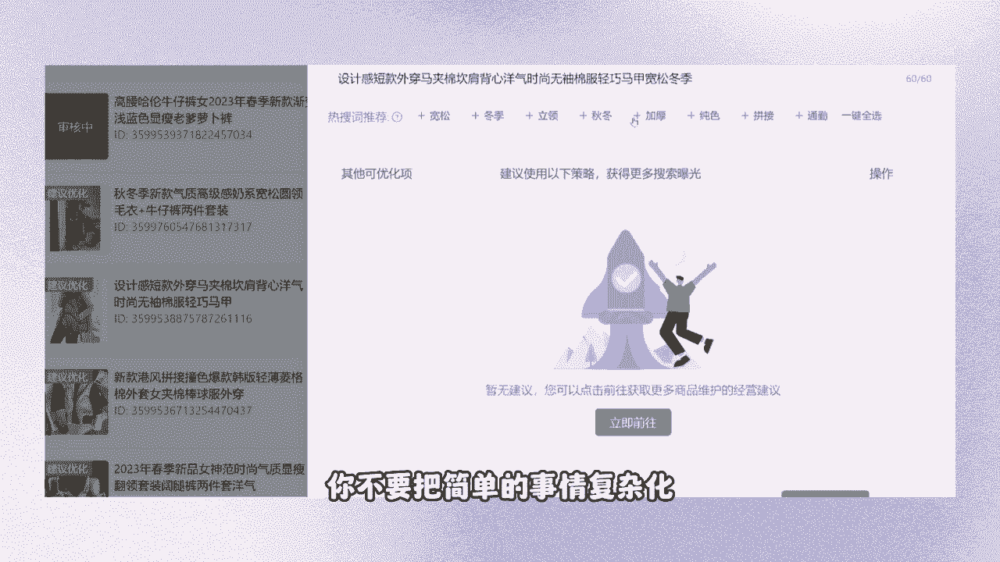

再操作一下啊，这个很简单啊，我再操作一下，我再操作十遍都没有任何关系，那首先搜索当中点开这个搜索商品诊断。

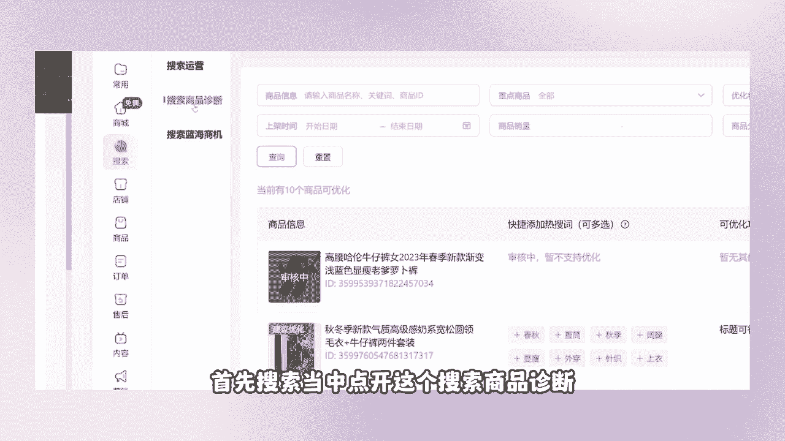

看到没有，然后来下方有一个区域化，看到没有，点开这个区域化，然后在区域化当中这边是不是有一个一键全选，点击一键全选，然后下方保存并更新。

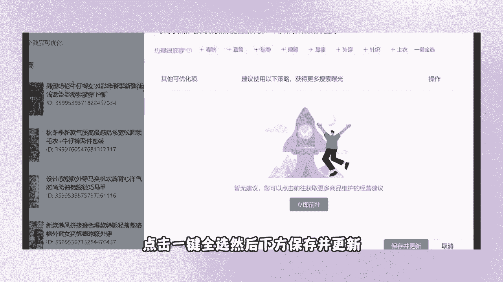

OK一款标题就优化完了，这是最简单的，能够帮助我们店铺，在前期没有出体验分的情况下，去获取一部分的搜索流量，但是这个搜索流量的人群精不精准，它的转化率高不高，其实我是不知道的。

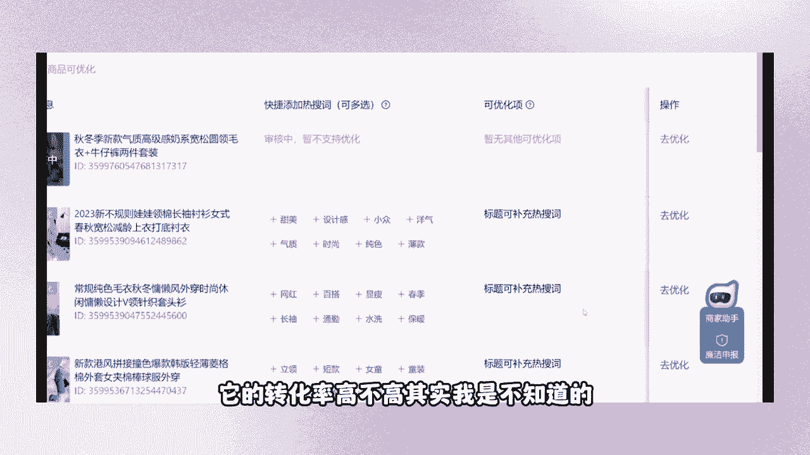

我还有第二个步骤，我们需要针对什么，启哥说的什么方式是针对单品啊，你不可能说企鹅让你们去把，按照全店的宝贝这样说话吧，那得花多少时间啊，每个表每个关键词去算一下，每个产品我去点开编辑一下。

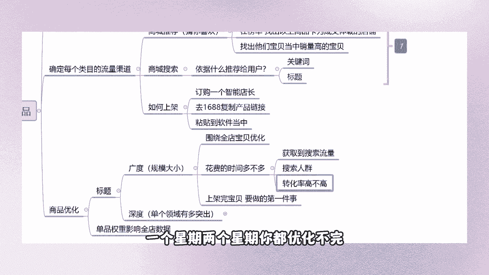