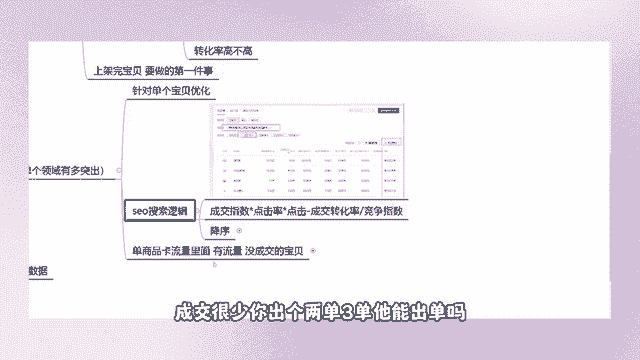
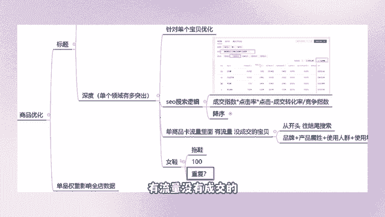

# 【2024抖音电商新手教程】-抖音小店官方完整开店教学！从新手开店到爆款店铺，零基础入门抖音小店运营教程！强烈建议收藏 - P9：商品优化深度 - 人生何处不相逢啊12 - BV15r42147Yp

好深度，我们针对深度针对我们店铺当中有流量，但是没有成交的产品，我们需要去制作为这个产品呢，去制作一款符合抖店平台SU搜索逻辑的标题，那么像刚刚的我只是简单的操作了一下，能够获取更多的流量。

如果说运气好，获取到了更多的流量，OK对不对，那么如果说我获取不到，那么我们在针对这个深度优化。

在单商品卡当中有流量的，但是没有成交的产品来，我们怎么去做好。

来看一下我的这家店铺当中，商品卡一个单商品卡流量，那像这个是不是256万的流量，是不是我们店铺当中都是由这种潜力单品，来承载流量的尖子生嘛，对不对，我们需要制作的优化的是这种标题，那么像这个需要优化吗。

肯定需要优化11。21万的流量，但是他就他妈三个人成交这个标题，你不去优化，你优化什么，你难道优化这个吗，是不是我们来把这个id复制一下，把这个商品的id复制一下，点开啊，我要被我这家店我要被气死了。

我等会跟你们说啊，为什么这家店会被气死，来去看一下他的这个类目，女鞋拖鞋包头拖啊，我问你这个兄弟说流量起来了，标题改了不影响权重吗，影响，但是你这个产品你有流量，你没有成交，不影响权重吗，嗯我问你啊。

我反问你一个问题，平台给你这个产品一天1万的曝光，但是就成交三个订单，你觉得平台会给你气下天继续推流吗，你不去优化它能干嘛，我们是在运营，我们是在开店，你不是在坐等脐橙啊，不是在舔舔钱啊，兄弟们。

这个钱不是摆在地上让人去捡的呀，我们肯定是要优化这个标题的呀，来选择女鞋拖鞋包头拖，对不对，我们去到搜索行业搜索词当中。

好选择到我们相关性的一个产品，女鞋拖鞋，包头拖好，来根据这个表格呢，我们选择搜索词啊，搜啊就这个搜商品来，来看一下啊，好把这个表格我们给它下载下来，下载之后呢有非常多的数据，对不对，出单了还能去干嘛。

如果说你要看兄弟们，你要去看你相关的东西，你这个产品如果说你一天有个10万的流量，一天也能够出个几十上百单，那你就不要去改了，不要去改了啊，不要画蛇添足，我们说的是嘛，你们认真一点听好不好。

我说的是什么，我们需要去优化的是那些有流量，没有成交的单品，成交很少。

你出个两单三单，他能出单吗，虽然说是出事出了单，但是那个单量够吗。

远远不够啊，对不对，来表格下载之后呢，我们需要去筛选一些数据，我们需要去筛选一些数据，保留这个搜索人数啊，这是我们的搜索指数嘛，然后这个关联商品数曝光内容指数不重要，我们给他删掉。

然后呢我们保留它的点击，保留它的点击率，保留转化率，然后呢把这个删掉，五项数据看到没有，第一个是人数，第二个是点击率，第三个是转化率，第三个你还要看它的成交指数，同样的我们也需要去看他的这个竞争指数。

这个是人群，这个是购买人群，这三个是成交的一个商品数量，这个竞争指数代表什么，我们这个关键词啊，它的一个竞争大小好，我们怎么去计算呢，需要去算出每一个关键词的核心竞争力的啊。

首先我们用等于搜索人数指数乘以，点击乘以转化，再乘以这个成交指数除以竞争指数来，为什么要除掉，因为我们需要去计算这个竞争指数，我们是需要去排除的，OK好给他批量计算出来啊，来筛选降序。

让它的分数由高到低往下去，降鞋小白鞋，高跟鞋啊，这都是品类型啊，这都是品类词，看到没有，你们在这个表格当中去挑选出，符合你们这个产品属性的呢，刚刚像这个我们去找出来的这个拖鞋，女浴室什么。

是不是去找出符合你们这个产品属性的，符合这个产品的使用人群的，怎么批量计算核心竞争力啊，这个表格的事情也要听课跟你们说一下是吧，这个你们在学校的时候，没有考过这个计算机证吗，然后点开这个东西。

等这个这个箭头变成黑色的时候，双击再点这个核心竞争力，选择降序，它的顺序就出来了，看到没有，然后你们根据这个分数由高到低的词，自己去选，选择相关性的一个关键词，把它加在标题的开头或者说是结尾的地方啊。

你也可以按照顺序从头到尾添加上去，因为这些词都是我们平台当中的热搜词，不管出现在哪个位置，它都有一个排名降就降不了啊，那你自己去研究嘛，这不是我的问题吧，我跟你们说了方法，说的方式，说的过程。

而且你还可以看到没有全选匹配相关性的商品，能够直接帮你们的店铺去优化这个产品，甚至连批量计算的这个步骤都不需要了，但是这个精还不是不够精准，兄弟们，其实我在这个方面我不是太相信这个软件。

我反而更相信我们的一个人工算法啊，我们能够根据人工的方式去计算出来，我不太明白这个软件的一个逻辑啊，不太明白它的一个底层的程序，它是依据什么公式去计算的呀，对不对，学会了没有，兄弟们。

这个第二种方式去找出平台当中那些热度高的，成交指数，高的点击，高的转化率。

高的竞争指数，低的词去给它加在咱们标题的开头，什么你们做的一个类目。

假设说你做的是女鞋，对不对，你们店铺当中全部都是拖鞋。

你们假设说100个产品，100个拖鞋吗，那么你按照这种方式全部虚化的话。

你的标题不会重复吗，是不是会出现这个重复性啊，所以说我们针对的是这个单商品卡流量当中，有流量没有成交的。

你不可能说所有产品我都去画一遍，那是你们吃多了没事干啊，你有这个优化标题的时间，你还不如去多去开几家店，学会了没有，要针对出平台的一个流量，针对你们店铺流量去制作出一款这个产品。

我们的产品这两个产品为什么能做的这么好，就是因为我们在前期就优化了它的标题，这是一个前期的布局啊。