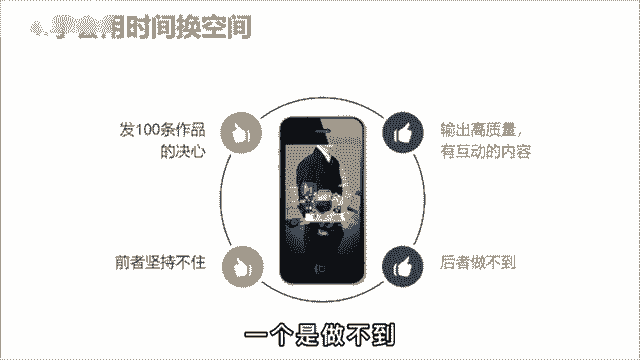

# 【2024抖音短视频运营必修课】零基础抖音入门课，少走99%的弯路，带你做出成功率99%的爆款账号！！！学完这15节课，7天内养出高权重账号 - P9：8抖音起号的正确方式 - 天天快乐丷 - BV1bp421m7DQ

有个同学问我，为啥自己的视频就无法播放，怎么努力都不行，而看别人做的却那么简单。

大大小小的培训博主关注了不少运营知识，也没少点赞，收藏怎么号就是起不来，难道是他们说了假话，但获得在付费课程里，我和他说，其实他们教的也没错。

只是你没有搞清楚哪个阶段该做什么样的事情，第一个阶段搜集信息，把你要做的这个赛道前十名的账号都找出来，作品按照时间排序，只看最近三个月，每个账号挑五个，把爆款的选题文案都抄下来。

用你的角度分析他为什么会培养网感。

第二步像素级模仿，把这50个当中，最符合你账号定位和用户画像的作品，进行像素级的翻拍，万万不会写，没关系，会抄就行了，鲁迅曾说过，会模仿绝不是虐点，会模仿又加以创造，那不是更好吗，由此可见。

邻家大师啊也都是先以模仿再加以创新的，之后才会有自己的风格，第三步发布投放，精心准备十条作品，每天发两条，五天发完，每天投200多家，选择点赞评论，这么做的意义呢是为了养树的，因为没有点赞的作品。

很少有人愿意看完，然后呢把其中完播率最高的互动数据，最好的进行单独投放，每条投500，选择粉丝量，一口气干到5000粉丝，这样呢之后就靠自然流量，你也会有几千到几万的方法，会播放的流程就这三点。

你需要做的就是转变思维，学会用时间换空间，要么像我一样，抱着发100条作品的决心干废三个号，要么输出高质量，有话题的内容吸引粉丝，但很明显，对小白来说，一个是坚持不住。

