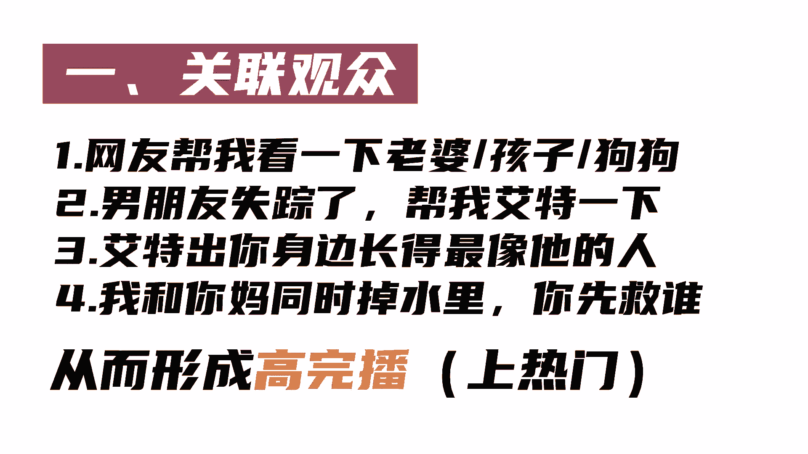
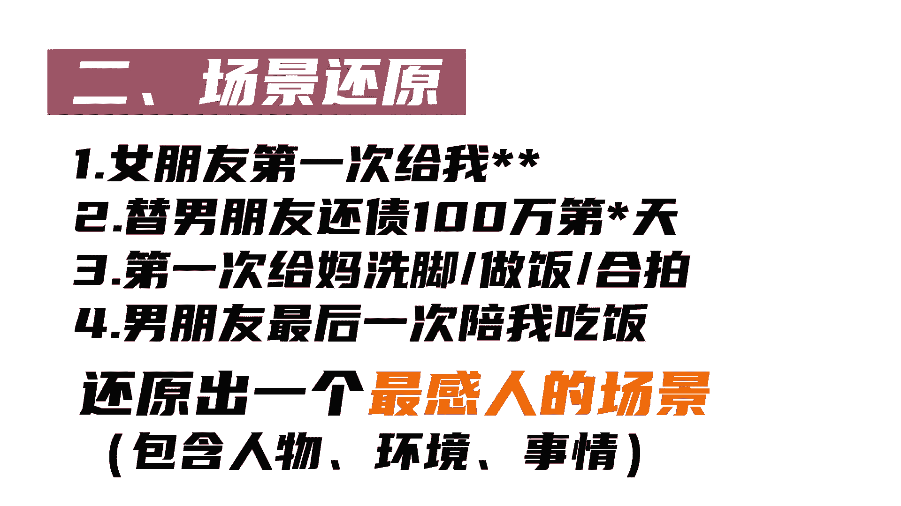
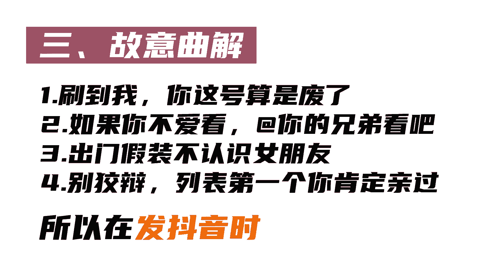

# 【2024抖音短视频运营教程】零基础抖音入门课，少走99%的弯路，带你做出成功率99%的爆款账号！！！学完这15节课，7天内养出高权重账号 - P16：加一句话 热门几率暴涨 - 雨巷少年永逸 - BV1Tz421o78i

上热门有一个最简单的方法，只需要在视频前加一句话，热门几率就会暴涨，不信你看这个视频。

拍完手办很难火，但就加一句话后，100多万点赞艾特出你认为和他长得最像的人。

以及这些我要看小孩要上厕所，虽然视频极其普通。

但开头加一句话后也能上热门，那如何运用在自己行业开头，这句话要怎么加。

下面就告诉你原理和方法，一关联观众，我们只会关心和自己有关的人和事，不然会毫不犹豫的划走那家的，这句话得让用户参与到视频当中。

方法就是让观众进行监督，选择判罚，从而形成高丸波二场景还原。

所有信息形式中，只有画面让人印象最深。

接受度是最高的，所以加的这句话要描绘出情景，还原出一个最感人的场景。

热门就会非常容易，三故意曲解，我们都会以自我为中心。

当出现和自己观念不符的事情，就会去试图说服别人，所以在发抖音时开头加一句曲解的话。

效果会非常好，当然也可以根据不同赛道家这句话。

从而热门，比如说教育美食，亲子开店。

你还知道哪些。