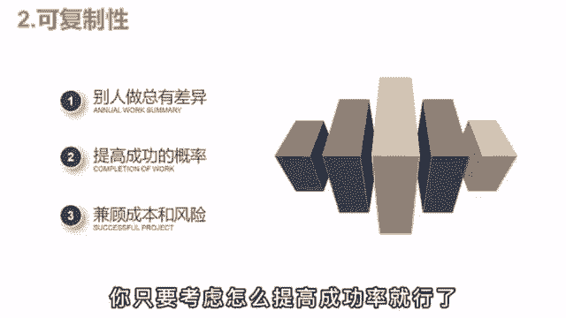

# 【2024抖音运营教程】强到无法呼吸！！！抖音起号养号黄金七法则，原来爆款账号这么简单 - P19：变现篇丨影视解说如何快速起号？ - 决战桃花江 - BV14ZWEeJEiY

之前啊有个朋友做影视号，干了俩月，发了50多套作品，就是没啥起色，每天焦虑的睡不着，死活都想不明白，这到底是哪出了问题，为啥辛辛苦苦做了这么久。

就一点回报没有，后来呢给我通了个电话，聊完后啊，说自己是彻底的悟了，原来玩自媒体是这么回事，之前啊被那帮博主给忽悠了，什么三天不播放，轻松100万流量都是鬼话，想做好自媒体真正的核心逻辑其实啊就两点。

第一概率大多数人都被欲望冲昏了头脑，梦想着一口吃成胖子，实现财富自由，但无论你是做短视频，做电商还是开饭店，本质啊都是做生意，都是通过自己的服务和产品来盈利，你做影视解说可以啊，给大家提供娱乐价值。

提供谈资，但就算你有货，酒量也不见得有人愿意看。

这样就和做生意是一样的，影响客源的因素有很多，不可能百分百成功，那话虽这么说，但抖音啊作为时代的风口，多少还是有区别于传统生意的优势的，首先呢低成本拍抖音是真的没什么成本，多人出镜，一部手机。

一个麦就够了，你要玩中视频，计划好物带货什么的，连手机都用不上，有一台电脑，再加上一点时间就足够了，而你如果要开店，租房装修，雇员工进货，这些都是必不可少的，少了一年也得几十个W折，这就劝退利波人。

第二点可复制性，假设你这个店啊经营的还不错，这时呢你想开个连锁，一个店的收入100万，三个店不就是300万吗，但现实是培养一个靠谱的店长太难了，手把手的教也没办法复制，你总有差异的地方。

而做抖音呢就没有这个烦恼，反正都是你做的，你只要考虑怎么提高成功的概率就可以了。

办法呢只有一个就是批量起号，一个号就算20%的概率，你做五个就能无限的接近于百分之百，总能跑出来一个哎，这就体现出了可复制性的优势，当一个号做起来后，你完全可以仿照那个爆款的脚本，用其他的号再来一遍。

自己抄自己总不会出问题吧，之后呢你就有了五个成熟的账号，然后啊雇一些人帮你打理，比如让两个大学生帮你写稿，剪辑有解放了，可以去钻研其他新项目的机会。

这就进入到了一个健康良性的运营状态，那做影视号怎么批量起号，扩大概率呢，剪辑啊倒不费事，可写解说稿就要累死了，要怎么一个人做五高呢，这个呀当然是有技巧方法的，你平时应该刷到过那些一剪梅吧。

就是只剪辑最精彩的部分，主页呢是没有全集的，但粉丝和播放还挺多，那像这种号呀就能提升效率了，一个号就算平均收益250个就是1000。

这还不算爆款的流量。