# 【2024抖音运营教程】强到无法呼吸！！！抖音起号养号黄金七法则，原来爆款账号这么简单 - P25：变现篇丨游戏号怎么提高播放量 - 决战桃花江 - BV14ZWEeJEiY

你以为录个屏就能玩好游戏，发行人计划没收益，那是你不会编故事。

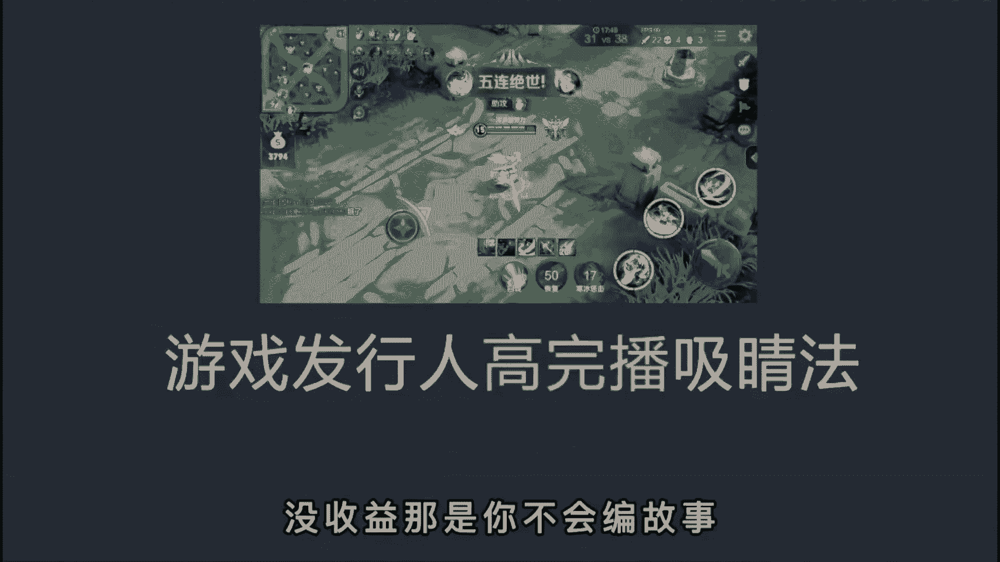

大家游戏画面都一样，但你不会编故事，就是发的再多也是徒劳，不同的游戏使用不同的文案，才会让流量收益最大化，为此呢，我花费了三天看了200多条游戏视频，总结出了这套游戏文案的写法。

学会后你就能轻松抓住用户的注意，达成五秒完播。

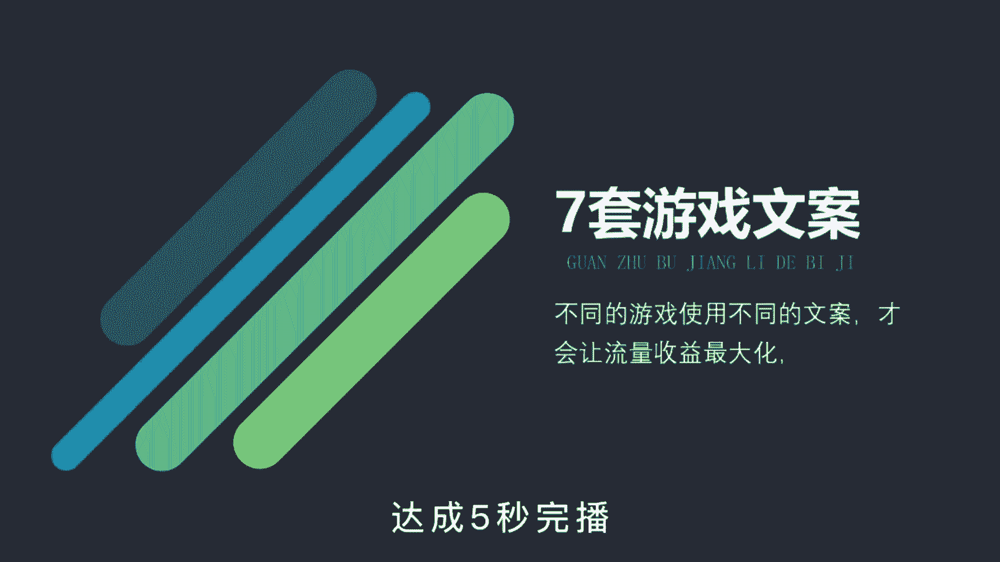

让你的作品获得更多的推荐，第一种对立对比性，南方vs北方，男生对女生，白羊座对狮子座，找出不同人群的对立点，引起评论区的争论，你再模棱两可的站个队。

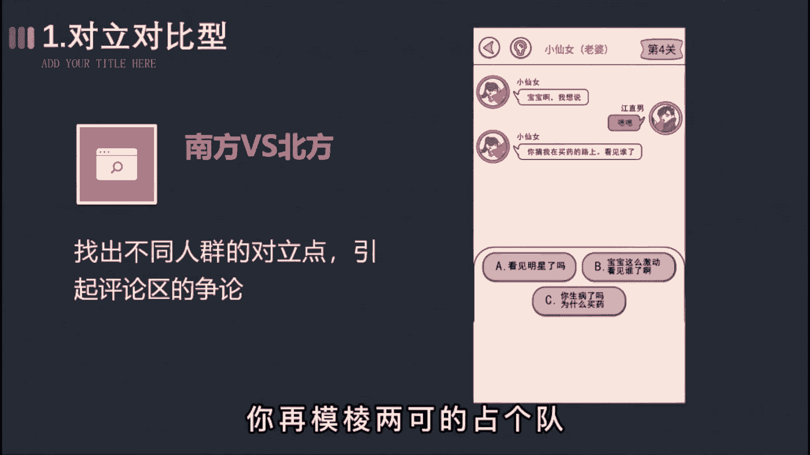

进一步提高作品的互动数据，比如这样女生的送命题。

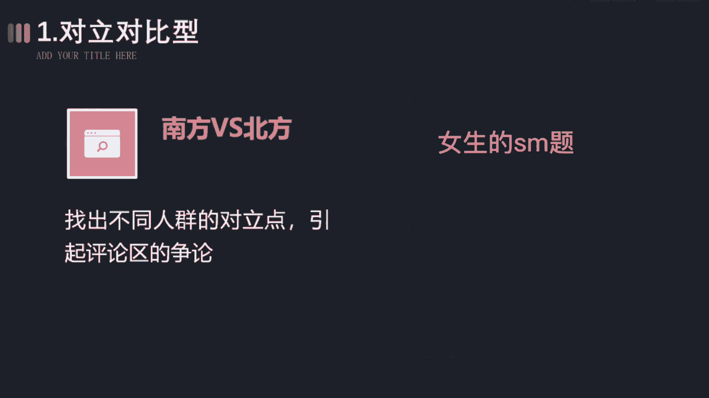

没有男生能回答上来，宝宝嗯，在哪，你猜我去买药的路上看见谁了。

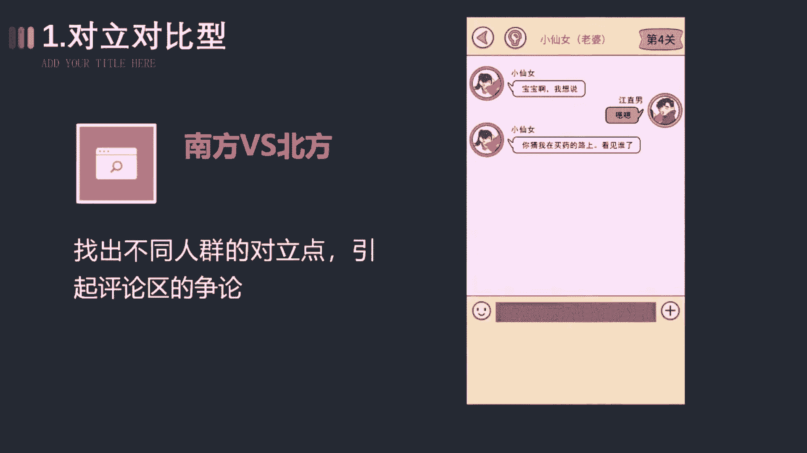

第二种请求帮助性，假装你是个菜鸟，请求大神玩家帮你通关，让观众产生想要试一试的冲动，进而呢点击游戏试玩，达成我们的目的，比如这样哼，你们骗人，红色加黄色加白色，根本就调不出皮肤的颜色。

快看我按照你们的方法，调出来的颜色根本就不对。

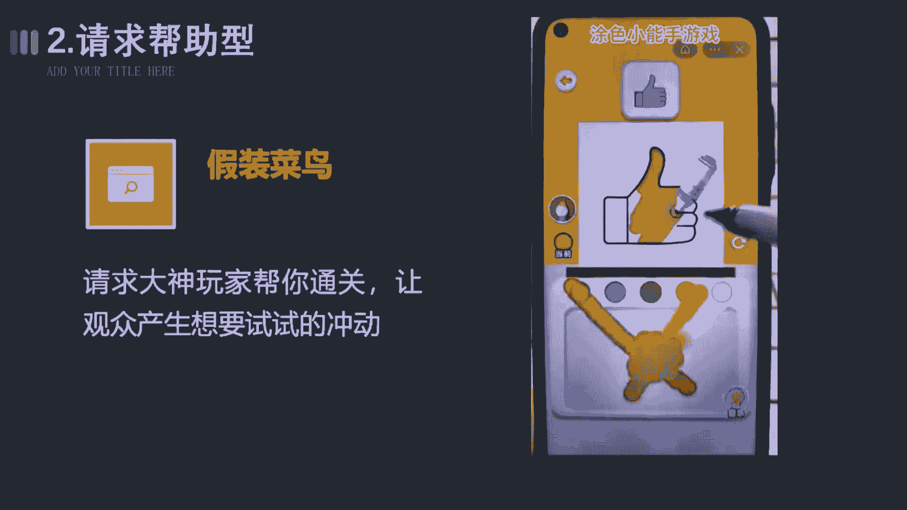

第三种蹭热点型，用热门动漫或游戏主播开场吸引，扩大用户的范围，突破小学生的圈层，像一条小团团，张大仙这种人尽皆知。

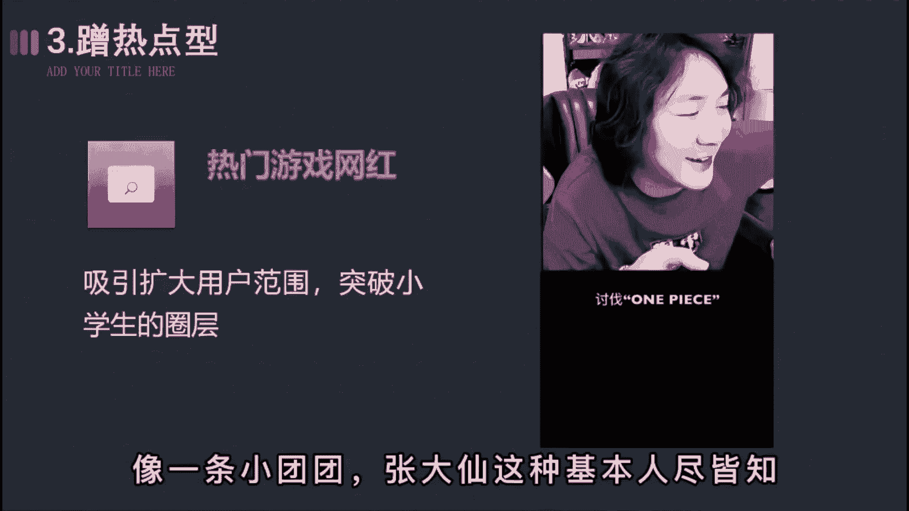

你完全可以拿来用，比如这样号称one piece开放兑换码。

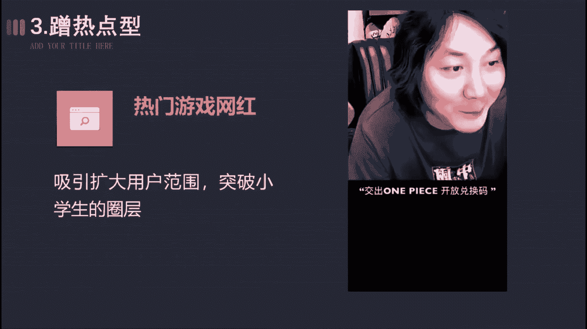

回顾始末，5月11日凌晨，大量热血航线的玩家被一则消息刷屏。

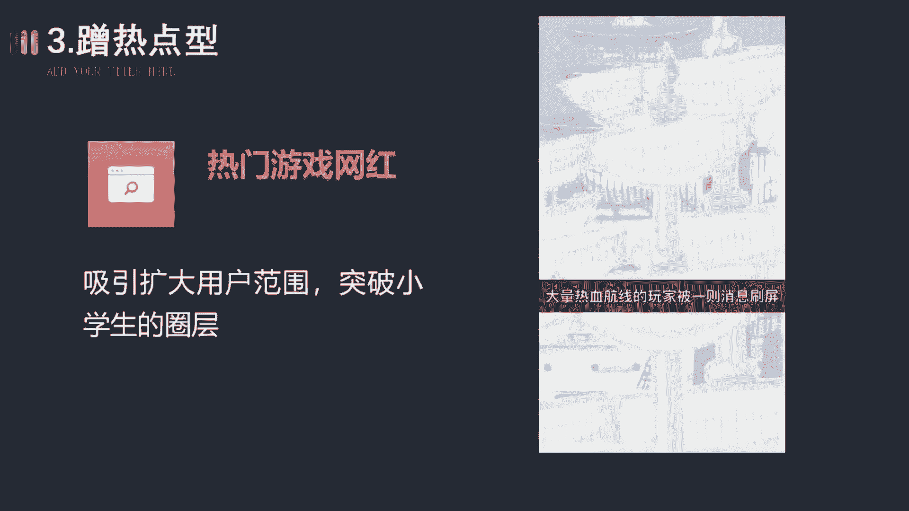

张大仙的粉丝在这游戏里有特殊福利，第四种玩法解说型装备介绍。

人物介绍，技能介绍，关卡介绍，反正啊就是围绕着游戏的玩法去解说，最好呢能通过你的解说，让大家发现游戏有趣的一面，比如这样，兄弟们，兄弟们，咱们第三个SSR也是终于出了呀，这一次抽到的是工程师。

艾玛单从技能不难看出，这是个强力辅助，第五种老色皮鞋。

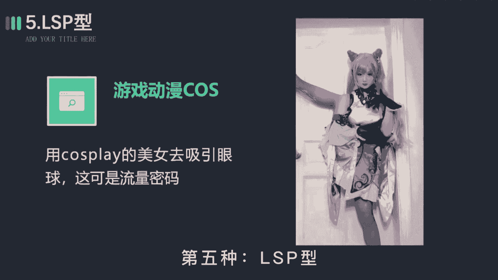

利用游戏衍生的cosplay去吸引眼球，毕竟啊漂亮的小姐姐人人都爱，这可是啊流量密码发作品的时候，记得艾特我一下，比如这样，I can you go i。

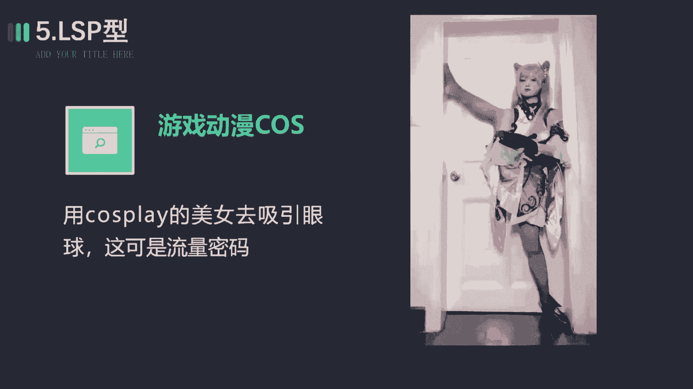

第六种警告诱惑性，通常啊用肯定和疑问的语气，搭配上游戏最有看点或者可玩性最强的那一关，来吊起观众的胃口，是一种万能的开场方式，比如这样。

你千万不要玩这个，没事走两步，否则你很容易连走路都不会了。

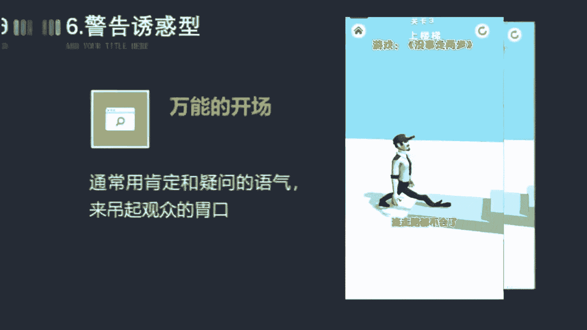

第七种真人出镜型，在游戏原剧情的基础上进行二次创作。

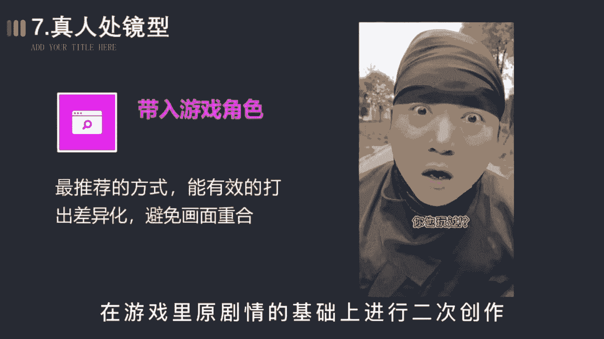

把自己啊带入到游戏角色中，引导观众点击试玩，这个呢是最推荐的方式，能有效地打出差异化，避免画面的重合，比如这样，忍者力量都是一步步修炼来的，你以为我没玩过忍者必须死三吗，你也玩过，那当然啦不做原创玩法。

点燃战斗狂潮，那以上呢就是小游戏制作的一个文案总结，相信你掌握后，能帮助你更快速的获得视频推荐好了，今天的内容呢就到这里结束了。

