# 【2024抖音运营教程】强到无法呼吸！！！抖音起号养号黄金七法则，原来爆款账号这么简单 - P26：18、视频剪辑方法-9 - 马云背后de女人 - BV197tJegEhP

剪辑环节我是直接实操带你来剪的，所以这个环节我希望你哪怕前面没有做笔记，这个环节把你的小笔记给老师，我搞起来啊，不然我讲完了，我明明讲过了，你又忘了，你说这怎么办，是不是来来到我们的剪辑环节呃。

这个时候就可以不用在公屏上面互动了啊。

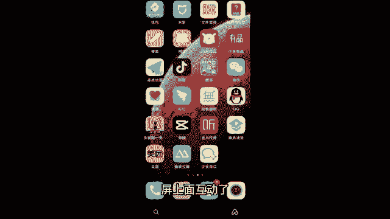

抓紧时间记下来好，我们用哪个去剪呢，这个剪映黑色的啊，不要下载错了，那么我点开教你们怎么用剪映也是抖音平台的。

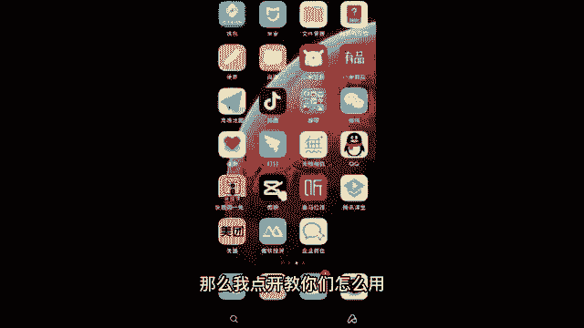

你放心用，他有手机版和电脑版，咱先讲手机，因为你们可能有的同学没电脑呃，来手机直接就能剪点。

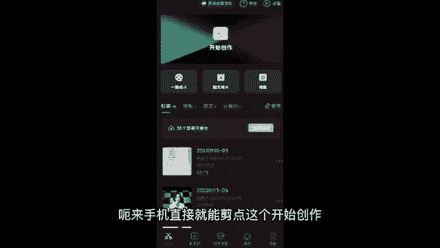

这个开始创作，然后把你要的这个视频啊导进去，比如说你一会你要剪辑哪条。

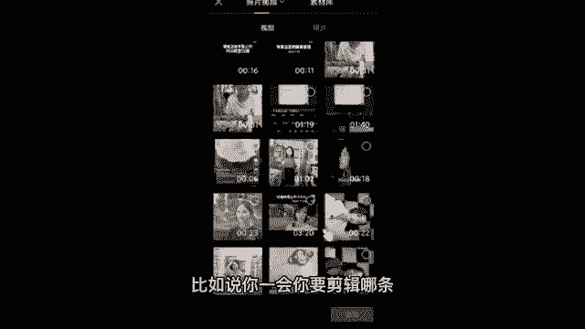

我剪这个吧，我自己的22秒的选中之后添加进去，你看这一条就添加进来了，比如说咱们是拍那种生活片段，有好几条开头中间结尾的，你这一条你先把它剪好，剪好之后，你直接点这个加号，你再把第二条再导进来对吧。

你一条一条导一条一条的剪，这样不会乱，那我们先把这条剪了啊，看问题出在哪啊，首先第一步构图比例就错了，怎么解，点一下这个视频，然后往右滑，然后接着点击这个方块编辑。

接着左边点这个旋转，旋转到合适的位置对吧。

如果说再想裁一下比例，可以点第三个裁剪，这里有什么一比一。

四比三，二比一都可以啊，自己去调一下，咱们第一步先把这个调好好，调好之后回到主页，那我们得听一下这个视频吧，点这个播放听一下，哎，你发现没，我前面都没说话，这没说话的地方咱可不能要要了，就是浪费时间。

这个竖线其实就是一个剪刀，比如说我们想把前面这段剪掉，竖线就竖在这儿，还是一样，点一下视频，点第一个分割哎，分成两段了对吧，前面不要点一下，点删除很简单，对不对，来再重复一遍啊。

比如说不要的选中分割来选中分割，中间不要的选中删除，像结尾对吧，关手机的动作，不要的还是一样的啊，选中分割。

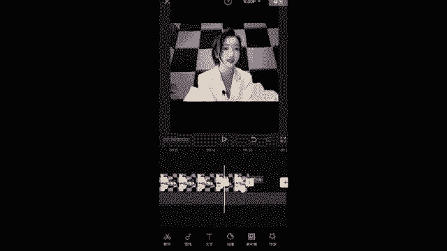

选中删除很流畅啊，你就记住选中分割，选中删除就能把它剪掉。

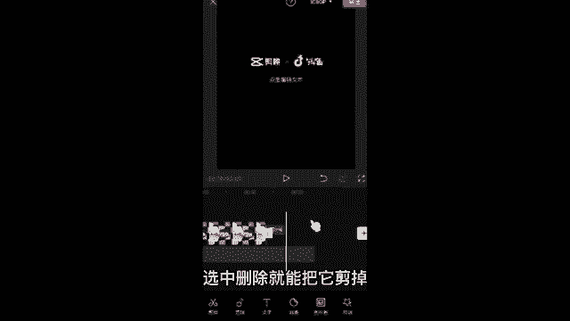

像结尾这个不要咱也选中删除，然后接着完整的视频，你这自己去仔细看一看，剪一剪啊，视频剪好了就得加音乐了，第二个就是音频，点一下音频，然后你如果刚才用了淘金阁配音的同学，可以直接点第三个提取音乐。

把音乐导入进来。

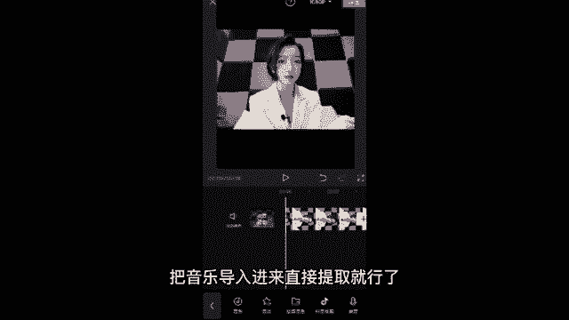

直接提取就行了，如果没有用淘金阁的，直接点第一个加音乐，这里有很多分类。

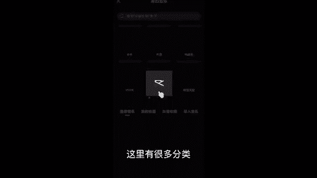

你可以搜歌曲或者看这些音乐的分类，你看美食啊，美妆啊。

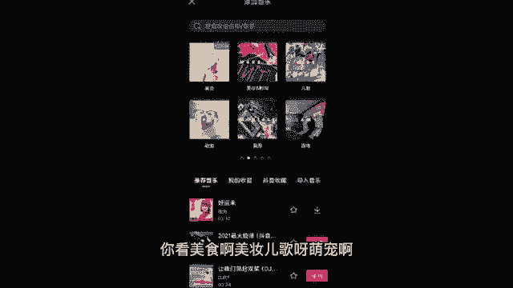

儿歌呀，萌宠啊，点进去都有一堆歌曲，包括下面你看你只需要点一下这个头像。

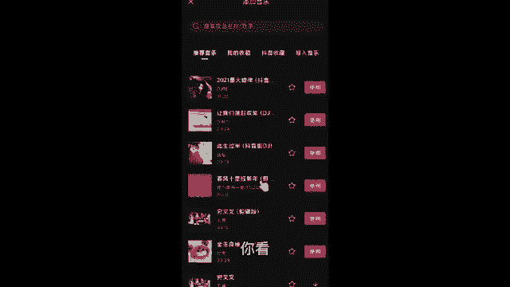

就能够预览，把这首歌下载下来听一下，如果你觉得这首歌不好听对吧，你就换一首，我们选好了，直接点击使用就行了。

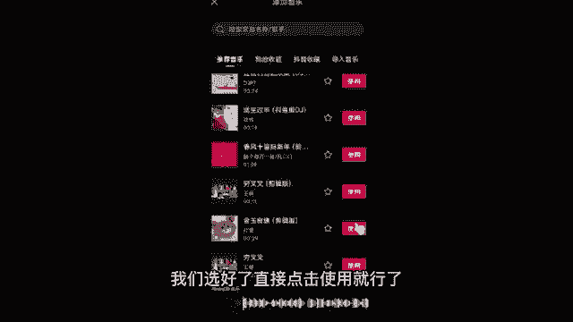

你看这首歌它就导进来了，音乐的就进来了。

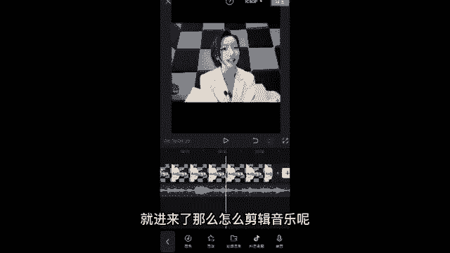

那么怎么剪辑音乐呢，音乐太长了，还是一样的，来剪刀竖在这选中分割，选中删除对吧。

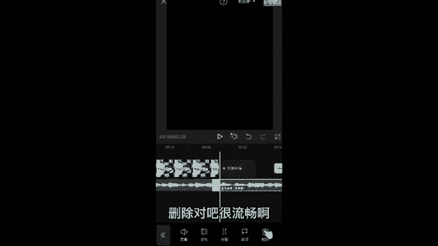

很流畅啊，然后音乐的大小怎么调，选中这个音乐。

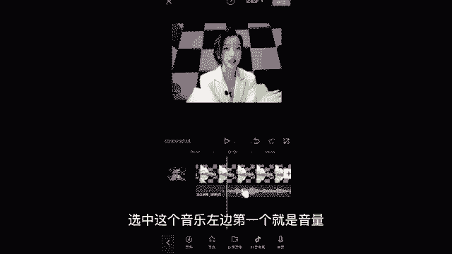

左边第一个就是音量，音量可以调小点，调下调大一点，自己去调啊。

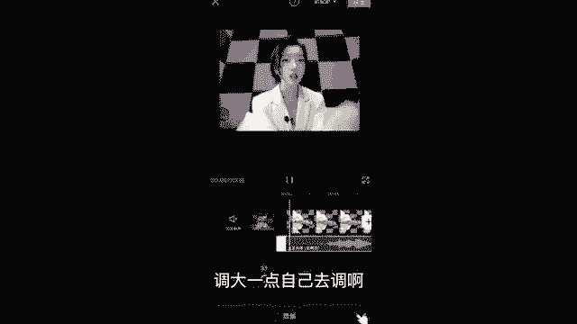

然后完整的视频是不是要加字幕，怎么加字幕，回到主页，第二个完了，咱就来到第三个，第三个文字点一下，接着你不要自己一个一个的去加字幕，这样很累，我告诉你一个好方法，你点第三个识别字幕。

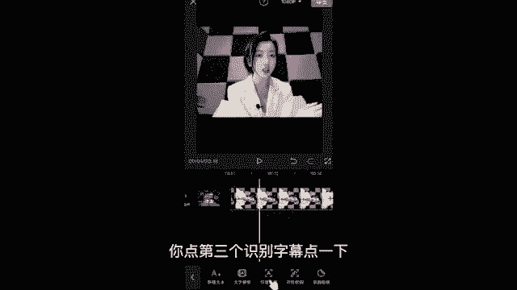

点一下，然后直接识别嘛，识别仅视频，尽可能别点全部。

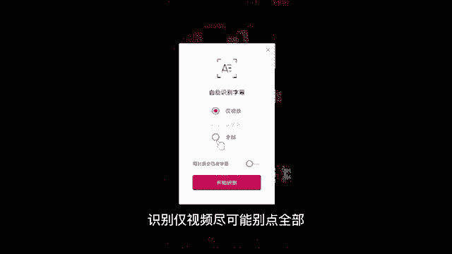

因为咱们刚才加了音乐，全部它有歌词对吧，开始识别左上角就在字幕识别当中。

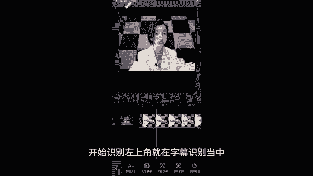

机器人它会自动给我们加字幕，你不用说自己一个个打字又快唉又方便。

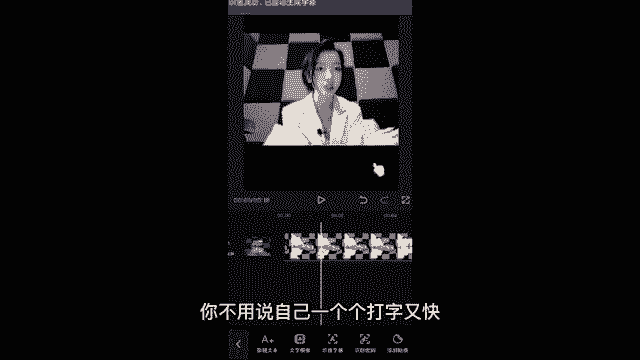

来识别出来，把它拖到合适的位置，你看后面都在合适的位置，然后你再检查一下错别字，有错别字的，你就可以双击一下。

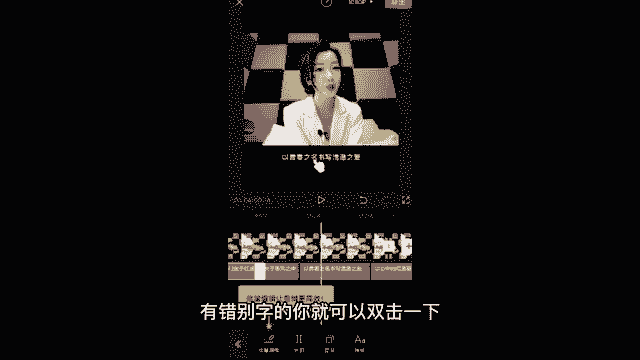

双击咱们把错别字删除，修改一下，然后还可以改一下字体，改一下样式，比如说我穿黄衣服，我改个黄色的字，你看到了没有。

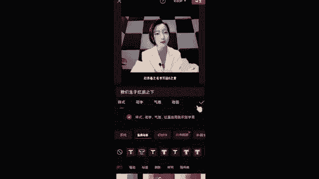

这些是不是都改好了，我们的比例调好了对吧，我们的视频剪好了，我们的音乐加好了，我们的字幕也一下就生成了。

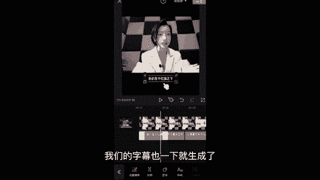

这个视频其实就很完整，就都有了，就跟种小草那个一样，都有了，你就可以导出了，但我跟你们说，导出之前啊，来小细节。

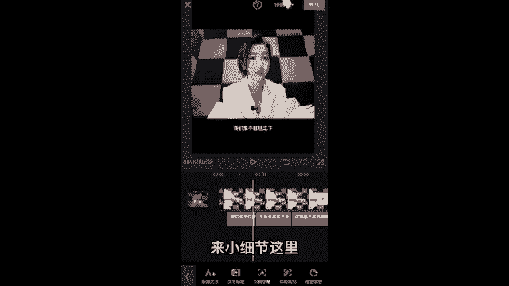

这里导出左边点一下，咱们得调整它的一个视频清晰度，你得让它视频不被压缩掉，那怎么办，做抖音你就记住咱们帧率就调到三十三十，做抖音最合适，然后分辨率咱们尽可能拉满，因为分辨率越高，视频就越高清，你就记住。

到时候帧率调成30，分辨率拉满就可以直接导出了，这个视频我不要啊，我就调低一点。

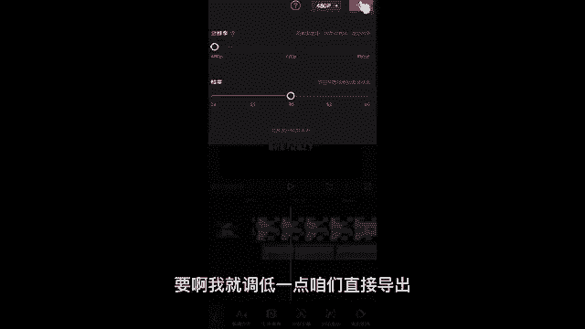

咱们直接导出，导出的时候记住不要锁屏或者是切换程序，我们耐心一点，等它导完就可以了啊，啊因为你如果说这个时候切换程序。

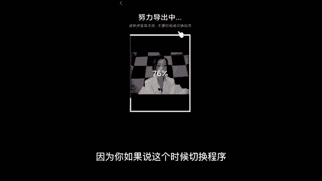

它没导完，你就给打岔了嘛，好导完之后啊，直接分享到抖音就行了，因为这个软件它也是抖音的，都是抖音的，直接分享到我们的抖音就可以了。

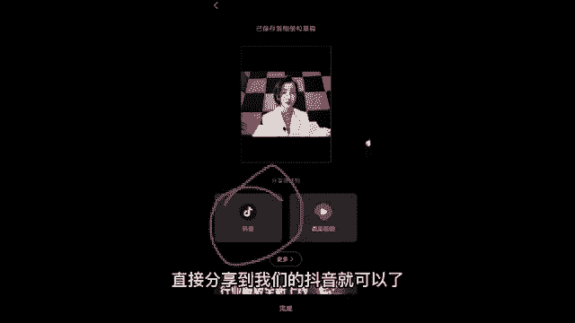

来这个环节你知道怎么弄的，给老师我扣个666，我看一下，也认真听，也认真记下来了，我都已经一个一个给你们强调了。

只要我强调的地方你都记下来，你自己操作一下，应该是没有问题的。

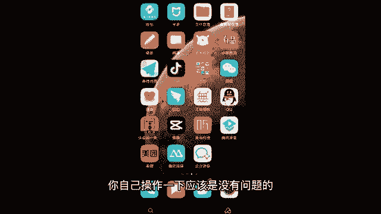

实在是还不懂啊，课下可以问问我啊，来接着我再给我们做口播的同学推荐一个软件，不需要你来背诵了啊，加声音老师，我刚才教过了，来不需要你们去背诵的啊，来我们下载一个软件，这个软件啊还是一样。

我讲课的时候你不要走神，可能十几秒就是一个知识点来，这个软件叫做爱提词，看到了没有啊，爱提词来你，我讲到哪儿，你听到哪，你要是错过了，你要是没有学会的话，你课下问我，不然的话你前面也没学会。

你后面我讲的这个知识点你又没听进去，结果你就是西瓜也没捡着，芝麻都没捡着。

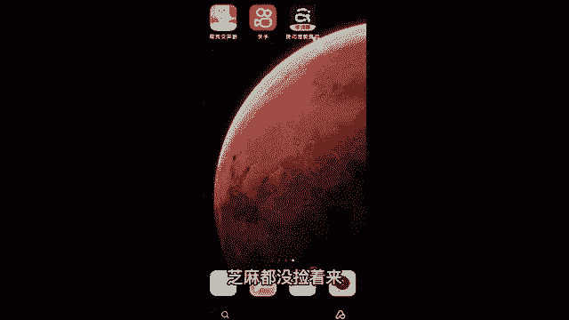

来爱提词，看到了没有，这个怎么用啊，口播的同学点进去。

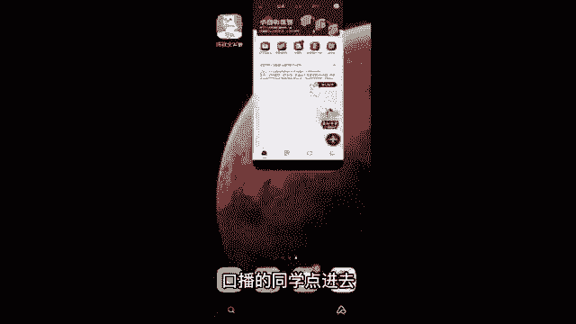

包括你后期想做直播，记不下来词儿来点进去，点右下角这里有个加号。

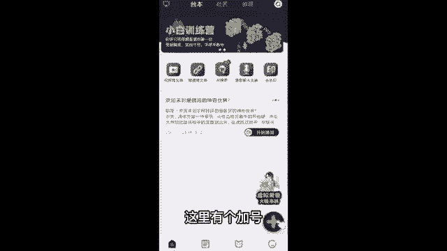

我们直接点添加，你就可以把你的那个台词，你背不下来的台词，直接打字或者复制粘贴打进来，我先随便打一点啊，然后比如说我们这个台词讲的是情感语录，我们哎随便啊，情感语录打上情感语，鹿嘶情感。

我老是打成枪感情感语录哎，在这里哎随便打一个标题吧，打完标题我们直接保存啊。

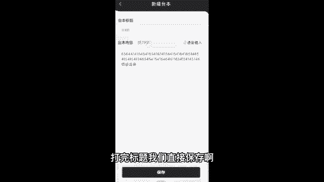

保存完了之后怎么用啊，你看我们要录制这个台词。

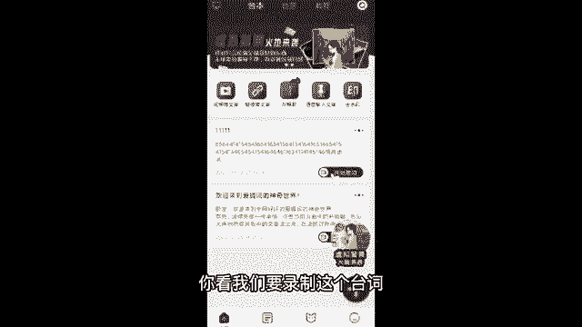

你直接点开始提词，点这个录制模式，你看咱们就可以一边录制，一边照着读了，你再也不用担心背诵或者记不下来，因为做口播你不需要背诵，你把词准备好就行了，然后如果你近视眼的同学，我们点中间这里啊，点这个设置。

你可以把字体调大一点对吧，你近视眼你都能看得清，就再也不需要背诵了，也可以调小一点都可以啊。

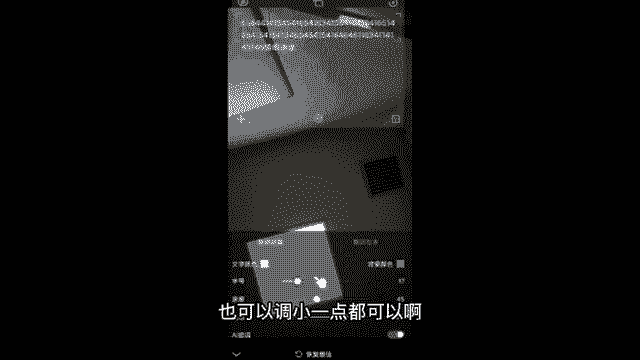

然后左下角包括我们拍摄，不要用原相机。

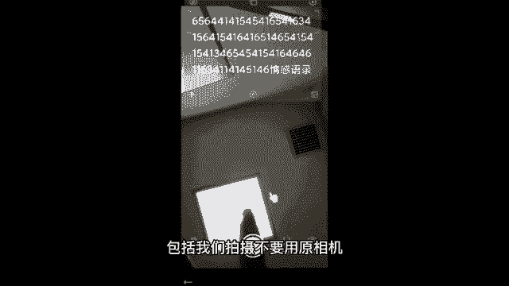

原相机把人拍的不好看，你用啥，你左下角有个美颜，你可以调个什么瘦脸啊，大眼呀，磨皮啊，美白啊，祛痘呀，加滤镜啊对吧。

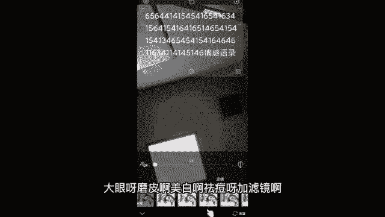

你给自己调的好看一点，这个它的软件的好处就在于，它不会像美颜相机给你拍的。

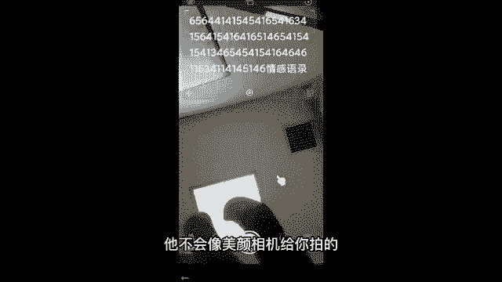

那么就是拍的那么假滤镜那么厚，你看他没有什么很厚重的滤镜。

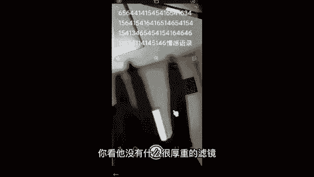

就能给你拍的，又自然就会觉得你的漂亮是天生的一样啊。

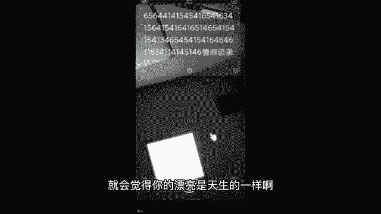

这是老师我给你推荐的，能解决你不知道用什么拍，包括说解决你背不下来。

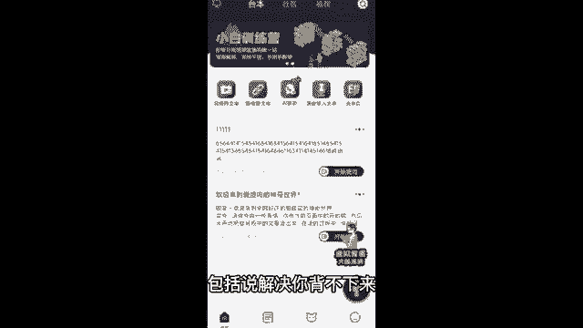

然后这里有一个爆款文案，你看这里有一些职业职场啊，你看创业管理，金融职场保险，情感健康啊，科普教育啊，生活时尚啊。

很多类型啊，咳我觉得你稍微下载下来，花个10分钟看一下，你绝对能会了啊，这个你到时候把这个app下载下来啊。

