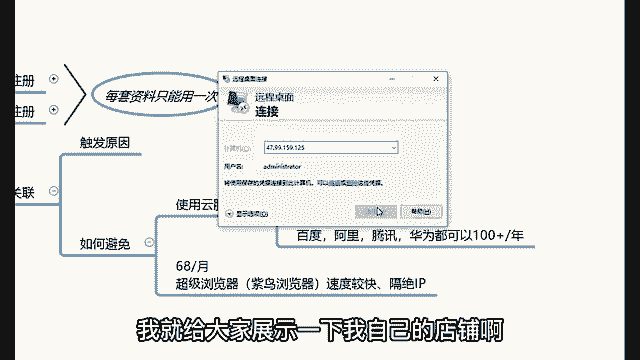
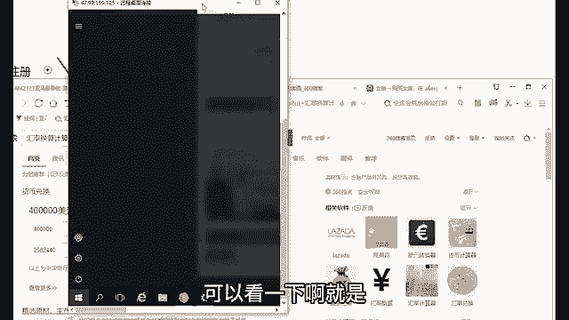
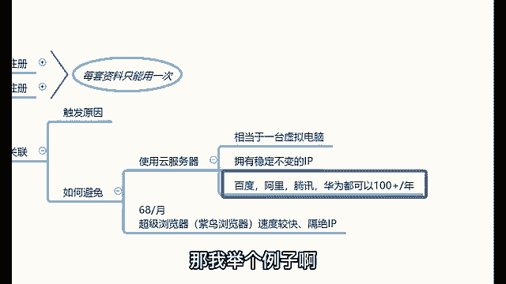
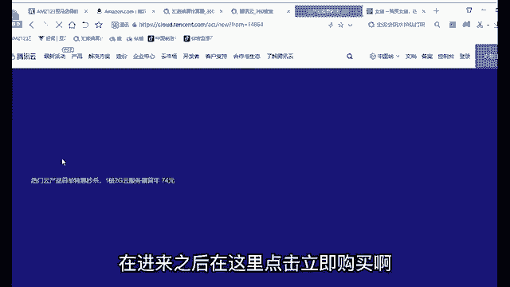
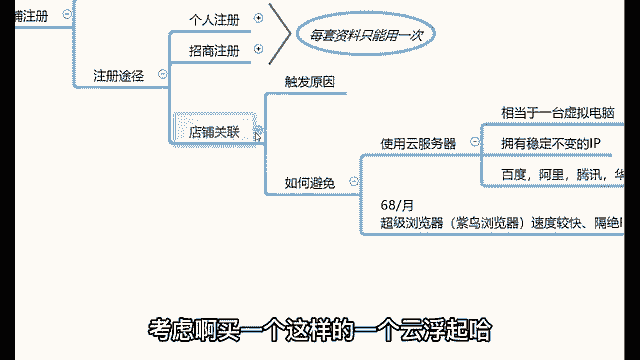

# 【2024最新B站跨境电商课程】冒死上传！零基础亚马逊运营课程合集，亚马逊跨境电商入门教程（纯干货，超详细！） - P12：13、如何注册店铺：注册途径 - Sakura1Ayane - BV14TtDeEE3M

OK当你把这些资料准备好了之后，去哪里去注册的？首先资料准备好的时候，有两种注册途径可以供你们选择。第一种叫做个人注册，第二种叫做招商注册。😊，个人注册的话就是在亚马逊的官方网站去进行一个注册。

这是亚马逊的官网的网址，讲完课之后也可以发给你们。😡，但是在个人注册的时候有一个问题，大家需要注意啊，就是很多同学对于平台如果说不熟悉的情况下就是。😊，不要贸然去个人注册啊。😡，然后这个为什么呢？

因为我怕你把资料填错。比如说我的名字啊，举例，我叫杨岳云。那么在注册店铺填写资料的时候，有有些地方我我会填成杨岳云，有些地方要填成岳云杨。😡，什么原因呢？因为我们中国人和外国人的习惯不一样啊。

在我们中国人看来，我们的习惯就是姓在前明在后。😡，对吧那么老外的习惯是明代前姓代后。那你说你把这个资料填错了啊，第一次填错。😡，那么第二次再用同一道资料，通过率会极其低。连续失败三次，你知道资料就报废。

😡，所以说为了避免不要浪费，你可以找你身边在做亚马逊的朋友，也可以找到我，也可以找咱们的助理老师去协助你们注册，都是可以的。那么这是第一种方式，叫做个人注册。那么第二种方式叫做招商注册。😡。

招商注册的话就是亚马逊在中国设至有官方的工作人员。通过他们注册的话呢。现在已经不行了，因为招商招商注册的话，它是有招商指标的。每年上半年是招商招商指标比较多的时候啊，现阶段招商指标早就已经完了哈。

有现的它就是招商注册其实跟个人注册没啥区别，就是到到时候会对接一个工作人员协助你注册而已。那么在注册填写资料方面它都是一样的啊。所以说其实在注册上没有什么很大的一个差异哈，就是个人注册和招商注册差不多。

该准备的资料都是那些资料，该填的资料也是那些资料啊，其实没什么区别哈。如果说你们资料准备好了，可以找找我们老师帮忙协助注册哈。😊，OK那么在店铺注册下来之后，一定要注意的问题就是店铺关联的问题。

什么是店铺关联啊？因为我先跟大家讲一下店铺关联的触发原因哈。😊，首先。假如说你家里边有台电脑，那么这台电脑的话。😡，在登录了你的店铺的时候呢，也登录了我的店铺，就是我们两个人的店铺在同一台电脑上登录的。

那么就会导致店铺关联。😡，一旦关点就直接封店，就是两个人的店铺封。放在同电脑上是不行的。两个人的店铺一旦出现在同一台电脑上，就会店铺关联，一旦关联就是疯电，你的店我的店都会封。假如说你家面有两台电脑。

一台笔记本，一台台式机，你在笔记本上登录你的店铺，在台式机上登录我的店铺，对吧？那么。😡，用的是同一个wifi或者说同一根网线的情况下，也会导致店铺关联，一旦关联也是封电，这就是店铺关联的出发原因。

那么如何去规避这个店铺关联呢？规避的方式啊，我教你们两种规避的方式。😡，第一种方式使用云服务器。云服务器相当于一台虚拟电脑，我我我自己的店铺就放在云服务器里，我打开我自己的店铺给大家看一下吧。

有很多同学说老师，你给我们讲那么多哈，你自己是实操的，还是真给我这边讲理论的？😊，来，这个我就给大家展示一下我自己的店铺啊。😊。

啊，因为这个东西也没有什么炫耀的成分啊，我只是给大家简单展示一下啊。那么你看这就是我自己的云服务器。那么我自己的店铺也是放在个云服务器里边。那你们也可以看一下我自己的营业情况啊。

首先今天有有这个实例在你们这给大家去讲课。那你们看一下我自己的运营结果啊。那么我今天订单数额大概在1491个订单啊，大概营业额在19520美金啊，这是我给大家算成人民币给你们看一下啊。

那么这是我今天的营业情况啊。😊。

1491个订单，然后这个19520美金的营业额19520，大概在126023块钱呃，这是我做亚马逊的一个今天的营业额。当然我做的时间会相对比较久一些。然后我做亚马逊应该从05年开始接触到现在啊。

就做的时间会相对会比较久。那么我给大家看一下，我30天的营业额，就是最近这个月的营业额大概在40万左右，4002041块钱啊，就是大按40万来算吧，我自己的营业情况啊，40万的营业额。这个月。😊，🎼呃。

大概在2582440块钱左右，这是我自己的店铺的运营情况哈。那么所以说我想要告诉你们啊，就刚刚认真听课的这些同学，你们是不是感觉自己赚大了？对你们刚刚听到的就是我自己在运营上的一些心得和体会。😊。

你了解了吗？所以说你们好好去做啊，做的时间久了之后，我相信你们也可以做出来这样的一个成绩，好不好？就是一直没有给你们展示店铺。因为我这个人其实我不希望靠这种方式去去去让学员去信赖。我你明白吧？

我更希望的是通过我自己的一个给你们提供的价值，而不是我做出来什么什么样的一个成绩。我感觉我做成什么样，对你们来讲不重要啊，但是其实也重要了。因为你对吧跟着一位牛牛牛一点的老师学习。

至少你能够保证你自己学习到的东西是比较棒的是吧？所以说我刚才也没有展示啊，就主要是啊也不太好意思不太好意思给大家去展示，我更希望的是用我自己的专业能力去征服各位哈。

那么甚至关于这个店铺的运营情况的一个简单的这个介绍哈，同时的话呢也可以给大家看一下，我这个店铺就是放在云服务器里的，看到没有？我这个店铺就是放在云服务器里。😊，可以看一下啊，就是。😊。

这个云服务器它是一台虚拟电脑，它有自己的一套独立的系统。它跟我正在给你们讲混合电脑，它不属于同一台，你知道吧？就我跟你讲混合电脑和这台云电脑，它不是属于同一台电脑。这个云电脑是放置在架设在云端的。

那么这个云服务器去哪里去买的，贵不贵呢？我告诉你真很便宜的哈，云服务器最便宜的几10块钱，七八十块钱一年。那我举个例子啊，我们可以买一个腾讯云举个例哈。😊。

我们去腾讯公司买一个腾讯云。比如说打开腾讯云，进入到腾讯云的官网，在进来之后在这里点击立即购买啊。点击完立即购买之后，大家可以看到云服务器最便宜的74块钱一年。😊。

就你花74块钱，你就可以买一个这样的云服务器。😡，对你后续把你自己的店铺放在这个云服务器就可以了。😡，所以说如果说你们想要做亚马逊的情况下。😡，可以去买一个这样的一个云服务器。

70块钱把店铺放在云服务器里边。你想在哪登录，在哪登录。你想在任何一台电脑上登录都可以。那你看像我这个电脑上，除了登录我自己的云服务器之外，还登录有我们公司的就这些店铺都是我们自己在运营的啊。

就是自己的公司的店铺。然后还有我们同事的店铺都可以放在云服务器里边去登录。那么。😊，所以说你们后续的话也可以买一个这样的云服务器。那么第二种方式的话呢，可以使用一个超级浏览器，68块钱一个月啊。

68块钱一个月的超级浏览器二选其一即可。所以说那么做亚马逊的情况下，你们就可以。😡，考虑啊买一个这样的一个云云服务器哈，这是关于店铺关联的触发原因以及规避的方式的一个简单的介绍。😊。

