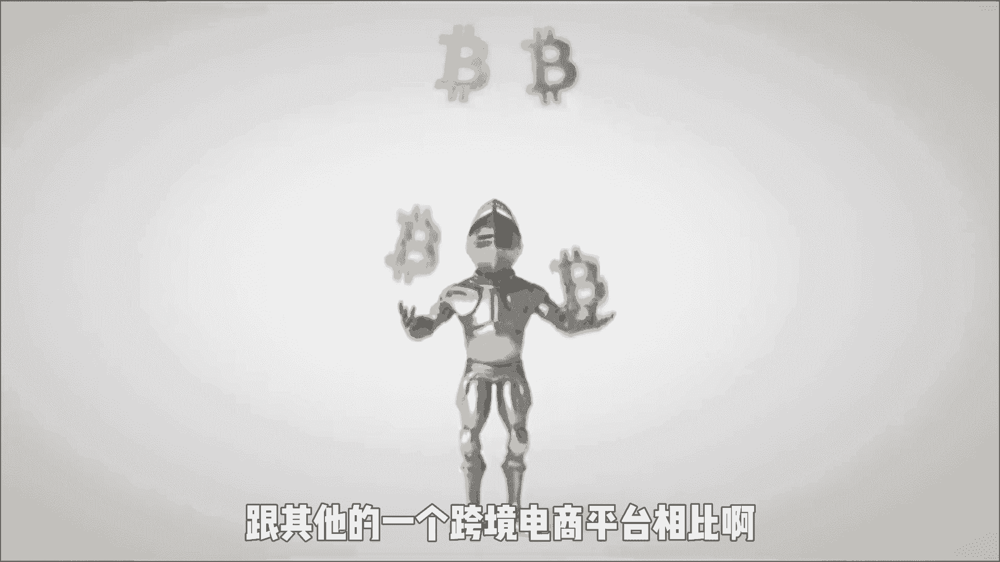

# 【2024最新TikTok运营教程】比付费还强十倍的自学Tiktok海外版抖音运营全套教程！tiktok体开店 起号真的快，赶快点赞收藏起来！ - P1：1、Tiktok跨境电商小店入驻。 - 固特异好 - BV1yD421u7fN

我告诉你TIKTO卡到底应该怎么做，不要再被别人割韭菜了，很多朋友啊知道怎么开店，怎么联系物流，但是啊你是只知其一，不是其二，某宝大家都知道，也知道怎么开店，怎么找货源，怎么去发货，但是就是这样。

你能做好某宝吗，为什么会选择在这一个时候啊，给大家去开一期这样的视频，是因为啊TIKTOK它其实是一个挺不错的风口，是未来在全世界范围内啊都热门，这没错，但是你们不要啥都不明白，就蒙着头啊。

一头扎进这一个韭菜聚集地，所以今天的话就是跟大家去分享一下。

我们在TIKTOK上的一些探索，由我们自己踩过的坑总结出来的经验，也希望今天的这个视频呢能够帮助到大家，不要傻乎乎的送上去歌了，TIKTOK这个系列的话，我打算分别从以下几个板块去说一下。

带大家去了解TIKTOK到底是怎么玩的，第一个是TIKTOK小店的生态是怎样子的，在上年底的时候，广州那边啊召开了一个公开的招商会，有说到5年内啊进入全球各大主流市场，然后啊会达到数千亿美金一个规模。

这是TIKTOK的一个愿景，那么跟其他的一个跨境电商平台相比啊。

TIKTOK小店啊，他是否具有一个这样的能力呢，首先他它的一个用户增长啊非常的快，它的流量现阶段来说是非常便宜的，然后它的用户粘性很强，很多的TIKTOK用户啊都是一刷就是十几个，20几个小时以上的。

并且啊，它现在具有很丰富的一个玩法，和比较好的购物体验，在这里给大家透露一下，从上个月3月7号开始啊，开通TIKTOK英国小店啊，是一个零门槛的窗口期，你只需要一个中国的营业执照。

包括个体工商户也是可以的，就可以开通英国小店，不像之前啊需要这需要那的一大堆的条件，那时我朋友圈做代开TIKTOK小店的服务商啊，对外报价代开一个店铺啊，收费就是3万。

现在注册是非常非常方便的，最快打半个小时就下单了，现在如果手上有营业执照的朋友，可以赶紧去注册一下这个窗口啊，我不知道它会持续多久，所以能尽快注册的话，大家得先尽快注册一下，也不需要缴纳保证金。

这一个注册链接的话。

你可以关注回复啊，TIKTOK就可以拿到，怎么注册小店等等一些流程都在这里面，不仅如此啊，包括说TIKTOK的app怎么下载，怎么发布作品，怎么玩开播这些啊，都是有给大家讲到，那现在给大家说一下。

这个TIKTOK小店的本土店，和跨境店有什么区别，因为啊大多数朋友他开的其实是一个本土店，其实我们没有必要啊，非得去开跨境的店铺，因为啊，本土店基本上是可以满足我们很多货运需求了，相信看我视频的朋友。

肯定有了解过那一个英美融合店，但是英美美容和店，他的一个入住要求啊是比较高的，除了闭环满30天啊，达到2000美元以外啊，还有一个很重要的指标，就是你的so不败的一个商店地址，这个地址啊只能在美国。

这个美国的地址啊，是相对来说比较麻烦的，还有一个小道消息，我也只能说小道消息，已经入驻英国小店的商家之后，是不需要另外再去开通越南啊，泰国啊，那几个东南亚的国家的，只要英国小店做得好啊。

后面是可以申请成为一个跨国店铺的，是真正可以实现一个店铺可以迈向全球的，当然还有更多的精彩内容啊，只是因为这一个视频时长的关系啊，我们这一期的分享就到这里，感兴趣的可以关注我。

