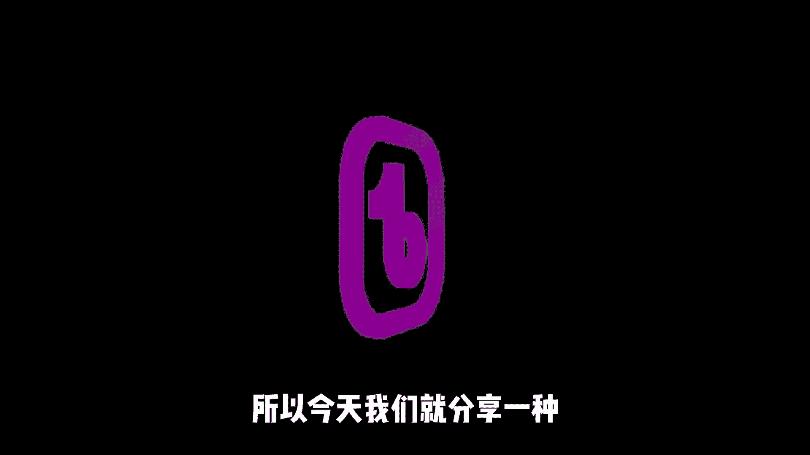
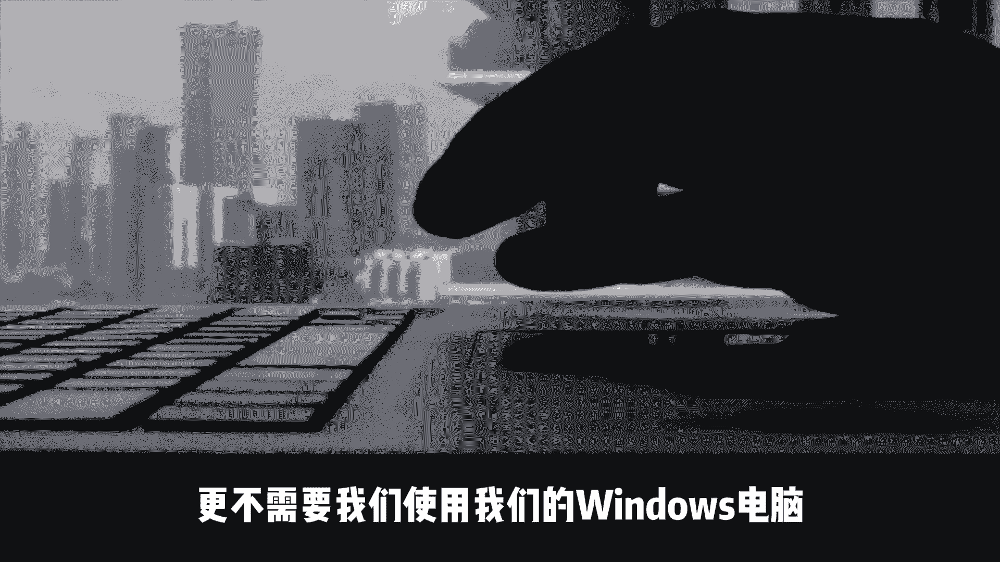
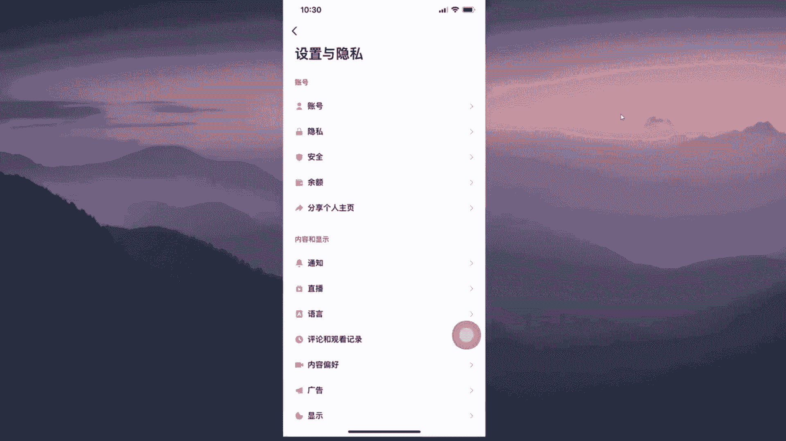

# 【2024最新TikTok运营教程】比付费还强十倍的自学Tiktok海外版抖音运营全套教程！tiktok体开店 起号真的快，赶快点赞收藏起来！ - P1：Tiktok免拔卡安装教学 - 漫画家秒 - BV1zJ4m1w7yj

哈喽大家好，我们之前分享过几期关于国际版抖音，也就是TIKTOK的一个使用教程，但是呢很多朋友说，有一些方法呢实在是太复杂了，问我了，有没有简单一点的方法，所以今天我们就分享一种。

非常非常非常简单的方法，重要的事情讲三遍，非常简单，我们不需要使用爱思手机助手。

也不需要使用其他的复杂工具，那么更不需要我们使用我们的windows电脑。

我们仅仅需要一部手机就可以，不管你是否有插卡或者是没有插卡，那么我们都能够正常的使用国际版抖音，Tiktok，那么现在呢我已经来到我的手机上面了，首先我们可以看见shut walking，就是小火箭。

还有一个TIKTOK，那么现在我们打开我们的小火箭，然后来进行一个连接，然后打开我们的TIKTOK，可以发现他是能够正常刷视频的，我这边先暂停一下，然后我们往上可以发现是没有任何问题。

都是能够正常刷视频的，那我们点赞也是没有问题，以及关注同样也是可以关注，那么我们评论一个ni ce lies，可以发现一秒钟之前就是我们评论的，然后我们点一个赞，评论也可以点赞，都是没问题的。

那么我们返回继续来关注其他的关注，也是没有任何问题，那么我们点开我们的个人主页，这边可以看见我已经是登录成功，然后我们点击右上角的三个杠，点击下面的设置与隐私，但是呢我们在里面可以看见。

它是没有任何的更改地区的，所以说这个时候我们点击我们的设置与隐，私的旁边大概就是我现在标记的这个位置，大概就是这个悬浮球这个位置，我们点击空白处，我们就可以看见japan以及韩国，美国。

英国常见的我们都是可以看见的，那么一般情况下我们用日本，韩国美国就差不多了，这边呢就是一个切换地区，那么现在我来教大家如何来进行一个下载，首先我们把这个token先删除掉，删除。

好了现在我们手机上就没有TIKTOK了，那么现在我们打开苹果的一个手机自带浏览器，然后我们来到这个网址，在这里面我们可以看见一个在线安装一，在线安装二，我们随便点击哪一个都可以。

我们就随便点击一个进行一个安装，它就会提示我们正在进行安装，我们点击安装，那么这个进度条呢我们不用去管它，我们就回到我们桌面上，就可以看见他正在进行一个加载当中，这个加载的话可能会大概需要几分钟。

这边是根据你的网速来进行一个决定的，当然如果说我们方法一安装的比较慢的话，我们就把它取消下载，让我们回到这个浏览器当中，然后我们就选择下面这个在线安装二，那么选择在线安装二之后呢，我们就回到我们桌面上。

你们反正可以去尝试一下，安装一也可以安装二也可以就等它安装完成，这边呢我就加速进行一个跳过了，好的，现在我们可以发现，我们的TIKTOK已经是安装完成。

那么这个时候我们可以用我们的shout walking，只要是能够自TIKTOK的，那么我们都是可以使用的，当然这边最推荐的还是使用一个小火箭，那么小火箭这个app呢，我们是需要进行一个购买的。

同时呢我们也需要一个外区id，如果说你不会注册美区id的话，我会把教程放在视频的下方，那么这边就是给大家说明一下这个情况，好的，首先我们来看一下，我们打开TIKTOK，可以发现我们这边是打不开的。

它是一个未受信任的，我们点击取消，那么这个时候我们不要着急，我们打开我们的一个设置，然后在设置里面找到一个通用，然后呢我们往下拉找到一个设备管理，然后呢我们选中它。

这边我们可以发现它下面是显示TIKTOK，我们只需要点击信任这个就可以了，点击信任，那么这个时候我们就可以回到我们桌面上，然后打开我们的小火箭，当然这边我们需要一个能够支持。

TIKTOK的一个机场节点才可以，那么你们可以在视频下方看见，我推荐的两个机场，这边是能够支持奈飞TIKTOK，迪士尼等多流媒体的，如果说你们自己有的话，你们也可以用你自己的，这边我们随便连接一个测试。

那我随便选择一个点击连接，那么连接成功之后，我们就打开我们的TIKTOK，那么我们就可以看见，我们已经成功的进入到TIKTOK当中，这边呢我们可以根据自己情况来进行选择，比如说喜欢的一个旅游或者是美容。

时尚艺术游戏或是舞蹈DIY汽车，这边我们可以自己去进行选择，我们点击下一步，当然你可以选择跳过，然后我们根据提示往上滑动，是没有任何的问题，都是能够正常进行一个加载的，那么浏览是完全没有问题的。

那么这个时候我们需要关注的话，就必须要登录一个账号，这个时候我们可以通过我们的一个手机号码，或者是FACEBOOK以及苹果的一个IPAD，或者是谷歌账号，或者是推特以及INSTAGRAM都是可以的。

那么这边我就选择一个谷歌账号来进行登录，这边我们点击继续，那么现在呢正在登录当中，我们稍微等待一下，好的现在我们已经是登录成功了，我们点击不允许我们发现刚才已经关注成功了。

这边我们点赞也是能够进的点赞了，那么评论的话，也是能够正常评论了，暂时不要，这边都是没有任何问题的，那么我们来到我们的主页这边，同样的我们选择右边的三条杠，然后选择下面的隐私与设置。

这边呢我要告诉大家如何来进行一个切换地区，我们这样找的话是找不到。

然后呢我们在设置与影视旁边，那么大概就是我移动的这个光标这个位置，然后我随便点击一下空白处，那么我们就可以看见可以切换地区了，刚才给大家说了，我们可以进格切换，那么现在我要演示如何进格切换。

比如说我们选择一个韩国的或者是美国的，我们就以美国为例，我们选择美国，那么这个时候我们选择第一个就好，那么他会退出一次，退出之后我们再重新打开TIKTOK，我们就可以发现。

我们现在已经是切换到美国地区了，关注点赞评论都是没有任何的问题，那么我们刷新也是没有任何的问题，对吧，所以说呢这种方法是非常非常的简单，你们可以根据自己使用情况来进行选择，如果说不想麻烦的朋友。

就可以选择我这种方式来进行安装，我会把今天相关的所有内容放在视频的下方，你们可以自己去进一个查看好了，本期影片呢就分享到这边，那么相比起我之前讲的一些复杂的版本，这个呢是要简单的非常非常多了。

那么我们全程是没有用到任何工具，以及任何电脑的，只需要用我们的手机就可以了，那么也希望今天的分享内容呢，能够帮助到屏幕前的，你好了，本期片就分享到这边，我会持续的在这里更新优质内容。

