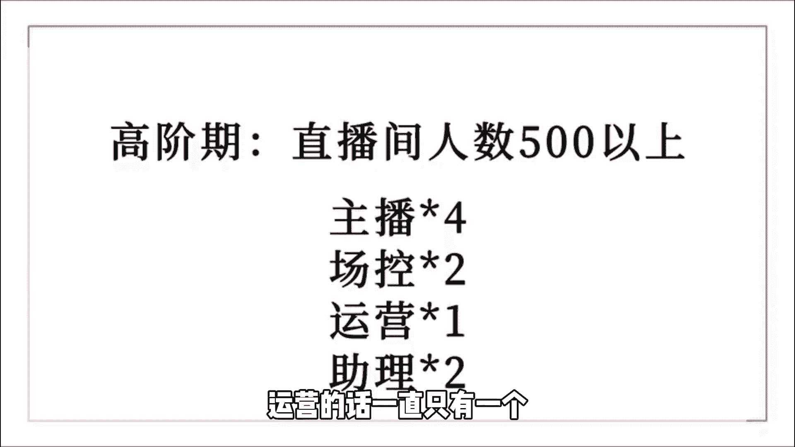
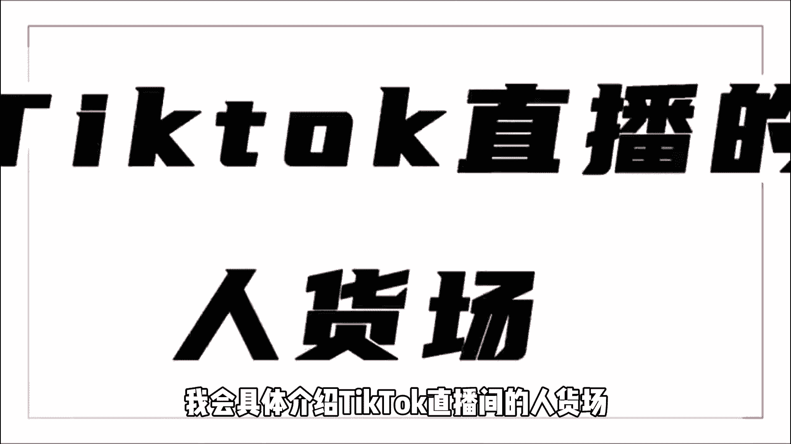

# 【2024最新TikTok运营教程】比付费还强十倍的自学Tiktok海外版抖音运营全套教程！tiktok体开店 起号真的快，赶快点赞收藏起来！ - P2：2、Tiktok跨境电商新人注意。 - 固特异好 - BV1yD421u7fN

我身边啊经常会有人问我，就是说做TTOK小店这个事情呢，没有有经验的小白可以做吗，一般我的回答是这样子的，如果你本身是做跨境，做短视频，做直播的人群，那么你在TIKTOK小店上啊是非常有优势的。

甚至可以马上去做这一个TIKTOK小店，对别人来进行一种降维打击，但是啊如果你只是普通人，而且又不会说英语的情况下，那我建议你通过短视频，或者说是联盟营销的方式去带货，不一定呢非得去做直播。

所以说无论你是有经验的老手，还是普通的萌新呢，只要你想做TIKTOK小店啊，那都是有门路的，上一个视频呢给大家介绍了，关于TIKTOK小店的一些基本情况，和入住小店的方法，那这个视频呢我们就来聊一聊。

在TIKTOK直播中的人货场，和我们国内啊有什么区别，这次的视频呢主要会跟大家去聊的是，直播这一块，因为直播怎么说呢，其实直播它相对来说数据会比较稳定，虽然说短视频做得好也会爆单。

但是它的稳定性呢是比较差的，关于这些内容啊，后面我会一一的去讲到，那么在TIKTOK直播中的人货场，和我，我们在国内的直播，到底有哪一些不一样的地方呢，首先我们来说一下一个非常非常重要的因素，那就是货。

这是没有做过跨境电商的朋友，非常容易踩的一个雷区，在你确定要卖什么货品之前呢，一定要去先了解一下有哪些东西是你不能卖的，肯定没有人想啊，自己辛辛苦苦选了半天的品，结果要么是根本不能运出海外。

要么是运费成本比天还高，搞得自己啊竹篮打水一场空吧，所以我在这里提醒大家啊，在选品之前一定要熟读平台规则，除此之外啊，另一个你需要注意的点就是物流规则，要搞清楚有哪些东西是不能运出国外的。

有哪些东西它的运费成本高，了解这些之后啊，你还要知道如果有退货的情况该怎么办，就比如说服装那些东西，我们是没有办法退回来的，这么远一个回程的话，我们的利润呢都已经没有了，那没有办法退回来。

我们要把我们的退货率，也要算到我们的成本里面，接下来我们说一下该怎么选品。

如果你是采取一个跟爆品的逻辑啊，那么你在直播这一块会很容易踩坑，为什么这么说呢，其实啊每个产品都有它的一个生命周期，从发展期到增长期再到平稳期，再到它的衰退期，我给大家的建议就是尽量不要去选。

在猛烈的增长期或者说平稳期的品，你可以在联盟的后台看热销板块，往后啊刷个二三十页，在这个里面去选上升比较快的产品，因为这个产品呢，它已经被一部分的TIKTOK用户验证过了，他们是需要这个东西的。

别看没有那么多人买，那是因为啊英国的这一个用户的体量啊，就那么多，如果大多数人呢都已经买了，你现在选的品，那不正好就是踩了我前面刚刚说的那一个，踩爆品的坑吗，他们大部分都已经买了，还在你这里买什么呀。

但也不是说完全不能跟爆品，我说的不能跟的是不能跟他们一模一样的，我们可以去蹭他的一波热度，去跟一波，那我们是怎么做的呢，第一个就是重组SSKU，重组这个SKU的话，本来你可能是卖一个产品。

但是啊你可以把他捆到两个去卖，比如国内螺蛳粉卖报的时候啊，普通的从口味上难以胜出，但是他们开始把螺蛳粉和锅碗捆绑在一起，这是不是提高了产品的竞争力，然后还有一个非常关键的点，就是你重组SSKU以后。

提高了你的一个客单价，因为我们的物流成本呢本来就在那里，所以你卖两件的利润了，肯定比你卖一件的要高的，其实做跨境电商的同行们呢都知道，跨境的利润呢其实是藏在SKU里面的，如果说SSKU设计的足够好啊。

那么利润是会比之前要高很多的，当然啦还有一些蹭爆品流量的方法，我给大家呀整理了多个完整的视频教程，这个教程呢会让你对TIKTO稿有个全面的认知，你可以关注回复啊。

TIKTOK就可以拿到怎么注册小店等等，一些流程都在这里面，不仅如此啊，包括说TIKTOK的app怎么下载，怎么发布作品，怎么完成刚开播这些啊，都是有给大家讲到，在这里啊。

再给大家说一下做TIKTOK直播的人员，我们是怎么配置的，在不同的阶段啊，我们的人员配置是不一样的，在新手机，或者说啊直播间在线人数在五五十以内的，我们只需要一个主播，一个运营。

当我们的在线人数在50~500的，这一个区期间，我们会增加一个场控，那当我们的在线人数超过500人以后啊，我们就会配备四个主播，两个场控运营的话，一直只有一个这个配置的话。

两个主播一个场控啊，即使是两个直播间都可以滚动起来了，关于主播，我们首先要考虑的就是他能否用英语，流利的交流，第二就是对英国文化有一定了解的，这样的主播相对来说是有优势一点的。

了解了这些基本的关于TIKTOK直播的内容后，在下个视频中，我会具体介绍TIKTOK直播间的人货场。

这期内容啊我们就分享到这了，关注我。

