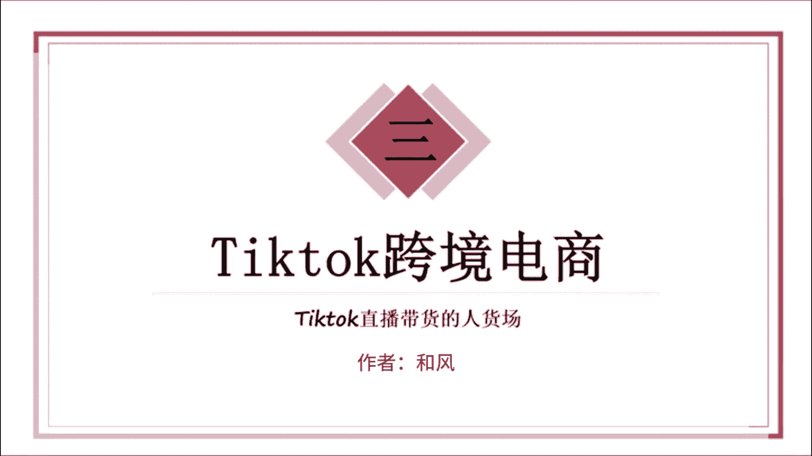
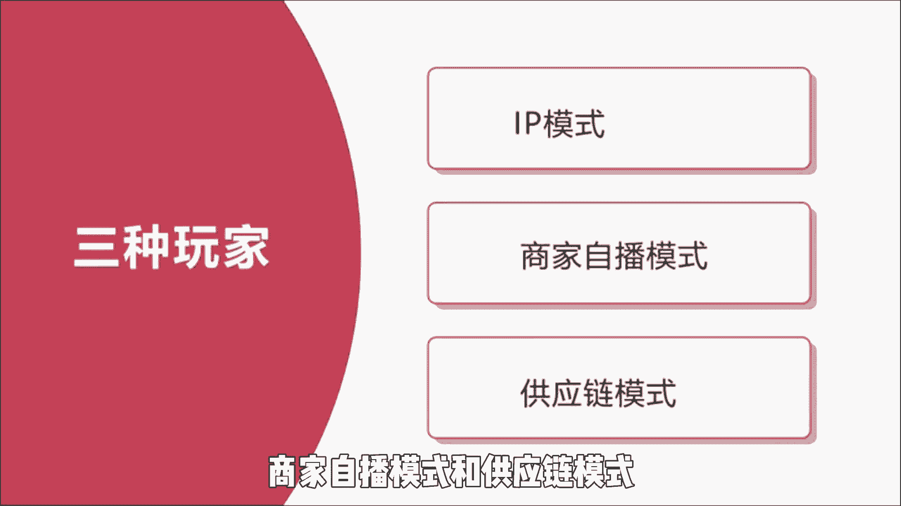
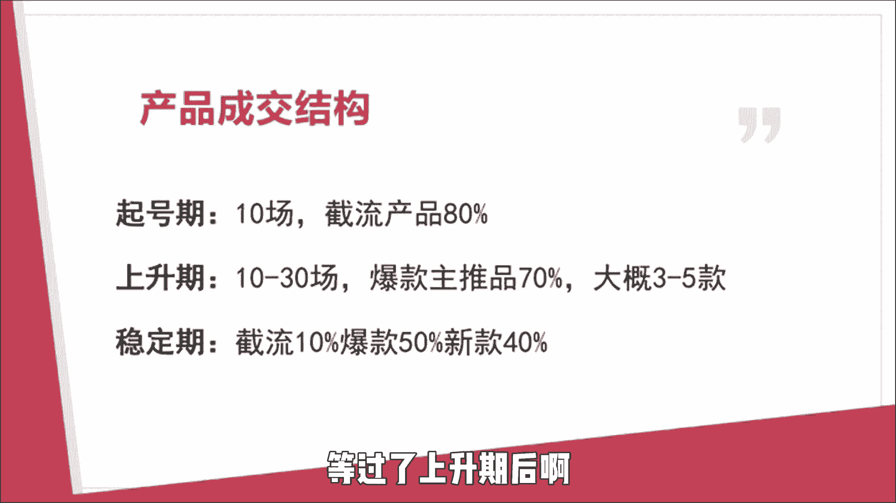

# 【2024最新TikTok运营教程】比付费还强十倍的自学Tiktok海外版抖音运营全套教程！tiktok体开店 起号真的快，赶快点赞收藏起来！ - P3：3、Tiktok跨境电商做货选品。 - 固特异好 - BV1yD421u7fN

不要来提个做客，如果你啥都不懂，你只会成为韭菜，在上个世视频中啊，我们介绍了TIKTOK直播啊，和国内的直播有什么不同，那么今天啊这个视频就给大家介绍一下，TIKTOK直播中的人货场，首先我们要了解。

在TIKTOK上面有三种不同类型的玩家，他们分别是IP模式，商家自播模式和供应链模式。

这点是和抖音类似的，第一种IP模式，IP模式啊，有点像李佳琦这一种，他们建立了自己的IP人设啊，然后根据粉丝对他的一个信任度啊，把商品通过直播的方式卖出去，第二个就是我们接触的比较多的。

是商家自播的一种模式，就是说我们自己卖什么就播什么，还有一种模式呢叫做供应链模式，你需要对接很多个KOCRKOL，你去接触他们，然后让达人去带货，这三种玩家对于TIKTOK这种直播来说啊。

IP模式是比较难做的一点，因为TIKTOK面向的是海外的用户，如果说你想要把人设这一方面打好的话，可能要找到当地的达人呢，或者说你自己去孵化一个外籍的达人，会比较合适。

因为他们自己人才会更加懂自己的文化，所以相对来说啊，我会更推荐大家去走第二种跟第三种模式，在我们前期直播的时候啊，最重要的就是准备一个节流产品，这个节流产品呢，能够在我们的TIKTOK直播时啊。

起到一个非常重要的引流作用，因为现在TIKTOK直播啊，有一个很重要的考核指标，就是你的成交密度，那什么是成交密度呢，成交密度啊，就是说你如果你在5分钟里面成交一单，和你在5分钟里面成交十单相比。

那成交密度肯定是后者大，后面的直播间啊数据更好，那平台啊就会把它推荐给更多的人，所以说啊现在这个成交密度啊，是搞TIKTOK直播啊重要考核的一个点，那么这一个节流产品它有什么要求呢。

怎样才能促进直播间的快速成交呢，首先你要确保你的节流产品和你的利润款呢，有一定的关联，不要搞那种完全没有关系的产品，其次啊这个节流产品的价格一定要低，给大家看到的是一个很明显的性价比。

让大家看到就想无脑冲不买就是吃亏，比如说我们搞了一个一升的大水瓶，最近呢在TIKTOK上面卖的很好，在别的直播间啊可能需要一个比较高的价格，但是啊在我们的直播间啊，只要花0。99英镑这样的价格啊。

大家看到后啊，基本上是可以去无脑进行成交的，还有就是超种草的爆款，就是你的产品呢可能要赋予一些颜值，或者说一些新奇特的一些方面，要具备兴趣电商的特质，最后一点就是大家会对一个东西啊，有一个共同的认知。

你这一个东西啊是一个标品，就比如说啊大家都知道一根普通的数据线啊，可能是五块钱以内就可以搞定的，但是你非得说它五块钱啊，已经是一个很大很大的折扣了，那这样一个大众对它的价格，已经有了普遍认知的东西啊。

你这么说啊，就是没人会相信你，所以说啊对于我们的一个节流产品啊，一定要认真的去选，就比如说那种日落灯，它本来的售价起码要到十几20几英镑的，然后你把它调成0。99啊，2。99这种东西。

它就是属于一个有共同认知的标品，而且是超低价格的一个成交价格，那些机构做过用户啊，看到他之后会觉得哇塞价格这么低还包邮，这么便宜的价格买到就是赚到，那么这就是一个很合格的节流产品。

在这里啊要和大家说一下，TIKTOK直播间的产品的成交结构是什么样的，首先啊在起号期的十场直播中啊，我们要主推我们的节流产品，节流产品呢可以占到80%左右，我们就天天推我们的节流产品。

把我们的直播间的流量啊先带起来，当我们的账号来到上升期时啊，大概就是10~30场直播的时候，你就可以开始去推爆款主推屏了，但这个时候的主推品呢也不要搞太多，3~5款就可以了，等过了上升期后啊。

账号来到了一个稳定期，这个时候我们就只做10%的节流产品，50%的一个爆款，然后啊我们可以加40%的一个新款进来，对TIKTOGO敢直播的，你可以关注回复啊，TIKTOK就可以拿到怎么注册小店等等。

一些流程都在这里面，不仅如此，包括说TIKTOK的app怎么下载，怎么发布作品，怎么完成开播，这些都是有给大家讲到，关于做货选品这一块，我还是要给大家一些建议，首先做小店。

大家都知道所有的电商平台都是从铺货开始的，无论是国内的某宝某音，几乎都是从铺货开始的，我们在TIKTOK直播上面也做了一些测试，我们发现啊小店的静默成交率是比较高的，有30%到50%左右。

也就是说就算我们一场直播下来，完完全全没有提到这个品，他的成就也有30%到50%，所以说啊现在国外的TIKTOK直播啊，是处于一个什么阶段呢，就是现在国外的人已经开始认同了。

这种直播购物的方式，他们觉得这种直播购物的体验感是很好的，对买到的产品呢也很满意，所以说我是建议大家尽快开店，尽快铺货，抢占先机，但是在铺货前啊，一定要计算好价格，不要让自己亏本了。

如果有不知道怎么去计算价格的，可以在评论区告诉我，我们在评论区一起探讨，那我们这期的分享就到这里了，关注我。

我们下期再见。