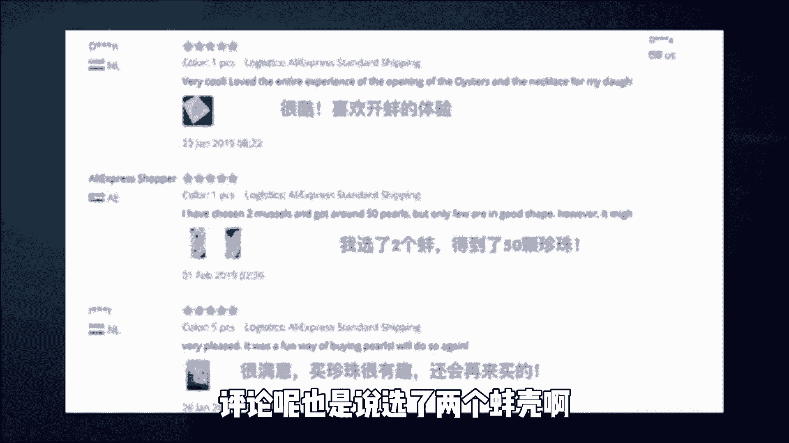
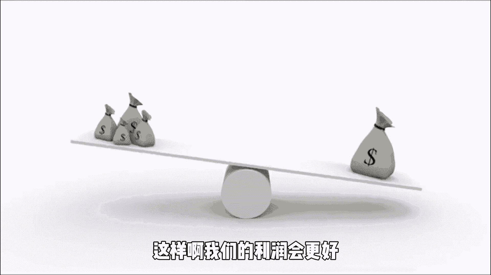
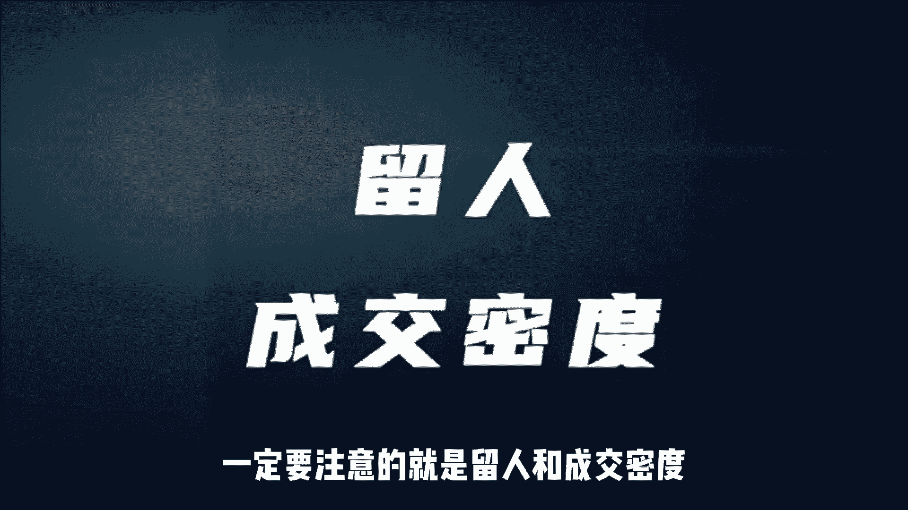
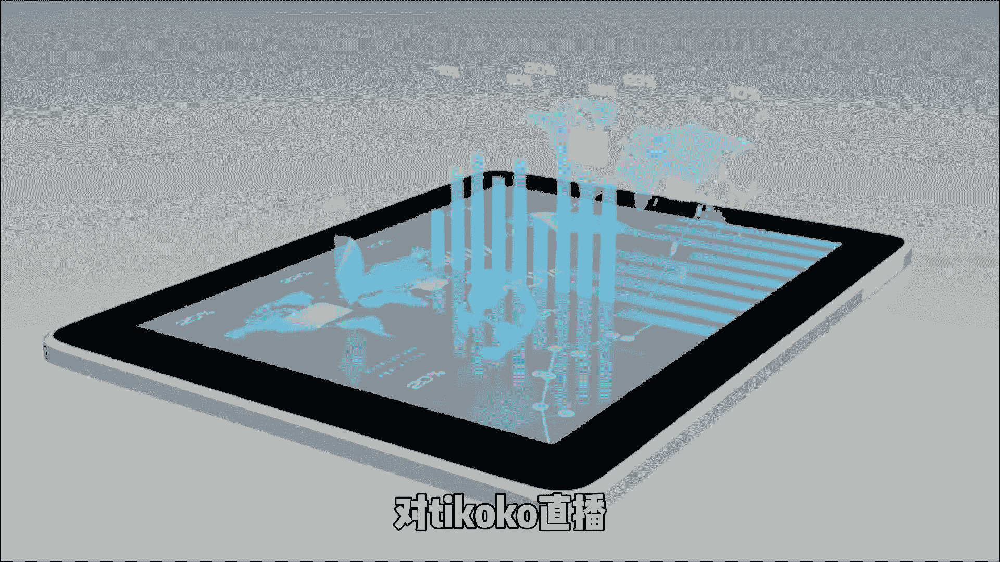

# 【2024最新TikTok运营教程】比付费还强十倍的自学Tiktok海外版抖音运营全套教程！tiktok体开店 起号真的快，赶快点赞收藏起来！ - P4：4、Tiktok跨境电商直播带货篇。 - 固特异好 - BV1yD421u7fN

最近都在说TIKTOK是个利好的风口，这确实没毛病，但是啊你不要来TIKTOK，如果你啥都不懂啊，你只会成为韭菜，在这里啊，建议第一次刷到我视频的朋友啊，去看一下我前期的视频。

这个视频我将给大家分享一下，TIKTOK直播里面的一些热门的玩法，这是一个卖水晶的直播间，那我们具体的看一下他的在线人数，可以看到啊，已经快12点了，但是啊还有1000多个人在看他的直播，这种直播间啊。

人气高的话可以达到1万多人在线，在TIKTOK直播水晶信任勺啊，这是一个非常非常热的一个类目，但是现在TIKTOK那边，已经关闭了水晶的申请通道了，所以现在基本上是很难有新入驻的，卖水晶的商家了。

平均我们一个卖水晶信任勺的直播间啊，GMV都有可能在3K到6K英镑，我给大家解释一下这个水晶信润勺啊，为什么能取得这么好的一个销量，首先在选品上啊，水晶就有点类似我们中国的一个玉石。

它是会给人带来好运的，寓意非常好，当然这个产品颜值也很高，所以啊在海外也非常非常的受欢迎，其次是他的这种直播形式啊，又非常的好，一大勺子就是扎堆蛙，会让人觉得一勺下去可以买太多的东西了，就会觉得很便宜。

然后他会通过一个跟评论区互动的形式，去问观众，说在不在，现在轮到了你之类的话，就是增加了和观众的一个互动，然后在价格上面啊，首单可以给到大家2。99的一个低单价，一半不到，而且还包邮。

不过现在基本上是不包邮了，他们当地其实是不太容易，就以这么便宜的价格去买到的，所以即便是现在在不包邮的情况，也会促成很多新用户的成交，所以啊他直播间的一个成交密度啊，也是比较大的，在之前啊。

TIKTOK上面还有一个比较热门的玩法，就是开放，这个的话日准呢也是在3K到6K英镑左右，那为啥说是之前的热门呢，那是因为后来这种直播遭到了举报，原因是你肯定想不到的，说是虐待动物这种开播方式被禁止啊。

所以现在不允许去用这样子的形式进行直播了，但是我们还是可以去分析一下，为什么这种直播形式啊能在TIKTOK上火起来，首先它在选品上相对水晶来说啊，体积更小，质量更轻，所以对于物流来说。

它其实就是一个非常好的一个商品，其次开蚌开出来的珍珠啊，它可以进行一个二次加工，做成手链吊坠，耳环等饰品的，来提高它的一个客单价，最后也就是一个说的惊喜与神秘感。

因为你不知道开蚌能开出多少颗珍珠，也不知道可以开出什么样子的珍珠，所以大家对这种未知的东西啊就会产生好奇，从而吸引大家留在直播间，来满足自己的一个好奇心，然后这里啊给大家截了两张图，大家可以看一下。

因为他们同时啊也是搞了这一个珍珠，开蚌的直播，评论呢也是说选了两个蚌壳啊。

得到了50颗的珍珠，非常的开心，其实大家之前在抖音上啊，应该也有看到过这种开包的这种直播间的，但是后面这种类型的直播啊都被限流了，但是我们可以去学习一下这种形式的直播方式。

你可以把你的产品换成是其他的产品对吧，另外还有一个比较热门一点的玩法，就是新春抽奖，我们可以用大转牌，骰子扑克牌等形式来增加直播抽奖的神秘感，吸引观众留在直播间，然后这种账号的GMV呀。

一天大概也是在1K到4K英镑左右，有很多观众啊还没有轮到自己的时候，就会停在直播间等待抽奖，因为直播间一般都是会抽五轮，五轮下来的话，在直播间能停留差不多五到10分钟，是没有啥问题的，等开奖之后啊。

会告诉你抽了什么奖品，然后再一个一个的打包好，这种过程呢其实是非常能够留住人的，我们做幸运抽奖的时候，可以把几种单品打包组合进行去卖，这样啊我们的利润会更好。

现在其实精准TIKTOK直播真的非常好，因为现在TIKTOK的直播生态还是非常的新。

很多玩法都不是很完善，把国内抖音直播的那一套拿到TIKTOK上面，还是能吃得开的，就比如说剥鸡蛋壳这种直播啊，直播间的人数也能破万，为啥这种直播能让那么多人观看呢，其实最关键的原因还是因为好奇新颖。

对于老外来说是非常新奇的玩意。

还包括一些直播刷安全带等，这些不都是我们你们国内抖音玩过的东西吗，就是一模一样的玩法，也可以拿到TIKTOK直播里面进行降维打击，但是我们做TIKTOK直播的时候，一定要注意的就是留和成交密度。

想要做好这两点，我们的节流产品呢就必须有很高的性价比，来吸引观众，想去成交，想要留人的话，就一定要做好直播间的氛围，保证我们的直播时长啊和直播质量，我们可以多去和观众交流互动，多去聊天，不能够一声不吭。

另外我们跟英国那边是有时差的，所以我们尽量选择在英国的黄金时间段去开播。

这样子我们的直播人气啊。

在线人数会多一点，下面的这三个时间段是推荐大家去播的，这一期的视频呢主要是给大家讲，TIKTOK直播的热门玩法，对TIKTOK直播。

那可以关注回复啊，TIKTOK就可以了，这里面还有怎么注册小店等等一系列的流程，包含了tik tok app怎么下载，怎么发布作品，怎么完成开播，这些都有给大家讲，到。

下一期给大家说一下TIKTOK上的短视频，带货和联盟营销，以及啊在做TIKTOK小店时啊容易踩的坑，那这期的分享就到这里了，关注我，每天增长一个新的认知。

