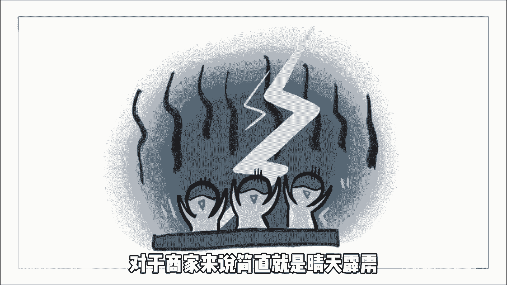

# 【2024最新TikTok运营教程】比付费还强十倍的自学Tiktok海外版抖音运营全套教程！tiktok体开店 起号真的快，赶快点赞收藏起来！ - P5：5、Tiktok跨境电商注意事项。 - 固特异好 - BV1yD421u7fN

我想这几天很多做TIKTOK，英国小店的朋友们呢应该都睡不着觉吧，现在这个局群里面全部都在讨论，自己的店铺为什么突然被封，而且这一次封小店啊，是大批量的封，还不会给你任何违规的提示。

这对于商家来说简直就是晴天霹雳。

要知道上个月才开放了，注册几万中国商家蜂拥而至，没想到还没过多久就被封杀，虽然啊具体封杀了多少店铺尚未可知，但是啊这次封杀的波及范围啊不可小觑，那究竟是什么原因才导致小店被封呢，有小道消息说啊。

这次大批量封号事件是，因为TIKTOK收到了品牌方的投诉。

TIKTOK小店里面有太多售卖山寨仿品的了，所以平台呢也是对这类店铺进行打压，这都是违反平台规则的，这次封杀带来的也不全然是坏处，至少可以肃清环境，也能让顾客走上正轨，那除此之外。

我们做TIKTOK小店，还有哪些不能触碰的高压线，具体情况啊，我也跟大家进行了一个汇总，第一官方禁止的内幕一定不要去售卖，具体有哪些品类啊，大家可以自己去查看商家大学，第二严禁售假，一定不要去啊。

触碰涉及侵权的产品，没有授权的IP啊，要选择没有IP风险的产品，第三一定要注意自己直播间的话术，不要用中文进行直播，也不能长时间不说话，更不能啊引流到其他平台，这种直播啊被抓了肯定是会封的。

第四上传商品时啊，要注意类目的选择，如果你的商品类目选择错误也是可能会被封的，第五现在直播间啊，最好不要再出现掷骰子的直播形式，可以换成大转盘之类的，是可以的，如果说你了解了这些之后。

还是想开一个TIKTOK小店的话，你可以关注我，回复啊，TIKTO口这里啊有完整的视频教程，怎么注册小店，怎么下载TikTok app啊，怎么发布作品，怎么完成开播等一些流程都有给大家讲到。

而且虽然说TIKTOK小店现在看起来形势，但其实啊还是有很多店铺播得热火朝天的，你想吗，这些天不是封了很多的店铺吗，是不是在直播带货的赛道上面，又少了很多的竞争对手。

兄弟们呐，抓紧机会，没有小店的赶紧去注册，有小店的赶紧去直播，我们今天的内容就分享到这里了，我们下期再见。

