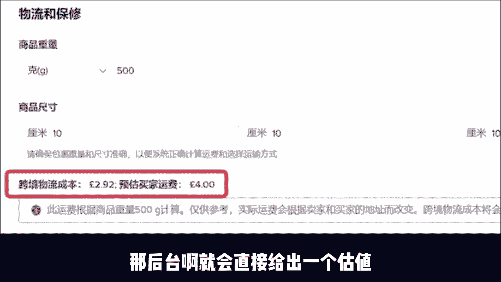
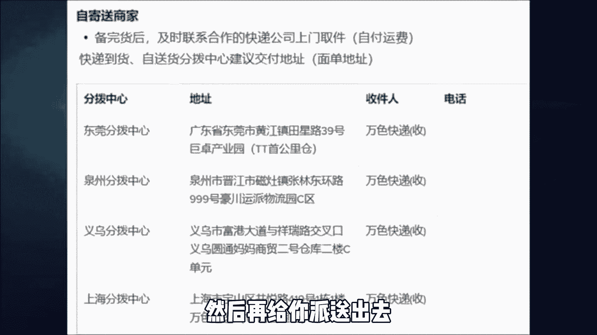
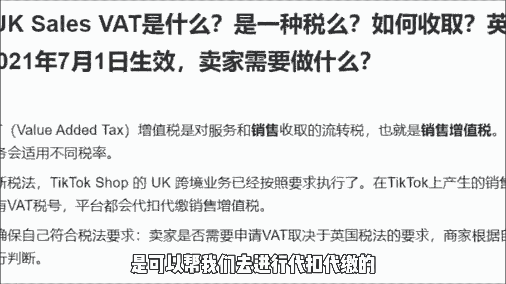

# 【2024最新TikTok运营教程】比付费还强十倍的自学Tiktok海外版抖音运营全套教程！tiktok体开店 起号真的快，赶快点赞收藏起来！ - P6：5、Tiktok跨境电商短视频带货篇。 - 漫画家秒 - BV1zJ4m1w7yj

很多人都在教你做TIKTOK，但是我劝你啊，别来TIKTOK，如果你啥都不懂啊，你一头扎进这一个韭菜聚集地啊，你只会成为韭菜，如果你本身是做跨境做短视频，做直播的那一类人群呢。

那你现在做TIKTOA是非常有优势的，甚至可以马上去做这一个TIKTOK小店，对别人来进行一种降维打击，但是如果你只是一个普通人，而且又不会说英语的这个情况下，那我建议你去通过短视频。

或者说是联盟营销的形式去带货，在前面的视频当中啊，我给大家介绍了一下TIKTOK直播带货的玩法，那么剩下的这一个短视带货和联盟营销，是怎么做的呢。

其实啊除了直播以外，短视频带货啊和联盟营销，现在在TIKTOK上面啊，也是很香的，不会英语的这一个情况下面去啊，你做这两个方向是蛮好的，不是非得死磕直播带货，在短视频带货这一块啊。

大家可以去低成本的测试。

因为像对直播而言，短视频带货的话，不仅可以去找很多很多的账号去做啊，而且没有传播时间的限制，你现在看到的视频呢可能都是在一周之前的，所以说你只要你视频的内容足够好啊。

这一个视频呢可能一直活跃在用户的视线中，不断的进行传播，另外它的成本会比较低，报单者后的成交量啊也是非常可观的，而且视频挂载购物车的这个功能呢，比去主页啊转化率要高很多。

所以啊也是建议大家可以从这方面入手，但是短视频带货跟直播带货来比的话，稳定性会差一点，但是啊他的矩阵操作会更容易一些，TIKTOK的短视频带货。

和国内的好物分享账号的逻辑啊是一样的，如果你没有做过跨境，或者说没有了解过TIKTOK小店啊，我是真心不建议你碰货，对TIKTOK直播，那可以关注回复啊，TIKTOK就可以了。

这里面还有怎么注册小店等等一系列的流程，包含了TikTok app怎么下载，怎么发布作品，怎么完成开播，这些啊都有给大家讲到，给大家说一下，为什么不建议你们碰货的原因呢。

也就是TIKTOK小店的常见的问题，免得大家上手的时候容易踩坑。

首先最需要注意的就是说跨国的物流的费用，那这个是怎么计算的呢，其实啊每个月啊TIKTOK的平台啊，都会给我们一个包邮的一个福利，但是他这个福利的门槛呢在慢慢提高，如果买家已经不是第一次下单的话。

订单金额要超过七英镑，运费才会有减免，所以说大家做TIKTOK小店的时候，一定要记算清楚，免得自己的店铺啊拿不到补贴，造成了更大的损失，其实我在这里啊，也是建议大家尽量不要设置包邮。

因为海外买家和我们国内买家的购物习惯了，其实是不一样的，他们是已经习惯了赴约运费的，所以说我们不是一定要给他们包邮，如果说你是想做包邮的话，其实以后啊很容易出现计算错误的原因呢，导致亏损。

像运费的这一部分补贴啊，不是给到小店卖家的。

而是补给买家的，那具体的运费该怎么定呢，其实啊，你可以在后台输入你的产品尺寸以及重量，那后台啊就会直接给出一个估值。

这个值啊跟我们最终的结果不会相差太大，如果你想计算的更加准确一点的话，那你可以套用下面这套公式，另外要跟大家说一下，就是平台啊，从3月26号开始又改了他的档次规则，所以说具体的还是自己要去看一下。

另外在物流方面，大家需要非常注意的是，我们做TIKTOK小店的话，他物流啊其实是非常友好的，就是很多地方都是可以手工领揽，收货代也是一样的，这也是给我们商家的一个福利吧。

但是你在的地方确实没有办法去进行揽收啊，那你可能要寄到他的分拨中心去，再给你派送出去。

讲了物流的费用之后啊，我给大家讲一下大家比较关心的结算问题，我们要怎怎样才能进行结算，账期要多久才能到，其实我们的小店结算了都是通过派银去结算的。

现在也只支持派安营，但是你一个派安营那可以绑定很多个小店，如果我们在一个无货源的情况下，从我们卖货到分拣到派送，但因为用户收到货之后啊，还有一个14天的退换政策，所以我们需要到14天之后啊。

款才会打到我们的太阳营中，这一套流程下来差不多就是一个月的时间，那税费该怎么缴纳呢，其实现在TIKTOK小店啊，是可以帮我们去进行代扣代缴的。

我们只需要填好信息就可以了，不需要啊去过多的操心这一个事情，以上就是我们今天分享的全部内容，关注我每天增长一个新的认知。

