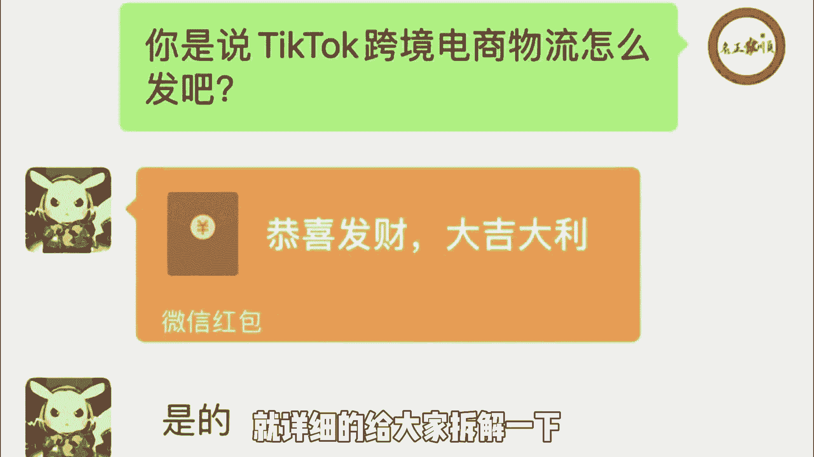
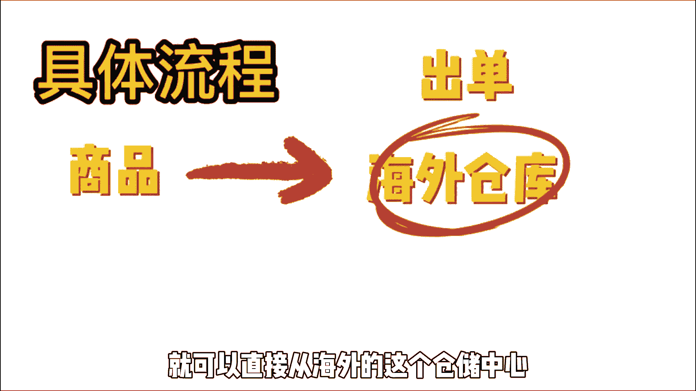
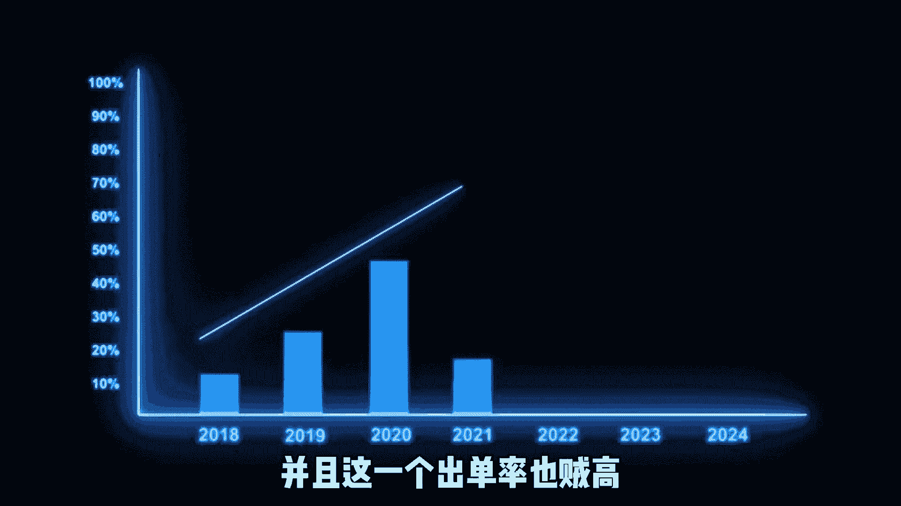
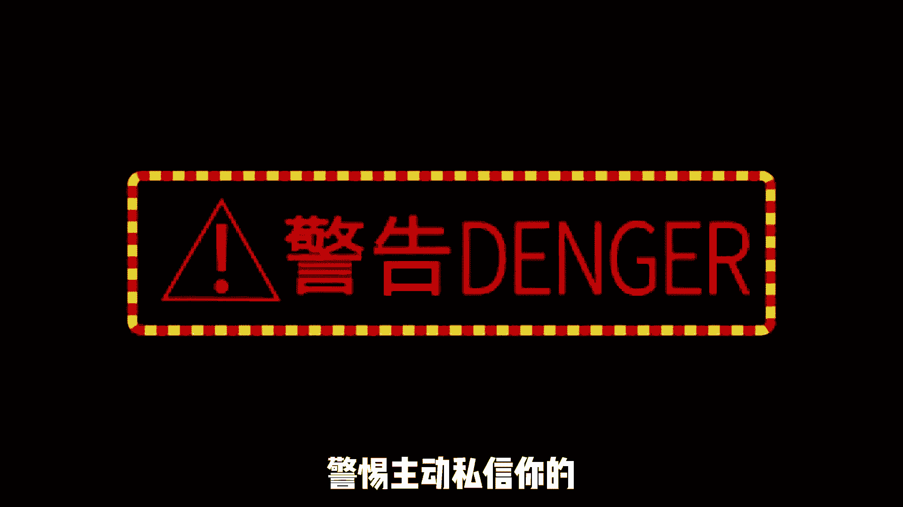

# 【2024最新TikTok运营教程】比付费还强十倍的自学Tiktok海外版抖音运营全套教程！tiktok体开店 起号真的快，赶快点赞收藏起来！ - P6：6、Tiktok跨境电商物流怎么解决。 - 固特异好 - BV1yD421u7fN

有个粉丝和我说，这个TIKTOK跨境电商的物流啊是怎么弄的，出单了要怎么发货，他想在这一个TIKTOK上面带货挣钱，今天这个视频呢就详细的给大家拆解一下。

这个TIKTOK跨境电商的物流啊，要怎么发，首先声明不是看在红包的面子上啊。

主要是看别人讲这一个国际物流啊，都藏着掖着，众所周知啊，我不是这种人，我要讲就给你们讲透了，这个视频呢很有可能会被举报下架，你们记得提前下载TIKTOK上，目前卖货的方式主要有两种。

第一种就是在你的这个TIKTOK小店上面卖货，出单，关于这一个TIKTOK小店出的单呢，一般呢都是会走这一个TIKTOK的官方物流，很多城市啊现在都可以上门揽收的，像上海杭州义乌，深圳东莞这些城市啊。

都是可以直接上门收件的，这个TIKTOK的官方物流呢，它有一个好处，就是啊每一单都会有一个补贴，这个具体要看用户的这一个下单金额，那第二种呢就是在独立站或者私日出单，独立站跟私域的出单呢又可以分为两种。

第一种是小包国内直发，那另一种呢叫做海外仓，这个国内小包直发就是所谓的货代公司，一般它的价格在几十到几百不等，像这种货代公司啊，大多数都是在深圳，你直接把这一个货寄到他们公司，他们拿到包裹之后啊。

直接给你发往这一个目的地，具体流程的话就是啊，先把这一个目的地的这个订单信息啊导出来，贴在这一个含有商品的这个包裹上面，此为发往目的地的商品和信息，然后把这一个包裹，通过国内的任意一个快递公司啊。

发往这一个货代公司，货代公司收到包裹之后，会直接帮你发到这一个目的地的国家，那第二种呢就是海外仓了，如果说你本身就是做跨境的大拿，或者说出单率贼高，那你可以考虑这种方式。

这个的话就需要我们先把商品送到海外的仓库，然后出单之后，就可以直接从海外的这一个仓储中心发货了。

发到用户的手里，物流方面比较便宜，但是这种方式呢我前面给大家说了，你必须是做跨境的大拿，并且这一个出单率也贼高。

那你就可以选这种海外仓的模式，这个需要你有一定的囤货基础，我是不太建议新人一上来就这么玩，资产比较重，玩不好啊，一朝回到解放前，还有两种特殊的情况呢，一种啊叫做云仓，云仓在全球都有它的物流体系。

你可以先把你的货放到他们那边，一单会多收你几毛钱或者几块钱，这样你就不需要再布置仓储了，哪里有单，他们就直接帮你配送到哪里，另外一种呢就是一件代发，就是说你现在没有货源，也不懂物流也没有什么关系。

你可以去找一些可以帮你一件代发的代发网站，可以直接把他们的这一个代发的货啊，挂在这一个TIKTOK上面，有人在TIKTOK上给你下单了，你直接在这一个代发网站上面拍单，填上这一个客户的订单信息。

他们会直接帮你把货发过去，当然这也是一种赚差价的方式啊，这个视频呢主要是给大家讲这一个TIKTOK，跨境电商物流方面的内容，想做这一个TIKTOK跨境电商啊，还是有很多东西都是你需要弄明白的。

我呢给大家整理了一份关于TIKTOK，跨境电商方面的资料，有需要的你们可以去我回放提个脱口，就可以获取，从这一个TIKTOK的下载，安装到这一个视频的剪辑发布，还有这一个TIKTOK小店的注册。

到这一个做货选品，以及啊直播都有哪一些玩法，都有给大家讲到，希望能对你有所帮助，如果大家对这一个TIKTOK跨境电商物流，还有什么疑问的话。

大家可以在这个评论区留言，对了提醒一句啊，警惕主动私信你的。

以及啊那一些个在我评论区调研的留言啊，上当受骗了，你们不要找我。

我不背这个锅，那好了，我们今天的内容啊就分享到这，关注我，每天增长一个新的认知，我们下个视频再见。