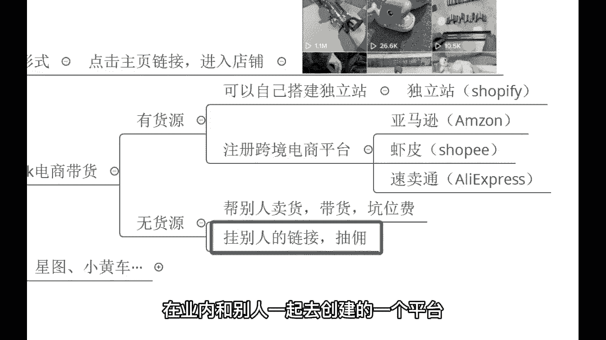
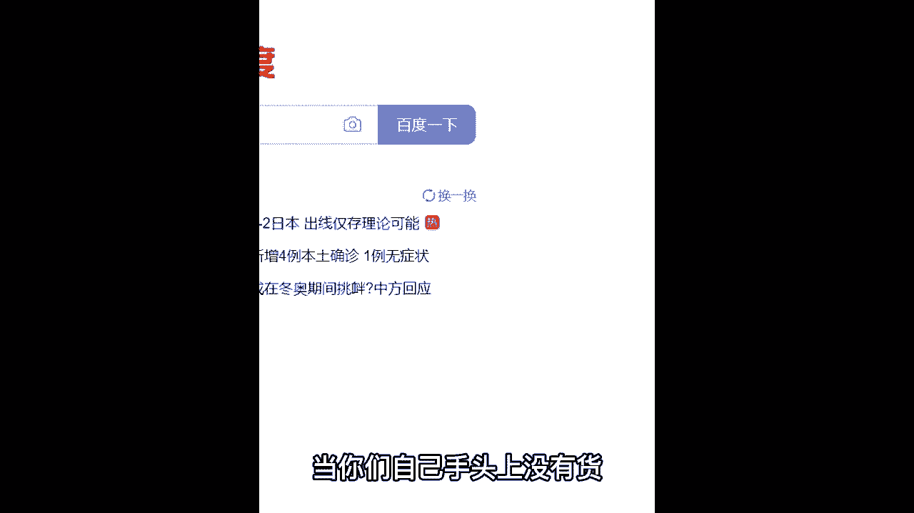
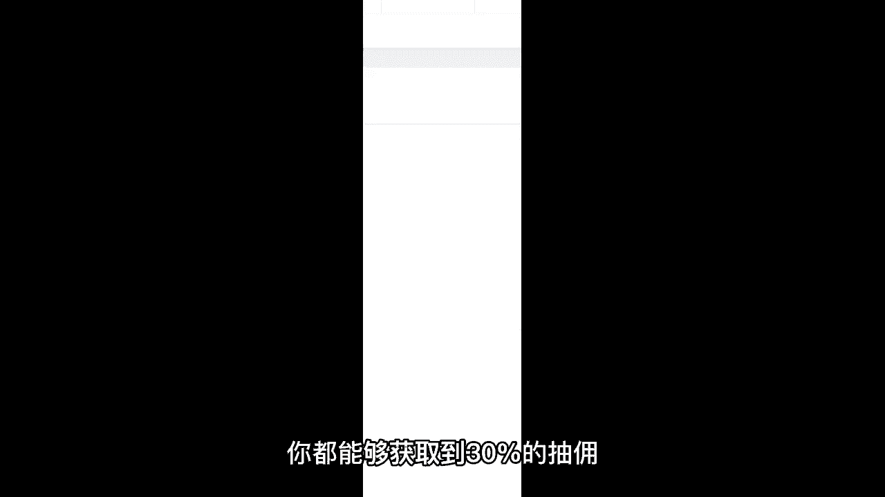
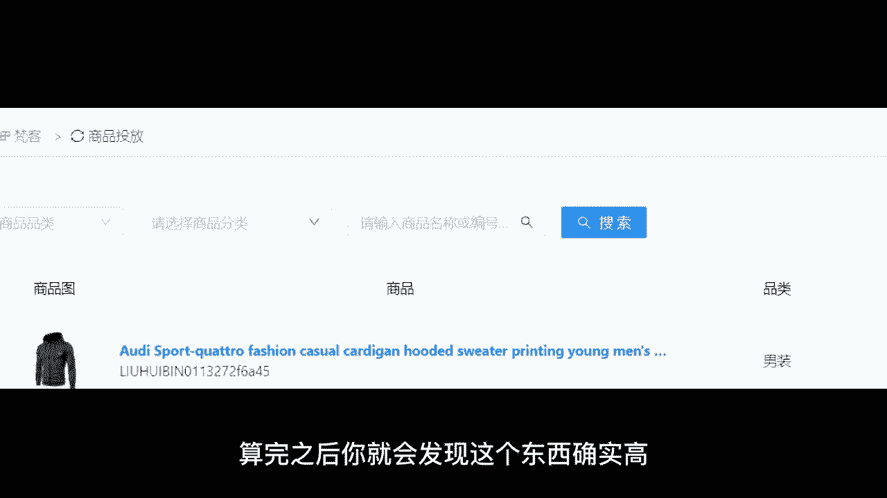
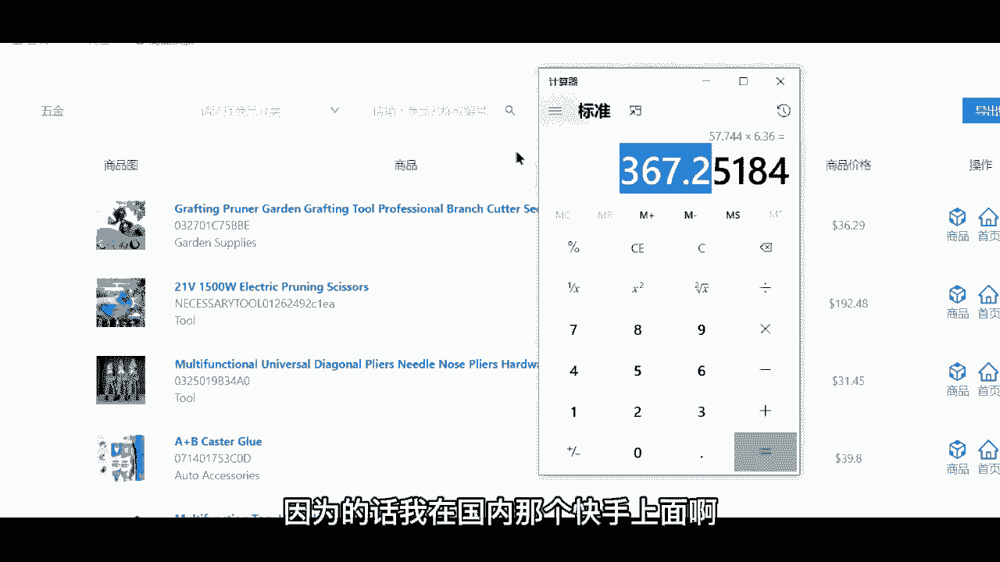
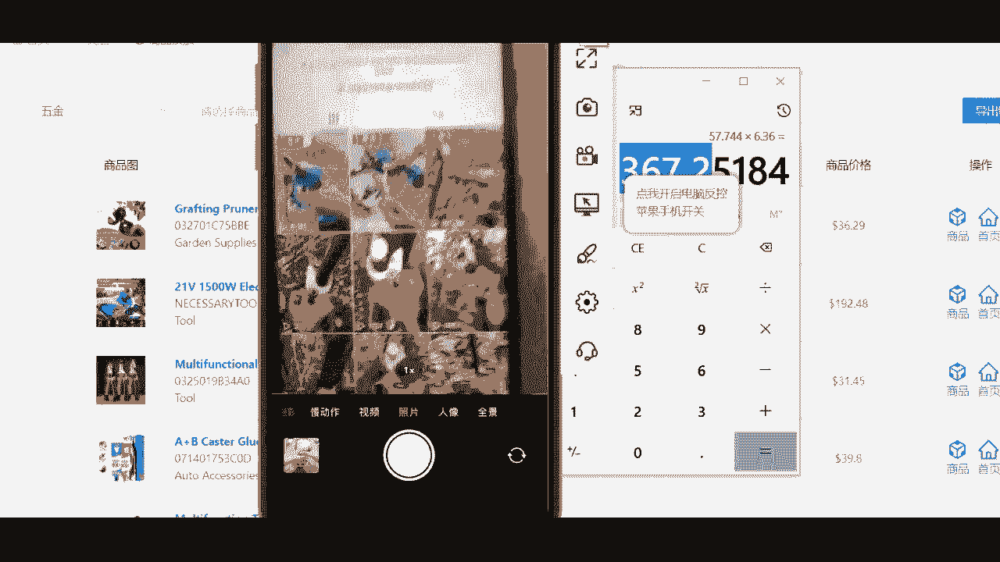
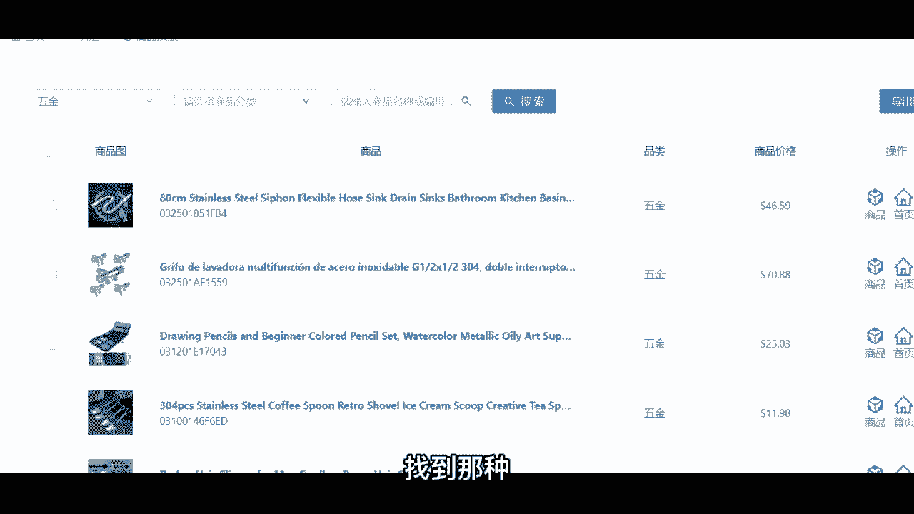
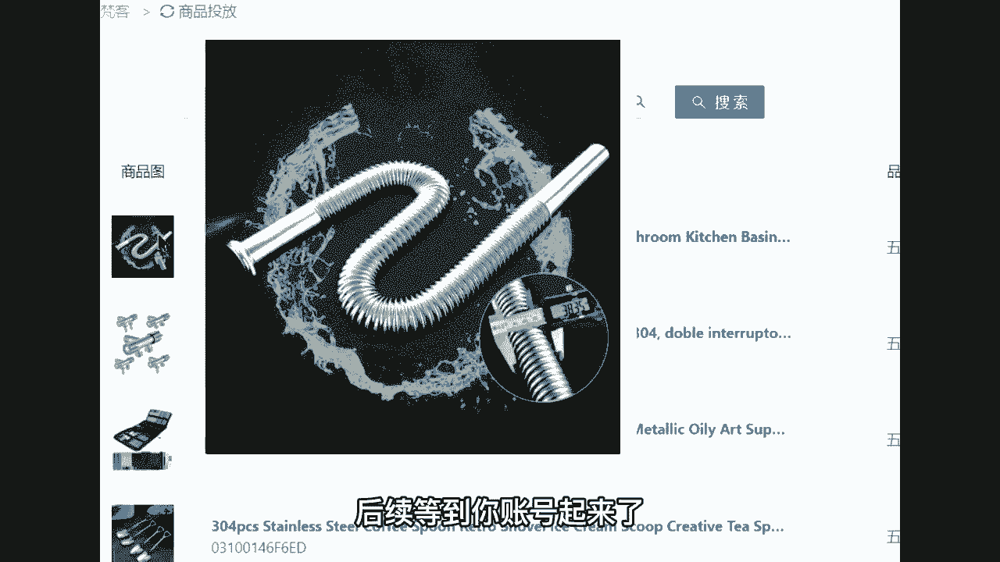

# 【2024最新】比付费还强十倍的自学Tiktok海外版抖音运营全套教程，别再走弯路了。从零基础入门到行业大佬，tiktok跨境电商注册／开店／运营／涨粉／带货 - P14：15、电商带货：无货源模式1 - 天天快乐丷 - BV1pi421R7s5

我给你讲一下那个没有货源的吧，没有货源也可以赚这么多钱，你不要说这个没有货源就不行啊，来没有货源的话呢，你可以帮别人去做到一个就是称之为带货啊，带货按照我刚刚的说法，就是叫做坑位费。

如果说你对自己的账号呢没有那么多自信，说收人家几10万，然后的话呢挂多少天，那你的话呢就单件商品一个一个去挂，去那种选品平台去挂别人的链接，知道吧，嗯挂到店铺引流，提高成交率，是的啊，是这个意思啊。

那像这个没有货源，你挂别人的链接，我给你们来去提供一个平台，这个平台的话呢是我们呃我自己的话呢，在业内和别人一起去创建的一个平台。

这个平台的话呢是一个选品的平台，当你们自己手头上没有货是吧。

你也不知道卖什么货的时候，你就可以通过老师，我这个平台来做到一个挂链接，你可以挂别人的链接啊，在这个平台里面呢，你都能够获取到30%的抽佣。

你能你想卖我的呀，卖我的也行啊，卖我的也行，30%的佣金很高了，各位30诶，我给你来算一下，算完之后你就会发现这个东西确实高。

具体怎么玩呢，首先我们先来看一下哈，这个的话是主页，我们看右侧，右侧的话呢有两个按钮，第一个商品，第二个首页先点第一个商品，点了之后链接复制成功，复制成功之后呢，就是这一件衣服的链接。

你把这个链接挂到你的主页下方，说明你在帮他卖这一个衣服，卖一件衣服，如果说你点后面的首页，那说明你在帮别人去卖整个店铺，里面的一个东西，如果说有用户点了这个店铺，并且在里面消费了1万块钱。

你就能赚到3000块钱的佣金，明白吧，那像这个光热门的就有3737条啊，而且的话呢像这种细分类很多，3C5斤儿童减肥茶是吧，各种各样都有嗯，而且的话呢这个大类里面还有小类，这个整合在一个资源整合了。

老师我好久好久哈，差不多一年的时间，有国内的商家，也有国外的商家都在这里面，你直接可以去做的一个选品，来，我给你算一下啊，到底这个佣金有多高，我们拿这个衣服来举例，43。99美金，乘以0。

3 30%的抽佣嘛，那就0。3等于多少，你帮人家卖一件衣服，你能赚13美金，13美金我们在国内发不出去，直接乘以啊，当下的汇率6。36，是不是转换成人民币将近多少，将近八十四块钱，各位83块九一件。

你帮人家卖一件衣服，你能赚83啊，各位各位啊，如果我们有10万的播放量，10万的播放量最终有200个人买，那200的话呢，转化率已经很低了哈，那我就算他是200，那我们直接乘以200。

我们卖了200件有多少，1万6786，这不比这个创作者基金更香吗，肯定会更好吧，更香是不是更赚钱是吧是吧，哎那这个风险呢有对比啊，那就是有伤害，那我们来对比一下国内，你们认为国内带货他们很赚钱吗。

看完之后你们就明白了，为什么现在带货的人越来越少了呀，大淘客联盟，这是国内抖音带货他们的选品库，给你们看一下销量榜，看一下人家的佣金，卖一个能赚多少钱，那个什么呃，呃这个招吧啊我这个一个直男啊。

我不知道这是啥啊，这是佣金62。94%，烟花三块五毛二，这个也是烟花三块五毛二啊，一个记记忆枕头11块七，还有那个什么水彩笔啊，多少2。28，还有这个儿童益生菌，五块五毛二，三块，二毛七，七块四，两块。

四毛八，27块六是吧，两块七毛七，目前我们看到的最高的佣金27块六，最低的两毛六分钱，你对比一下，你对比一下什么感觉，各位你在这上面30%的佣金，河南里30%天差地别啊，那我教你们哈。

尽量的话呢咱们去找那种单价比较高的，我呢也在卖这个我在卖五金领域的一个产品，五金领域有一个东西啊，单价非常高，我自己在卖自己的东西，其次我也在卖其他的一些产品，我也可以做带货呀。

我不一定不一定说非得自己有产品，我就不能做带货啊，不是的啊，我给你说一下，我在卖这个啊，这个不怕你们说啊，不怕你们跟着卖啊，这个就跟你们说了好吧，就这么一个玩意儿，我卖一个我能赚300多块钱的利润。

售后什么都不需要我做，我只需要去帮他推广就行了，和你们现在的情况一样，如果你没有产品，未来你帮别人去带货，你只需要只需要负责销售什么售后啊，物流啊，生产啊，和你们一毛钱关系都没有，你只要卖就行了啊。

来咱们的话呢，192乘以30%的佣金，57，你帮别人卖一个，你就能赚57美金，相当于人民币多少，相当于人民币是367块钱，你卖一个你就能够赚到367，眼见为实啊，这个直接的话给大家来看一下。

我这个账号直接给你们看一下那个账号，那个账号的话呢，我是在因为为什么会去卖这个呢，因为的话我在国内那个快手上面啊。

我找到了一大堆这个视频，找到了一大堆，然后我把他的作品全部做到了一个搬运，全部做到了一个搬运来，我看给你们看一下啊。

这个我把人家的视频全部搬运下来了，然后我的话就发到海外哦，操作的话呢还是按照我之前教你的啊，把这个链接挂到这里，然后呢直接的话经过又经过一个二次剪辑是吧，600万3620万啊，111个亿，知道吧。

这个百万上去之后的话，那就是一个亿啊，101。1m，这就是一个亿的播放量了，刺激不赚了100万，100多万啊，就这个带货赚了100多万好，那像这个呃除了带货能赚到一笔钱之外，我还是要给你们说一下哈。

你们可能忘记了创作者基金这个可以叠加的，你在带货的同时播放量上去了，创作者基金也能赚得到610万的播放量，再加上3620万的播放量，再加上一个亿，一个亿的话，那就是1万是吧，等于多少。

1亿4230万的播放量乘以6。36，1万播放六块三毛六，那有一个亿直接乘等于多少9万块钱，各位9万块钱，就光这个创作者基金这个字节跳动，公司人家就得要给我9万块钱，你可以看一下。

我全部的内容都是发的这个全部的内容，发的都是这个剪树枝的一个工具，现在流量的话呢，没有像以前那么这个给到我这么多，因为我内容的话呢没有说太多变动，全部都是这个产品，但是我赚到钱了呀。

啊我不管说这个账号未来如何，我赚到钱了呀是吧，行那哈，那像这个带货啊，也是希望大家能够说去找一些单价比较高的，这里还有非常的多啊，有十多页，你知道吧，像这种182美金的啊，找一些同款。

在国内找一下这种行李箱是吧，找一些这种工具箱啊，喊着或者说像这种水龙头转接头，哎呀你拍就行了，找到那种是吧。

相似的一个视频，然后做个做一个加工，后续等到你账号起来了。

起来之后的话呢，把这个把这个什么啊链接往上一挂啊。