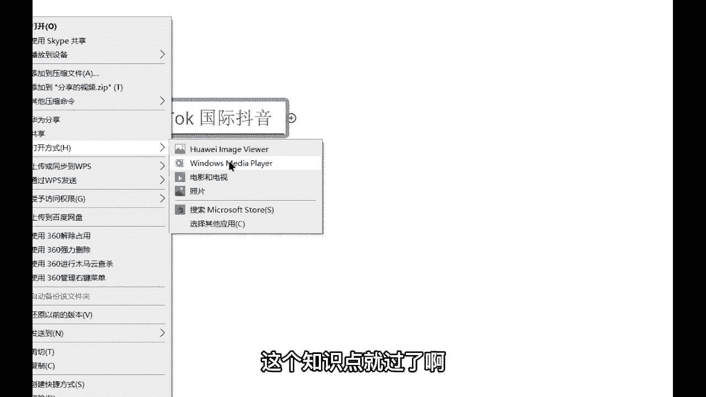
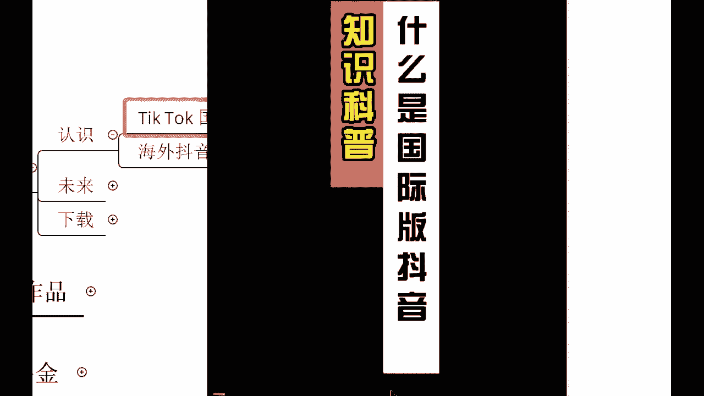
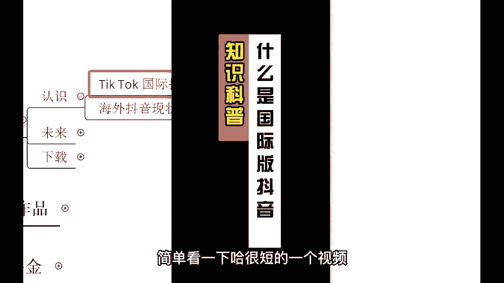
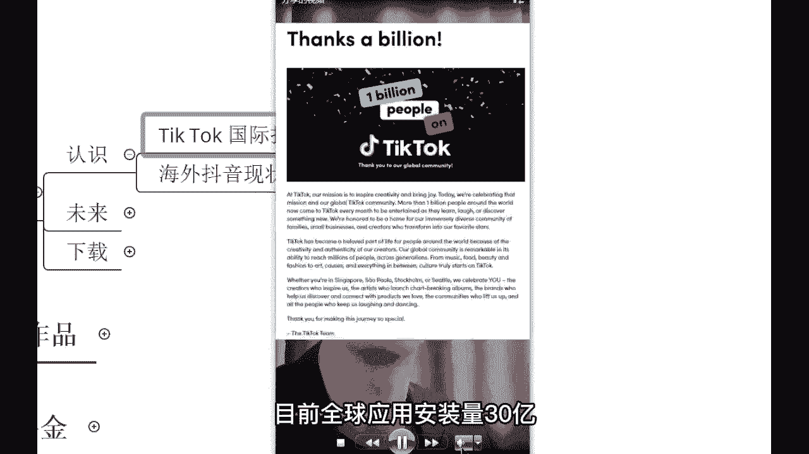
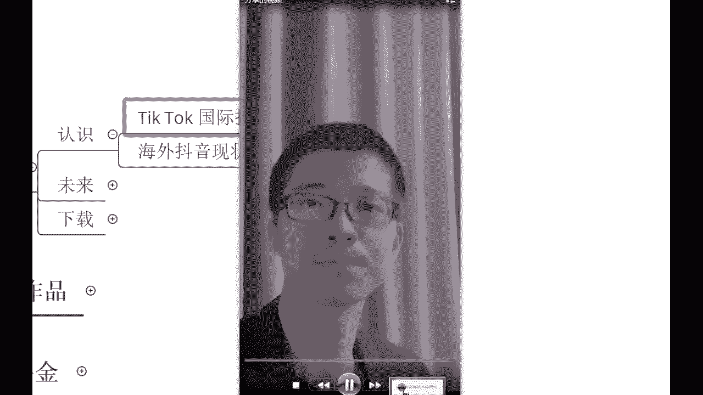
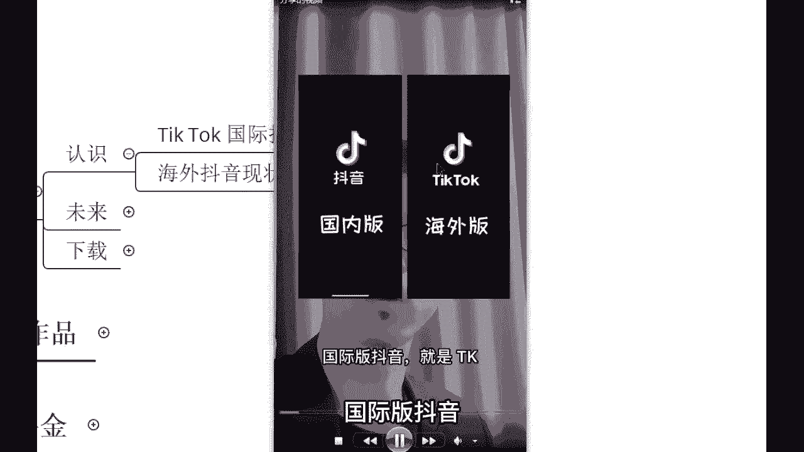
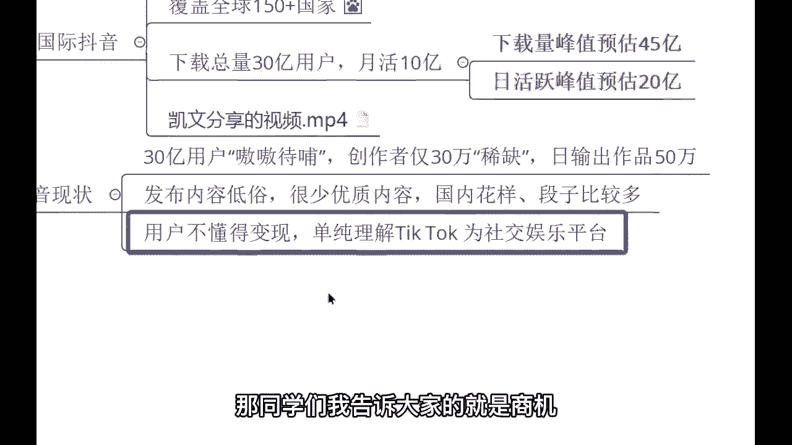

# 【2024最新】比付费还强十倍的自学Tiktok海外版抖音运营全套教程，别再走弯路了。从零基础入门到行业大佬，tiktok跨境电商注册／开店／运营／涨粉／带货 - P2：1认识tk - 天天快乐丷 - BV1pi421R7s5

首先咱们这么多零基础的同学，那我们就先来认识一下国际抖音，国际抖音你读一遍，你就会发现这个和我们国内的抖音啊，它很多相似之处也是抖音，那其实国际抖音他呢老板，他这家公司的老板叫做张一鸣。

和我们国内抖音的老板是同一个，而且的话呢人家的工资也是同一个，叫做字节跳动，那这个国际抖音，他面对的是咱们中国这一个国家，但是国际抖音他面对的是海外的用户，他不对咱们中国用户开放哈。

而且呢这个国际抖音啊，人家的发展会非常非常的好，来我们先看一个视频哈，我们看一个视频，这样的话，你应该会对国际抖音有一个简单的一个了解啊，看完之后呢，我再简单给大家介绍一下这个知识点就过了啊。

因为国际抖音没有什么很多要分享的。

来科普什么是国际抖音，简单看一下哈，很短的一个视频。

D版抖音，国际版抖音就是TIKTOK，说人话就是国内版抖音的海外版，所以也称为海外版抖音或国外版抖音，视频有点长，先点赞保存，它前身是美国一家音乐公司music，2017年被字节跳动收购。

2018年正式命名为TIKTOK，中国唯一一款走出国门。

受到外国人追捧的手机应用，目前全球应用安装量30亿。

月活用户10亿，已覆盖全球多达150个国家，涵盖75种语言，目前已长期占据全球免费应用榜榜首位置，所以不懂英文的你也照样可以运营好t talk，如此强大的应用，让我们普通人也可以通过视频带货，直播带货。

将产品销往全球任何国家，还可以将你的粉丝导流到你的，What's app，Line ins，Facebook youtube，建立起强大的全球私域网络，甚至还可以向全球传播中华文化，讲好中国故事。

展示中国制造。

我发现好多小伙伴还不了解国际版抖音。

国际版抖音嗯嗯好行，那像这个国际抖音的话，那我们就通过这么一个简短的视频啊，来认识一下好吧，再者我就讲三个点啊，三个点第一国际抖音，它目前的话呢是世界第一啊，刚刚也有同学说到了哈，这个什么世界啊。

世界了啊，他是什么世界呢，他是世界第一的一个下载量，同学们，国际抖音目前的话呢是全世界下载量最高的app，全世界哈，而且的话呢经过美国媒体调查，国际抖音的年访年度访问量是全球第一啊。

有同学说不知道怎么下载啊，这个不用着急，待会的话我会讲到啊，我们的话得要先了解一下这个平台好吧，那现在的时代不一样了，现在的时代是Z时代，时代呢它在不断的发生着这个变化。

同学们如果说让你现在去看以前的报纸，去了解一则新闻，你愿意吗，你会觉得非常繁琐，你会觉得这个东西我通过一个视频是吧，就能够了解的一清二楚，这也是为什么在我们国内像短视频平台，它能够说发展这么迅速的原因。

现在的时代变了，所以说外国人也是一样的哈，他们的话呢了解一则新闻，也是通过这样一个短视频来做了一个了解的，所以说这个国际抖音那一经出海，就受到了很多外国人的一个关注，也非常喜欢去玩这样的一个平台。

目前的话呢下载量是全球第一的哈，因为海外还没有一款短视频平台，这是唯一一款那种唯一一款啊，各位非常棒的哈，那再者的话呢国际抖音人家发展会更加好一些，目前的话已经是在全球150多个国家，来进行了一个推广。

对进行了一个推广，150多个国家哈，这个东西的话呢都是这个有真凭实据的啊，金融界抖音，海外版已覆盖150多个国家和地区，关注相关注相关概念股啊，这个后面的话就不用看了啊，看这句话是吧。

已经覆盖了150多个国家，同学们，这个流量这个市场它是非常非常的大的哈，目前的话呢，人家这个平台下载总量已经是超过了30亿，月活十个亿呃，他的一个预计啊，它的一个峰值预估，峰值下载量能够高达45亿。

咱们全球总人口也就才70多个亿是吧，他就占了一半多，是不是日活的峰值的话呢，预估能够达到20亿，现在的话呢还是在不断的去做那个推广平台，推广这样的一个平台啊，发展是特别特别的快的哈，非常迅猛。

那像这个国际抖音啊，我就不花太多时间的话去介绍，因为的话呢它数据都是真实的，你在哪都是能够看得到的啊，之前被打压过对的，反而没有打压住，哎现在的话呢反而成为了他的一个助力啊。

助燃剂很多在以前没有打压之前哈，很多人连这个国际抖音他是什么都不知道，结果一打压诶，引起了很多人的一个注意，知道吧，结果的话呢这个嗯特朗普政府把这个是吧，诉讼撤销了之后，后续的话呢。

越来越多的人关注到了这个国际抖音，反而成为了平台的助燃剂，现在的话呢特别火啊，好那我们来讲一下他现在的情况，目前的话呢这个平台30亿的用户，在这里嗷嗷待哺啊，嗷嗷待哺，各位，因为他的创作者他只有30万。

他每天呢只能说输出50万的作品，你想一下这50万的作品，他怎么能够满足这30亿的用户呢，是不是，所以说在后续的话呢，这里变现渠道有一个叫做创作者基金，哎这个的话呢是和这个创作者联系到一块的哈。

这个数据我们就先简简单的认识一下，后面会给大家讲到创作者基金，目前的话呢这50万的作品，人家发布的内容很低俗，你看不到任何的一些亮点，而且的话呢很少优质内容，你会发现等到你们下载好了，你们去玩。

你就会发现，曾经我们在国内玩的很好的一些段子啊，呃这个很火的段子梗，或者说一些花样诶，我们已经玩了快一两年了，已经玩烂了，现在才在海外才火起来，这就是信息差呀，各位啊，他们觉得很有趣。

殊不知我们早就玩腻了啊，而且的话呢现如今的一个国际抖音用户啊，国际抖音的创作者，他不知道如何通过这个平台来进行一个变现，单纯理解为这个平台是社交娱乐平台，这就和我们18年的时候是一模一样的。

18年的我们也是一样的，知道吗，18年的时候，我们的话呢玩这个国内抖音不也是很单纯吗，没有想到任何一个变现的一个玩法是吧，哎国内抖音赚钱啊什么的都很少，很少的人去做，是不是，那同学们。

我告诉大家的就是商机。

