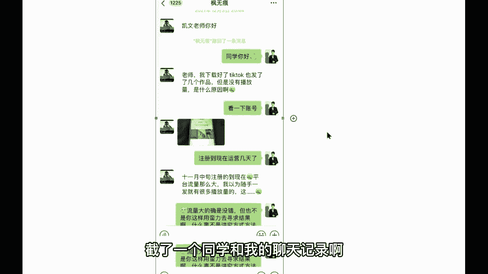
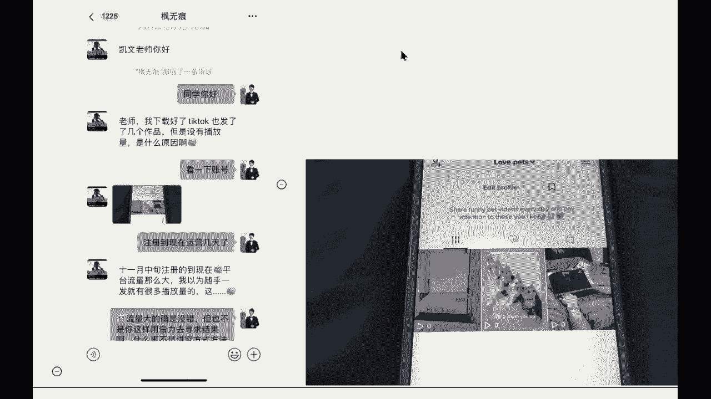
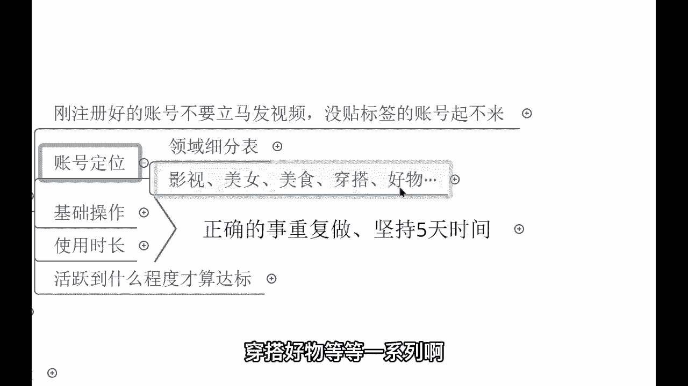
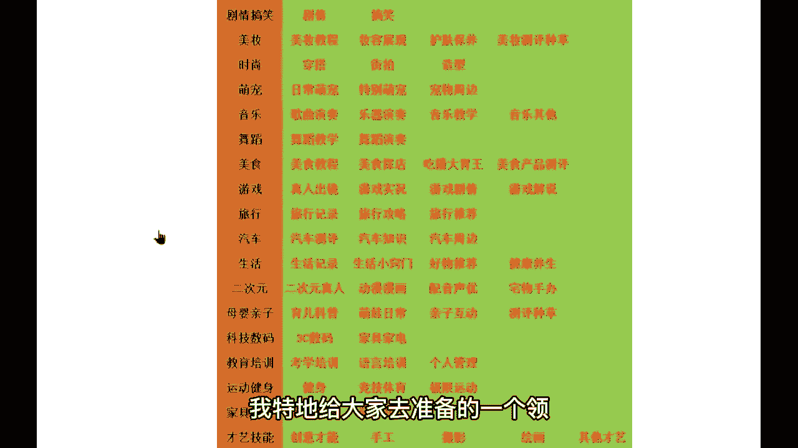
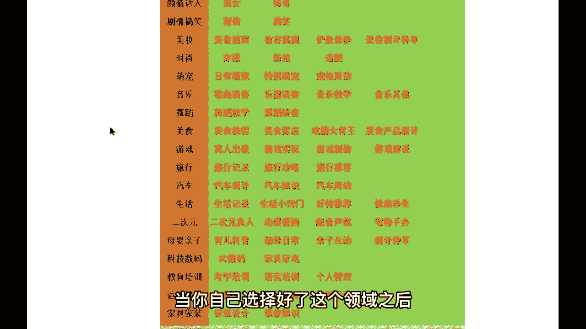
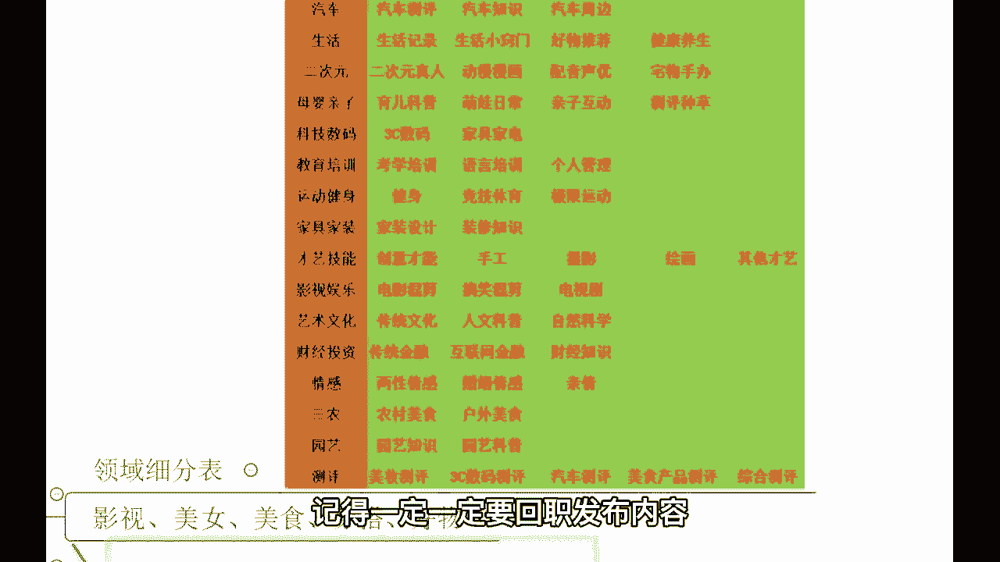
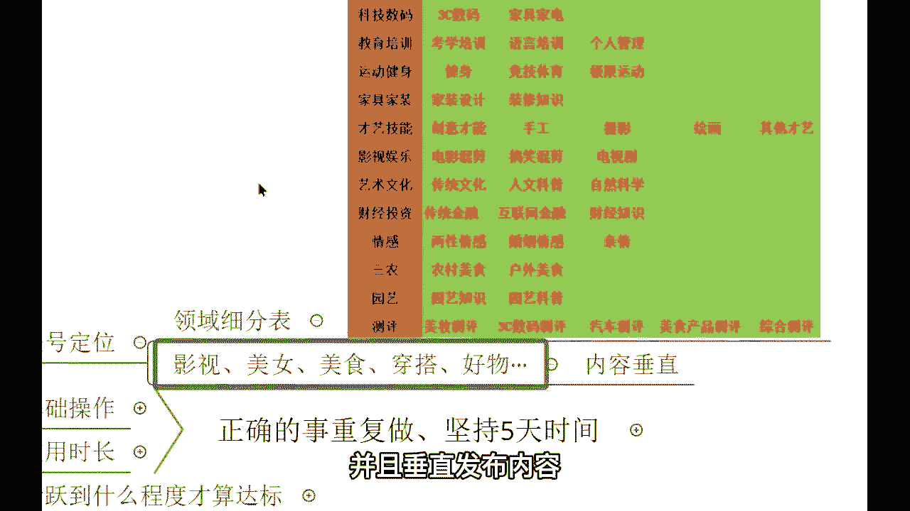
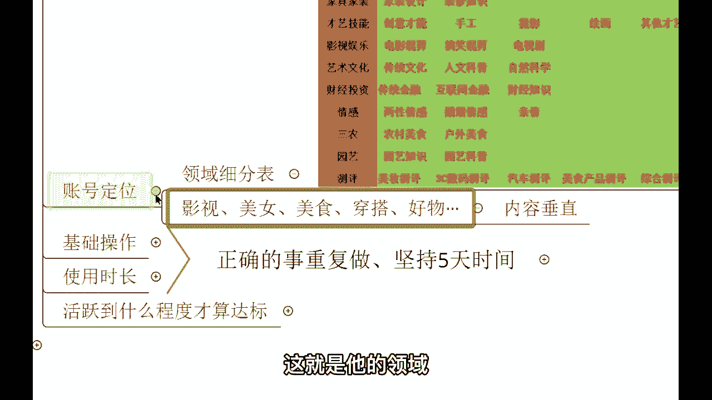
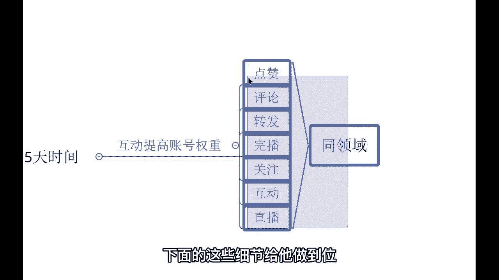

# 【2024最新】比付费还强十倍的自学Tiktok海外版抖音运营全套教程，别再走弯路了。从零基础入门到行业大佬，tiktok跨境电商注册／开店／运营／涨粉／带货 - P5：5、给账号贴标签2 - 天天快乐丷 - BV1pi421R7s5

接下来我教你们，如何快速的给自己的账号贴标签，快速的冷启动，因为的话呢发布作品啊，肯定得要做一些前期的铺垫，你不能够说立马的去发作品，这样的话会影响你自己的账号的哈，有收获吗，有收获吧，第一个板块来。

我让你们更有收获啊，贴标签贴标签来，你们刚注册好的账号，不要立马发视频，没贴标签的账号，他是起不来的，呃，我特地的话呢截了一个同学和我的聊天记录啊。

特地截了一个同学和我的聊天记录呢，给你们来展示一下，这个同学的话，那就是他下载好了，国际抖音也发了作品，但是没有播放量，什么原因，我说看一下账号，然后他是半个月了哈，发布的作品半个月了都没有播放量。

都是零，都是零，他这个作品呢是搬运的，作品是搬运的，我呢总结下来就两个两个问题啊，这个对他的一个情况总结下来两个原因，第一是他的手机没有调试好，第二是因为他的作品不行，所以说导致零播放，他以为随便发哎。

平台流量大的确是没错，他的话呢用蛮力去寻求这样的一个结果，结果的话那就是三个零啊，一个播放量平台都不给他，这就是操作失误啊，各位，那接下来我教大家如何正确的去玩好，这个国际抖音。

首先我们要做一个账号的定位，各位账号的定位，这个账号的定位呢，哦我们在业内我们称之为领域，领域这个领域呢有影视美女，美食穿搭好物等等一系列啊。

来我给你们来看一下，这个是老师，我特地给大家准备的一个领域细分表。

在这上面的话呢，你可以任意选择一个领域，长期稳定的做下去，最终你都能够进行一个变现，最终都能够赚到钱，颜值搞笑美妆时尚萌宠，音乐舞蹈，美食游戏，你可以任选，那如果说你这个呃不知道做什么领域。

那你可以把自己的兴趣爱好给他放大，你可以做搬运吗，当你自己选择好了这个领域之后。

记记得哈，记得一定一定要垂直发布内容。

危机发布内容，你不能够说我今天心情好，我发一个美食，明天我心情不好，我发一个穿搭，哎，后天我发一个好物推荐不行，你不能够说把国内啊，国内抖音的那一套用到这个国际抖音上面。

很多同学的话呢就把这个抖音当成朋友圈去发，我告诉你，你以前的话呢是一名是吧，这个你以前可能是啊没有这样的一个概念，你随随随便便的去发这个视频，这个无所谓了啊，现在你想要在国际抖音上赚到钱。

你就得要确定领域，并且垂直发布内容。

比如你今天你发布了美食作品，你未来你都得要发美食的作品，不能够偏离美食，就这个意思，这个就好比啊总结起来就一句话，好比我们在读大学的时候选专业一样的道理，读大学咱们的话呢都是一人一个专业走到。

是不是做账号也是一样，选好了领域之后一条道走到底，哎这就是领域明白了吧，你想想你回想一下，你在国内，你关注的那些大V，百万级别的粉丝，有哪一个不是垂直发布内容的，就连央视新闻，人家都是垂直发布内容。

人家的话那都是什么发布新闻，你看他哪天会发美食，他哪天的话会去发布什么其他的东西，不会吧，人家发布的都是新闻，这就是他的领域啊。

就这个意思好，那这个是第一步啊，你们要做的，紧接着，我们要去快速的把自己的账号给他活跃起来，首先基础操作你们一天打开app的次数，打第三次要在三次以上啊，没有时间限制，早上中午晚上都行。

紧接着你们在玩的时候，每天不读不得低于30分钟，每天不能低于30分钟哈，并且在你们玩的过程当中，要关注同领域的账号，比如你这个账号，你未来想要去做这个美食领域，那你呢在这个玩的过程当中。

去关注同领域的账号，坚持五天的时间，五天这个五天的时间都得重复的去做啊，并且这五天的时间之内。

