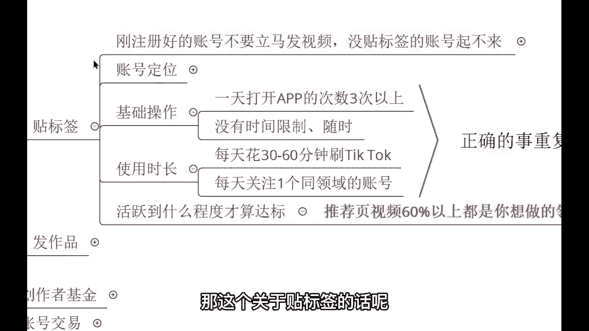

# 【2024最新】比付费还强十倍的自学Tiktok海外版抖音运营全套教程，别再走弯路了。从零基础入门到行业大佬，tiktok跨境电商注册／开店／运营／涨粉／带货 - P6：6、贴标签账号成果示例 - 天天快乐丷 - BV1pi421R7s5

那这个关于贴标签的话。

我要给你们看一下，这个真正实际的结果怎么样啊，这个是我做搬运的，来我给你们来看一下，这个是我做的一个搬运视频，我把国内抖音的视频搬运到了海外，如果说这个声音大了哈，你们可以说我可以调小一些啊。

如果声音大的话，我可以调小一些，来同学们可以看到这个视频的话呢，我是从国内抖音搬到了海外抖音，他呢发生了一些变化，3万8的点赞，我发到海外170万的点赞，各位翻了多少倍，3万8到170万啊。

那这个估计啊，原视频的作者要是看到了会气死哈哈是吧，人家的话呢发个作品才3万多的点赞啊，我一发100多万的点赞，来我们看一下这两个视频有哪里不同啊，我们先看国内的。

Lego one two three four，我拜我拜我拜拜拜拜拜拜拜拜，我不多BB，我爸让他嗯行，那这个视频的话，那就简单看完了，它非常简短，而且的话呢国内的人诶，他会觉得这个视频没有什么亮点。

所以说这个点赞量的话，顶多也就在几万点赞就封顶了，但是的话呢我经过调查，我知道外国人他喜欢什么，他的一个审美，他的一个兴趣爱好，经过调查的话呢，发现外国人对于这种宠物诶非常非常的喜欢啊。

宠物它们花在宠物身上的钱，比花在男人身上的钱还更多，所以说对于这种视频的话呢，外国人是非常喜欢的，那我直接的话呢做到一个二次剪辑，二次剪辑之后来，我们看一下这个视频有哪里不同，和她的美丽啊。

好视频没有没有了啊，看完了就这么简单，那同学们可以可能会发现啊，这个视频没有什么太大的区别是吧，我告诉你，我把这个视频做到了一个二次剪辑，也就是接下来我们会讲到的一个，发作品的一个知识点啊。

发作品的一个知识点，那我经过二次剪辑之后，把国内的视频发到海外，34。1M的播放量，来考考你们有没有认真的听讲，有没有认真的把这个之前的内容来做到一个啊，理解来，我考考你们这是多少播放量。

这是我发布的第一个作品，这是我发布的第一个作品来，你告诉我34。1M是多少播放量，来打到公屏上，我看一下有多少同学能回答对啊，340万，3万4，还有呢，他同学你是什么看法，34万，340万，3400万。

340万，341万，3400万，3亿3400万啊，三四百万啊，你这个三四百万啊，涵盖了好多啊，啊340万好行哈，这个也看到了很多同学很多同学的一个答案哈，这个很多同学的一个答案，这样啊。

我们来先恭喜一下这些打340万的同学哈，恭喜你们回答错误啊，回答错误啊，老师我提一下啊，这个呃开个玩笑啊，这个340万的同学，你们确实是回答错误了哈，哎确实回答错误了，刚刚说什么那个几亿的来着。

刚刚有同学说33亿啊，你这个3亿太夸张了哈，我跟你们讲啊，这个正确的答案，正确的答案，正确的答案是3400万，各位3400万，这个是正确的答案，好吧，来咱们再次恭喜一下，这些打3400万的同学啊。

好像这个M是百万，对你们理解的没有错啊，理解的没有错，M是百万，那如果我有em，那就是100万，是不是，那这就是100万，如果说哎我有10M，那这不就是上升到另外一个阶层了吗。

史莱姆不就是等于1000万了吗，是不是，这就是另外一个阶层了，所以呢相对一个34。1，那你倒推一下，那不就是3400万的播放量吗，是不是对，就这个哈，所以说我这个考考你们哈。

未来的话呢我相信有了这么一段经历，你后续你自己发作品有多少播放量，你心里应该会有数，你会时时刻刻想到现在的一幅场景，好吧行的话，到时候的话那你自己就明白了，你看这个贴好了标签之后，第一个作品暴力不。

第一个作品就是3000多万的播放量。