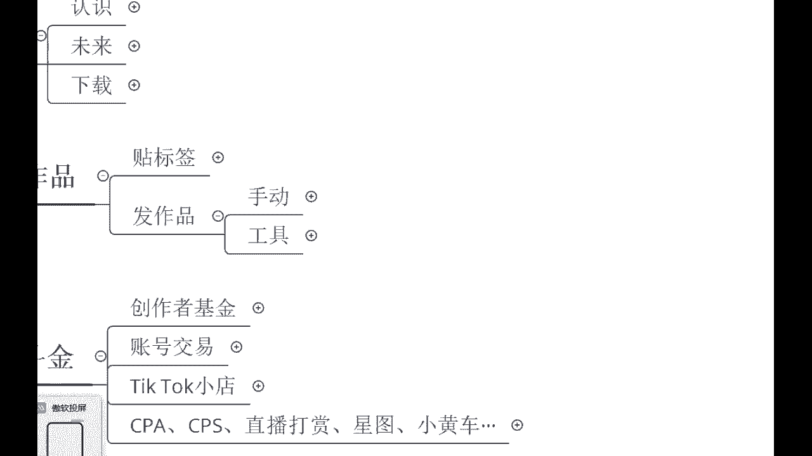
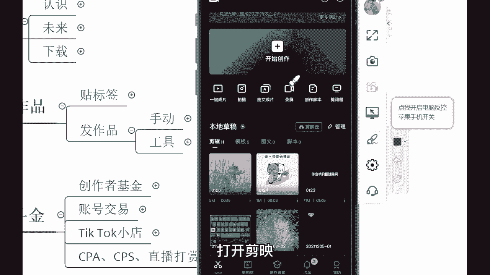
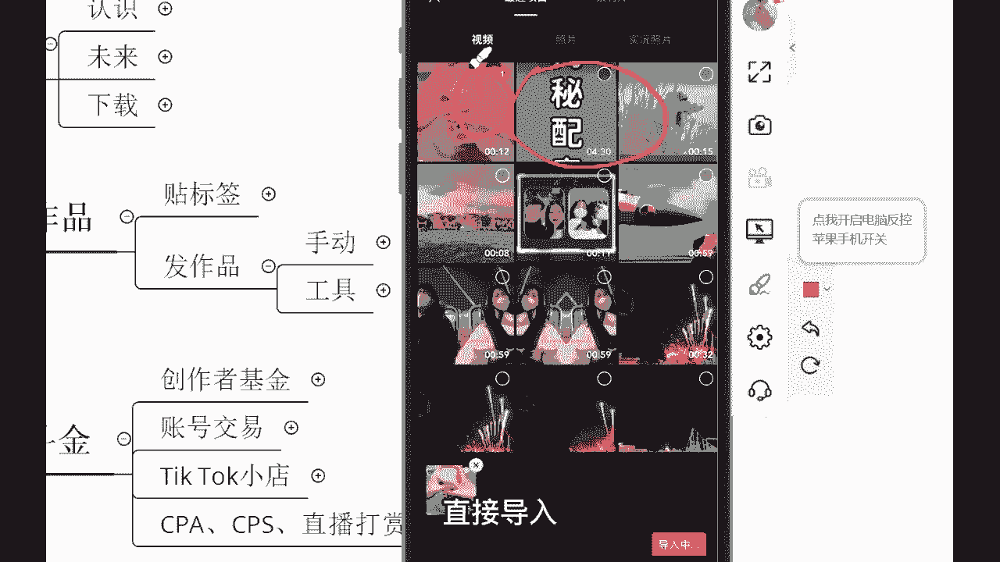
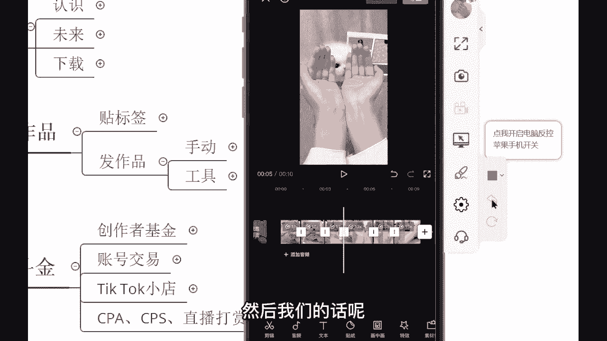
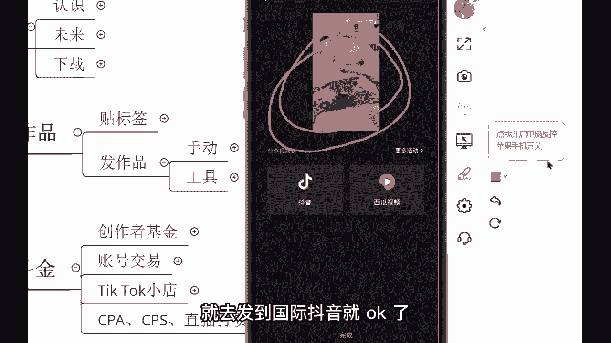
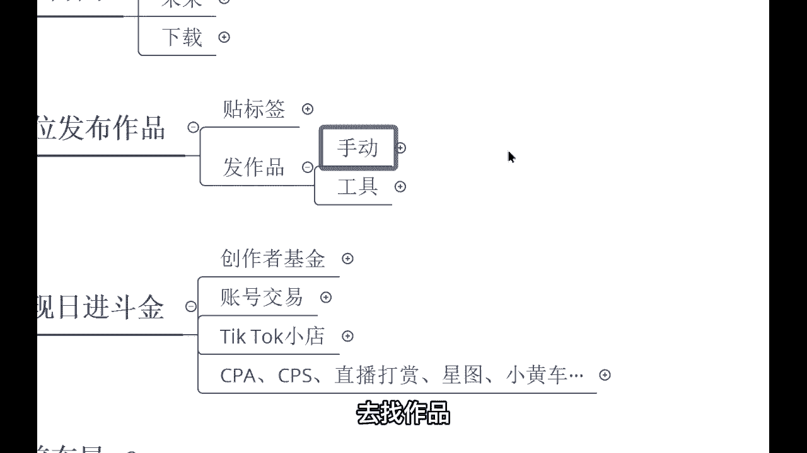

# 【2024最新】比付费还强十倍的自学Tiktok海外版抖音运营全套教程，别再走弯路了。从零基础入门到行业大佬，tiktok跨境电商注册／开店／运营／涨粉／带货 - P8：8、手动搬运作品教程2 - 天天快乐丷 - BV1pi421R7s5

有同学的话，那就是直接的话把这个视频诶，往这个国际抖音上抖上去了哈，直接发射不行的，我告诉你，这样的话你的视频很难过审核明白吗。

视频很难过审核剪映你们都知道吧，打开剪映。

你们手机里面的剪映，然后呢这里开始创作，打开开始创作，然后把这个视频导入进去，直接导入导入之后。

那接下来我们的话呢，就要开始进行一个操作了啊，那进行操作的话呢，首先我们先去把这个视频的哎大小啊，需要去做了一个调试，为什么要去做这个二次剪辑呢，它的缘由啊给你们讲清楚，首先他的一个视频。

他在互联网上有一个东西叫做MD5值，MD5值就相当于这个视频的身份证，如果说你直接的话呢，把人家的视频搬运下来，直接发，就相当于相当于你在用人家的身份证去发视频，不行，所以呢我们得要去修改MD5值啊。

把这个东西修改好了之后，来把这个视频做到一个剪辑，做到一个处理，把这个东西变成互联网上独一无二的视频，把这个MD5值修改了之后，我们再去发布就没有问题，而且不会受到受到这个流量啊，播放量的一个影响。

反而的话呢还可能会更高明白吧，所以说我们得要去做到一个剪辑，不能直接发，首先我们的话呢先去调整它的一个大小，把它变得和原视频不一样，两只手指诶对着屏幕放大放小啊，都是可以的。

来我这个放大给大家来放大一点点啊，不需要破坏这个视频原有的美感，放大一丢丢就行了哈，然后紧接着我把整段啊，把整个整个视频的这个滤镜啊给他调一下滤镜，把这个滤镜的话呢变成一个气色啊，调一下哎，现在更亮了。

是不是看到没有看到吗，气色啊，现在的话那就更亮了，哎这个的话呢微妙的一些操作，我们的调一调，是不是，你看现在的话就没有什么太大的一个变化，那紧接着我们还要去做一个镜像处理，哎镜像处理。

这是做二次剪辑最简单的一个操作了哈，镜像处理跑哪去了啊，等一下啊，编辑哦，这里点击编辑，点击镜像诶，现在的话呢就是左手换右手，右手换左手了，你看一下是吧，哎刚刚的话是右手现在变左手了。

但是的话呢也不会影响这个视频，是不是不会影响视频，同样的话呢是去看，所以我让你们不要去用那种有对白的呀是吧，两个人对话的呀，尽量的话呢就不说话，就看视频内容，看视频就OK了啊，好做完镜像之后。

你们有没有做登记啊，第一个视频的大小调整视频缩放，这第一第二滤镜，第三镜像，然后呢紧接着第四分段分段来，我们的话呢把这个视频来分一下，分一下段啊，嗯12秒的视频我们分三段三段啊，分割分割啊，分了三段。

分了三段之后的话呢，我们要进行调速啊，这是第五个步骤了哈，第五个步骤调速，变速常规变速不要调太多啊，调个一点一，这个的话呢调个1。2，然后的话呢后面这一个调个1。3，1。3，那我们来看一下。

又等到响起了，下课铃，已经约好在操场等你，真真的是闷的，可以带你去吃草莓冰淇淋，好，OK那像这个视频的话，那速度就做到一个调整了12秒的视频，我们变成了十秒钟，是不是好，那这个速度我们调了。

接下来我们还得要再做，第六步就是抽帧，抽帧啊，把这个视频有些同学不知道抽帧是什么啊，这个我打出来抽帧，这个对从这个视频当中抽取那么一帧啊，不会影响画面的哈，点击分割，然后的话呢再点击当前位置不可分割。

那你就是点后面一针就行了哈，唉分了好，那这一帧的话直接做到一个删除就行了，你看还是十秒还是十秒，这一帧的话不会破坏这个这个视频画面的哈，好那分了三段，是不是我每一个每一段都抽取那么一帧。

每一段都抽取那么一帧，放到最大，放到最大，然后的话呢抽帧分割，嗯然后把这一帧删掉，嗯还有最后一个，我们来看一下现在画面整体的感觉怎么样哈，哦又真的想起来了，下课铃已经约在操场等你，夏天真的是闷的。

可以带你去吃草莓冰淇淋，是不是现在的话已经是把很多的一些操作啊，全部搞完了是吧，像这个滤镜抽帧调速是吧，视频的一个缩放，镜像等等一系列的一些操作都已经搞完了，这个视频的话呢已经变成了全新的视频。

还有第七部就是换背景音乐，换BGM就可以了啊，这个大致就是这么几步操作了，然后搞完之后，然后我们的话呢把这个视频给他做到一个导出。

对给他导出啊，我不要这个视频哎，导出来了算了，导都导出来了，那导出来了之后的话呢，就是会出现到咱们那个相册里面，紧接着我们把这个视频啊，这个背景音乐还没有换哈，我只是简单给你们举个例子。

这个视频导出来之后，传输到我们发布国际抖音的那个手机就可以了，我们就可以去发布作品，这个作品就直接发到上面就可以了，背景音乐嗯，这个的话是发作品的啊，这个是视频的剪辑方面的一些内容。

同学们这个同学们可以去把这样的一些内容哈，把这个知识点啊，真的你要好好的登记起来好吧，这些都是我自己的话呢，把这个结果做出来之后，然后给大家总结起来的一个内容，明白吗，好那这个视频保存好了。

你们自己的话就去发到国际抖音就OK了。

这就是手动如何去剪辑视频。

