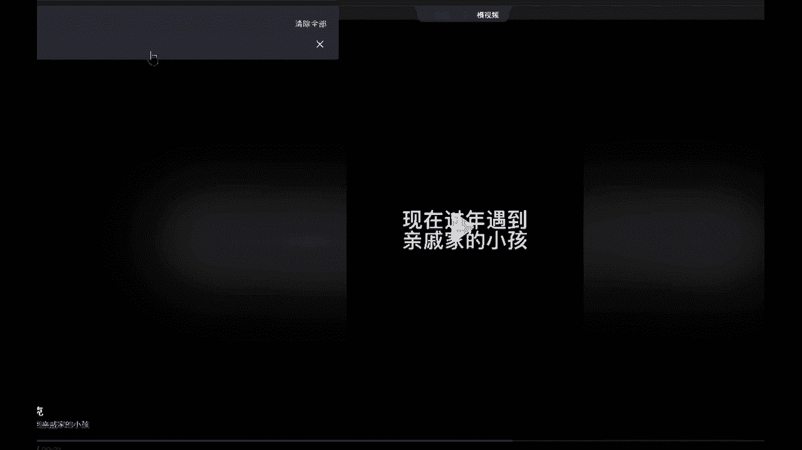
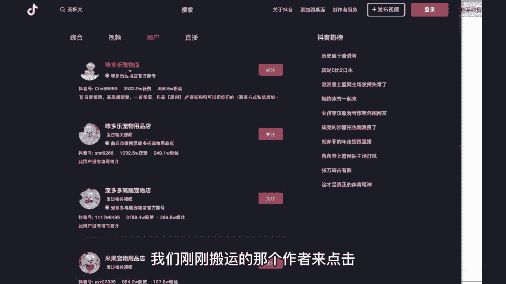
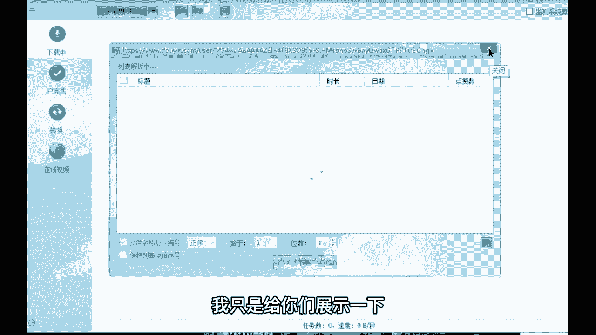
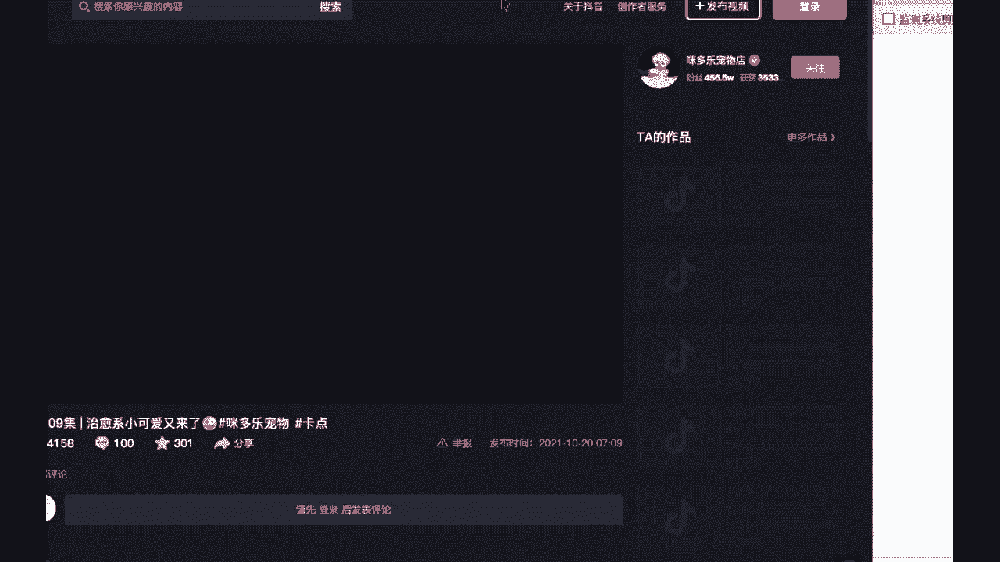
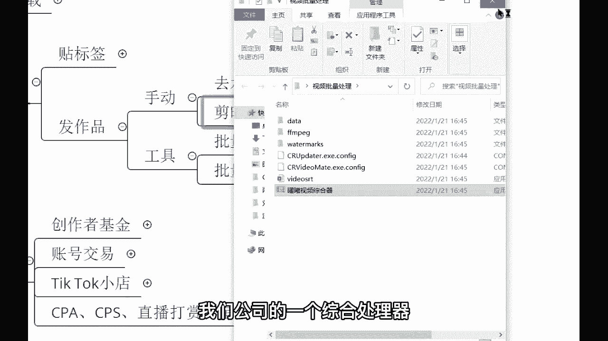
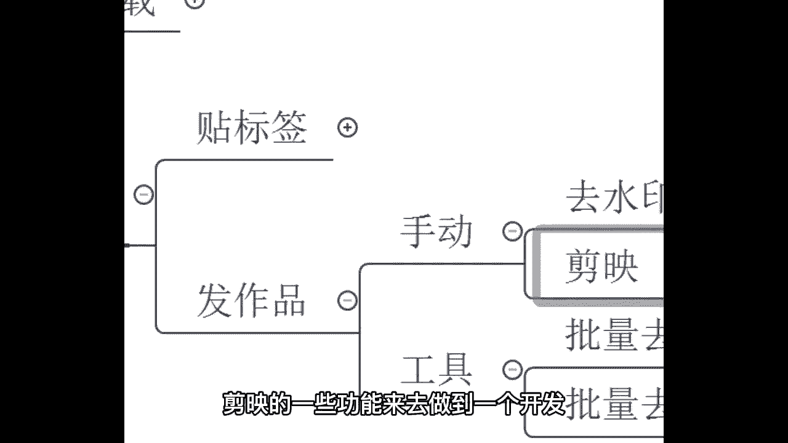
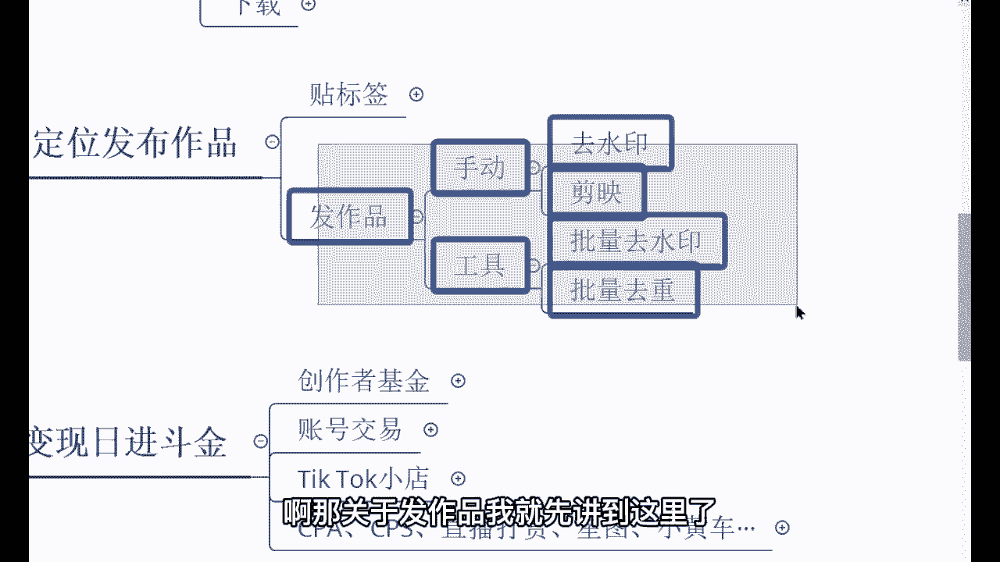

# 【2024最新】比付费还强十倍的自学Tiktok海外版抖音运营全套教程，别再走弯路了。从零基础入门到行业大佬，tiktok跨境电商注册／开店／运营／涨粉／带货 - P9：9、搬运视频工具 - 天天快乐丷 - BV1pi421R7s5

那接下来我给你讲一下工具啊，工具工具会更简单一些，我觉得也会更加适合用这个新啊，更加适用于这个新手，你们的话呢也刚开始接触这个国际抖音是吧，然后呢想要去搬运作品啊，怎么样的也可以用到这个工具。

这个工具后续可以给到大家来，第一个的话呢叫做批量去水印，批量去水印来，我这个工具给大家来展示一下啊，这是我们公司自主研发的嗯，花了几10万去打造的呢，现在的话呢就是可以给到大家去做的，一个使用哈。

未来的话呢可以拉着更多的人去用来，像这个呢就是去水印的一个工具了，那首先我们来先去找到一个视频，教大家怎么去水印，这个的话那就更简单了哈，非常简单，直接的话把链接粘贴到上面就OK了。

抖音打开官方官方跑哪去了。

现在过年遇到，来我们找到那个茶杯犬的那个视频啊。

茶杯犬来米多乐宠物店是吧，我们刚刚搬运的那个作者来点击。

点进它的一个主页，那人家的主页呢有多少，729个作品，729个作品，是不是我们如果说想要针对性这一个人，针对他一个人去搬运他的作品，我们就直接可以把他的链接，把它的主页链接给它复制一。

把它的链接给它复制下来，复制下来之后的话呢，把这个链接粘贴到这里，他现在呢就会去把人家这700多个作品，全部给他做到一个去水印，但我不要这么多啊，我只是给你们展示一下。

有这么一个功能好吧，那我的话那就给大家翻译一个来试一下，我们看一下能不能找到我刚刚搬运的那个作品，不是这个啊，好像不是这个，哎这个。

终于等到响起了，下课铃，已经约好在操场等你，想念着你好，那我们找到了哈，就这个这就是我们刚刚搬运的那个作品，是不是在手机里面操作的啊，那接下来呢，我们也可以用工具对它进行同样的操作。

把这个视频链接主页看到这里，链接并复制，复制好了之后呢，直接粘贴，现在就是在剪辑的过程当中，他现在就是在解析的过程当中，我们不需要管啊，就放到它放置就行了，待会的话它会自动下载下来，下载成功。

下载到我们的电脑上面，好下载好了，下载好了之后呢，来我们来看一下啊，点击这个文件，他这个视频就出来了，来同学们看一下啊，是不是这个作品的话，那就出来了，而且的话呢你发现没有特别高清。

是不是和他的一个原作品是一模一样的，非常非常的高清啊，这就是其中一个工具啊，批量去水印的一个工具，因为我现在的话只展示了那么一个，就你如果说想要去搬很多很多个作品哈，那你的话呢就可以是吧。

人直接把人家的主页给他做了一个复制粘贴啊，几百个作品同步给你做了一个去水印，这就是呃批量起，批量起号需要去用到的一个工具，你知道吧，这个未来的话呢，你们会发现这个东西很好用的哈。

因为我们未来学会了这套技术之后呢，你绝对不会说一个一个作品去搬运，你肯定是批量的去搬运的啊，这个就是功能，其中一个功能批量去水印，第二还有一个东西啊，批量去从你比如我自己哈。

我自己的话呢不是像这个手动用剪映，我不是用剪映的，我不是用剪映，剪映的话，那速度太慢了，我用的是另外一个，是我们公司的一个综合处理器啊，我们公司的一个综合处理器。

这个东西呢，功能和剪映上面的功能基本是一致的，因为我们的话呢就是按照这个剪映的一些。

功能来去做到一个开发，然后我给你看一下，像这个加水印啊，去水印啊，裁剪画中画，去，去头尾片呃，这个夹头尾变速文本，还有这个背景音乐，全部都是按照剪映的功能来去做到一个研发。

然后像这个视频A视频跑哪去了啊，刚刚那个视频的话，我可以直接把它，看一下啊，下载下载那，哎没有下载啊，刚刚那个视频，比如说啊我随便拖一个视频，随随便拖一个进去，进去了之后的话呢，这些功能全部都会亮起来。

亮起来之后啊，这个软件叫什么，这个软件是我们公司自己加的，知道吧，就叫耀西科技药西综合处理器，这个不是东西，你可以在呃这个可以卖，但是的话呢直接可以给你，你你下载不了的啊，你下载不了。

那这个时候自己研发的啊，好那咱们的话呢呃通过这个视频来点击一下，点击之后我们可以调亮度啊，调亮度亮度可以往下调，也可以往上调啊，对往上调往下调都OK，然后的话呢像这个饱和度呢也可以去调，调完之后呢。

你可以去预览啊，我发现好多小伙伴还不了解是不是可以去预览，如果说你觉得调过头了啊，不行是吧，太丑了，那你的话呢可以调回去，那相当于一个什么镜像水平翻转也是一样的啊，我发现好多小伙伴还不了解国际版抖音。

是不是我让你们的话不要找这种对白的，也就是因为这个文字它也会对白啊，他也会去做到一个镜像，尽量不要找那种有说话的对白的啊，然后像那个呃抽帧啊，每这个两秒两每两帧到每六帧啊，中间的话呢抽一针啊。

这个的话呢我们简单的进行一个微调两针，这个每两帧的话呢去抽那么两抽一帧啊，然后像这个动态缩放，还有饱和度，这个应该你们刚刚听老师，我在讲这个剪映的时候，应该都能够，现在我不想再讲一遍了哈。

刚刚已经讲过了哈是吧，什么是抽帧是吧，什么是动态缩放啊，什么是放大，什么是调整画面，是不是这些功能的话，那就一应俱全，全部的话都是在这里，就不需要像抖音那个剪映一样，在一个手机里面一点一点的去触摸啊。

1。1点的去用，知道吧，变速啊也在这里加头尾，去头尾画中画裁剪啊，还有文本，还有背景音乐好吧，这个功能就很适合新手，因为你怕你们会去忘记有哪些步骤，知道吧，有些同学呢做了这个是吧，嗯变换这个滤镜。

但是的话呢会忘记如何呃，忘记这个抽帧，但是的话呢你有这个工具，你就全部的步骤都能够说记得到好吧，我就简单给你展示一下哈，未来的话呢你自己拿到这个工具之后啊，你不懂的，你再问我好吧，这个会给到大家。

但是的话呢你得要把整堂课听完我才给你啊，是不是，如果说你都没有听完，我给你这个工具好像也没有太大的作用，知道吧，也帮助不了你啊，好那关于这个发作品就有两种选项嘛，第一个的话那就是手动发啊。

第二种呢就是工具啊，用这个工具的话效率会更高一些啊，弹射起步啊。

