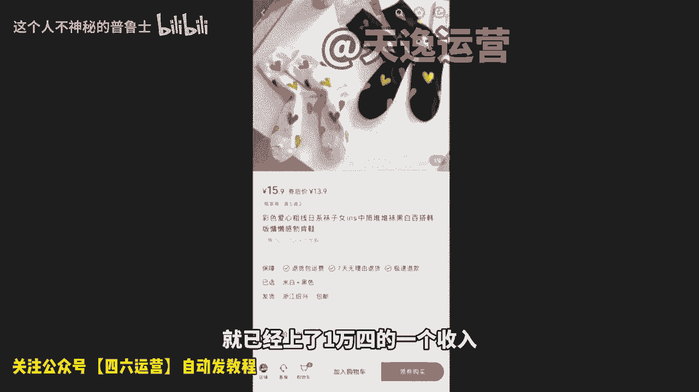
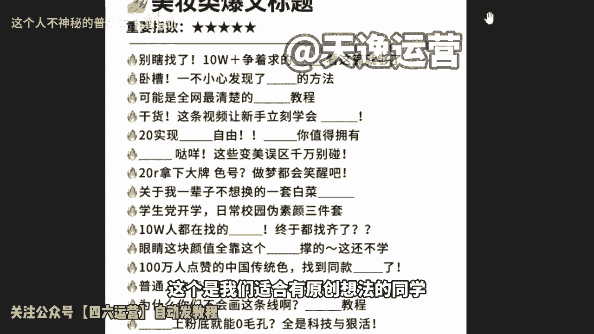

# 【2024最新小红书运营教程】分享花了2.1W买来的小红书课程，目前B站最新最完整的小红书开店运营教程，起号涨粉变现一条龙教学！ 小白收藏！ - P1 - 这个人不神秘的普鲁士 - BV19D421G7qR

还有谁。要说最近什么项目最火，那必须要提到小红书电商。最近几个月呢，几乎整个互联网都在讨论小红书电商。我关注的几个商业博主啊，包括一些付费社群都在讨论他。我朋友圈月入5位数甚至6位数的比比皆是。

这个项目在年初的时候，我其实就有让团队跟进测试，我还在市面上买了一些课程学习，到现在单人单店一个月能做个一两万块吧。今天我就用一个视频详细的给大家拆解一下，就是小红书电商到底怎么玩。

我会把整个小红书电商的流程，包括一些注意点，比如怎么开店，怎么选品，怎么做流量，一次性给大家讲清楚，你甚至都不用再去看别的相关视频和培训啊，你就跟着我的视频去按住做骥，就足够你在这个事情上开始盈利了。

视频的结尾呢我还会给大家准备一份资料，里面有我找的课程啊，对你运营小红书电商呢会有很大的帮助。有需要呢直接去拿就可以了。言归正传啊，整个项目的逻辑啊，其实也非常简单，它就三件事，第一个呢开店。

第二个选品，第三个流量。我们一个一个来讲，先说开店。呃，开店其实没什么好说的。那，首先就是打开小红书，然后点击左上角的菜单图标，再选择创作中心，然后点击更多服务这个选项，选择店铺，点击立即入住就可以了。

你就按他官方要求的提交资料入住就行了。我居然看到有人把小红书开店包装成一个项目拿出来卖。居然还有不少人买，这也是很奇特。这里跟大家说一下，小红书店铺的两种形式，个人店和企业店。

其中个人店有两种分别是个人店和个体工商户店，个人店只需要身份证加1000保证金就可以开通了。个体工商户呢还要多一个营业执照，企业店呢就多一点，企业店有三种呃，有包括那个普通的企业店有专卖店和旗舰店。

企业店都需要营业执照，而且还要缴纳600个年费。我们刚开始运营小红书电商的时候，你直接选择个人店就可以了。我们实测下呀，企业店和个人店一样，平台并没有对企业店有什么流量倾斜。唯一的区别是个人店。

你只能开一家，而一份营业执照，你可以开三个店，你一个店如果都没做好，你开再多的店都是没有用的。而且小红书电商啊，我觉得是。

适合店群形式去做的。这是因为小红书的流量机制，它的电商自然流占比非常低。那你付再多的店再多的货有什么用呢？所以只要你看到有博主跟你讲什么小红书店群，我都觉得是在扯淡。小红书是要做矩阵的啊。

但不是店铺矩阵，而是账号矩阵。这个后面的流量获取那里，我会跟大家细说，开店的成本呢有这么几个。第一个就是1000钱的保证金啊，不做了可以退。第二个呢是平台的扣点营业额的5%。第三个呢是支付渠道的费用。

大概呢每单是0。7，第四个就是自己的流动资金啊，一开始大家做呢可以有无货源的方式去做？对资金要求也不高。你刚开始呢准备个20003000块完全够了。呃，开完店以后呢，我们下一步就是选品。

我们应该在小红书上卖什么呢？选品其实也简单。在其他平台上的爆款大概率在小红书上也能报。目前小红书呢，我是推荐三个渠道进行选品的。第一个是通过某东某宝上面找那种小红书平台调性的爆款产品。呃。

身边有做电商的朋友，他自己在某宝的店铺卖爆款，搬到小红书上。第一篇笔记就开始。第二篇笔记单量就已经破百了。第二个呢是通过某音的那个精选联盟。你在某音的精选联盟排行榜，你可以看到现阶段哪些品卖的好。

只要符合小红书用户调性的产品，直接搬运测试就可以了。第三个就是某多多的这个销量排行榜选择适合小红书的类目排行榜，从中选择相应的爆品搬运到小红书。整个选品的逻辑，就是我们要利用市场来帮助我们选品。

而不是自己在那瞎想，我们要借助大卖家的选品能力来弥补自己选品上的不足。所以我们只要判断一个东西啊，就是这些排行榜上的爆品是否跟小红书的人群有匹配的可能，如果有我就搬过来测一下，对吧？

相当于是借助了别人的能力来帮我们自己选品，这样反而是最快，而且是最稳妥的选品方式，肯定比你瞎测成功率要高很多。然后等你这个产品上架以后呢，就到了最重要的环节了。我们应该如何获取流量。

小红书它是个种草平台。你店铺九成以上的流量啊，都是来自你发发的笔记。这就是为什么我之前说小红书不要铺店群，而要做账号矩阵，尽可能多的发笔记好流量。它的通路就是。用户通过你的笔记然后对你推的产品产生兴趣。

然后到达你的店铺完成购买，你堆一堆店铺，对吧？你铺一堆店铺一就还不如多发笔记，多发几篇笔记的这个效果好。所以怎么在小红书上发笔记，对吧？就是你小红书电商是否成功的关键。小红书这个平台，你直接发硬广。

我觉得效果非常差，对吧？本来小红书的这个用户群体认知就比较高，你直接发广告没有办法获得信任的啊，更不要提转化了，你发笔记的时候，一定要用一个素人的角度，你知道吧？就是用户的角度去切入。

站在用户的角度去做种草内容，而不是官方视角，这才是真正有效的。呃，这种种草笔记怎么做，其实也很简单，就是去各大平台的商品评论里找。比如某音某宝某东的商品买家秀找到好看的素材，你直接copy下来用嘛。

对吧？文案呢在买家评价上去做修改。这些买家的评价呢就是商品用户的使用体验，天然的适合用来做这个中考笔记，而且可以说是取之不尽了啊。然后呃当你单个账号的SOB跑通了是吧？我们就可以开始举阵引流了啊。

通过批量上小红书账号批量发布笔记。给我们的店铺来引流来放大。那基本上整个小红书的电商的运营啊，就是我上面分享的这些外面不管多少钱的培训啊，000块也好，000块、1万块也好，其实就是这些东西。

有些培训可能还没有讲的清楚啊。根据上面几个点，我给大家准备了一份资料，里面包括了小红书账号的起号运营的方法，以及一份小红书电商的视频课程。你如果打算经营小红书电商，你也不用看别的东西，就跟着这份资料走。

足够你开始盈利了。有需要的啊，点赞加关注，在评论区回复红书电商，我分享给你。😊。

🎼要有自信啊，你是最好的，知道吗？就是大家是19年用小红书还是20还是2122，还是23年才用小红书，还是没用小红书，可以告诉我一下。然后我针对大家的情况来决定说我的内容的一个速度啊。

现在是8点16分啊，我们预计一个小时可以讲完，然后剩下的时间啊，我们进行一些简单的答疑。OK好，有19年有2有22202223年的啊。OK好，50%的人啊应该是用来小红书有一段时间的啊。啊。

也有刚开始用的啊。好的，我大概大概清楚了一个情况。那我简单的做个自我介绍吧。呃，我的。我用的网名啊叫福克斯装修笔记，是某top一电商平台的一个认证讲师。

那我应该我相信大家应该也猜得到top一是哪个电商平台啊，因为我们自己出去讲课的话，正常来说是要报备的。然后这一次呢我们去组织咱们的这个小红书的一个淘金互助计划呢，也是属于一个临时起义。

就觉得说市面上有很多那种打韭菜的是吧？卖个9991299啊，包括一个chedGDP啊，卖个2000多。我们觉得反正这不是我们的风格吧。然后。这一次组织啊，我们是相当于说是无组织无预谋的。

就是大家觉得说可以去给大家做一点事情。因为不管是我也好，还是戴老师也好，还是大一老师也好，我们其实三个人都是在不同的城市。而且有自己不同的公司，而且是纯实战派的。呃，我上一次分享是什么时候呢？是。

上一次我去带这种带队去做这种新平台研究，是20年的时候做视频号。那个时候有一个学员叫小七。他后来成为了视频号保险行业的一个扛把子也是非常不错的那我跟大家分享一下。

就是在我上一次带队20年带队的这个过程中，呃，我最后的一个感受啊，就是往往能够出结果的人，是他提前就有自己的变现方式，或者说商品的人，因为他自己有变现的产品，他对自己的产品足够了解，他对这些东西呢。

就有更强的一个欲望和目标去做。但是呢针对咱们啊有一些小白的这个同学是吧？可能之前没有在电商上去卖过东西，或者说没有在自媒体去做个账号，没有赚过钱。那么对于你们而言，我说真心的啊。

我觉得就是说可以降低一下咱们的一个目标。因为我们看到的就是说像以我为例啊，我可以用二十几篇笔记做出1万粉丝的账号，这是基于我十年来的一个内容积累，就是我可以很快的去了解到一个平台，他要什么。

我可以很快的去判断这个类目能不能做要怎么做谁做的方式离前更近，这都是需要基本功的。所以说接下来呢那我就不浪费时间了啊，马上进入正题啊，感觉大家进来的差不多了。

那么我们今天讲的主题是小红书运营的一个底层逻辑。我们怎么样从0到1来做出一万粉的账号？那么先是我们来看一下啊。今天讲4个。大块。第一个是了解小红书的一个平台。第二个是小红书平台的一个底层逻辑。

第三个是小红书用户的一个使用逻辑，以及我是怎么样从零起号月破百万的啊，我是大概是平均去年应该是做了将近1000万的一个线下的成交额。那今天我会弱化这块部分会主要跟你们讲账号和平台怎么去做。

然后整个的这个内容绝对是纯一线的实战干货，我敢说这个东西你们在外面应该是很难很难听到的。因为大部分就是说公司比较大的话，这个老板他不会是自己一线的操盘手，他操盘有别人。

而我的账号是我自己从选题到内容到全流程是我一个人独立完成的。虽然公司有人，但是我做小红书是属于2019年是属于先行研究，所以我是没有用用任何公司资源做出来的。那我们先了解一下小红书的一个平台啊。

就是说先看一下小红书平台的一个官方定位啊，这这张图是小红书官方的图片，它的描述什么？是生活方式平台和消费决策的入口。

凭借真实向上多元的社区氛围，小红书已成为年轻人不可。替代的啊入口。所以小红书给自己打的标签真实是排第一的，向上啊，社区以及消费者决对入口。那这个第二个呢它是讲到了高净值值啊，高净值人群。

超一亿的月活用户70%的一线和这些一些东西啊。但这些数据是中间的。我们把官方的这个资料说成人话是什么意思呢？就是在目前现阶段的这个网络平台当中啊，我们可能会刷抖音，可能会刷快手或者B站知乎啊，甚至微博。

那我们会在这些平台上去接触很多很多的信息。

那我们小红书和他们之间是发生什么关联的呢？就是因为他们从这些平台上啊，从这些平台上收获到信息之后，他们。在穿梭到小红书来进行一个研究，通过小红书进行浏览啊，然后进行一个影响决策。

要么他们会在小红书进行打扫。因为小红书它自己有官方商城啊，要么他们会直接在其他的平台进行一个购买，这是小红书的一个决策时刻。好，那我就跟大家用说人话讲啊，就是小红书这个平台它到底是怎么火起来的呢？

其实它是经历了抖音的一个4近将近4年的一个增长。因为抖音在它这个四年的一个野蛮生长时期，它的变现方式其实是经历过N种样式的迭代。我不知道你们有没有人刷到过啊，最开始的抖音快手变现，他们是主播只要有粉丝。

你在直播间你开直播就有几千几万人在线，这个时候就已经开始有商家。比如说比如说啊比如说你们是主播，你们的直播间有几千人上万人，而我是一个卖面膜的商家啊，我就会告诉大家，我非常非常的喜欢你很喜欢看你的内容。

我的这个面膜，在天猫旗舰店卖199啊，在京东卖199，但是针对你直播间的粉丝，我拿出几百单来做福利，只要多少钱，只要39。9块。那个时候是抖音最开始的一个变现模式，就是商家直接打版，打版之后直接卖货。

然后。主播给这个商家挂人，我想问一下，大家有经历过这个时刻的人吗？有经历过的打个有好吗？有经历过这种卖货的吗？叫打连麦卖货。那再往后走，抖音开始推出了一个小黄车，就可以进进行一个通过小黄车去购物。

那这个时候它是什么玩法呢？他们就有很多的人啊跑到这种源头的水果产地啊，大爷大妈啊，下贵说求求大家了，我的苹果直销啦，橘子直销了呀，就用感情牌啊，用视频去吸引大家去下单啊，但是这些东西现在是不被允许了啊。

那么再往后走，像一些美妆的，他们又研究出一个什么样的一个玩法呢？就是一次性投放上百个达人账号。比如说啊我老婆她买的那个酒酿面膜，我记得买过酒酿面膜，买过那个薏米茶，买过那个号称是协盒的美白。

美白的那个小瓶瓶的，后面都上新闻了啊，协盒说根本他们就没出过这个产品。那么这个操盘的打法，就是可能你通过一个博主，对吧？你说这个美白能这个东西能美白，可能你不信，那O我买通100个博主甚至几百个博主。

我让你9点钟刷视频，A说他有用，B也说它有用，C也有用，刷的越多之后就造成一个从众心理，最近一个收割。而这一系列下来啊，就有不少人收到货之后，他就会发现什么，就会发现自己踩坑了。然后也就开始变得谨慎。

那怎么样防止大家上当呢？所以这个时候其实小红书的价值就开始体现了。因为小红书它的定位是种草的一个分享社区，而且它的算法对普通人很友好，有大量心地善良的人在里面分享，包括面膜的使用感受啊。

防晒刷的一个真实效果对比图啊等有效信息。所以小红书就相当于它为大众提供了一个产品好坏的一个体验的一个分享平台。你们如果片面点的去理解，也可以理解为它是一个避坑平台。

但是然后又由于前期有很多的海外购物经验分享，小红书，它的前身是做海外购物分享的，积累了一批高素质、高学历、高消费能力的用户，高素质高学历，就决定了他们的语言表达会更加的客观。

他们拍照的能力和展示能力都更强。所以他们给用户的感觉会比商业的博主要更加的真诚啊，可信度更高，也就慢慢积累下一批女性用户为主的用户。那么抖音和小红书。如果。我说在我的视角里，我们去做一个对比，就是抖音。

现在是专业的玩家居多里面呢鱼龙混杂啊，有正有正向的啊，也有玩套路的，而套玩套路的是层出不穷，而小红书呢，它更倾向于普通人真诚分享的平台，里面信息的密度是比较大的，你可以筛选出有用的避坑指南生活方式。

所以其实就让我想到啊，就像我们以前用淘宝是吧？最开始我们在淘宝上买衣服啊，可能只需要有衣服在上面挂着就会有人去买。那再往后唉商家觉得说好像好评这个东西对消费者决策起到关键的作用。

那可能他们就会在好评上面啊，比如说我搞100个买家秀，自己弄100个账户去。说这个衣服有多好看，穿上去效果有多好，但是消费者他也不傻呀，他发现说唉我买回来衣服和好评里面的衣服不一样，怎么办啊？

消费者就开始不看好评，我们开始看差评啊。那有的商家又变聪明了，你看差评是吧？那我就在差评里面去做文章，通过差评去让你认可我的产品品质。比如说啊比如说一个一个一件卖一件衣服是吧，他可能说给的是一个差评。

但他说虽然衣服质量还可以，价格也合适，但是配送太慢了，这个差评我给定了。像这种的语句，看似它是一个差评，实际上它还是向你传递了用户的真相认可。所以商家和消费者他一直在博弈。而大部分人我们在抖音。

如果说去买到了这种不好的商品，你去曝光它，其实拿到的流量是很有限的。而小红书这个平台不一样啊。如果说你在上面买了什么不好的产品不好的体验，第一，素人的流量权重和大大的博主可以说几乎没有太大的区别。第二。

小红书他有搜索流量，因为我们是基于什么？基于我们在某些短视频平台刷到了这个产品，比如我刷到一个是吧？这个又刷到一个什么面膜啊，号称能够美白。那这个时候因为我之前上过当了。

所以我这一次我就希望说我在小红书平台再去搜一下。而这个时候当他搜这个面膜的时候，可能他就进了一个测评的帖子，那测评的帖子可能就告诉他这个。的面膜不如另外一个面膜啊，然后这个消费者的心质就被影响了。

所以小红书它基本上就是给我觉得片面的理解啊，就是避坑平台，它的内容就类似于说豆瓣的电影评分啊，以及大众点评的一个美食评分一样。那虽然到今天为止啊，平台里也会有很多的素人分享。

但是同时也参杂了很多的这个商家啊冒充信息。但是这个平台整体来讲还是非常有这个使用价值的。那小红书平台的一个底层逻辑啊，就是我在做小红书平台的时候的底层逻辑。首先我们去做一个东西。

一定要了解一个平台他要什么平台要的东西，你给他他自然就给你流量。那么我想问大家一个问题啊，假设现在你们啊是一个开淘宝开天猫旗舰店的，现在你手下有5个有5个客服来回复这个客户的咨询，你店里有2000。

现在每天有2000个咨询啊，你会怎么去分配，是平均分配2000个除以5个人，每个人平均分配400个，还是怎么分配，还是说不平均分配，你们可以告诉我吗？你们思考一个问题啊。

现在你们的身份是天猫旗舰店的一个老板，你有5个客服啊，然后有2000个客户咨询，你们怎么分配是吧？这同学很配合啊，这者是平均分配。这个其他的啊其他的朋友啊，也可以啊，继续去多互动。

因为我知道你们的水平就决定了我后面讲的一个东西的重点和速度。啊，有人说不理能下单的不会多问啊，这个兄弟，你在跟我开玩笑，你一个开天猫旗舰店的，你说2000多个客户咨询，你有5个客服，你跟他跟我都不理啊。

有人说按需求比例，有人说按能力分配，有人说平均分配。好的，那如果说这五个是新人的话，那基本上来说的话，第一轮肯定是先平均分配。但是你们往后走，你们会发现一个结果。

就是每个人的能力是不一样的那我们可以看到，那通过一个星期的数据下来，那我们现在发现了张三他的成交是4000块钱，李四是3000块钱，往五是8500块钱，照六是6500，升期是1000。

我想问一下你们接下来你们准备平怎么分配呢？我相信啊。假设你们是一个老板的话，你们是不是会希望王五能够拿到更多的客户？因为王五的销售额是8500元。他是张三对吧？和李四的double。所以。

这就是我们啊假设我们开店的一个商业逻辑。那。到了小红书平台，你们就去思考小红书平台。其实对于小红书而言，我们他手上拿到的东西是什么？他手上拿到的是访客，对吧？我们打开手就变成访客了。然后呢。

他手上会有多少呢？会有新增笔记。那你觉得他分配笔记怎么分配呢？他就像我们去开店铺一样。他前期比如说我们现在同一时刻这一分钟有500篇笔记，新到诞生了，他一定是给这500篇笔记啊。

一个平均的一个初始流量值。然后通过初始流量值的一个数据表现，再次再去决定二次分配和三次分配。所以那我就想问一下大家第二个啊问题就是小红书平台它最想要的东西是什么？你们有想过吗？

是用户停留还是新增还是成交额？你们可以在评论区啊可以在评论区。告诉我。你们觉得小红书平台最希欢要的是什么？我来看一下啊，这道题这道题挺有技术难度的。Yeah。所有打停留的啊停留的是正确答案。

停留的是正确答案。因为我现在用的词是什么？是最希望要的是什么？为什么我告诉你，用户停留是最关键的啊。因为不管是小红书也好，抖音也好，快手也好，微信也好，他们都在干一件事情，就是要争取用户的时间。为什么？

因为你后面所有的成交额，你的这个电商的变现，广告的变现都是要基于用户在使用你这个软件。包括你们所说的用户新增，新增看上去很重要。但是你要明白，当我们愿意用1个APP，愿意一。新增只是早和晚的问题。

如果1个APP你一天只用2分钟，或者说你一个星期你都不想打开一次，你觉得这样的新增有意义吗？所以我们就想到以前是吧，我们以前看电视的时候。还记得吧？以前电视台的核心关键数据是要啥？是要收视率，对不对？

收视率电视台有了收视率，它就可以去插播。广告植入对吧？可以接一些大品牌的一个广告。所以对于。这种平台也好，其实不管小红书、抖音、微信、淘宝，他们都是希望有用户停留，有用户停留才有切可能。

那这里又有一个问题就是。我们希望用户停留。那就需要有好的内容让用户去停留下来。但是小红书的平台，它是一个机器。如何让机器去判断内容的好坏呢？啊，我们都说内容未完，你们有想过没有？

如何让机器去判断这个笔记的好坏呢？如何让机器去判断笔记的好坏？机器一篇笔记灌输下去，其实它是没有办法啊，算法机器是没有办法完全去识别出内容的好坏的，它只能通过一些数据。

所以我们能够看到的点赞、收藏、评论、转发。这四个东西其实就是一个用户的反馈。对于机器而言。系统推荐。两篇笔记啊，A笔记和B笔记各500个。报关A笔记获得了100个点赞，B笔记获得了10个点赞。

那机器就有理由判断A笔G更受用户欢迎，能理解吧？我相信你们都能理解的。好，所以说整个来讲，小红书平台它其实就是基于。用户停留的需求啊，用户时长的需求通过机器去判断你的内容是否是用户喜欢的。

能够让用户留下来的。因为我们自己是不会在我们不喜欢的内容去浪费时间的。所以那整个来讲的话，大的方向啊我跟大家分享一下，就是小红书平台现在有哪些红利呢？第一个是流量红利。

因为小红书目前的月活应该是两个亿左右啊，我估的。然后23年刚刚上线了网页版。这个流量红利就意味着说，如果小红书未来的月活能够在接下来23年、24年达到5亿的话，它有两倍的流量buff。

就是你做相同的事情，它是有两倍的流量buff。如果小红书能够到7。5到8亿的用用户，就有3倍的buff，是你做相同的事情。这也是为什么我会去在。119年去做抖音，我们做11抖音是19年6月份。

我做小红书是21年10月份，我永远因为作为一个老互联网人，我永远是要抢平台的前瞻视角前这个流量加成的。所以说抖音我我们现在有在做，我们还会接下来还会去做。但是现在的抖音的流量已经肩顶了。

所以我们其实早做和晚做同样的一个项目，差距不大了，没有流量红利了。那第二个点，我们讲的是素人红利，就是小红书平台对于素人笔记的其实是很友好的。而且最近小红书平台。

他把这个广告的门槛从1万粉下调到1000粉也可以开通。这是你能感受到它不是去捧这种大博主的一个心态。第三个叫搜索红利。就是笔记在小红书的笔记，它可以获得长期且持续的搜索访问量。

3000小眼睛的笔记拿到100万。小眼镜，这是我实际的我的后台数据。这个等一下你们后面呃可以给大家看一下啊。第四个就是电商红利。小红书今年对于电商有很多的动作，类似于早期的小红车的推出。

包括最新拿到的信息。小红书的这个本地团购也在内测了。就是你通过笔记可以直接上架。本地的一些优质商家。所以我觉得就是说对于一些小白而言啊。你这一次可以把你的目标定到，你知道怎么样去做内容，做有效的内容。

然后电商这个东西你可以。就是说你不要把自己的要求拉太高啊，在这一次，因为后面还有本地团购等着你。这个你们可以看一下，我有一个习惯，就是我会统计我每一篇笔记，每一天的一个最后的一个数据。

这一篇的话是截取的一个曲线，它是从。这应该是几百的播放，到了几万多多播放。而且这张图是我应该是去年截的，现在应该还是继续往上走的。这个我没有去拿数据最好的图片。所以说小红书最牛逼的地方是什么？

就是它的长尾流量是我见过最牛逼的。查尾流量是我见过最牛逼的，没有之一。包括你们可以看到右边啊它的搜索我的笔记，我的搜索量是77，所以都是搜索进来的，搜索流量就越的精准。那么总总结一下。

就是小红书平台快手，它们的差异在哪里呢？快手抖音啊，我觉得它可能更倾向于之前的优酷土豆，是用户一个欣赏观看视频的一个工具。而小红书呢，它有点类似于百度加知乎的一个结合体。我们在百度可以查到怎么去。

一些比较啊更深入的东西。比如说iphone怎么去拆机，而小红书它有百度加知乎的一个这种调线的一个感觉。我们接着往后走啊，那么小红书我们要去做的话，我们了解了平台之后，我们要还要了解用户的一个使用逻辑。

可以看一下这张图啊，这张图是我去研究用户的一个一个流程图。我们可以发现说小红书平台，你打开之后，对吧？它给你推荐的是4篇笔四篇笔记啊，四个封面，对不对？四个封面。

那么我们的行为轨迹是不是要么你就有有兴趣，你就点进去，要么你没有兴趣你下滑了。而点进去的里面，要么就是看完所有内容啊，要么你就是看完离开了，是不是？那还有第三个什么思考一下思考一下，动一下你们的大脑。

我们打开小红书啊，我们小红书给我们推送了4篇四张封面，我们要么点进去看完，要么我们看完离开了，还有一个选项是什么？有没有人能够想得到啊？今天的内容，你们能够动起你们的脑子。

我相信会让你们可能是今年收获最大的一个小时。看一半啊，这个这个朋友没有名字，但是我觉得回答的很漂亮。就是还有一个选项就是没有看完离开了没有看完离开了。没有看完，离开了啊。所以说看完所有内容之后的路径。

他又选择没有互动离开以及有互动离开，以及进入个人主页。啊，以及接下来的路径。所以这是我去研究用户，其实我就是研究我们自己。那你们有没有这样的一个思维是吧？我们再往后走。

那么小红书平台做账号和抖音它到底有什么不同呢？第一个就我们刚刚所说到的啊，它的其实是属于信息的推荐方式就已经不同了。因为抖音打开软件，它是直接推送一条内容并自动播放的。你们不感兴趣。

你们就会去刷到第二条。而小红书打开软件，它是推荐4条内容，它没有自动播放的。你们不感兴趣就直接下一条了。所以就意味着是什么？说明抖音的开头很重要，因为抖音是自动播放，而小红书的封面标题非常重要。

如果你的封面标题不行，对不起，我我一一个我都不会点进去看，我直接下面四个了。所以说小红书的标面标题封面非常重要，大家现在应该能。这个解这个拆解，你们应该能意识到封富标题的非常重要性啊。

那么你们去思考一下，或者说啊你们有女朋友的，有男朋友的对吧？或者你们的同事，你们去研究一下你们的同事，他在耍小红书的时候。给他四篇笔记，他是怎么样去阅读的一个顺序。他是从。一看到二看到三，看到四。

还是他打开手机扫一眼啊，直接滑了，还是说打开一眼扫一眼直接点了。就我个人而而言，这四篇笔记我是不会按顺序1234去看的，我是扫一眼的，扫一眼也就意味着说。一秒钟的时间，4篇笔记。

其实每一篇笔记连半秒都不到。所以说这个封面标题非常之重要。那么小红书平台啊做和抖音还有一个什么区别？其实他们的账号的运营方法也是不一样的。抖音平台。

你们去运1个IP其实主要还是要去博这个系统的一个推荐流量啊，用想办法去破圈。而小红书他是因为社群属性和搜索流量大，他还可以通过账户笔记为形象展示，去他人评论去吸引目标用户啊，像右边这个案例啊。

是我前几天刷到的，就是这个人。在这篇笔记啊这篇笔记讲的是啥呢？这篇笔记讲的是。就是没有听妈妈的话，拿着家里的钱去开店就压力很大啊。他就在评论区说，我也是对家里报喜不罢忧。开奶茶店最多负债500万。

不敢跟家里说，每次问只能说还行，因为奶茶店太卷，最后去做压，结果没想到一年把负债还清，还把生意发展到全国，就意味着他这个其实传递了一个什么信息，一年。他是负债500万一年还清。

就意味着说什么说他一年赚了500万。然后下面还有一条评论，不过你们家味道确实不错，就是价格高，不知道是不是一样，对吧？还有一个用户好评。看到没有？所以如果说我想问一下大家，如果是你们。看到了这一个人。

你们会不会点他的头像会打会好吗？不会打不会。如果这篇笔记是你们刷到了，你们会不会点他的头像去看一下，因为他负债500万。啊，一年还清会对不对？那我想问一下你，你们点了他的头像。

进了他的主页和他发一篇笔记，你们看完了进他的主页是不是达成了同样的一个目标，就是把你吸引到了他们的主页里面去。是不是？所以这就是小红书的一个魅力。它可以通过评论区去吸引用户。

不是只能够通过内容去吸引用户。啊。那那也就意味着说对不对？比如说是不是就我以服装举例啊，我们用服装举例，我们换位思考一下。假设这篇笔记它讲的不是开店亏钱的事啊啊，或者说我还是开店开店亏钱啊，就是呃。

找爸妈借了10万块钱啊，开开童装店。啊，开不下去了。会不会小红书会不会有这样的笔记，肯定会有，就是那些开童装店开不下去的。那么是不是可以在评论区去说。现在实体店的东西卖那么贵，怎么可能开得下去？

我在我在朋友群里买的一件小朋友的T恤，才6。9块钱，而且跟实体店29。9块的质量差不多。谁还愿意去实体店买东西？我想问一下大家，这一句评论区有没有杀伤力？是不是你们就可以理解啊。

同样的小红书他现在还干了一个什么事情。今年啊我发现他把群聊的一个这个好友数就是一个人可以进群的上限已经我现在已经建到15个群了，之前我只能建5个群，现在能建15个群，那也就意味着说。

他的这个玩法会更加的多样化了，包括他还可以他还他有一个官方页面招募群友。你建群之后，他他给你提醒你，你可以发布笔记招募群友。所以这个玩法就有很多种方式了。好，那我们就问，那么接下来我们的问题就来了。

那我们的笔记封面如何脱颖而出呢？已经知道每次打开推荐四篇笔记，我们怎么样把封面做到超越他人呢？尽可能高的拿到点击呢？啊，这里我插一个问题啊，我插一个问题，就是平台能够给你们的给普通人的唯一的一个。

数据你们知道是啥吗？就假设啊我们200个人全部发笔记，他能够唯一给的东西是啥，你们知道吗？他能够唯一给的东西叫这个。叫报关。啥意思啊？就是把我们的笔记推送到别人的手机上面。这个动作让你的手机。

看到这四篇笔记，这个动作叫曝光，就是平台唯一能做的，就是让你们的笔记出现在别人的手机屏幕上面，他只能做到这一步，他没有办法让。看到你这个笔记的人点进去，他也没有办法让他点赞。

所以很多时候你们的小眼睛是由什么决定的？是由你们的点击率决定的。假设平台给这四篇笔记都给一000的报关。都给一000的报关。假设这篇笔记1000的报关里有200个人看。

就会显示你们的左下角就会显示小眼睛。其实这个叫。小眼睛它是属于阅读数，但是平台给你的不止200，他可他可能给了你1000，明白吗？明白吗？同样的，这只猫它可能也给了1000个曝关。

但是因为这个猫比较吸引人，所以它有300个小眼睛，那就是30%的点击率。所以你的眼睛只有200，你的眼睛，别人有300，不是说平台给了它300给了你200，而是你的点击率会影响。好啊，那我告诉大家。

我是怎么样去提升我的封面呢？接下来的这个方法，如果大家看了有用，就在评论区回复有用，好不好？我的选择是啊，这是我的一个封面。我的选择是我做出来我的封面之后，我把很多个封面放到一起，我把我的放上去。

看我是不是最能跳出来的那一个，我把我的封面放在这个手机的示意图上，看下能不能跳出来，我把我的封面放在这四个里面，能不能跳出来。有用答有用好吗？有用答有用。因为我跟大家说了。

我们这一次的三位老师全是实战派老师，我不会去跟你们说什么啊，标题的三个方法啊，这个吸引人的三个方法，我讲的就是我在用解确实有用的东西。接下来还有更多的干货啊，咱们继续。啊，大家也可以在去。

继续啊咱们继续。好，那么问题来了啊，就是笔记封面我们如何脱颖而出呢？啊，这是我今天从网页版上啊截图的十几个。那么。划重点来了，就是在之前啊在在今今年啊网页版推出来之前，我们要思考的是啥？

我们要思考的是四篇笔记啊，我们要思考的是四篇笔记，我们怎么脱颖而出。但是网页版出来之后，网页版的推送是是多少？是是这样推送的是我是黄红框里面的一个推送啊，我是把两个拼到一起了。

那就意味着说每如果说你要考虑到小红书后面的流量，它如果是手机端进入，你是四进一。它如果是网页版刷的话，你是十5进一，是不是对你的封面要求更高了。那么这一张图，我为什么截给大家看啊，我想跟大家讲一个点。

改一个点。就是。以网页版的一个阅读质感。我把这个。同样啊这种在备忘录打字啊，这种算很简单一个展现形式，这篇笔记算一号笔记，这一篇算2号笔记，这一篇算3号笔记，这一篇算4号笔记。

你们认为1234里面哪一个是如果你们选择这种表现形式会会认可的方式？1234，你们更认可哪一种方式？2对不对？为什么？因为二不仅它的标题更加的显眼，它还画了一个红圈做视觉引导。而一是吧，一的字。

三的字啊都是属于字都有点看不清了。四还好一点，在网网页版的视角里，四的字还是比较清晰的，而二的标题更加的清晰，而且它还用了这个用了这个红色，对不对？这就是我们把就是东西好坏是怎么来的？我告诉你们。

封面好与坏，标题好与坏。就像什么？就像我们。😡，给我们的对象拍照一样。你拍一张照片可能就只能拍出50分。那我们怎么样保证自己的对象能够选出好看的照片，是不是咱上来先给他干个100张。

是不是你在100张里面选，你总能选出好看的嘛？所以我们去做小红书，做封面，我们。😡，两种方法，一种是我们去看100个封面，找出我们觉得好的去学习，还是我们做100个。去选一个呢，肯定是看嘛，对不对？

然后。讲到这个服装啊，我今天还去找了一下服装的例子，就是我们如果去研究账号啊，我们要去向有结果的人的学习。因为我已经告诉大家，标题和封面非常的重要。那什么叫有结果的人呢？

我觉得第一个你要看他的数据是否稳定啊，像这个账号。他前前面的数据还是比较稳的啊，点赞都在100以上，可能最近的流量不行，但是它能够连续几篇拿到100点赞的这种账号，它其实一定是对平台有内容理解的。

如果一个人对平台的内容不理解，他的数据就会变成什么？可能突然他有一条100点赞1000点赞的。但是再往后他无法连续，他无法连续，就是优秀的人他的下限是更低的。

就是我们没有人能够说我一定能写出1万点赞的笔记，但是优秀的人他的下限可能就是100。但是如果说你对平台没有那么了解，那你的笔记完全就是开盖率。那这个账号他的特点在哪。因为你们要讲要可能有人会选择做服装。

那我给你们简单讲一下，就是。第一，它的定位，它是专门研究篮球穿搭。细分是吧？第二个。他是。小众篮球穿搭。第二个，为什么我说这个账号有用？是因为我们通过他的评论区，你去看是会有人找他要链接的啊。

求第一套裤子的链接。他不是简单的说，我给你点个赞我，点个收藏，我走了，你会在评论区看到有人要要是什么，是代表购买欲，是不是？好，那我还找了几篇其他的这个衣服去看啊。像这个账号也是比较有特点的。

这个账号它的一个拍摄角度是非常固定的，而且它的数据也很稳定。这个账号数据也很稳定啊，然后这个账号人家更直接了，蹲价格侠，价格侠什么意思呢？就是谁谁去了店铺翻到件衣服的价格。

告诉我这个直接就是考虑到价格层面了，能考虑到价格层面，说明什么？说明这件衣服他已经心动了。那么我们再往后看第三个啊，这个账号它叫野生塔塔。这个账号它也是很固定的一个商品，对不对？我们讲的账号定位清晰。

它的账号定位是什么？账号定位就是这种它这个叫什么叫JK是吧？学生日常的这种风格，然后他的目标客户也很清晰是吧？就这种感觉很相似啊，他的效果有没有有人家会问他裙子哪家的啊，他说海胆举例子。好。

那接下来问题来了，其实这三个账号，它的变现方式是不一样的。是不一样的，你们来看一下啊。这个。人家是告他是告诉别人，我的裙子在这家店铺买的这一个也是告诉别人我在哪里买的这个衣服。而，这一个呢。

这一个是发链接。谁。我先问一下大家啊，就是篮球啊和这个黑衣服。啊，这个水手服你们觉得这三个哪个更赚钱？或者说哪个的运营水平更高。你们有这种感感觉吗？就运营水平来讲啊，是打篮球的高，还是黑衣服的高。

还是水手服的高？有人说篮球啊，有人说第二个，有人说第三个。啊，你们觉得篮球是吧？其实我我我讲我的个人观点啊，我讲我的个人观点，可能我会觉得黑衣服的高一些。就就变现手法啊，就变现手法。

这个篮球它是卖衣服嘛，是吧？它可能是没有上限的，但是就这个账号定位而言，就账号定位而言，我觉得黑衣服的。呃，段位高一点。因为第一个他的这个数据。更加的稳定是吧？篮球它是稳定稳定100家。

那也意味着黑衣服一篇是他的十0篇。第二个，黑衣服的这个。质感更高级，单价应该也会更高一些。这是我我的个人观点啊，我的个人观点啊。就是黑衣服的整个调性，它就不是简单的说我要卖衣服这一件事情本身。

它是我在卖衣服的这个事情里面，我去选择更高客单，更高预算。更有钱的这个客户群体。而且我告诉你们这三个账号里面。有两个账号其实是有模板的，这个水手服，它就是在走。

就是在出快出门的这个位置拍这个黑衣服它就是在这个位置拍。而这个篮球它是户外户内，包括这个停车场都拍。所以从这个拍摄的一个。这个角度和拍摄一个成本啊，我们可能拍一条这个成本。是差不多的。

但是你做篮球的这个账号，它是一直在想我今天在哪拍，明天在哪拍。而这两个剩下的黑衣服和水手服它是有模板的，它是我只要有新衣服，我就知道在哪拍了。而且它的这个模板是持续有数据的。

这也是为什么我说黑衣服的它这个运营水平更高。他的拍摄模板更加的明确，不用每天去抠脑袋，我明天怎么拍它的数据更加的稳定，它的质感更加的高。至于他变现手法是挂店铺也好，还是挂链接也好。

其实他有了这个运营能力，只是他自己喜，只是看他自己想怎么玩而已。他想轻松一点，他就挂店铺啊。他想复杂一点，他觉得赚钱多是卖衣服，他其实完全可以挂链接的。他的运营能力是最高的。

那么最后啊第三个板块来讲讲我是怎么样去起号去月报百万的啊，这个其实是讲的是怎么样去做成交。那可能针对大家来讲，我我因为我是擅长去往思域导的，我成交会讲少一点，我会讲这个账号的运营思路。

然后啊总共总共我分了四个步骤，第一个步骤就是我要掌握平台的规则。我第一步一定是了解平台。第二步是什么？是获取种子客户植入钩子啊，让人把别人从这个网络上调到思域里来。因为我是擅长思域啊。第三个呢是。

做成交。那第四个什么是做复购，分了四步很明确的。那么我要做这四步的时候，那我要研究我自己了。我作为一个用户，我用小红书APP的原因是什么呢？那我前面跟大家讲了是避坑啊，是查资料。

比如说小红书已经牛逼到什么程度，我告诉你，如果你是一个女生啊，她可以牛逼到你到长长沙来游玩，你去哪几个打卡点，他都给你标出来。他不是哪几个景点，他去哪几个打卡点，拍什么样的机位的照片好看。

他都能给你标出来。所以小红书它是有价值的，有干货的，有攻略的啊，这是第一个。第二个。当你看到笔记的时候，你点进去是为什么啊？这些问题比较多，我不一一展开，但是是我去做的时候会想的问题。

那么第三个就是当你看完笔记后，你点赞收藏评论的原因是什么？我会经常问自己的。比如说我一个我比如说我给这个笔记点了个赞，那我想一想为什么我要给点赞，我点个收藏，我想为什么要收藏。那么再看一下数据层面啊。

其实最开始的数据我是跟大家啊，我是跟大家没啥区别的。可能一开始就10个赞，20个赞，这很容易，对不对？30个赞。然后我通过我刚刚给你们看的啊，我对封面的一个优化方法之后。

我马上把数据拉到了上百的点赞收藏，上百的点赞收藏，而且是稳定的，对不对？这个158这个191这个176，这也是也是几个月前截的图啊，现在的这些数据肯定更高了。但是你们发现没有？我又从。

100多优化到了上千点赞。啊，后面我就开始上千点赞了，收藏加点赞肯定是过千的啊，这个图都是半年前的了吧，应该至少是。我做了什么，你们知道吗？我告诉大家，我就做了两个字，一件事。这个叫做迭代。

就是我没有认为自己找到了100多200多点赞的一个方法，我就觉得我很了不起。我在想办法去做的更多。所以我选择了这个方法，其实我就已经有效了。但是我又尝试了这种方法，我没有要封面，我换了一个样式。

那这个样式数据起来之后，我就其继续用了数据更好的样式。那我问一下大家，你们有没有想过，为什么后面的这个会比前面会数据更高呢？你们能不能想的明白，假设你们是一个观众啊？你现在你们现在不要单子里是一个运营。

你现在就当你是个观众。为什么你们为什么后面的这个数据会比前面的会更高？告诉大家啊，我后面我去复盘，我去分析的是。后面的比前面的这种内容含量会更高。就是戴老师前几天说的一句话叫意图胜千言。

这个封面的信息量比这个封面的信息量要大。信息量来讲的话，这个是小，这个是中，这些的信息量是大，这是密密麻麻的一个表格。所以这个信息量是最大的。同样的还有一个问题是什么？是因为它的信息量非常之大。

所以它不点进去根本看不清。能理解吗？他可以看到标题，标题它可以看得清净水方案、净水器啊、浴霸，但是它看不清型号，我看不清型号，我又想知道这个东西的结果我怎么办？我是不是要点进去。能理解吧能理解吧。

因为看不清，所以他要点进去，这是我后面复盘的。所以。点赞提升的秘籍啊，我跟你说，绝对绝对只有8个字。就是真诚分享友好互动，你们自己去看小红书的这个这个官方啊，他们有很多账号，就跟你讲8个字。

真诚友好分享互动啊，真诚分享友好互动。但是啊从流程上来讲，我们可以猜四个动作，分别是点赞、收藏、转发、评论。那我想问一下大家啊。你们知道点赞撬动点赞的秘诀是什么吗？你们知道撬动收藏的秘诀是什么吗？

你们知道撬动转发的秘诀是什么吗？你们知道评论的秘诀是什么吗？我来告诉大家。两个好不好？我跟你们说两个，你们自己带着两个回去思考。撬动收藏的秘诀是什么？你们看一下我的这个账号啊。

看一下我的账号其实有一个特征是收藏比点赞高的。你看这篇笔记啊，6800的点收藏6300的这个。点赞。包括像这篇啊，1300的收藏6660的点赞，基本上你们随便看1900的点赞3100的收藏。

你看到今天啊我的数据优化结果是什么样的，是。我的数据结果是这样子的。就是你可以看到我快速的从上百个点赞收藏，优化到大几百，直到全部啊接近很多都是上千的。数据像这一篇啊，4400的点赞9500的收藏。

你们知道收藏的秘诀是什么吗？我告诉大家。收藏的秘诀是我想问大家一个问题，两个选项。A啊A拍一个视频是他做饭的一个过程。比如说他做了一道长沙的特色菜啊。查到特他是啥呢？这个。反正有茶色菜。

我一下子没想明白啊。我想一下啊，比如说剁椒鱼头吧，香菜啊，它A做拍了一个剁椒鱼头的制作过程给你们。B。拍了一个剁椒鱼头的制作过程加菜谱，你们觉得这两个是过程的收那个点收藏的人多，还是有菜谱的收藏人多？

Yeah。Yeah。啊，我告诉大家，一定是过程加菜谱的人多，为啥？因为制作过程我看一遍，我记住了，所以这个视频跟我以后没有关系了。但是这个菜谱他可能有多少克啊，他有更精确的一个东西。

所以说我们会有一部分人他去收藏这个菜谱。能理解吧？所以就是说你的信息量是他当时那条视频无法消化完的，所以他就要收藏。如果说这个东西它当时消化完了，对不起，它就没有收藏的必要了。听懂掌声好不好？

听懂打个掌声好不好？再讲一遍啊，你的内容如果是他看完他就知道的。比如说啊我今天告诉你怎么在支付宝上领5块钱红包，他看完他就知道的，他不会再给你收藏了，他跟你说拜拜了。你的内容是啥？

你是支付宝一个月有5次领取红包的机会，这种东西人家就收藏了，为啥？因为他一天他记不住啊，所以他就他觉得收藏，所以收藏最后是干嘛？最后是吃亏的，但是你们就要把握收藏是怎么来的？是他单条视频，他觉得有用。

他又记不住，消化不掉，所以他要放到收藏夹里去。收藏的秘密讲完了，我再跟你们讲评论的事啊，我们刚刚讲了撬动评论，我给你看一个我做的一个案例啊，这篇笔记。我置顶了一条评论啊，我这篇笔记什么时候发的？

是2021年11月份发的，2021年11月份发的。那么在2022年3月，我置顶了一条评论，是有一个观众，他看了我的笔记，然后他在说我买的这个锅炉。啊，出现了问题，商家不负责任，品牌不负责任。啊。

他问我应该怎么维权，那你看我的回复是什么，我的回复是我帮你置顶，希望后面的姐妹能帮忙顶一下，争取厂家早日帮忙处理。所以你们可以看到这一篇笔记，他的这一条的点赞有300多，剩下的只有30多。

我想问一下大家。数据是不是就拉动了？那我是不是也是在真诚的帮助别人？因为我这篇笔记每天有三四千的访问量。因为我会统计数据。所以我在真诚的帮助他，那么其他的人看到了也愿意帮助他。所以他们给他评论点赞。

这是不是拉动了数据？来，我们再来看一条。再来看一下啊，像这一篇。4800的点赞，7900的收藏。这一篇有多少评论呢？有1200条评论。是啥呢？是这一条是这一条评论。我在22年7月份的时候。

我21年发的比较，我在22年7月份的时候，我发了一条，就是说我家装修延期了。我家装修延期了。然后如果大家希望知道后面哪一台喜烘套装性价比高的话，你们可以留言。我收到再回复。为什么我会这么去说这一句话。

是因为我发现我发了这一条之后，有很多人在下面评论说蹲洗衣机蹲洗衣机，所以我把那一条评论置顶了。所以如果你们可以看到他有大量的人在下面就评论一个字，就是蹲，因为我跟他们说什么。

我说你们想知道我最后买了什么，你们就在在我评论去回复一个蹲，对吧？你们评论了，我就我就告诉你，所以我后面啊也是。做到了是不是他们问我，我就告诉他们了。那我问一下大家，如果我不去把评论区。😡。

我不去做这个动作是吧？我啥也不说话，他们会在评论区去打蹲吗？😡，我这一条笔记1200个评论蹲应该有三四百，这是不是拉动评论区的数据？能理解吧？还有其他的啊还有其他的一些细节，我就不一一展开举例了。

我们继续去讲。所以到第二步啊，就是。第二步是啥了？就是我们通过我们的内容，是不是获得了报关，我们怎么样去获取这个客户啊？第一步是获得笔记和获取报关。第二步是获取我们的目标用户去添加我们的微信啊。

因为我是思域玩法，我下面讲的私域玩法，但是同样的原理是一样的。比如说我做私域的玩法，我思考的就是。当被一篇笔记被人家被吸引了之后啊，他什么情况会进入主页场更多。然后什么样的内容跟账号。

人家会认为不可信不靠谱啊，什么样的情况你会希望和作者取得联系啊。这些问题都是在我做的过程中，我就会反推的，我会我会自己带入。就比如说我看了十篇笔记，有谁是我想关注的，有谁是我一看这个账号。

我就觉得这个人靠谱可信。有谁的账号是我一看，我就觉得这个人有可能是个骗子，不能信。像刚刚那个我问一下大家啊。你们觉得刚刚那个卖鸭脖的。😡，还记得吧？前面那个搞家加盟的。

在别人评论区说自己从负债500万到赚了500万的，你们觉得那个人是好人还是马扁，告诉我好不好？前面那个卖鸭脖的，你们觉得他是好人还是马扁，他说他自己负债500万一年赚回来。他是好人还是马扁？😊，啊。

你们说的是马扁是吧，为啥呢？因为。嗯。😊，因为第一这个数据太浮夸了。第二，它的主页内容就是搞加盟的。加盟这个东西码扁的概率很大。是不是？所以你们就会感觉说你是会想看，但是他这种东西吧，其实对。

对一些有过认知的人，或者说清楚加盟套路的人，是会让他觉得不可靠的。好，那我们再往后思考，就是什么样的情况让你加微信，你也不会加。以及私信加微信领取资料和主页网盘置顶饭资料，你们会如何取舍？哎。

其实这个其实这个问题啊和这个和这个。我这个戴老师他的操作是一样的。如果你们当时你们有没有想过啊，如果当时你们通过他的抖音账号进了他的粉丝群，他说你们要加个人微信才能发资料。

你们一定是有一些人不会去加他的。那戴老师是怎么做的？他是你们进群。他把链接二维码对吧？发到群里面了，然后只相当于直接把资料给你们了。所以有的时候你会发现说强制别人加微信，再给资料和你只要进去，我就给你。

我没有说我要强制链接你的意思，是不是后者更加让人家能够看到真诚。是不是同样的，你们又可以带着这个思维往后面去思考什么样的情况，你去看小红书笔记的时候。你看着看着，你会打开淘宝店去搜索店铺或者关键词。

是不是是吧？你看有人有有人说他说真不想嫁人，是不是？所以就是。我们要思考的轨迹是什么？我们要思考的轨迹是人心，要思考的轨迹是人心。而不是套路。因为戴老师是真心对你们的，他压根就没想加你们。

他就是觉得说我知道小红书怎么做了，我想分享他分享了。哎，我有一些资料我可以整理给你们，我给你们了，对吧？我想去带一群人去尝试做小红书这个事情，那么谁愿意来谁就来，所以他是真心的。

所以我们今天会相遇在这里。所以那到我这后面你知道做思域的话，你还会遇到什么问题？就是那你加了人之后，你怎么做好友管理，对不对？你要不要建群，群里面的人谁是值得帮助的，每个人的想法都是不一样的。就即便是。

咱们的100多个人群，对不对？你会发现啊。有人有不同的价值观的。同样的一个群，它的利和弊是什么？啊，微信群邀集好友拒绝还是通过这些就是我在做这件事做这个事情的过程中会经常思考的问题。

我之所以能思考出答案，能做出答案，是因为我先把这些逻辑想明白，想明白之后再决定我要怎么去做。然后我再问大家一个问题啊，这三个问题会跟大家相关，精准的用户推给商家，没有成交是谁的问题。

是用户的问题还是商价的问题，还是博主的问题？模组把精准的用户推给商家，没有成交是谁的问题？你们能弄明白吗？没错啊，是山架的问题。这里我给大家分享一个事情，就是我在最开始去做这个跑模型的时候啊。

就是首先啊我这个装修的过程中，我所添加的粉丝，我是真诚的对他们的。所以我在做的事情是帮他们找到好的产品去压了价格去给他们做成交，并且我跟他们讲的很明确，我自己的成交价，你不要问我，我肯定比你低。

但是我做到一点，我不赚你们的钱。就是比如说这个市场这个事情这个东西人家商家正价卖1万啊，我可以帮你们谈到9千09千0，但是你不要问我是多少钱买的，因为我也不想骗你。

所以我对他们也是真心的那这个地方我想跟大家分享一个什么事，就是说精准的用户给到商家没有成交，是商家的问题啊，这个大家答案都是对的，那我也不再去展开。所以如果说你们在小红书拿到了精准的流量。

你挂了产品没有成交，那就一定是。产品的问题明白吧？啊，以及我也会去思考。那装修时我们喜欢的东西跟我们想花钱买买的东西有什么区别？这句话翻译一下是啥？翻译一下就是比如说我们现在去逛商场去买衣服，买鞋子。

我们最后买回来的是我们最喜欢的那一件吗？同学们。很多时候不是。因为我们最喜欢的衣服，可能你一摸一看吊牌1500一双鞋子，你一看1200。但是我们其实是带着预算去买东西的，可能我最喜欢的是1200。

但是我看到有一双鞋只要六七百，它在我的预算内，所以我会选择买预算范围内的，是不是？所以我会深刻的去研究说我搞装修的过程中，我到底看中了什么，我买了什么，为什么？那为什么我要去思考。

因为我要做的是用户成交。不是所有看上的就一定会买，而我要研究的是成交了什么东西，为什么会成交？而那些容易被别人看上的喜欢的而又成交率很低的。那对我而言就不是好的产品。那还有一个问题啊。

就是装修用户想花钱买产品。那为什么要在我推荐的商户这里买呢？这是不是跟你们的问题有点像小红书的用户在小红书刷笔记，不是只有你们在挂车，为什么要在你们的笔记下面买呢？这个逻辑你们是要想明白的。

所以我想的很明白，我告诉我粉丝群的人。我帮你们找的是好产品，而且我把找产品的这个过程，我有告诉他们。比如说我星期一到哪里看到什么东西，我发给他发到群里，星期二我看到什么发到群里。

星期三我发了什么发到群里。然后我告诉大家，我选哪一个，以及我能拿到的价格是多少。所以我不是说。因为装修啊跟你们卖的这些东西都不一样，它是一个非常高客单，而且非常。复杂的东西。

所以我会把整个的这个选品的过程去分享给他们。然后会明确的告诉他们，这个东西A比B比C的东西它好在哪？差在哪？然后再去告诉大家，我为什么买A，然后价格是多少？所以在这个过程中啊，像成交的突破。

其实对我来说就已经很简单了啊。像这一个粉丝的话，他基本上他家里。这个这个这个这个。啊，这个应该是五六个东西，跟着我一起买了4个东西。在我看来它是很赚的，因为他没有花任何的时间。

我跑油都不知道跑了多少箱油。而且还没赚钱，他还买的比市场价低。而且这个事情我能做成，其实我还是完成了小红书的这个调性，就是真诚分享。我是真诚的在做事情。我没有说我是因为谁给的佣金高，所以我去帮谁卖。

我一定是找到好的东西。然后去告诉他们。啊，这个包括这个成交也是一样的啊，这里啊跟大家讲一个细节，就是当我在21年10月份启动账号的时候，到22年4月份啊，我整个这个这张图这个PPT是去年4月份那个。

年年审过的下个月哦呃5月18号要去杭州，是第三年了。那个展示的认证。我在2月份的时候成交了20万，我在3月份的时候成交了170万，4月份成交118万。这个数价我觉得不重要，重要的我觉得是这个玩意。

这个玩意。为什么我要在4月份的时候去开我前面的成交证明，你们能想到吗？就是当我有了成交之后，我为什么要在4月的时候去开成交证明，你们能明白能理解吗？大家思考一下。

为什么我会在4月份的时候去开一个成交证明？因为我要借力打力。这个其实跟你们做小红书也好，跟你们以后做任何东西都是有关联的。什么意思？其实真正的山寨不是说你拿很多的钱，你拿很好的资源去跟别人去拼。

真正的三战是什么？我们作为小白起家的，我们作为小白起家的人，包括你们你们要在这个互联网上去赚到钱，你们往往是是以小博大，你们是田忌赛马，要在局部劣势中去战去产生战争的一个赢家。

讲人话就是你要在你没有就三家是什么？他可能是你一万单，我给你多少价，你5000单我给你多少价，对吧？比如说我们去。信巴买榴莲是吧？你能拿100吨，我给你多少钱一斤，比如说给你251斤。

你只有11000单，那我给你28，你只有100单，我给你31斤，是不是这样的？那真正的山寨，你们要掌握到我如何只有100单的情况下，我要争取到他给我一万单的价格。为什么要这样子？因为你只有把价格压低了。

你有利润空间了，像你们做电商，你有利润空间了，你人做钱人做事的动力是跟你赚多少钱有关系的。你你一个月下来。你上班赚3000，你做小红书赚100，你第二个也没动力了。你一个月赚3000，你做小红书。

一个月赚500你这个月嗷嗷的。所以说真正的山战是你在用小资源的情况下去撬动商家的。好政策。所以说我去开这个证明是要给后面的商家看的。我已经做到这个成绩，你的这个东西我预估我能做几百万，你干不干？

所以说我这个门窗的价格我怎么谈的？我上来我就跟他说，我1000个平方，你能做什么价？😡，我说我家有几套别墅，100个平板，你给我什么价？😡，好，他就给我一个价格，我说我告诉你，我没有两套别墅。

我只有30个平方，但是我有一个小红书账号，你相信我按这个价格给我，我给你再找啊970个平方，然后给他做到了。所以这其实是跟大家穿插了一个真正的你在落地过程中的一个商业经验。

那你们去做这个小红书是不是一样的。是不是可以拿到自己的一个基础的成交，再去网上去做？那包括思域的复购怎么去做，是不是怎么去做福利真诚。我去看工地对吧？两款瓷砖一和2就是大家会在一和二之间抉择。

你可以理解为两个口红的颜色，我会去拍两个照片去分享给别人。所以人家会把我的内容分享给他妈妈看啊，把他的同事啊，分享分享给包括我看的东西我都会做很多的东西去分享给他们，就是真诚分享友好互动。

那么最后总结一下啊，就是我觉得作为电商商家一个小红书的一个破冰流程呢，你们要明确内容是有区别的。有的内容是吸引眼球的，有的内容是调动思维的，有的内容是有下单欲望的这是三种不同的内容。我们到网页上看一下。

好吧。给大家看一下啊，客户怎么来的，给大家展开一下，好吧，这篇笔记。这篇笔记就加了。200好人。来给你们看一下，怎么带你们看一下，记得啊内容的三种形式，内容是有吸引眼球的调动思维的和有下单域的。

如果说你的目标。是去。卖货，那你就要做有下单域的内容。哎，我们看一下啊。来问你们吧。像这种是吸引眼球，这个茅台是吸引眼球的，还是调动思维的，还是下单域的？这个茅台它就两片茅台。是吧啥也没写。

然后有出互动，有数据，这种所于吸引眼球下单月。还是调动思维啊。眼球是吧，眼球思维下单这个吸引眼球的。啊，这个呢。2。4万拿下20件家具。这个是眼球思维还是下单域？下单吗？我想问一下大家。这个地方。

哪里有下单？哪里有下单？😊，你假设你是一个读者，你从他的评论去看，哪有别人想找他下单的这个欲望。没有的，有思维，就是人家会去看他里面的东西，有字啊，比如说618双十一的一个购买时间，但是没有找他下单的。

是不是他的评论区你们可以看吗？没有没有人找他买。Yeah。这个是思维，这个是没有下单的。就是用户对于这个作者来说是没有下单的。这个啥眼球思维下单域。给他找一个。找一个这个有下单域的啊。啊。

这种这种这个这个是啥眼球思维下单域。这个啊第一次退茶位费成功结算，这个是眼球思维下单月。这个是思维啊思维。就是如果你们看了这篇笔记之后，你们会去思考它的这个东西做法对不对？然后这个做法你有没有必要学。

你学了有没有用，这个是思维。来我们要找到。有下单域的东西，因为你们要卖东西，你们要知道什么叫下单域。如果这个东西都没没有下单域，你做了之后，他没有成交，那太太正常了。看我吧，告诉你们什么叫下单域。

随便看。眼球四维下单月能看见这个小字吗？我只想知道结论，长沙买哪家。我只想知道哪里可以安装同长沙求推荐。求推荐。求推荐。求推荐。求推荐已关注求推荐求推荐。求推荐。求分享。求推荐。求推荐。求推荐。

再看这一篇。我只想知道结论，长沙买哪家。啊，这是同一篇。看这一篇好吧。博主同长杀，麻烦拉我进群。你选好了吗？选哪家，我看吐了，拿不定主意。从长沙想进群。求笔记。再给你们看一下啊。这一篇。

求推荐求推荐求推荐啊。所以你们要有意识的去区分吸引眼球调动思维和下单域。如果说你们赚的钱，你们是要赚陌生人的钱，那你们就是下单域。如果说你们想赚粉丝的钱，那么你们需要有调动思维的力和有下单域。

然后接下来你们还要干嘛？你们还要明确学习的账号，明确运营的方向和明确运营的结果。还记得我给你们看的三个卖衣服的吧。如果不管你们自己要做什么，其实就是。四句话，找对标拆爆款多尝试，要坚持。这12句话。

我做任何一个平台，其实就是靠这12个字，先找对标。装修就研究装修，水果研究水果衣服研究衣服，视频研究视频拆爆款。你要去去猜到别人的这个东西为什么会爆啊，这个东西反正后面还会有老师去分享具体的东西。

但是你知道就这四个字，第三个是多尝试，第四个是要坚持。然后我想问一下大家。告诉我你们这一次的目标是什么，好吗？做出一篇100点赞的笔记，是你们这次的目标，你是小白，你就评论100点赞。

如果是1000点赞就评论1000点赞啊，你们的目标就是只要做出一篇这样数据的笔记就行了。如果你们的目标是做出100粉丝的账号就打100粉丝，1000粉丝就打000粉丝，做100成交就打100成交。

10千成交，就做10千0成交，100利润就打100利润，10千0利润就打1000利润，大家定下自己的目标，好吗？看一下大家的目标啊。大家都给自己定一下目标，我看一下你们的目标。

然后也给后面的这个分享啊来确定大家的一个。方向嗯。好的好的，你们打着啊，因为我到时候会去把这个数据啊，我会去分析一下这个尽量啊去帮助大家达到自己的一个目标，好吧，好吧。

然后希望大家知道龟兔赛跑赢的不是兔子，是龟。有的人他很聪明，但是他可能觉得说。这个事情对他来讲太简单了，他不愿意去做，反而真正出结果的人是坚持不断迭代往后走的人。好，接下来问答环节。大家有问题就提问啊。

我讲了75分钟。稍微差了点时。大家有问题都可提问啊。有人问啊，怎么让人关注涨粉啊，这个问题就是说。当你的内容是对别人有价值的时候。其实这么理解吧这么理解，我这个问题我这么回答你啊。

你的问题是怎么让人关注涨粉，你打开你的小红书。打开你的小红书，打开你的关注列表，你扪心自问，你问你自己，你为什么要关注他？再看第二个人，你为什么要关注他？再看第三个人，你为什么要关注他，你把列表分析完。

分析你自己，你心里会有答案。第二个是一天几篇笔记发布，这个看你自己看你自己。就是内容的发布数量啊，我觉得这个没有固定的一个要求的。你像我如果去写这种原创内容，我基本上我真的三四篇三四天我都能干一篇出来。

这个自己把控就好了。啊，有人说做了一个多月，出了三单全退了，又暂停了。这就是我后面说的嘛。要尝试，其实很多时候。你能够出三单，其实就已经代表说你对产品对内容是比不出单的人要强的。

这个时候那你要去找这个问题在哪？出三单退三单是什么原因造成的？就我你可以看到我做这个事情，全流程的过程中，我问了自己很多的问题，每个问题我心里都有答案。啊，黑梦问怎么让人产生互动性？

互动信我刚刚你你如果后面来的，你看一下回放吧，我大概在五六十分的时候，我拿我的账号说了，怎么样去调动收藏，调动评论。互动什么？互动就是点赞、收藏、评论、转发、收藏和评论。

我都已经给你们看了实际我是怎么做的。啊，有人说我开店一周，现在每天还有十几二十个的赞。浏览量也是有个几百个，但是一直不出单，不知道该不该换品。这个你就是你要去看具体的东西啊，你这个我没有看到具体的笔记。

具体的商品我没办法判断，你也要去查你的这个类目，你不出单，究竟是你的价格比别人卖的都高。还是说就是说你先确定你的产品有没有问题。如果你看了小红书，同样的产品，你觉得你的质量比它好，或者说相同质量。

你的价格比它。就是合适一点，或者说价格也差不多。你觉得你的产品没问题的情况下，那你再把你的这个报关和笔记内容放大一点。啊，有人问做人社贷的产品必须是一个行业吗？我这么回答你这个问题。对于这个东西啊。

我这么回答你。看你这个人的销售能力有多强，销售的最高境界。是别人相信他这个人，不管他卖什么产品都会去买。你就想一个道理了。不管是罗永浩也好，还是董雨辉也好，没有说他只能卖一种产品的。

销售的最高境界是卖人，卖产品是前期。啊，有人说我们卖水果怎么有那么多内容？找对标。你在小红书，你去搜产品也好，搜水果也好，搜这个方式也好。其实你们去它是有无限种方法的，包括助理今天在群里买了，你卖水果。

你只能去发水果吗？可不可以？假设我是一个开水果店的，我可不可以发我的，就是说创业日记啊，我开了一个店啊，今天卖了多少单，明天卖了多少单？可不可以发创业日记？我可不可以用另外一种形式，一种心态啊。

就是不要把思维局限在啊，我是卖香蕉的，我就天天拍香蕉，天天拍香蕉。你去小红书搜一下香蕉，你看一下什么样的东西有下单域，只要是有下单域的内容，都是你可以研究的内容。刚开始。小眼睛数多少是正常的。

个人理解啊个人理解小眼睛，我觉得你新发一篇内容。200左右的小眼睛是正常的。如果说你的东西你一发只有100个小眼睛，然后你接着发几篇都只有100个甚至40个50个。

我的经验啊是这个账号的权重是比普通账号要低的。我会建议你直接注销，重新注册。因为我曾经有一个后面有一个账号，就这样的，搞搞了两次，就是一发就是100个、50个、60个，我注销重发注销重发。

我第三次我发一篇就在这拍了个窗户，200个小眼睛之后，我再发同样的内容，那篇笔记点赞加收藏就过百了。好，有人说怎样找到适合自己的对标账号，我觉得你们去思考对标账号啊。第一个是。要思考几个问题。

第一个是这个账号它是否能够达到你的目标。你的目标，如果我就是100个点赞，或者说100个粉丝，那只要他能够内容能够吸粉，能够有人互动，那就已经是属于你能够借鉴的对标账号了。

如果你的内容是希望卖掉东西的那你就一定要找有下单域的账号，下单域可以从评论区可以看出来。有下单域的账号里找到之后，比如说你找10个20个里面，再从这一20个账号里面找它的内容，你也能够创作出来的。

然后第三个是这个内容它可以持续更新的。再然后。你不是说然再然后你可以持续去。找你这个赛道的东西，你可以去继续去迭代你的内容。它不是说你一定是固定的一个东西。怎样才能输出更高质量的内容和优化？嗯嗯嗯。

我觉得啊你能够输出更高质量的内容和优化，一定是你对用户要看什么更加。更加理解，又或者说嗯你可以去看，比如说你要去讲一个知识点吧。嗯，举个例子的fabing这个单词FA。MI LY。那我们同样是英语老师。

同样是英语老师。我们去讲单词FLFAMILY。那我不管别的老师怎么讲，我会告诉你怎么去记住这个单词。faly是家庭的意思。F代表father爸爸and motherother，妈妈。

I love you。所以爸爸妈妈，我爱你，就是family家庭。那么我用这样的一种方式去讲解family这个单词，是不是一下就比那种纯讲单词的高级多了？那这种内容就会比纯简单词略好。

那我会我是怎么来的呢？是因为我看到了这一条，我当时就觉得这个老师真牛逼。我记得很清楚，我相信我今天告诉你们，family等于father and mother I love you。

你们这一辈子都会记住。😡，最好的内容就是多刷多看多借鉴。更高质量的内容啊，如果你没有原创高质量内容的能力，你就多看看了你就有灵感。好，有人说小红书开店红利能有多久？嗯嗯。

其实红利这个词呢它是一个大盘数据，真正你能够赚到钱的人。其实红利一直存在，因为消费需求是没有改变的，因为人永远有需求。那平台红利的话，我觉得就是到他这个日活月活见顶的时候，我自己啊个人判断。

我估摸着小红说这个APP我爸妈还是不会去用的。他们虽然会用抖音会用微信还是不会去用的。所以13亿人减去老老一辈的，我估计到六7亿的这个用户没问题。还有两倍的增长没啥问题吧，2到3倍。Yeah。

有人说权重是经验吗？还能在哪里看到呃，账号权重是这样的，不用过于神话。我简单跟你们说一下账号权重什么逻辑啊，就是。我们大家去发内容都是正常权重。但是如果说我的粉丝，我的账号有1万粉丝。

也只意味着说我的起始曝光比你们多给一点而已。但后面大家还是公平的。但是如果说你的账号数据异常，比如说人家发都有2300个条件金，你一发就只有100个几十个，这个就属于账号异常。就这三种情况。

一种是大账号有一点点基础的加成。第二个是正常账号，大家其实都没啥区别。第三个就是异常账号，没有其他的更多的选量了。啊，有人说听完我的接下来怎么做？接下来大义老师还会再去给你们讲详细的定位和内容啊。

我们今天讲的主题是小红书平台运营的底层逻辑和我是怎么样从0到1把账号做到永万粉丝的。啊，有人说小眼睛正常200浏览情况下是发布比就后24小时吗？对，就你发完一天有个200眼睛，你这个账号就是正常的。

然后有人说需要养号嘛？养号这个东西呢严格意义上来讲是个伪命题，但是你可以养一养养号的作用在什么？在告诉平台你要看什么和不看什么。就是比如说我们你像我我做装修，那我就会去看一些装修相关的东西。

比如说设计师，比如说设计方案，而不是去看那个。这个小姐姐是吧，你越看的越多，小姐姐，他越给你推小姐姐，就是还是要让自己在使用这个平台的过程中，自己做的这个类目还是要占据25%到30%的阅读量吧。

我觉得其他的你想看什么还是可以照照常看的。好吧。那我看大家没有什么太多的问题了。那今天的分享就到这里，感谢大家啊，接下来还会有大益老师去给大家分享账号定位以及更多的实战干货。

这一次所有的三位老师全是实战派，没有一个理论牌，好吧，谢谢大家。同学们好，我是清风。然后因为之前我录的一个这个小红书无货源电商报单的那个教程嘛，有的学员他说有的地方还是不懂，可能是我录的还是不够细。

我想了一下，然后我又总结了目前其他的看了一些这个付费课程啊，总结了这个最新的一些玩法，然后更新了一版这个最新的小红书无货源电商报单，我称之为终极版。然后还做了一下这个实战手册，大家可以看着这个课程。

然后根据这个手册就是一起同步的呃，来做这个小红书，真的是我称之为就是真的是保姆级的。因为我这个讲的特别细，基本上每一点这个都讲到了，你就直接从零开始，按照这个课程，按照这个手册1。1点做就行了。

还是按照惯例，就是我给大家然后介绍一下这个小红书电商的项目。呃，这左边的是这个目录，这像征十313手册怎么用的？左边是目录。然后如果你。想要找哪些内容的话，你可以搜关键词ctrol F。输ctl F。

它可以。查找这关键词，它就直接可以跳到那个级别。然后这个目录也你也可以点，大概你可以先先做之前，你可以先大概看一下都有哪些东西。首先就是项目介绍呃，小红书电商整个的这个逻辑，它其实就是。

就是我们小红书账号发我们想卖的这个东西的这个类目的图文笔记和视频笔记。然后笔记是挂着这个商城的链接，商城是我们自己要开通的这个小红书商城，但是挂的这个链接是拼多多商品的链接，就是你卖这个东西的同款的。

它的链接。然后顾客通过。购买你这个商从小红书购买你这个商品呃，然后你去拼多多给他发货，我们就是从中赚这个差价。这个就是整个小红书无货源，无货源电商的逻辑。呃。

首先这个平台优势就是我们为什么要做小红书的电商，就不做抖店啊什么的呃，拼多多啊，是因为他小红书是做种草发家的一个平台嘛。他目前目前的这个主要的这个业务还是在种草方面，他的这个电商还不够成熟。

但是他想做这个电商。目前这个小红书的这个种草啊这个搜索的功能，它其实已经超过百度了。就是目前在现在呃在需需要有一个什么东西啊，有一个产品的测评啊，或者搜一些知识的话，以前是用百度嘛。

现在百度都都是基本上都是广告。但是小红书你搜这个东西，你能看到各种测评，各种比较详细的使用评价，还有种草啊，就目前小红书作为一个搜索引擎种草平台已经非常厉害非常厉害了。但是他也他其实也想做，也想把这个。

电商给做好。他也是想看着那个看抖音那边做的比较好嘛，他也想把这个这个东西给做好。但是有个问题是，他们主要精力还是放在种草方面。然后目前电商也是前期比较缺商家。呃，制度啊也不就不太完善，不跟抖音啊。

还有这个拼多多那边那些传统电商一样，呃，它就是管控不严，惩罚机制也很轻。就是目前就是因为是前期嘛，像抖音呃开抖店啊，还有拼多多，他们管的就很严，还有淘宝啊等啊，对这种机制都管的非常严。

你只要不不及时回复啊，他直接就扣钱。这个小红书还目前还是挺好的。然后就是小红书自然流量比较好，他就你就直接发笔记就行，就不需要什么投抖家呀，直通开直通车啊，还有拼多多那种的，你就要就不需要花钱打广告。

前期也不需要站外引流，你就直接发笔记，他就肯定能爆单，就直接就是就能获利。呃，还有就是平台的它主要的群体是18岁到30岁的女性，包括大学生啊呃宝妈呀、白领啊，还有等等。就是呃用户质量它是很高的。

付费意愿很强。然后女性的这个购买力大家都懂的嘛。我们主要做的就是主要的群体就做的就是女性。然后所谓这个高利润40%到100%。这个其实就是我刚讲了，他我们做无货源，这个模式就是挂的是拼多多的链接。

是拼多多的这个商品。我们从中赚的是差价。比如说一个裙子，呃，从拼多多那边挂的是30块钱。我们把它加上40%利润。比如说我们卖50块钱，挂在这个小红书这边等于是我们挣的就是中间这个差价20块钱的差价。

甚至这个这个差价我们可以提到更高。但是这个价格你要根据市场价格定，然后还有同行的这个价格不要太离谱就行。呃，还有就是比如说这个裙子啊像这种裙子，它的走我们是走量的，它客单价可能低一点，呃。

我们这个利润就设的最低就40%，就不要弄太高。但是像有一些品类，它是比如说眼镜嘛，它不是走量的，它是客单价本来就很高。然后那我们就把这个利润定的高一点，就定100%甚至更高200%。

这个你看着自己这个市场价格要自己定的。下一个就是我我们做无货源，它是零成本的，因为我们不用进货嘛，就是从拼单拼拼多多啊，还有其他一些呃什么1688呀，从那些第三方直接发货的。这个我后边会讲。

还有是零门槛呃，用一个手机号啊，一个手机号，一个身份证就就能开通一个店铺呃，是个人店铺，但是大部分的这个产品都是开个人店铺就行。还有就是。还有是后期可以转这个多店运营精细化的模式。

比如说我们前期做这个无货源，他可能第第三方嗯代发的话会有一些问题。但是后边的话我们就做原创嘛，做原创自己排，这不过这就是后期的呃，这个后边我也会说。小红书这个赛道的选择给大家讲一下，我们该如何选哪些品。

卖哪些东西比较好。首先就是给大家看一下，有一个这个小红书呃，这个数据数据网站产小红，这个就是专门专门针对小红书的。我们可以看一下这个首页。它是有各种，它主要是针对小红书的所有品类的数据。呃。

不管是这个博主啊，你看可以可以你可以找笔记，找这个低粉豹纹的笔记或找品牌，找博主找品类选品都行。我们可以看一下都有哪些品类，哪些赛道是我们好做的。可以点这个互动最高的品类，我们可以看一下。你看这些品类。

他你看这上面也有分类。我们都可以参考一下这里边都有哪些是比较特别热门的一些品类，或者是你看看一下有哪些你比较擅长的品类，或者是感兴趣的想做的品类。比如说这个母婴用品啊。

还有服装的女装啊、服装、鞋袜、包、女包等等，这些都是特别特别热门的。或者你自己如果是有这些渠道，比如说有五金或者你家里是做装饰材料的门窗的，这些你都可以做呃，我给大家。推荐一下。

还有这个小红书无货源这个月份选品表大家可以看一下。他是根据。根据这个时间表。来列出来了列出来的像什么什么节日啊。节气啊，季节啊可以卖不一样的东西。你比如说你卖的是这个品类的东西，然后呃比如说就是服装吧。

你春季卖春装，夏季卖夏装。😡，然后你也可以搭配当季的一些跟服装有关的东西来卖。因为你的群体是那一类的群体嘛，是女性群体嘛，他就有可能还会买你这些类的东西。大家可以看一下这个表，这个我就不细讲了。

然后主要的一些比较热门的品类。像女装，这绝对是第一大类女装女鞋女包，然后我们还可以细分做垂直，比如说内衣、帽子等等，这这属于装饰类的。也属于女装范畴里边的，我们也可以做这种细分的。你看这个女包。

她的点赞就非常高，这1。1点多万的点赞大概能有个这个就非常高了。大概播放量肯定有几十万是肯定有的，几十万播放量，然后出单最少得出个。第10万几千单都得有啊，这一个包。这一个包能卖特别多，能卖。

几十万几10万块钱都能卖。这还是只是一个品，他一个店里的一个品。大家可以看一下，这个鞋也是三就是女鞋嘛，也是比较火的。还有女生的女装的T恤，现在不是夏天嘛，这个T恤正是当季的时候，呃。

冬季啊可以卖秋季啊，可以卖秋秋装。然后冬季就可以卖羽绒服。我们如果做这个女装的话。你不要觉得这个品。😡，这这个像女装这种大类呃，卖的人多啊，做不了，他其实需求量特别大的需求量要要比肯定要超过你的想象。

我们就是做这种的。肯定笔记只要能报，你就肯定能报单。还有就是饰品项链，这种小的这种的看单价可能低一点，但是也是走量的，也都是刚需，也都是女性比较呃需求比较大的这个产品。还有眼镜。

眼镜就是属于是可能是量没那么大，但是客单价高，这个利利润很高。嗯，可以看一下，这都有这都有非常爆的这个笔记啊。还有手机壳。玩具打火机，这个主要是针对女性的女性的打火机，还有。

还有一些比较可爱的这种摆件呀、玩具啊、手办呀，或者一些新奇的呃这个小玩具，这都是比较受女生欢迎的。有一些大学生也会买，然后有一些白领，其实白领对这种小东西啊还是比较上头的。呃，食品的话我是不建议做。

如果你自己家有这个许可证的话，经营许可证的话，可以试着做食品是不好做的。还有美妆美妆是部分的产品，比如唇彩啊等等，它是需要品牌授权和资质的。就是我们一般人没有这个资质是做不了的。这个也不太推荐，其实。

还有家居用品，家居用品的话就是一些比较新奇的新奇的而呃又实用的这种看着很可爱，会就是比较实用的东西。有的女生很喜欢的买一些，他没有见过的。他就会有这个付费的意愿。然后母婴母婴也是一大类童装。

包括这个就这小孩的衣服呀，也是跟女装是同一个道理的。就一般家长给小孩买这个衣服都是很舍得花钱的。然后是益智玩具，益智玩具也是家长给小孩买的，但是你一定要卖这种比较奇特的，而且实用性比较强的比益智类的。

不要买那种呃有的家长呃有的那些东西，有的学员给我看的他上的这个玩具啊，有的你看着都不想买，就根本就没有给小孩买了那个冲动。就是卖这种意志类的比较好，就是为了一切人为了孩子嘛，只要为了孩子就舍得花钱。

还有一些其他类目，就是比如说蓝海的类目，小众的类目，它其实也可以做，但是最好是做自己擅长的领域。自己对哪一方面比较擅长，他是最容易做起来的。大家进入课堂啊，然后我们现在开始的话就进行我们今天这个课程。

欢迎大家啊。然后据我了解啊，我们今天课堂有来自于不同这个平台的这个同学，然后有了解小红书有不了解的，是不是啊，有在这个什么B站啊，抖音啊啊知道听说小红书现在有这个挣钱的项目，但是可能具体怎么来操作。

不是很清楚啊，大家现在有没有这个小红书的账号，或者说你们平时会不会用小红书会用吗？自己平时有没有用。😊，啊，有会使用，对不对？啊？我先跟大家讲一点啊。

因为如果说我们现在要去选择一个互联网的这个行业去变现，大部分人会想，哎，好像这个抖音比较挣钱，对不对啊好有用啊，但不知道怎么挣钱，没关系啊，很多人下意识会想说是这个抖音的这个平台啊。那事实上啊。

抖音它现在已经处在一个饱和期了啊，就是因为做的人太多了啊，在这个平台去变现，然后想要在这个平台赚钱人有点太多了市场是已经溢出来了啊，那么所以说小红说它其实也看看中了这个抖音这样的一个变现模式是吧？

以前抖音哪有这个什么带货，哪有什么直播都没有啊，以前我看到是美女在那PK呀，在那跳舞啊啊是这这些内容，然后包括刷视频看到也是娱乐等等啊，但是自从抖音开了这个直播带货之后，开了这个橱窗带货以后啊。

它相当于说把我们中国传统电商的啊，这个市场已经做到了一个瓜分。就比如说呢之前我们习惯性在。😊，淘宝买东西啊，在什么京东买东西，现在更多我们会下意识觉得好像抖音上更便宜，对不对？好。

那么呃小红书它的一个模式其实跟抖音有点类似，它也是一个社交平台，也是一个分享作品的平台。但是小红书的区别在于它不是说那种大批量的视频，而是小红书更多是以图文的这个方式来进行。

但是你想啊作为一个社交平台来讲，就是作为小红书来讲，它如果说一直走这个图文的方式，它不挣钱。😊，对吧平台不赚钱啊，所以说他开始呢想要去借鉴啊这个抖音的一个代货模式，也想做出一个社交的代货平台。

社交电商平台。那么所以说今天咱们才有这节课啊，因为小红书给大家提供了一个这个创业的机会。我不知道大家有没有关注到这个在春节联欢晚会的时候啊，有第一个小品，当时上场的第一个小品。😊。

在那里面出现了一个小红书的logo啊，我们以前看这个春晚，基本上没什么广告吧，对不对？今年啊小红书直接把广告打到哪里去了，打到春晚去了啊，直接一个抱枕最显眼的红色的抱枕在这里，所以说它下血本了啊。

那么我跟大家讲这个意味着什么啊，我们今天为什么会有这么一节课。因为小红书即将迎来它的流量爆发期。第一，小红书自己花钱花巨资啊，再给自己的平台打广告，在疯狂的引流。

那么同时如果说未来我们在小红书的平台去开店铺也好啊，还是说我们去做一个商业账号去打广告也好。那么我们会直接获得平台给予我们的免费流量啊，就是你不用说像做抖音一样，我还要抖抖家，对吧？我还得花钱。

在小红书我们去做账号的话，现在我们是可以完全封闭不掏，获得流量去挣取收益的。然后今天我会详细跟大家讲几个玩法啊，来给大家看一下一个的。😊，是我们怎么样来快速的去涨粉？

因为目前我们是处在一个零粉丝的一个状态，对不对？😊，那这是第一个啊。第二个呢，怎么样去制作这个爆款的作品。因为既然我们想要在小红书平台去赚钱，首先你的作品得有人看我得有粉丝是吧？有人能看到我的作品。

那么才能达到引流的一个效果啊，那么第三个如何打造值钱的这个商业账号，就说我的这个号，如果说有粉丝了，有播放量了，我怎么把这些粉丝去变现变成钱啊，让他们来买我的产品，或者说呢我通过接广告我来挣钱啊。

那以及呢我们今天也会讲到一个很重要的，我在不掏钱的情况下，对吧？不花钱啊，然后呢并且呢我没有产品，我没有货源，在这种情况下，我们怎么样在不投资的这个情况下，我们去获得回报啊。

这是小红书这个平台目前能够做到的那今天这节课的话呢，就是由我啊全程来跟大家讲一下我们整个平台它的一个玩法啊，那么我叫小南，我做互联网的这个时间算比较长啊，15年开始做过淘宝后包括16年开始呢。

我们又接触了很多跨境项目，像什么虾皮呀酷。😊，啊速卖通啊，然后包括呢像亚马逊啊等等啊，18年我们也是最早一批在国内抖音做视频带货的商家。然后我今天主要跟大家讲的几个方向，也是我们不用去直播啊。

就是你自己自己不用真人出镜然后另外呢我们不用说去拍摄自己的生活呀，然后不用说自己原创去做这个素材一样可以挣钱的一些玩法那现在我们先来介绍一下这个小书平台到底是什么啊我们有很多同学可能一进来云里雾里的。

咱们现在在讲的是什么呢，讲的是这个小红书平台的变现玩法也许这个平台有点冷门。有同学可能进来之后连这个平台是什么都没听过关系我们先了解一下啊，小红说现在它其实是一个集合了所有的年轻人的这样的一个平台啊。

我们现在已经有一个根深蒂固的感受，就是我如果说想买个什么东西，我会下意识打开小红书先搜一下比如说我买口红，对吧？我不知道我这个白皮适和什么黄皮适和什么小红书搜索一下我要出去旅游。

我也不是问一下当地人说哪里好玩什么东西好吃啊。😊，我这小说搜的吧，武汉啊这个哪个地方景点，江汉路怎么怎么样啊，对吧？什么东西好吃啊，然后去搜。😊，在小红书能直接给你答案。

包括我今天我想买一个什么筋膜枪啊，我想买个按摩仪，人家小红书里面能够很全面的给你把所有的这个品牌的介绍都给你写清楚。来，我们看一下啊，我直接打开这个小红书的界面来，我们搜索一下这种，你看一下。😊。

对吧我直接搜索一个什么美容仪。他的内容做的是很精细的啊。来，咱们可以看一下啊，在这里面的话，它有很多这种专业的产品的分析来看到没有？对不对？就这种啊，很多个产品给你罗列在一块，然后给你做分析非常专业。

那所以说这个平台做这个流量背书，做的很好啊，它里面针对性的客群是有很多的，就是想要购物的客户，它是居多的那所以说我们之后去做这个账号的机会也会比较大。😡，那再一个跟大家讲一下小红书它的一个发展历程啊。

就是在最早之前，小红书其实它是一个没有变现能力的平台。就是我们以经刷小红书，发现里面可多炫富的了。😊，有没有什么香奈儿的包啊，怎么去买啊，哪个款是当下的爆款，什么情人节限定是吧？

然后包括呢买这个爱马仕的铂金包，你需要配货10万还是20个W啊，以前讲的是这些东西，名媛的下午茶啊，这个星空顶的豪车，对吧？以前是刷的是这些东西啊，但是这个大牌是不可能说在小红书去开旗舰店的啊。

所以说慢慢转型，到后来呢这个卖点什么化妆品啊啊，卖点这个护肤品啊啊，然后再到呢后来跟各种服装品牌去合作啊，再到现在什么花西子啊，完美花西子啊完美日记啊，这个几10块钱的产品也开始出现在这个平台。

所以说现在小红书它其实主打的一个方向啊，就是去做带货那么所以说今天我们也会来教一下大家，我们怎么样来做这个模式啊，我跟大家简单先说一下这个百万买手计划是什么意思。为什么我前面在开课的时候。

我就跟大家强调，我说现在是做小红书的黄金时间，对不对？黄金三个月啊，就从现在起往后数三个月时间，现在。😊，平台直接给咱们免费上流的一个时候，为什么来我们看一下啊，他们这个CO发布了这个新闻发布会。

讲到了这么一个玩法，叫百万买手计划。😊。

就是他们现在在大力的招募，有创业能力的人，有开店能力的人啊，有电商经验的人来到小红书去开店去卖产品。不管我们的货有没有品牌无所谓啊，就是能够开店能够去成交，那么就可以。

为什么来现在小红书要靠这一个玩法去翻身。我举个很简单例子啊，如果未来我们的店铺成交金额达到1万块钱，对不对？我卖了一万的货。😡，那么平台能不能从我们手里抽成呢？可以他会获得5%的手续费服务费啊。

相当于说你需要交钱给他是多少钱呢？500块直接从你手里扣走啊，不会问你同不同意，看到没有？那如果说我们成交的是10万元，对不对？他直接能够从咱们手里啊获得5000元的分成，来同学们，这个钱是不是挺多的。

是吧？这就是小红书啊，他未来走的一个方向？😡，你开店卖货卖的越多，你给平台创造的价值越多。那么他从你身上捞到油水越多，他给你的支持就越多啊，这就是小红书现在跟我们所有的达人合作共赢的一个方式。😡。

那么今天我们就算是个小白，我啥都不懂，只要你把这个店开起来，我们把产品上上去，把作品发起来啊，赚钱是很容易的。基本上7到5天左右是没有问题的啊，这个是一个百万买手计划。你看之前我们在小红说。

你要买个东西很麻烦的对吧？我还得去搜啊，说这个你好链接有没有求个链接，这个群子很漂亮啊，你还得到淘宝上去下单，是不是作为商家来讲，作为卖家来讲很亏的，作为作为小红书来讲，很亏的，明明是我自己平台引流的。

我花钱来的，买来流量啊，结果跑到淘宝去买东西，钱被淘宝挣走了，对不对？那现在不一样啊，现在的个玩法什么样的来我放这个大图给大家看一下啊。😊，很方便，它的模式跟抖音几乎没有区别。

就好比说今天我们看了这样的一个作品，一个卖手机壳的，但是小红书算很委婉啊，我们可以看一下，就这个卖手机壳的一个作品，他怎么写的，他不会告诉你，像抖音一样，我告诉你，今天我这个产品9。9块包邮。

买一个再送一个啊，赶紧进入直播间抢购，没有这种它是什么嗯，那你看炫耀一下新买的，他们就是手机壳，对吧？嗯，是不是他真的是他买的，不是我们通常会被这个标题引进来，对吧？

好像哦你真的在给我推荐一个好用的一个东西，实际上人家自己就是老板。😡。

啊，他写文案，把你先圈进来这个小套路，对吧？然后在左下角告诉你啊，购买同款直接点这个通道可以进入，它就跟抖音的小黄车是一样的道理啊。然后进入到这个界面以后，来，你们自己看这个界面熟不熟悉。

小红书的购买通道是不是跟抖音它是一模一样的。😡，对吧没有任何区别，一模一样的啊。来，这里已售出产品价格等等，对吧？下面加入购物车立即购买都是一样的。😡。

那么用户呢就可以直接下单，直接购买了。那么但是啊小红说的产品通常比其他平台其实要更贵一点啊，但是用户并不会有这个想法，并不会因为价格高，哎，他就不买了等等啊。

刚才其实我们也讲到了这个说到了一个抖音的这个玩法啊，抖音的这个方式，就是我其实说实话不太建议大家在做抖音。因为我们像自己团队来讲的话，我们去年做抖音200多号人，去年年初的时候还有200多号人。

然后我们缩减到80个左右啊，因为他投产比越来越低了，就是相当于说如果你去做抖音，你不投钱的情况下没有回报。而且抖音现在限流很重很严重啊。因为他的市场饱和的原因，太多人做橱窗带货了。

导致呢如果说你是个新号，或者说你的作品质量不是很高，不是原创内容。那么你挂了车就被限流。😊。

挂了车就被限流，因为太多了啊，对吧？但是小红书恰恰相反，你不挂车反而没流量，你挂了车平台直接康给你上流量啊，这就区别。因为平台要靠你给他挣钱啊，要靠你给他挣钱。现在小红书做人很少啊。

你今天比如说是今天我们听课的很多同学都不了解小红书在大街上随便拉个轮问一下自己亲戚朋友了不了解他，很多人不知道的对吧？那一个平台知道人越少，机会越大，是不是？另外啊小红书我们去做的话呢。

要相当相较于来讲更简单一点点。我们可以看一下它的一个素材啊，呃，我们拿抖音的来对比一下。就说因为我们今天听课的时候，同学也讲说老师会不会很难呢？对吧？我做小红书这个作品当中我怎么去做呀。

会不会很复杂呀等等啊，同样的一个产品，我们可以比较一下啊，然后这个视频的话是一个卖完美的一个卧蚕笔啊，一个美妆的一个产品，如果今天我们在短视频平台去做一个账号，你也许要达到这个效果。😡。

🎼才能把作品才能把产品卖的出去。来，我们看一下啊，哪，这哪里是在画卧蚕，简直是在徒手捏卧蚕，一笔两笔三笔4笔，无论多少笔都不会手中不会化脏，再用另一头的提量，轻轻画几下卧蚕就起来了。大家看到没有？

这种是短视频平台，她那个特点啊，因为人家要在两三秒之内，我必须拿个美女吸引到你。如果说我第一秒我在抖音看到是个普通的女孩的这个脸可能我划走了对吧？我不感兴趣。因为美女太多了，就这个作品啊。

她实际上的一个带货能力不是很好，在抖音里面一个月才卖了500多个订单，卖了500多个订单，为什么呢？因为作为消费者来讲，如果说我看到一个这么漂亮的女孩啊，我会被你吸引，但是我可能不会有下单的一个冲动。

因为我觉得你本来就好看，对吧？你用完这个产品好看是应该的啊，但是我这么普通，我用玩你的产品能有这个效果嘛，对吧？这是作为消费者的一个想法啊，所以说她在抖音虽然说播放量高，但是带货效果不是很强。

如果你们要做一个这样的作品，你最起码投入一个视频找模特。😊，找代拍800到1000块钱肯定是要的对吧？但是我们看一下啊，在小红书完全不一样。其实小红书平台它的一个性质是属于哪种呢？就是高端的。😊。

买家秀平台啊，更高端的买家秀平台。来，我们看一下啊，这个是在小红书平台一个月卖了3000多个订单的一个作品。有没有发现她的这个女孩其实很普通，是不是？😊，再想我说你要放一个特别美女的。

特别漂亮的一个美女啊，反而可能点击率还不如这个。😊，啊，因为大部分的这个女生是想要去变美的啊，想要去改变的。那么她看到这个图之后，对第一感觉很真实是吧？我们这个二建中心说了很真实的感觉。第二张图一看啊。

画完妆之后变化确实很大。😊，那我对你这个产品有兴趣，我觉得可能我画完也有这个效果，是不是？那你看几张图片，加上一个标题，加上一小段文字，效果很好。😡。

小红书里面他没有说抖音那种几十万几千万这种点赞的一个效果啊，3000多赞1000多收藏算是非常非常理想的这样的一个作品效果了。啊，那么我们未来去做小红书也是一样的。我们有图片的素材，加上取一个好的标题。

加上一段对产品真正的描述，那么我们就可以达到一个带货的效果。你即使说我不会视频剪辑，那也一样是可以的。另外小红书平台现在很缺人啊。所以说我们去做的话呢，相当于说你的第一个竞争比较小啊，竞争比较小。

另外呢我们的机会比较大。😡，当然在这里也给大家解释一下什么叫做接广告挣钱的对吧？我又不是网红，又不是明星。老师，你跟我讲这个接广告，它现实吗？来，我们看这里啊，今天我们主要会讲的两个玩法。

一个叫做商业合作，一个叫做我们的这个开店带货。😡，那么第一个商业合作啥意思呢？😡，我不需要你有10万20万啊，我不需要你有什么知名度，你只需要有1000个粉丝。好，来大家说我现零粉丝，我没粉丝啊。

待会上课我教大家怎么去涨粉啊，怎教你们怎么涨到1000粉来，当我们达到1000粉丝的时候，我们也能接广告，但是咱们接的广告不是10万20万的，我举个很简单例子啊。

你今天不是接什么海蓝之谜SKwo香奈儿的广告啊，好比说有一个牙膏的品牌，叫蓝天牌牙膏，我从来没听过不知名的品牌小品牌，对吧？那现在他想要打开自己的知名度，想让更多人认识到自己的品品牌，他是花20万。

找一个网红给大家做宣传，还是说我这样我就我就找那些1000来个粉丝的博主。😡，我每个人给你300块钱，我能找100个人给我发，每人我就给你300块啊，因为反正你粉丝不多，对吧？我就给你300。

你也愿意发。然后呢，你去帮我宣传一下我的牙膏，一人我给300100个人去发。那这个时候用户每天登录到小红书一打开兰天牌牙膏，一打开兰婷牌牙膏，哪个更划算？😡，我觉得哪个更划算。

但是我觉得三00是很低很低单价的一个价格啊。随着我们粉丝的增长，2000粉、3000粉、4000粉，不同的粉丝阶段价格是不一样的。35071000。😊，递增的啊。

跟我们的粉丝数量是有关系的那这个就是我们可以去接的广告，有好几个品牌是这么起来的。像那个呃粉这个来芬那个吹风机啊，现在抖音上很火，也是这么推起来的。还有呢这个像那个叫什么WIS的一个面膜，对吧？

这些东西都是这么推来的啊，它实际上本身没有多少市场份额，都是靠推广的人越多，把这个知密度打起来了。来，这个就是我们今天可以去做的一个方向啊，我给你们看一下啊。

就这个东西我们实实在在拿这个后台给大家去瞧一下啊，你看一下像这个我看这个账号3000多粉丝来，这是我们一个啊，我看一下这个同学什么情况啊啊，在物流公司上班的一个同学他是做了40多天的一个账号。

在小说下涨粉很快啊，然后你们看一下。😊，3000多的一个粉丝对不对？3345个粉丝数啊，素人是不是没有签约，任何公司未签约啊，江苏扬州的一个地区的一个同学啊，然后他的报价就是他这一条广告240。😡。

240啊，然后因为他的这里面的这个作品的话，他是这么想的。本身我跟他讲报价，你报330百是完全可以的。他说想打价格战，他就想自己报的便宜点啊，这个商家呢优先找他，所以说你看啊人家是一共接了就两个月以来。

因为他没做多久，一共才做40多天，两个月以来接了44条，44乘以240块钱的话，但概是什么样的一个收益。今天我讲的这个玩法是真正落地，就是你们也能做的，是2041条，对吧？这个价格啊，1万块钱左右。

两个月以来。😊。

啊，如果说是之前做，不会说挣钱那么快啊，但是因为现在是流量风口，平台的单子多，然后平台的广告多，所以说机会多。然后这个是一个，包括像这个你看1500多粉丝的啊，这个同学是才做一个多月时间。辽宁沈阳素人。

你看也是现在黄金时区做号，对吧？外签约任何公司都普通人直接咱们这可以看得到的啊，报价是300，这个比较实在，想多挣一点的对吧？借了29条来29乘300。😊，29乘300多少钱啊。

差不多在8000块钱左右，是不是？那这个钱大家想不想挣这个钱想不想挣？对这个对这个项目感不感兴趣？感兴趣的话，一会我们在下面讲啊，我们在下个环节就来教大家怎么去做这个商单，我们去讲这个玩法，这是一个啊。

然后这是我们今天会讲的第一个，他是有门槛必须1000粉丝啊，然后怎么去涨粉，一会说第二个玩法的话，是我们去开店。刚才我们有个同学叫彩华好像啊，他说老师我没有货怎么办，我们今天要教大家这个玩法。

第一个你说我们有粉丝啊，没关系啊，开店是不需要粉丝的。开店是不需要粉丝零粉丝就可以啊，领粉丝就行。然后另外呢因为现在平台他是有个百万的一个买手扶持计划。只要我们开了店铺平台自己会主动给咱们推流量。

那么你先开店，然后再去发作品，你的作品直接流量会比不开店的账号流量要更大，完全不用担心播放量的问题啊，这是第一个，那么领粉丝我们就可以开店了。😊，对不对？另外啊我没有钱去拿货，没有钱进货怎么办？

不需要啊，我们可以做代发，可以做无货源项目，就是我们去合作找产品，找到商家之后，由商家直接帮我们发货。你只需要把他的产品挂在你的店铺就行了。找人发货啊，你把他的产品放到你的店铺，相当于说代发的形式。

这个我们在后面也具体来讲啊，因为现在做店铺流量，真的是非常夸张。给大家看一下，这个是我们之前呃在这个中信银行做销售经理，就推销信用卡的。然后他当时在做的时候，其实。😊。

不算是最好的时机啊，因为这个是年前开始做的一个账号，他当时扶持不算多，他是在这几个月开始，这个店铺才慢慢起来的啊。然后你们可以看一下，他那个时候的一个单日支付金额，4554元。

就是一天的这个不是一个月啊，这是一天。然后呢昨日全天8000多的一个成交金额，我们算他50%利润来讲，最起码是2000块钱左右的一个利润，对不对？啊，所以大家做三个月的话呢。

现在店铺单月的一个销销售额是10万左右了啊，达到10万级别的一个店铺了啊，你们到时候如果说去开店铺的话，因为有这个百万买手计划，达到10万销售额，平台直接给你发现金奖励。

达到20万30万50万一样的平台直接现金奖励给大家啊。那我们如果说对这些感兴趣的话，具体怎么来操作。我们现在来讲啊。好，我们有赵一慧同学说我发布的很少点击率几乎没人。一会我来给大家分析啊。

我们现在作为没有粉丝，纯小白什么都不会该怎么做。😊，我接下来把没有流量，没有播放量，包括像甚至有同学说老师我自己也去申请店铺了。但是我那个店铺开下来，我店铺连人都不进啊，一天几十个流量的，特别可怕的啊。

不知道该怎么办了，对吧？我一会跟你们来分析啊，一会来给大家解决。我们先讲第一个发布视频前的准备啊，我们先把这个注册账号的问题说了，我前面讲过了，小红书上春晚了。

他现在已经是让全国的人民在下载小红书去使用小红书在打这个广告了。那么我跟大家讲，不仅是你们啊，现在绝对有很多公司很多电商公司都瞄准了小红书，这个风口了，想要去批量注册账号了。

那么所以说我建议大家如果你想在这个平台多挣钱啊，你可以去联系你的父母把父母的账号都拿来一起用，有亲戚的拿过来一起用。你不要说我只做一个号，做一个号收入有限啊，你多做号，收入是叠加的。

所以说趁这个黄金时间赶紧把账号做起下，就跟抖音当时。😡，一样啊，做的早的呃，是吧，草根都挣钱了，做的晚的你再厉害，没有办法竞争太大了，蛋糕就那么多。😡，啊，不管你是男性还是女性，都是OK的啊。来。

那么我建议大家，我们如果说还没有注册账号的，先暂时不要实名。为什么？我跟大家说一下，有一点你们必须要接受。所以说我们在做小红书的时候，它的起号是有概率的。比如说你注册了5个账号，对不对？😡，嗯。

我就我就不算他5个账号，比如说我第一个账号啊，我就一个账号，然后你这个账号是不是百分百能挣钱，不不一定。😡，你这个作品也许发的很好，很优质，但就是没有流量，那怎么办？这个号可以不要了。

如果我们等了两天3天，播放量没有起色，直接注销啊，拿你这个手机号，隔天再注册一个新的账号。😡，你也许你不断的注销，再注册，不断注销再注册差不多最多啊就5个左右，你肯定是能测出一个有流量的一个账号的。

明白吧？因为这个东西是有概率问题的，现在注册小数人太多了，平台的审核很严格，然后他是随机去推流量的，他不可能说每一个这个发作品人我都给你推送啊，所以说他会有概率啊，那么为什么我建议大家5个账号一起做。

这也是概率问题啊，5个账号里面最起码你起来两个三个，对不对？好，剩下时间我再去测新号就是这样的啊，所以说呢最好不要实名啊，因为你实名的话，要隔天才能注册新号，但不实名呢，你当天注销当天又能注册新的账号。

直到我们测出一个有流量的账号为止。😡，啊，然后呃包括像我们之前有很多同学是已经发过作品的，有没有发过作品的啊，你不管是这个变现作品还是什么其他的自己的自拍呀、旅游啊，自己的小孩啊，通通隐藏掉啊。

我跟大家讲，你的账号千万不要删除任何一个作品，不要删任何一个作品，因为删了之后，你的账号健康会受到影响。那么我们账号它其实分为两个属性，一个叫生活号，一个叫做商业号啊，今天我在课题图里面，我也写了。

我们要做商业号，有价商业价值的，删过怎么办？先发几个作品，到时候测下流量，如果流量不行，我们就注销啊，来跟大家讲一下生活号什么意思？就是你平时发的这个生活的内容比较多。那平台会直接认为你是一个用户。

就是你是一个客户，你是用户的这个角度。那么你的作品发出去，你发的再好，它只是给你推身边的人或者说同城的人，很难往外推啊，你的播放量是受限的。那么商业号不一样，商业号的推送是整个平台。😡，普遍去推。

直接推荐页里面去推。所以说这个是不一样的。😡，那么我建议大家啊一定要去养号，一定要去养号。然后这个养号怎么去做。来，这样我我给大家总结一下吧，你们为什么没有播放量啊，我把这几个跟大家说一下。

你们就应该更清楚来播放量。😡，少的原因啊。第一个，首先你在注册账号的时候啊，就是我们在注册完账号的时候没有养号，然后直接去发赠品。😡，导致我们账样活跃度不够啊，平台认为你是机器号。

或者说认为我们是营销号，认为我们是僵尸号，他不可能给你流量啊，这个活跃度是不够的。然后第二个这个情况的话呢，就是。😡，嗯，我们的账号属性没有转过来，账号属性问题啊。第三个作品内容啊，作品有违规。呃。

这个东西的话，其实很多时候啊有同学说老师我作品没有违规呀，平台没有给我发违规提醒，他只是因为你的账号已经给你限流了，他压根就不提醒你了啊。像这种账号没有接受到提醒。

不代表你的作品就是好的那这个内容违规是一个第四个啊，内容不好啊，就是你的内容质量不高。然后还有一个你的品类，你要卖的这个东西，你要做的这个方向不是平台需要的。😡，这些都可能导致我们没有播放量啊。

都会导致没有播放量。来，我待会跟大家讲一下，就是我们播放量正常应该是多少啊。来，我先说一下这个养号的问题啊。养号的话其实就是等于说我们把账号活跃度提升上来，让平台认为我们是优质账号。

然后给我们变现的机会。就像我刚讲的，如果说你不去养号，你账号没有活跃度，平台觉得我们是营销号，对不对？那么它不会轻易的给咱们流量，那怎么做？现在有很多刷号的。我跟大家讲一下，很多刷号怎么刷。

人家有自己的机子啊，就每天会自动去浏览作品，浏览半个小时，就提升活跃度。但是这种机子刷号，它是不能去点橱窗，它就点不开购物车的。那如果我们之后想提升自己的活跃度，想让平台认定为我们确实是个真人账户。

那么你就需要这样，你随便去刷视频，每天刷够半个小时，明天起啊，然后呢看到喜欢的不管什么类目，跟我们做的没关系啊，就不管看到什么类目，你觉得还不错的，都去点赞评论，关注收藏。😡。

特别作品最好是多刷一点带货的作品啊，然后到人家的店铺里面去浏览一下，到别人的产品那里去加点购物车，不用下单购买啊，就加购物车就可以了，记住没有？😡，加购物车就行了。当我们有这个类似于真人的行为之后。

那平台会判定为我们是健康账号啊。那这个时候即使说我的作品有违规行为，那么也没有关系，因为平台会给你发提醒，告诉你你的这个文章里面哪些文字或者说这个图片是违规的。请下架修改后重新再上传。

那如果收到这个通知代表我们的账号是O的，是健康的是还有机会能挣钱的，但如果说违规了，平台连提醒都不提醒，说明这个号没有用了，你就算他用了两年用了三年无所谓，我不要这个号了啊，我就直接注销了就算了。

因为这个号他又不值钱，另外有一个很关键的点，因为咱们也知道啊，你要接商单，要接那种300500的广告，最少1000粉丝，那么很多人为了涨粉，快速涨粉，他会干嘛？😡，发到别人评论区去啊。

互关秒回这个东西千万别做，你做了一次，这个号费掉了啊。我跟大家讲，千万不能这么做啊。因为现在平台对这个识别非常严谨，它跟抖音不一样。你但凡到别的评论区去引流，这属于恶意引流行为。那么你的流量。

你的粉丝如果说是从评论区来的，这个是无效粉丝是没有用的。😡，啊，这个是不可以的。我们的粉丝有效粉丝是什么？必须是用户他在推荐页随缘刷到你的作品，点开你的作品，看了你的作品之后，然后再点的关注。

那么这个才叫有效粉丝啊，因为现在做的人越来越多，平台慢慢的专业化了。他对这个考核越来越严谨了，所以说这个我们一定要去注意，啊，一定要去注意。好，那这些我就说到这里啊，那接下来我要也跟大家说一下。

就是这种号如果说你没有养号，你的播放量也许就这样的17个看到没有？同样作品这是我们自己测的号啊，我们自己学生测的号一模一样的作品换了一个号发。你看养过号的2000多就完全不一样。同样的内容。

文字图片改都没改，再发了一次。另一个号，000多的一个播放量。😡。

啊，2000多一个播放量。是吧是这样的啊，来，那么这个的话呢，就是属于我们一定要去做的这个一定要去做的这样的一个行为，必须要养号啊。😡，有同想说老师我这个没有作品的有粉丝，那属于平台。

有的时候估计别人刷粉啊，他那个错乱东西关注到你那里去了。这个很正常啊，我们很多这个新号刚注册完，隔天啊这个连浏览作品都没浏览，直接上来十几个粉丝都有这种情况啊，但这个粉丝是没有用的。

就是我们的粉丝平台在后台识别你的粉丝的时候，他只会识别通过你作品关注你的粉丝，其他都是不做数的。就比如说你200个粉丝有效粉丝可能只有1700是这样的啊。好，那么我们怎么去测试这个账号来给大家看一下啊。

我们之后在养号完毕之后，对吧？养号完了以后啊，然后我们先发一篇作品，这个作品的话呢，文字编辑好啊，认真去写。然后图片呢我们真正准备好，然后去发，不过在这里呢我要强调一点，不管我们之后做什么账号啊。

你上来的前两个作品，你不能直接表明自己是个卖家的身份，就像刚才我们看到那个卖手机壳的作品一样，你要写的文案是这个东西是你买的啊，我买来的。😊。

产品跟大家分享我用的好用的东西，我来跟大家分享。啊，你不能直接去发说啊，今天给大家分享一个手机壳啊，这个是我自己在卖的什么9。9块，这个不能去这样做啊。前两个作品不要挂小黄车。

前两个作品只从分享者的角度去分享东西，不挂车。然后测完流量之后，流量没问题，再开始挂车啊。来，那么在这里给大家看一下啊，就是当我们在发了这个测试的作品之后，你等两个小时时间两个小时过去了。

如果说你的播放量在500左右或者说更高1002000，那很好，这个播放量又算很正常，说明你的账号是正常有推流的但如果说两个小时过去了，我们的小眼睛啊，100来个70个80个呃。

1170180都属于限流状态，都属于平台没有给你推流啊。因为我们看到的这个100来个流量，它不是说真的有那么多人看了你的作品啊，很多时候是安慰性的一个数字。😊。

就是平台为了告诉你说啊，你这个作品是有人看的，安慰性给你镶了几个数字，不是真的有那么多人看。所以说这个时候我们的号都是属于限流的一个状态。就像我刚刚讲的，号又不要钱，注销了再重新注册就可以了啊。

这个东西因为小红书去测号的话，抖音的话可能你还得测两三个月的啊。但是小红书的话呢，它是属于说做一个爆款账号需要7天左右的时间啊，稳定出单的话，最起码15天左右的时间15天左右的时间啊。来。

那么同时呢我们在测了这个账号以后啊，我们发现你发的两个三个作品的播放量都比较稳定的情况下，那你可以尝试去开店。😊，但是如果说我们发的两个三个作品都是在100来个播放量啊，那这个时候我们就可以直接注销。

然后再去注册新的这个账号了啊，然后呃因为是这样的，我们今天是两个直播间开课啊，所以说公屏评论区可能问题会有点多，我不能说一一去回答。

但是我拿个别也跟大家做个讲解像刚才有同学讲到说老师我有的是100多播放量，有的是一两千这是什么情况呢？包括像有同学讲说老师我的播放量全部都在100多，但是我还在坚持发啊，这种情况的话，来这样啊。

同学们如果说对自己的账号不是很确定的，我们可以下了课，把你的账号主页，以截图的方式，后发给你推课堂链接的那个助理老师，我们的老师都很专业，下了课给大家逐个去分析一下，好不好？

看看你们的这个账号到底适不适合做，要不要注销，还是说可以继续做啊，你们可以下了课给助理老师发一下啊。但如果说你的播放量高，发的是生活类内容，就比如说是你自己的自拍，是你出去吃了一个好的餐厅。

那个播放量再高都不行啊。😊，再高都不行，因为那是属于生活流量，我们要的是商业流量。😡，好，OK这个我们就过掉了啊。然后我给大家看一个我们之前一个学生做的一个号码，跟大家讲一下啊，为什么人家的号能起得来。

包括他之前为啥没流量啊，跟你们分析一下，呃，我这个学生叫李吉平，然后他是属于40多岁一个年纪，没有做过抖音，没有做过小红书，就任何短视频平台没有接触过的。😊。

啊，但是他的这个号现在能稳定，就一个月，变现最起码在1万以上啊，跟你们讲一下他的这个情况。他之前的这个作品，如果说有同学你现在发作品没有流量，你也可以考虑一下，就是跟你的发的内容其实也会有关系。

他是什么？他内容实在是不好啊，因为这个审美是有问题的。当时我跟他有讲过，我说小红说的用户其实更多是这种。😊。

对生活品质有要求的啊，审美有一定要求的用户。所以说如果他去卖这个发卡是可以的。但是他去卖这种图案的发卡就不是很合适啊，就是不怎么好看。另外他找的这个素材拍的很随意是吧？没有什么呃稍微好看点的这个配色呀。

地上就是地板，你要知道啊，我跟大家说一点啊，就他这个图他这个视频，当时发的，你看一个播放量是不是非常非常少，地上很脏啊，地上还有那种掉的头发，没有拖地那种脏的。你说这种作品发出去之后，能有人看吗？没有。

😡。

我就跟他讲了，我说啊，但是我安慰，我没有直说委婉一点啊，我说先养号吧啊，先养号，到时候再发换一个号再发这个作品。因为这个作品实在是限流，连人家连十几二十几都没有，他就是一的播放量。然后后来让他换了以后。

我跟他选了什么，我让他我说你去做那种Y twoK的风格。😊。

就比如说这种很精致的发卡来看一下这种风格是吧？银色的布灵布灵的带带点小钻的这种发卡。好，这些精致女孩她更喜欢。而且当时流行的一个元素，将Y twoK的一个风格。我说你换这些产品。😡，好，效果立马不一样。

是不是同样是手拿这个产品。然后但是呢因为这个产品的颜值更高，它的效果就更好。😡，啊，当然这个素材也不是他自己拍的啊，都是找这个品牌方去拿的。来，你看一下，当时他13天时间换了产品。

就后13天时间立马100多单啊，100多单那个订单，这个里啊给大家看一下26。9块的一个价格。😊。

是吧卖了102单十几天的一个时间啊，那这个产品是怎么来的？然后包括这个产品拿货价多少钱，我也给你们看一下啊，像我们刚刚有同学说到说啊老师这个货啊怎么办啊等等的。我这里呢先简单给大家说一下。

然后在后面我们讲带货的环节，我在详细说流程啊。首先第一个我们的货源问题，我推荐大家两个平台，一个是1688，一个是拼多多。但是呢我更建议后者，就是我更建议大家未来去找拼多多去合作。

因为1688现在它的所有的产品呢是有点过时的，就它已经不更新了，拼多多里面本身是一个打价格战的平台。所以说大家很多这个产品已经接近这个拿货价格了啊，所以说到时候我们可以在拼多多干嘛去找工厂店。😊。

找工厂店，然后并不是说要你们在拼多多里面下单啊，我下单一个，然后联系那个小红书发货，不是，而是你找到工厂店之后去加那个商家的微信，然后跟商家去说啊，说我这个呃想跟您合作，我想做代发。

然后我想卖你这边的货可不可以，一定是可以的啊，工厂店本身他们就是做代发的。然后给大家看一下啊，就是我们之后先确定好自己要做的一个类型。后面我详细说啊，现在我不想不讲那么细，我先把大概的跟你们先讲一下。

让大家心里有数。然后那么我没有钱拿货怎么办，对不对？你不要去跟商家说啊，你说啊，老板我没钱拿货怎么怎么地，你不能这么抢，人家一听都不敢把货拿给你，你怎么说你说因为我这边开店开的比较多啊，我是做矩证的。

我是做批量的。😡，所以说我们现金流啊没有那么多。😡，先跟您签个协议吧啊，签个什么协议，先采后付的协议。这个拼多多里面他都支持这个方式啊，这个叫先用后付。但是咱们签协议呢，叫先采后付。啥意思？

就是我跟你签订好多长时间来结款，比如说15天或20天，对吧？那么我先把你的产品挂到我店里上去卖。我卖了一单，你这边给我发货，让你们的财务记好，我的成本是多少钱，等15天到了20天时间一到。

我就把钱打给你。那这个时候你的客户也确认收货，你也收到钱了。😡，你就不会存在说我没钱去付货款的问题了。这个大家能不能听懂，这个都直接是在线上签电子合同，直接电子协议有法律保障的啊。

谁都逃不掉的那这样的话，我们前期就不需要去投资钱啊，这个对于新手来讲就比较友好了，对不对啊？然后像我们当时这个同学的话，他就找到左边那个商家。😡。

这里面卖的是6。69块，但他合作价格啊，私下沟通的价格是5。9块包邮啊，这个是包邮的啊。因为本身这个工厂价格很便宜。那你看他一个的价格是多少钱，一个的利润多少钱，21块钱的利润啊，然后再乘以多少钱。

再乘以这个102个订单，相当于说他这个是2000以上的一个收益，对不对？2000以上的收益啊，就光这一个产品的收益就还不错了。然后他当时第一个月的时候就挣了8000多块钱，就是做带货啊。

后面他因为他不止做做这一个项目啊，之前也跟我讲，你看他以前是在图书管里面做管理员，后来因为他帮帮着他女儿带孙女啊，然后呢，他孙女经常生病，然后他老请假就被辞退了。本身收入其实也不高。

就200多块钱一个月，他想的时说干脆在家找点事情做啊，然后你看现在人家卖的，这不是现在啊也之前的你看这个发卡不同款式都在卖嘛，对不对？😊。

19块989单嗯，28。8135单。24。5块是吧，25单就这种几十单几十单，其实它的一个利润加在一块也不低了。然后他在第二个月的时候就已经上了14000的一个收入啊，现在还做了一套在卖袜子的。😡。

啊，就这种，然后你们之后都是可以去走这个方向。因为开店铺，我说实话它是最挣钱的这个玩法。😊，然后现在我们也先讲这个带货啊，先讲完带货，再讲商单变现。因为商单呃我讲一下商单的优势啊，来钱快很简单。

所以我们放在后面说复杂一点的，我们先拿到前面来讲啊，属店带货就是开一个店铺我们去卖货。这个对大家时间有要求啊，你最少一天拿两个小时出来做，有没有问题。一天最少两个小时，没有固定说几点到几点啊。

但是你中比如说中一小时，晚上一小时，那是必然的，肯定要的。😊，啊，没问题那就行啊。呃，我先讲一下。如果说我们做带货类的这个账号。因为带货类，为什么我们要重点讲它是符合目前平台的一个叫做百万扶持计划的。

你们可以看一下，这里啊，我直接打开这个小红书官网给你们看。因为这个东西我光我嘴上讲没有用啊，我们要看平台的，你看这是小红书签翻商城，就是他们的官方商城的后台。然后在这个登录界面就直接写了，买手时代以来。

1000亿流量助力买手和商家共同成长，就是平台是实打实真的给咱们推流量的，对不对？这个东西不能作假作假，人家不可能写在自己的这个官网首页啊，那罚款都得罚死啊。所以说这个是实实在在真的给流量的。

那么只要开了店铺啊，一定是能出单的，那么有句话叫七分选品三分运营。就是说我们卖的这个产品的类型，他得是符合平台，目前有的一个需求的。我上课以前有同学问过我啊，说老师我是宝妈，我能不能卖小孩的衣服啊。

我不建议。😊。

来，我给你们看一下这个图我不细讲啊，这个图你们需要的公屏扣要字。然后助理老师后台拿那个数据统计一下，打了要字的，我们下了课，自己对照那个网名去微信里面给大家去发一下这张图啊，打了要字的。

我们下了课去给大家发一下。呃，我教大家怎么看我这个列表啊，教你们怎么看这个思维导图，这是我自己写的。比如说像同行7600，那可以做，不算说特别大的竞争，但如果这种你看T恤2万多个。

是不是你说老师好多人卖T恤啊，我也卖，那就大错特错了，不是这个思维啊，而是卖T恤人太多了，我不掏这个浑水了，做的少的，你去做啊，选择少的，你去做，比如说睡衣可以。😡，家居服可以，对不对？

然后呢啊像这种3C数码的，虽然说做的人多，但是你也可以做什么充电器呀、无线充啊，对不对？快充的那个数据线哪啊，OK都可以啊。然后像这个项链的同行也比较多，然后爆款的这个概率又很低，我们就没有必要了。

在这里我自己写了三个啊，就是目前我们测流量特别爆的，一个是这个母婴用品，一个是百货用品和车载用品，给你们举几个例子给大家看一下啊，我拿几个产品举例给大家看一下。呃。

其实我们有句话叫做这个小孩的钱是最好挣的啊。其次是这个女性。😊，对吧，然后所以说我们其实就可以从这些角度啊，我们去考虑这些问题来给大家看一下，就这些啊，比如说像这个你看粘毛器，狗狗的。😡。

这个东西成本多少钱？卖价36。9块啊，对吧？你们看不清楚，可以横屏一下啊，因为我们这个图放大不呃，这个图放大不了啊，你们就可就得这个稍微咱们这个啊斜一下看一下啊，然后这个36。9块的一个价格，对吧？

我们真正它的一个成本价格才3块多钱，3块多钱，所以说这个也是可以去变现的一个方式，然后包括这种手套啊，然后这个除毛器。😊，这个成本才1块钱。啊，然后包括这边你看这个掏耳勺，对吧？29。8块成本多少钱。

也3块钱。😊，也是3块钱包邮啊。对，这个是包邮，就3块钱包邮的成本。😡，3。9块包邮的成本，23。9块的一个杯刷，这个东西1块多块钱的一个成本。😡，啊，因为像这种东西呢。

它其实我们会觉得说好像快递很贵呀，我去菜鸟驿站寄个快递12块钱啊。你要知道，其实我们真正去合作了这个物流之后啊，很多小的不占面积，不占体积的这个产品，它几乎物它几乎运费是跟我们直接省掉的。

就是五毛钱1块钱的这个运费都有啊。然后包括像这边你看9。9块的这样的一个盒子，对吧？包括这个建麻的一个这个猫扎板，它那个价格49。9块，成本十来块钱。😊，啊，成本十来块钱，还有像这个啊像这种产品啊。

有特想说老师，那我那边运费高，这个怎么去处理啊，我们之后去卖货的话，是不需要我们自己发货的啊。就是我不建议大家把货囤到自己家里，然后你自己再发，这个是没有必要的，就相当于说我去卖别人的货，对吧？

我卖他的产品，我今天把所有的产品的订单导出来之后啊，有这么20个单，那么他会有一个数据统计，每个订单，他的收货地址等等，导出一个表格，直接甩给那个商家，让他安排发货就行了啊，发完货之后订单号发给你。

你去填就行了啊，就是这样的。然后那么我建议大家去做的产品，除了我刚刚讲的这些就是类型之外啊，就是我们得去考虑一个点，就是他的颜值高不高我们不用管他这个东西有没有用，你就看他颜值高不高。

因为像小红说里面卖的很多像之前有个很火的叫loy的一个那个呃。😊，摆件啊那个玩偶是不是就那样的一个东西，我说实话就韩国流行过来的啊，我觉得不是很好看。但是小红书里面很多人喜欢。😡，啊。

然后还有各种带钻的呀，布灵不灵亮的呀啊，即使说它成本很低，都是可以卖高价的。然后像这种水杯也是一样的。你看一下啊，就这样一个小眼睛的这样的一个保温杯，对不对？拼多多17块17。6块啊，这边227。

8块的一个价格，包括在过年的时候卖的很好的这样的一个车载挂件啊，拼多多里面呢就16。8块的一个价格，小红书卖49。8块。所以说在小红书普遍普遍来讲，它那个价格更高，另外包括像我们看到那种手机壳什么的啊。

这个在淘宝啊，拼多多有这个2毛钱的啊，有2块多钱的是吧？有这个3块钱的小红书都29。9块39。9块，就这样的。😊，就这种包括像我们其实很多时候在卖母婴产品的时候，发现很暴力一个东西啊，耐拼。😡。

对吧我这个成本我去拿货的时候，这个成本才18块钱。再想我说我甚至可以卖到160180的一个价格啊，这个就是我们挣的就是这个平台里面有收入，有收入，有这个高收入或者说有消费力。

有购买力的这一群人的这个钱啊，那这是我们要做的。😊，来，那么我们先来看一下开店是否要投资的这个问题啊，就是我开店要不要花钱呢？开店其实是不用花钱的啊，但是因为你想要把这个店开下来，想拿开店资格。

有人会花钱。😊，有人会花钱。呃，我跟你们讲一下，就是目前开店的话是这样的一个情况啊。呃，像有同学来有没有开过店的，有没有有开店的？😊，有没有已经在小树开了一遍的，有没有流量啊？长腿同学说有啊。

有流量没有？😡，没开的，咱们先不用打字啊，没开的，不用说老师啊，我上课很积极，我就一直配合你。😡，很少流量，对不对？有一点，但是不多啊。好，那就对了。来，我跟大家讲啊，我跟你们说一下，就是小红书。

我们不说其他平台啊，我就讲小红书现在这个平台，它的一个这个流量的一个问题。首先我们刚说了小红书有千亿流量扶持。我讲过一个点，我说只要你开了店铺，对吧？那么平台就会给咱们推流，但是这个是有条件的。

因为店铺它分两种，一种叫做普通的个人店铺。😊，普通个人店铺呢，他不需要你有经验。😡，不需要。经验谁都能开，但是它是概率性问题，就是可能10个人申请，只有8个人下店，10个人申请6个人下店啊。

他不会给所有人下店啊，但是大大概率会通过你只需要上传身份证，那隔天就能下店，对不对？有开店的，是不是你只上传身份证了。😡，然后你也没有客户经理，没有客服经理，对不对？没有店铺经理。😡。

就是你没有一个专门的助理，是平台给你配的助理，是没有的，对不对？那么这种店铺啊，你开了之后，你发现没有流量正常。因为第一个平台现在要做口碑，他不确定你卖的货是不是好产品，有没有质量保证。

不知道你到底有没有店铺运营能力，他不会轻易给流量给到你，因为他根本不认识你也不信任你，这是很正常的。那么还有一种店铺叫什么呢？叫做内邀店铺，跟大家来说一下啊，内邀店铺。😡，是哪种呢？

他要求你必须有电商店铺经验，销售额单月流水是要突破10万的，单月流水要破10万。你可以是在抖音开过店，可以是在淘宝开过店，你需要向平台提交你的流水证明，并且店铺的存活时间是在半年以上。

就是近半年每个月都有这样的流水，有稍微一两万的偏差没有关系，但是存活是半年以上的时间，证明你是有店铺经历的。有店铺经验的。那么就相当于说是平台吸纳人才的这个方式把你邀请进来啊。

那这个时候你会获得流量扶持的店铺。你的店铺呢它不属于普通个人店铺了，就像内邀个人店铺一样的，不用营业执照啊，同学们不用去注册营业执照，小红书好就好在你只要有身份证就能开店。你就算是在政府机关单位上班的。

你说我不方便搞副业的，小红书店铺你都能开。我们有很多在消防局，在政府这个在纪委单位上班的都是。😡，一样的啊，都是有在做这个店铺的啊，赚一份复业收入。因为他不用营业执照，你有身份证就能开店了啊。

这个是它非常非常方便的一点。你在抖音上都要都要营业执照的啊，那么好一样的，上传身份证，那么就可以下店了。像这种店铺的话，才是有平台流量的一个推送的那其实今天我们大部分人是达不到的，对不对？有说老师。

那我根本没有这个经验怎么办？现在市面上的有卖那个假资料的。😊，就跟你买房一样，流水不够，贷款办不下来，对吧？做个假流水是一个道理啊，这个店铺也能做假流水啊，然后呢给你去申请店铺，但这个封店的风险比较大。

不建议你们花这个冤枉钱啊，2000块钱也不少了。那么所以说我跟大家讲，其实开店的话，因为小红书它不像抖音那种啊，就我谁来都来这个谁来都行，对吧？我不在乎这个你的到底有没有能力，但小红书不一样。

因为小红书本身它的格调啊，它的调性跟抖音就不同，他走的是高端路线，所以说他会他会审核这个电商经验。那么我跟大家讲一个就是我能解决的一个方法，这个也是我个人啊，今天跟咱们这个公司无关。

就是我个人的一个想法。因为我现在作为我们这个企业来讲，我是去承接了这个。😡，小红书它的一个达人孵化的那等于说我是有资格带大家来参加平台的一个百万的一个店铺计划。我跟你们讲一下这个东西啊，百万店铺计划。

😊，那么这个计划就是我前面讲到的，你只要参加了，那么你的店铺销售额达到10万，有奖励，现金奖是1000块钱，达到20万，有奖励，达到50万有奖励。他每个跨度有不同的现金奖励。那么在这种情况下。

他是需要有带教人的啊，就是你是有人去带进来的，有人。😡，有人来帮你申请的。那么如果说我作为你代价人，其实我们是合作关系啊，就是你挣多少钱，你挣100万，挣100万跟我们一分钱关系没有。

就是我不会分我不会分走你的任何利润。但是如果说你的店铺是我这边申请，我们以内邀的方式把你申请过来。然后我向平台提交资料，对不对？好，那么你能有钱我也有钱，就是你有奖金，我有奖金，是这个方式。

那如果说大家觉得O这个我还挺挺喜欢的，我能接受，对吧？我想要有一个这个有流量扶持的店铺，那到时候我可以帮大家搞定，是这样的，我会以我公司的名义，我跟平台讲，这个是我们公司运营的店运营要申请的店铺。

然后让他去给我内邀名单，给我内邀名额，然后我把你报上去之后，你一样的会拥有一个平台的店铺经理。然后但是呢他们一定会给你打回访电话，就是给你确定说你这个。😡，是从哪里了解到我们，你要跟他讲，我是小文的呃。

比如说是我团队的人啊，或者说你是我的员工都OK啊，你要这么去讲，你不要说接了电话说我是小白，我什么都不懂，对不对？这个就不行啊。因为平台他的要求是必须是有经验的，才能参加这个活动。明白了吗？

有多少同学是想开这个店铺的，咱们可以打个开字啊，到时候如果你们需要的话，咱们可以合作一下。😊，我们可以合作一下。那这种开店铺的话，是不用去掏钱买资料的，也不需要说用什么假资料，有封店的风险啊。

就相当于说我们直接会向平台证明你就是一个专业的运营。然后呢，给你这个开店的资格，我们是以这个方式去申请的啊。嗯，那么好O这个我就说到这儿啊，这是关于一个店铺的问题。那么这种店铺的话就有流量。

像我们自己员工给你们看一下，多夸张。过年回来以后啊，过年在家里找了七八个亲戚啊，借手机号来用。因为他们不刷小红书嘛，也不用小红书，干脆把手机号借过来说啊，借你手机号开个店，借你手机号开个账号。

拿他们的实名一用挣的钱呢，打你自己卡里就这样的，看到没有？15台手机，直接百桌上一起做的。😊。

啊，手机买的好多2222手的那个手机啊，34010台就这样做的，是不是？为什么啊？因为现在黄金时间嘛，流量是扶持期啊，然后一个身份证的话，可以帮大家开一个专业号，一个店铺啊，一个个人店铺呃。

在海外能不能做，在海外一样可以的啊，在海外一样可以的。😊。

啊，来，我们OK我们再来看第三个啊，就是那如果说我们确实是去开这个店铺的话，我们的作品怎么去发，是不是内容我怎么来去处理啊？来，首先我们在小红书去发一个作品的话呢，它无非是这么几个组成部分来我们看一下。

😊，给大家找一个啊，就这种你看我们随机点开一个这个啊这个内容。你看它就是这些图片啊，图片啊加上一个标题对吧？加一个标题，加上一大段文字啊，加上对这个产品的介绍。好OK这就是这样的一个这个作品的一个组成。

不需要去剪视频，不需要去做那个很长的那个作品啊。好，那这些图片怎么来，咱们自己拍还是怎么回事啊，这个文章又怎么去写这么长，我都不了解这些什么美容仪，我怎么来写。来，现在我来告诉大家。

我们具体一个操作方式。第一个图片问题，其实更多的啊，我们如果说去卖货的话，你的图片组成，一个是产品的实拍图。😊，产品实拍。就真实的拍摄的，手拿的也好，那个产品放在一张床上，一个好的背景，拍一张也好。

产品实拍图。😡，然后再一个真人的。😡，体验图。对吧比如说我是一个卖化妆品的上脸的效果，我卖假睫毛的，贴上之后的效果，对吧？然后我卖等等这个其他产品在使用过程的效果，卖个沐浴露。

你得去拍那个手上有泡泡的啊。好，来这个是真人体验图，加起来的话呢，最起码有个4张左右的图片是最好的啊，4张左右图片。如果我们追求这个产品的。😡，追求这个作品的一个效果。来最好呢是有对比图。

有对比图是最好的，就是我使用产品前，使用产品后的这个效果，那是不是需要我们自己拍呢？不用。首先产品实拍图从哪里来啊，你找商家，因为像我们有的时候卖了一些货啊，他没有品牌，他也没有任何知名度。

甚至说我在淘宝我都找不到这款货啊，那你就要联系商家，因为他们有自己的美工，你让他们的。😡，商家给你提供实拍图，你说我要别人没发过的，或者说您这边能不能安排美国现场给我拍一下啊。

因为我这边是呃要做这个账号，我是做自媒体的，帮您宣传你的产品，他一定会给你啊，这是第一种方式。那如果这个产品刚好它是其他平台也有在卖的那就更好了。有现成的素材，我们可以拿去用啊。好。

这个是一个那真人体验图从哪里来。既然我们讲小红书是一个升级版的高端的买家秀平台，那图片我们不妨就从淘宝买家秀来，对不对？来给大家看一下啊，我们直接在手机也好，在电脑也好，你到淘宝的这个界面去。

我们直接去搜这个。比如说我今天要卖假睫毛。😡。

对吧我直接去搜假睫毛，来，我登录一下我账号啊，稍等一下。😡，给大家来看一下。

好，登录上去之后啊，到时候我们直接在小嗯来稍等啊，这个还要再加载一下。😊，好，就这样的，比如说我们搜了假睫毛以后，然后你们尽可能去看那个销量高的，看销量的那个排行榜。我们去找销量高的那个产品啊。

比如说这样你看我选这个销量对吧？第一个的这个6万多人收货的这个9。9块的啊，我不管这个产品跟我卖的款式是不是一样的啊。像这种假睫毛啊、沐浴露啊、香水呀那些啊，然后包括啊像什么粉底液呀，对不对？

然后包括像什么身体乳啊，啊，就这些东西用在身上是看不见牌子的啊，你找其他品牌的都是可以放心用的。你找其他品牌买家秀都可以用，我卖的这个牌子，蓝天牌身体乳。

但是我用的买家秀是这个多芬的身体乳的买家秀都没有关系啊。来，那么我们直接进入到它这里面有个宝贝评价是吧？有宝贝评价，这里面有很多人是上传了自己的买家秀的那我们就去里面找一找。

有没有稍微高质量一点的这个图片啊，比如说这个你看一下。😊，这个好不好看，能不能作为我们的这个买家秀来用啊？我们要注意点啊，就如果说这个美女有点美的太过头了，就是一看就是像个网红。

像个大明星似的那种太美的，咱们也不要啊，不真实，稍微有种邻家女孩的感觉，像是我们身边真实存在的那种颜值啊。这种图我们可以拿来用，对不对？我们可以拿来用，包括底下再看一下像这里。😡，是不是这些啊再往下。

你看这个还有对比图的那更好了，是不是还有对比图的那更好了，我们都可以拿来使用。但是为了避免啊，因为我跟大家说一下，为了避免重复，比如说你去买这个产品，你用了这个买家秀。

别人也用的是跟你同样的一个图片就很尴尬了，是吧？我们最好是往底下多翻一翻啊，往底下多翻一翻，只要越往后啊，用的人越少的，那我们可以拿来使用，是不是？然后像这样的图我们是不是就可以直接直接拿来发了。

对不对？但是我跟大家讲一点啊，因为这种图片，如果你直接去点击下载，那么它的一个图片代码是淘宝的代码是不可以直接发的啊？因为这个代码的问题会导致我们的作品是违规的，那么怎么办？手机截图会不会。😡。

手机截图会吧你把这个图片点开，不要直接保存。我们用截图的方式把这个图截下来，然后再用。😡。

然后再用。那么这个时候大家会面临一个问题，我如果说拿别人的买家秀，别人上传图片去发作品，我不会造成违规的现象吗？是不是我不会侵犯他人的那个肖像权吗？我跟大家讲，小红书本身我们走的就是一个买家秀的路线。

那么我们在发布了这个作品之后，你不能讲这是你本人你要在我们的文字当中去描述，比如说涂几涂几是试戴效果，你讲清楚，这是产品的试戴效果，你不用说这不是我啊，你就说这是产品试戴效果，明白了吗啊。

我们这样去讲就可以了。我们这样去说就可以了。如果遇到本尊要求你下架，那咱们就下架换成图片就可以了，这个是可以去操作的啊，这个是可以操作的。我们目前在小红书看到很多这种真人露脸的都并不是这个账号本人啊。

并不是这个博主本人好，这是第一个方式。在淘宝买家秀直接去获取这个图片，是不是真的很方便，对吧？这里面还有好多啊，你看每一个是吧？你要为了好评返现啊，给他回一个这个图片。😡。

那这个咱咱们是可以拿来使用的啊，这个还有清纯的啊，对不对？好，OK那除了这个以外呢，还有一个方式在抖音。😊。

啊，因为抖音现在电商做的很成熟，在抖音里面带货答人是很多的那这个时候来我给大家。😡。

🎼来，比如说这种啊像在抖音平台里面也有这些带货的一些作品。那么但是呢我们要注意一点，如果你用的是抖音已经签约公司的达人的素材啊，就好比说这个博主他是签了公司有M森的，对不对？

那么你是不能只用直接使用人家的全脸的素材的。比如说你看他在他在卖的这一款假睫毛啊，他是有一个什么，他是有一个试戴过程的。唉，那这种素材就很好。因为你看他有这样的一个对比，是不是普通睫毛啊。

然后带上这个款式之后啊，对不对？有这样的一个效果，那么我们在使用他的素材的时候，一样使用截图一个方式，但是你不能够把他的整个脸部的所有五官都截下来，你只能去截部分，比如说我截他单只眼睛，光是这样一张图。

其实也很好看了，对不对？普通睫毛是这个效果，带上我们的产品之后是另一个效果，这个使用前使用后的对比图，他是不是也有了。😊，🎼对不对？是不是也有了，像这种视频里面去截图使用的素材，重复率反而还会低一点。

就是没有人跟你撞款，没有人跟你撞型啊，发出去之后效果可能会更好。这个是我要教大家的几个这个方式啊。然后当然呢我们会遇到一个问题。因为我是电脑打开，你看这个点赞啥的，在边上不会遮挡，对不对？

你们正常在抖音里面呢，这边有个头像有个点赞，有评论什么的，把这个视频遮挡掉了。那如果你直接下载呢，它又会带一个这个抖音的logo在上面就很尴尬。如果之后我们想要使用这样的一些素材的话啊。

到时候呢我去给到大家一个工具来给你们看一下，咱们不要去点下载视频啊，我们一定要去复制这些视频的链接，在手机也是一样的操作。然后呢，我会给大家去送一个工具，这个工具是可以免费去水印的。

在咱在咱们的这个微信小程序里可以直接用啊，点击粘贴链接就好了。😊。

直接人家的整个视频给人家copy上来了啊，水印什么的完全没有。我们再到这个原视频里面去做截图就可以了。来，这个大家听懂记住了没有？听懂来，咱们扣个一啊，记住了明白了，公屏扣1。😡，嗯，好。

OK这素材问题啊。呃当然有同学说老师，那我能不能去找人拍呢？当然可以，我为什么不建议大家前期做原创？因为你的试错成本很高，我们并不能确保说我请的这个模特给我拍的视频就一定能火。那每条视频都是一个成本。

在这个时候你前期投入资金过高的情况下，你很难获利。但如果说我们前期以这种搬运的方式来进行，对不对？那么效果会更快一点会更显著一点，等你的收入上你说像我们现在有同学能做1万店铺的，你到达人家那个水平。

你再花钱找模特做原创，因为你之后那个账号想长久引流嘛，对吧？我想长期做，我想做的更大一点，你再去什么找模特去拍呀，拍这个照片什么的，拍这个图也就100块钱一张。请模特拍就100块1张。

但是现在没有必要去投这个钱。说实话啊，O这个是简单的素材，我们去呃找这个素材的一个方式，第二个啊，我们要说到的一个标题的这个问题，然后这个关于标题的话，如果说我们有原创精神的同学啊，😊，我文采还不错。

我愿意自己去写。然后我今天呢也给大家送个小福利。这个咱们下了课可以找助理老师去领啊，记住找助理老师领啊。你们看一下，就这里面呢我给大家去总结了一些关键词，就不同类目的一些关键词。

就是在我们的呃标题里面可以去体现的。因为我们现在如果说你的标题里面，比如说别人在搜索的时候啊，搜这个。😊，淡斑对吧？搜美白，那刚好你卖的这个产品是有美白功效的，你就得在那个标题里去写上美白两个字啊。

就是你得带有这个关键词，对吧？什么修复啊、精华呀、护肤品啊，人家搜的时候是可以通过这个关键词搜到你的。那所以说我们在标题的时候就要注意去加上这些关键词啊。然后这个关键词的话呢，在这里我就给大家总结好了。

到时候你们可以下了课找助理老师去领。然后另外一个就是做爆款标题的这个点，然后这个标题呢是给大家总结了一些目前带货效果还不错的啊，然后把这个标题给大家拿出来了，把这个词啊给大家扣掉了。

你们也可以去带入进去，然后呢去形成一个新的标题，但是不能直接用啊，就好比说人家这个是这可能是全网最清楚的美白教程，对吧？但是你不能完全照样的把这个去写进去啊，因为这个跟别人是重复的。

所以说你只能说去模仿他这句话再写个类似的写个类似的啊，这个是我们适合有原创想法的同学。😊。

但是实际上其实我们自己在做内容的时候，一般来讲我们不会做原创。😊，我们是怎么做，不会说自己去写啊。呃，我想问一下大家知不知道什么叫做差GPT我现在跟大家讲个黑科技啊。😊，讲厉害的一个东西。

然后这个软件的话呢呃是我自己团队做的，我们自己研发的。然后但是说句实在的，我们本是它的一个本体啊，我们是借鉴了一下海外的chaGPT啊，我们是把他们的核心技术拿过来了啊，copy了一下啊。

然后做了一个升级迭代。😊，知道哈人工智能能帮你高考，能帮你写论文，能帮你写周报写月报写工作总结啥都会啊。嗯，对，然后但是呢我们现在国内它其实是没有一个针对于小红书的一个版本的。

然后当时我们在跟小红书去讲这个合作的时候，他他们他他们当时就跟我们讲了，说现在做小红书的时候，其实很考验写稿能力啊，就是说小红书确实挣钱机会多，但是很少有人能够在小红书有这样的一个机会，它不像抖音啊。

你能剪一个视频出来，你各种素材去拼接，你就能做一个能够做爆款的一个作品，小红书不需要有那么复杂的视频，但是他对于你的文笔有要求，就是你写的内容能不能吸引人，能不能抓人，更多人在刷小红书的时候。

是看除了看你的几张图片，那几张图片有什么好看的，对不对？更多是看你的文字，对于这个产品的描述，你对于这个产品的心得体会，他觉得话真的很真实啊，写的很好，对吧？有吸引到他他才会下单才会去消费啊。

所以说这个文字是很重要的那怎么办？咱不会写，我也不知道我写的东西到底能不能做到爆款，能不能吸引人那你。😊，不妨交给AI来做啊，我先给大家看一下啊，这个工具我不是拿来卖的啊，我就是今天给大家做个分享。

到时候如果说你们做小红书，能把这个工具用上也是事半功倍的啊，来给大家看一下，比如说我今天要做一个标题，对不对？那么我要写这样的一个内容。如果自己去写，它不一定是爆款。但是如果用工具的话。

它的素材的呃采集呢是来自于小红书本身已经有的这些爆款标题，然后呢，它通过模仿的形式啊，达到80%的原创度给你写个新的出来。😊。

我们看一下，比如说我今天要卖一个这个我想个产品啊，比如说我们做一个什么好呢？😊，墨镜吧。是吧比如说墨镜啊，然后呢我的要求是吸引眼球，大家想做一个什么标题，你们也可以说一下啊，想做一个什么产品。

然后我给我给他我给大家去示范一下啊，吸引眼球。😡，不要说大范围啊，什么女装那些不要讲了，你要讲产品的名字啊。😡，新眼琼。来语气我怎么选？如果说你想更亲切的口吻，我们可以选友好的啊。

然后如果说是奢华来这样吧，我们有一个小葛同学收到的一个珍珠项链来，我跟大家讲珍珠项链好了啊，我跟大家讲为什么？因为它还有一个好的用处来珍珠项链。😊。

我们用这个的情况下，你看它是可以做区分的。如果我卖的珍珠项链价格很贵，对吧？它是1000多块钱一条的，真正的高端的产品，那么我们不能很随意去写，我选奢华的，我点击生成它的词藻就会比较华丽。你看一下啊。

奢华的象征。😡。

一块珍珠项链的奢华魅力，揭秘顶级珍珠项链的奢置风范等等。哎，他写个这样的一个内容出来啊，你们能看清楚吗？在底下，如果我对这个内容我不满意，我点换一换，然后他立刻又会给咱们写新的。😊，看到没有？

又文写新的。😊，啊，以这样的一个方式给到你。如果这个我还不满意，再点换一换，它永远不会重复。但如果说今天我卖的这个珍珠珍珠项链，它是属于什么呀？它属于那种low货啊，就是50块钱的人造珍珠是塑料的。

那我们就不要选奢华，你选什么，亲民一点的，咱们选个友好的啊，我再点生成来看一下，这个时候就不一样了。😡。

啊，他就不会说有那么辞早的话，那么华丽的一个词藻了啊。你看如何挑选你的完美珍珠项链，小红书精选指南珍珠项链搭配数，让你轻松成为优雅焦点，对不对？来这个标题写的好不好？大家觉得这样的一个标题好不好？😡。

能不能用？😡，来看啊，好是吧？还不错，珍珠控必看如何选购与保养你的珍珠项链，每颗珍珠都有故事。珍珠项链的时尚演绎之旅，小表情都给你带上了，小表情都带上了，这种就是便宜的啊，它一定会有的这个小表情，贵的。

人家就不带表情，因为要严肃是吧？要庄重啊，这个就不一样来这个标题咱们就搞定了。无论是哪种品类，哪种类型，包括甚至说哎我做个沐浴露，对吧？我做一个沐浴露也是一样的，我选个友好，或者说我就选个常规的吧。来。

咱们选个常规的再点生成。😊，你看宠爱自己从沐浴露开始，对吧？让肌肤喝饱水的秘密啊，来，我们重新再加载啊，刚刚跟那个融合了沐浴沐浴小确幸发现一款让人心情愉悦的沐浴露，对不对？这些都O啊，这些都O啊。

然后鼠标店做什么高级感鼠标垫就做常规就可以了啊。鼠标店不要高级感，你高级感的话就卖不掉了，人家一看你的标题就觉得这个鼠标店太贵了，人家点都不点开啊，这个标题我们取得这个呃效果的话。

是跟人家能不能点进来看是有关系的啊，临时也是O的。来这个标题我就不多说了，之后AI咱们直接生成就可以了啊，你不用说自己动脑筋去想，包括我们再回归到刚才讲的这个带货啊，我们这个带货还没有说完，对吧？

我们既然有这样的一个工具之后，我们就可以直接生成文章，无论是卖产品还是说介绍单非常简单非常容易啊，没有什么难度。那么同时在这个工具里面，如果之后还有一个方式啊，就是我们还有一个可以去获得流量的方式。

在这里也交大一点。比如说我在想我说刷视频，我刚好刷到了某一个。😊。

人他的这个作品呢是两个月以前的，但是他依然在推荐页。我们再推荐看到吧，有个作品啊，3000多点赞，你看那个发布时间。😡，去年的。😡，前年的甚至更久的啊，半年了是吧？几个月了。好，那这个时候告诉你。

这是个商机的。😡，你去模仿他的文章，写一篇类似的，包括你的图片的排版等等，都跟它做类似的。因为平台始终要新的东西，它不可能说一直推以前的老的这个东西啊，那是因为没有可以替代的，所以说只能推之前的旧作品。

那如果你写一个类似的出来，平台会选择把流量划分到你的这个账号这里来。好，那这个时候我们怎么去模仿，对吧？我不知道怎么去写这个东西，你把这个东西一样的交给咱们刚才的AI工具啊，在这个位置。

它有1个AI聊天来有个AI聊天，它会模拟啊，这个就是你它会满足你的所有的要求。然后在这个位置的话呢，比如说我把这个文章我复制过来，对不对？我把这个文章复制过来之后，我下面带上一句仿写这段文字。😊，好。

那么他就会给你反仿写。你看本身我们第一句话是肿眼抛天菜，对不对？好，它改成什么了？改成这款隐形双眼皮贴真的太赞了，对不对？他意思没有变，但是他的文字他的语言，他的语气是会有变化的啊，这就叫仿写。

然后包括你如果说重复再给大发，还会有新的东西？这个AI软件叫什么，目前没有名字啊，因为这个是我们自己做的，毕竟我跟大家说一个这个说一个这个事情啊，为什么它没有名字，因为这个技术是从国外来的。

它原版的这个工具叫GPT但是它没有小红书的这个试用版本，我们相当于说是等于说我们用了人家的技术，然后做了小红书的版本，所以说我们没有办法在正规平台上线，这个工具是我们自己私下在用的。

就是我们公司自己的员工在用的。如果到时候你们确定做小红书，比如说你从明天说老师，我下定决心我要开始做这个是做这个项目了，你到时候找我来要。😊，🎼你到时候再来找我要好不好？如果说你真的要做小红数再要。

因为今天我们也也担心会有同行在听课，我不可能说把这个东西直接啊，我说每人一份，那这个东西不值钱，也是增加竞争对手啊。然后到时候如果你们真的要做的话，我们再考虑这个问题，你再要就找我要就行了啊。

这个东西我不会说收大家钱啊。因为我们这个东西不会拿去卖，拿去卖的话，相当于说别人如果说再来抄我们的这个技术，对不对？那我们这个东西就很难搞啊。所以说如果你们真的是自己要做的，我们再说啊自己要做的再说。

😡，另外就话题的话，到时候我们会有包括我跟大家讲啊，你们到时候如果说在文章里面不知道带什么话题，对吧？有更大的一个热度。😡，然后包括你不知道要卖什么产品的。

我们现在是直接拿到了小红书后台的所有的统计权限。我给你们看一下，我们是有这种比如说呃品类的一个品类搜索给大家看啊，就是我们有比如说我要做箱包鞋靴，对不对？我要做这个箱包鞋靴女鞋男鞋等等。

都O那么我们在后台是可以直接看到，比如说这个笔记有多少篇，一共有多少篇，然后呢，这些所有的笔记里面爆款当中用的关键词最多的是什么？达人分析品牌分析，它的关键词分析，高频的评论词，我们都有。

就是我们可以直接看到整个平台，包括他每天新的作品发的这些内容是什么？然后包括它是怎么样去做的引流，就是我们这边可以直接看到后台所有达人发的作品。

然后到时候如果说你们需要说老师我不知道我应该怎么去发这个内容，对吧？我不知道我当下卖哪个款式，比如说同样是之前卖一个这个长筒靴，我是卖这个V型的还是圆形的这个鞋统的。😊，🎼包括我卖棕色还是黑色的。

这个其实都有讲究的。然后到时候我如果你们需要的话，我们直接导出数据给你们，就是我们会导出后台数据，告诉你哪个款式是当下适合去卖的，然后你卖就可以了。有这个专业数据来做扶持的话，比你去测评，不断试错。

效率要高很多啊。然后这个的话我们到时会给大家去操作啊，我们直接是有后台给你们导出的。😡，然后现在我们讲一下关于我们到时候店铺的时候上品的一个问题。因为店铺对于大家来讲，我们到时候上品会有一个。😊。

要注意的事项。来，同学们仔细听一下啊。关键词的话之后我给你们去获取啊，关键词我们这边都有，就是我们有后台关键词，我告诉你们用哪个关键词像这个流量会大，然后你们就直接呃拿到这个关键词之后。

比如说像这个卖服装，对不对？婚纱风韩系欧美约会微胖美眉显瘦穿搭梨形身材设计感，对吧？通勤穿搭。好，你拿到关键词之后，你干嘛呢？你到淘宝里面去搜啊，到淘宝去搜。因为淘宝的审美跟小红数是偏类似的偏贴近的。

我不可能说我看那个小红说，别人卖啥，我卖啥，对不对？那这个你没有优势，我们也得自己去选个同样类似款式的出来啊。好，那么我上淘宝去搜这个关键词，搜了以后，我们去看那个销量榜单，你找那个销量比较高的。

价格又适中的，不是说特别贵的啊，就是价格适中一两百块钱。啊，这种这种的一个价格就可以了。😊。

好，找到以后记住不用多多停留。你把那个图片保存下来，把那个款式的图多保存几个产品的图片上拼多多去搜同款。那么这个时候在拼多多它就有同款式，价格更低的产品了啊？那这个时候不能说我单纯看这个价格低。

我就跟他合作，是不是你要看评论那个买家秀是不是真的，还是说请的模特拍的假图。😡，或者说他差评多不多，因为我们新店有一个致命问题，你一旦退货率很高，会影响到你账号的流量。😡，啊，那退货率的原因是什么呢？

就质量你卖东西质量太差了啊，人家这个真的实在是受不了啊，给你退掉了。所以说我们得去看那个评论啊，你看一下人家的退货率怎么样，包括评论说这个东西质量到底好不好？如果说确实是OK的，就算价格稍微高一点。

没关系，我们就跟他先去合作，我们先把前期店铺评分拉起来。你的销量包退货率不高的情况下，后面我们的流量也会更大啊。好，那这个时候找到合适的产品，跟商家去联系，跟商家沟通啊，不要直接在拼多多下单，为什么？

因为你直接拼多多下单的话，人家那个商家帮你发货，那里面还有拼多多宣传单页还有什么好评返现那些的很尴尬的。人家用户一看啊，我在小说买的东西，原来是拼多多进来的。😡，肯定会退货，是不是？

所以说你要联系到商家，跟他发微信，跟他讲清楚。😡，你好，我这个产品要做转卖，我要做自己的品牌，麻烦您把发货人改成我店铺的名字。比如说你店铺叫小明之家，对吧？发货人就叫小明之家，地址无所谓。

地址是他们的就可以了啊。发货人改你的名字，然后包装和要求是没logo的，素的包装，里面不能放任何宣传单，也跟他一切讲清楚了，商家是明白这个的啊，人家是知道人家做工厂都知道这个转卖的。好O讲清楚了。

有的商家好说话，就直接你安排了，不好说话，就说啊我们要收包装费，一个产品1块钱，那你就给就是了。对不对？好，O了，这就叫代发模式。那么代发的话，比如说一个产品，你代发的一个价格，找人这个帮你发货的价格。

可能那个产品的拿货价20，你进价的话，可能你去进货，囤货的话，可能拿货价才15啊，我就建议大家前期你就先做代发。因为你本身没有多少的一个启动资金，当我们收入高了，你的利润高了，你再去拿底价。

像我们那些同学卖袜子的啊，你自己去。😡，找别人代发一双袜子，5块钱拿货一双袜子，1块钱，这种你就可以进货啊。但是如果说这个价格差的不是很多，没必要进货啊，你就找人代发就行了。还更方便啊。

当你产产生订单之后，后台直接导出一个表格，对吧？啊，多少多少的这个多少双袜子啊，多少双这个产品多少多少件产品，然后地址是什么啊，你一次性把这个表格直接发给商家让他跟跟他讲说您这边安排好发货之后。

帮我把那个呃就对应的订单号填到那个表格里面去，然后到时候你再挨个对吧？你往你那个店铺里面去输送，挨个去填就可以了。然后有一个问题啊，就是我们之后再。😊，传产品的时候会出现这个情况来给大家看一下。

就是比如说我刚有提到的一个货，像这个你看一下，像这种东西，拼多多里我们找的商家，人家那个图确实因为人家成成本低嘛，对吧？人家不会说费心思做美工，把那个图片搞得很漂亮，他就个白底一个杯子，看到没？😡。

但是那些卖的好的啊，通常这个你看这个手啊，这个白衬衫啊，这个背景啊，这个光影啊，这个图就很好看，很美观是吧？那怎么办呢？我又想跟他合作，我又没有好的图片，那这个时候我可以这么操作货，我就卖他的货。

图我从别人那拿。那这个图你既然没卖别的商家，那个好看的图片的商家的货，人家不可能给你但是我们可以用一些技术手段，对吧？我把他图拿过来啊，比如说我到淘宝，我去找一下，哎，我看一下有没有卖这个产品的对吧？

有没有卖这个同款产品的啊，这个时候比如说我看了这样的一个床上四件套哇，好好看。😊，颜值好高是吧？啊，颜值好高。唉，刚好我在拼多多找到了同款的货，那么我是不是就可以用他的这个素材上传到我的店铺去呢？是的。

但是啊如果说有一点同学们，如果这个图你是这么复制粘贴的，是那么下载保存再上传的，还是那句话，你的代码是淘宝的代码。你传到小红书店铺之后，直接就违规了啊，直接就违规了。这个东西是啊，这是给自己判死刑啊。

不行，对吧？它不是原图，是不可以这样复制粘贴的那怎么办？😡，啊，拿工具啊，拿我们的一个插件，到时候给你们啊，拿这个插件。你看我们直接在手机安装，或者说在你的电脑里安装上这个插件。

手机电脑都能用PC端就电脑移动端就手机直接有一个你看这个啊下载以上全部信息的按键。我点击下载以上全部它就会把当初商家在上传这些图片的时候，采用的原图，没有淘宝代码的图片一次性给你下载下来。就这样的。😡。

你看几个文件夹给你罗列好，对吧？SQU图片呢详情图片呢，123456给你排序好。😡，啊，都你排好，我给你们看这个图是不是真的原图啊，你在淘宝这里你都没办法放到那么大那么高清。我给你们看我这图。

这东西又不是我在卖的，这店也不是我的啊，就是咱们这个实实在在下载下来的。你看我放大。😡，啊，我这还是电脑啊，你们在手机看的会更清晰。来，你看我放大，我再放大清楚吧。😡，为什么？

这是人家真正的相机拍的原图，我们采集下来的啊，看到没？我还放大这个羊眼睛还这么清楚，这个抱枕还这么清晰，这就个原图啊就等于说我们拿下来的这个素材的话，它是没有任何代码的，是原创图片。

那么你在小红书里面去上传的话，你的这个产品也会被判定为是原创产品的，是不会有任何流量限制风险的，明白了吧？啊，我们就用这个AI，我们用这个工具去识别，用这个工具采集就行了。

无论是拼多多还是说这个淘宝还是说其他任何店铺的，你去找那个高颜值的图片来用啊。小红书对于这个审美要求是有要求的，尽可能找好看一点。你看像这种拍很好看，很有意境，对吧？啊，我再放大，包括换一张图片。

你看这也是一样的，我再放大，一样是高清的。😡，我再放它一样是高清的，对不对？可以放到这么大来缩小这个图。其实这个小羊抱枕才这么小一个看到没有？这就采集的是原图啊，采集是原图。

那我们就可以做到第一个货我拿的又是便宜的，是吧？图片我用的又是最好的啊，这个时候销量就不会有问题了，对吧？包括呢我采集下来，唉，这个文件夹以后，那我到时候上品呢，我是一张一张图上吗？一张张传。

那不是也很累吗？对吧？那也很累，你不需要一张张传，直接把这个我们会有商品工具啊，直接把这个文件夹直接传到那个网页就可以了，手机也可以操作，电脑也可以操作，直接传文件夹上去，它会自己帮你匹配好啊。

会自己帮你去匹配好，就是这样的一个方式啊，来O这个我们就解决了，对不对？然后店铺真的还是那句话啊，声音卡了吗？同学们其他同学卡了没有，没卡扣数字8啊，没卡扣个8给我回复一下。😊，我这没卡呀。😡，嗯，好。

卡了的我们刷新一下啊，因为我是没有卡的。啊，我我实实在在讲啊，因为确实是挣钱的这个项目，我建议你们做，你们到时候做的越好。我前面也说了，你店铺达到一定的销售额，我是有奖金的。

我是巴不得你们多赚点钱的啊所以说我给大家看一下，这实实在在我们一个宝妈啊，自己的一个心得体会，他什么情况呢？他是过年的时候直接辞职回家。原原来人家是在要企上班的啊，他过年是直接辞职回家。

现在全职在做小红书的，因为孩子在家里上学，你们可以听一下他的分享啊，这是他年前的时候给我拍了一个视频。他说老师我分享一下自己的心得。当时在我们的学习群里发的，我就保存下来给你们看一下啊。

你们可以听一下他的一个分享。😊，老师好，大家好，我先给大家汇报一下我的账号情况。我是跟小南老师呢做小红书快4个月了。那我呢最开始是做车载摆件的，大概测了两个瓶左右就直接出单了，这个呢是属于出单比较多。

但是呢利润其实是比较一般的。我做的第一个月呢大概是赚了7000多的样子，后面呢又同时在做抓夹跟厨房用品的这种号，一天呢基本上在稳定2000左右的利润。那我刚开始觉得做号的话呢，真的是要有耐心。

赚钱呢不能想着说我不劳而获。那我每天呢基本上是做四个视频加两个图文这样子就能够稳定到这样子的一个收入。我之前呢是在医药公司去做销售，大概一个月的话呢，到手也就才7000多块钱。但是在深圳生活的话呢。

我感觉真的是不够的。平时买一个东西哦都是精打细算的。那我呢是准备年后回家直接全职做小红书风口。有钱还是比较好赚的，所以大家一起加油吧。😊，啊，我觉得他这句话其实说的很好，这也是我当时我跟我的很多。

就是之前我们大学生我在讲啊，我说这个市场它是瞬息万变的。不管是抖音还是小红书，现在知道小红书越来越多，你看都上春晚了，对吧？知道人越来越多，未来做的越来越多，就果跟抖音一样，刚开始好做，很好挣钱。

后面越来越难。😡，🎼这个东西是无法改变的，因为跟你竞争人越来越多了。但是如果说我们前期储备好了。比如说你的店铺我已经有销量在这了。那那些后面听说这个平台好再来做的，人家是零销量。

他是没有办法跟你去比的对吧？因为我们已经有储备了，所以说现在我们尽快的去把这个店铺做起来，我们在有限的时间，我们去尽可能多赚点钱，这是我给大家的一个建议啊。然后这个是我们的一个店铺的这个玩法，一定要做。

必须要做，一定一定要做。因为做店铺的话，到时候我给你们开的这个店铺的，咱们是有平台的一个流量推送流量扶持的。流量是要比正常别人开的店铺更大。人家开的普通个人店铺，那是完全流量，他都进不来。

平台压根不推流的一个新手从零开始做小红书后，30天之后月入5000块钱，有可能吗？在小红书认真发布帖子的博主里面，月收入超过1000块钱了，占到了57%。😊。

🎼别说是超过5000块钱了，占到了28%。也就是说，只要你开始做了小红书，只有28%的概率，纯靠小红书就能养活你自己。设置是先驱，我会在接下来的几分钟，里让你获得这28%的入场券。

🎼首先我们要知道小红书是一个什么样的平台，它的本质是一个社交分享型平台。我们要注意里面的社交和分享。🎼所以要为他人提供有价值的内容，是做起来一个小红书号的核心。所以有四类人是不适合做小红书的。🎼第一。

不喜欢创作和表达，没有持续输出内容能力的人。第二，不善于检索阅读和总结信息的人。第三，心理脆弱、容易放弃的人。第四，没有执行力的人。这4条只要你占了一条，后面内容你都不用再听了，直接评论区找到我。

先提高你的基础能力再说吧。🎼如果你一条都不占，那么恭喜你基础能力是没有问题的。接下来我们会手把手教大家解决三个问题。第一，如何从零开始起一个号。第二，如何保证持续有高质量内容的输出。第三。

如何确保内容能够变成收益。这三个问题，我会分别分为起号片和变现片两期讲励大家。本期是起号片，起号第一件事情不是起名，不是搞图像搞简介，而确定自己到底要卖什么赚钱，它决定了整个号的方向。

我们做小红书不是为了做慈善做分享？我们做小红书的唯一目的就是赚钱。有些人辛辛苦苦运营了半天，有了几千几万粉丝了。然后发现自己的方向赚不来钱。

🎼比如有些人喜欢做每日好好剧分享，每日读书打卡的号热度也很高，但没有什么商业价值。这种核心的问题就在于，一开始就没有想清楚自己这个号到底要卖什么东西。

🎼所以第一步你要确定的是自己到底要卖什么产品，然后在这个方向上确定号怎么做。你要卖衣服，你就做穿搭号，你要卖付费课程，你就做培训号，你要卖吃的，那就做美食号。你自己擅长不擅长某个领域。

并不是你选择方向的依据。🎼选择方向的依据是你要在这个方向上，第一能够持去创作内容。第二，有产品可以交付，那就可以去做。至于擅长不擅长，不擅长，你可以学呀。

所有人刚起好的时候都不可能比这个领域大杯更加擅长，能力都是做着做着就起来了。就算你刚开始不懂穿达，你做上200个传达的帖子出来，你还不能不会吗？如果实在不知道该做什么，这里可以给你一个参考。

小红书里面最赚钱的领域是家居、护肤，其次是情感，健身、健康、母婴和美食。其他领域的收入普遍都没有这些高。所以你在这里面随便挑一个，你可以做就可以了。确定方向之后是一些基础的工作。🎼第一个是起名。

给你一个万能模板，要做的事情加标签，加个人昵称。🎼要做的尸体和标签之间要有一定的反差感，比如卖猪肉的转行医师生鱼玉。🎼买烧烤的下岗基金经理曾哥，抑郁的心理医生刘刘，不会穿达的女装店主。

不会做饭的美食博主，不会骑自行车的旅旅行达人，不会穿越的烧烤摊主。这种反差太好找了。如果不会搞的话，来评论区找我，我给你起都可以。第二，头像随便弄也经常换就行，没有什么讲究。第三。

把不过人小红书改成自己的微信号。这样以后面有人私信你，你就可以直接告诉他，加我小红书号就可以了。这样可以合规引流。第四，简介凡是万能模板。

🎼身份我是谁，加我在做什么，加这个号会发什么？

🎼比如说这个人身份是90后自媒体创业者，做什么帮人搞流量，搞变现号里面会发什么，会发小红数运营自媒体干货IP打造。第五，熟悉下平台规则，第一，禁止炫富，不要带给人焦虑。制造焦虑可以短期有流量。

但长期来讲，既会被平台打压，又不利于人设出塑造。第二，禁止直接引流。帖子中间不能出现任何微信号公众号等信息更不能出现二维码。合规的引流方式以后，我们会讲，也可以直接看评论区置顶就行。但是。

在你彻底了解之前，千万不要直接引流，直接引流对你的负面影响，一定会打鱼。你所得的收益。第三，不要出现不文明言论，不良言论。

🎼第四，不要过度擦边。第五，不要抄袭大杯的内容，可以借间选题，但不能抄袭内容。第六，可以发泄负能量，但不要宣传负能量。比如你可以说自己心情不好，但不要宣传人就应该抑郁，不抑郁不是正常人这样的观点。

到这里，所有基础工作就做完了。接下来是最重点的部分，如何做出好内容，如何把账号给做起来，做出好内容，做起来账号总共有5个方面。🎼第一，找到一个稳定的创作模式，进而找到一个稳定的素材来源。比如这个博主。

他的创作模式就是每次做一道新菜分享给大家。植物的做法显然是无穷无尽的，所以他这个模式可以保证长期持续稳定的更新。再比如这个人，你可以看到他的内容就是不同类型的衣服穿搭。

衣服的类型、款式穿搭的方式是年年都不同，无穷无尽的。所以他也可以保证自己源源不断的有输出的内容。每一个领域都有类似的创作模式，稍微研究一下对标账号，你就可以把他搞清楚。如果自己只是有感而发。

或者根据自己的经验，人生经历真是去创作，你写个样视片，恐怕也没东西写了，所以你必须要找到一个稳定的创作模式和素材的来源。找不到评论去找我，我给你找。第二，内容必须有价值，要么能解决需求痛点。

要么能引起情绪波动。如果别人想做红烧肉，但是不知道怎么做，你教会了他，这就是解决了需求。🎼如果他晚上刷了小红书时，肚子正在饿着，也给他提供了一个美食视频，这就能引起情绪波动。🎼这二者同时都有。

算是满足底线要求的合格内容，只满足了一条属于低质量的内容，都不满足，那就是毫无价值垃圾内容，没有发出来任何必要，发出来也没什么用。但是即使是两条都满足了合格内容，也不一定有什么流量。自媒体发展到了现在。

大家已经不是比的不是谁能合格了，而谁能考90分。🎼不说红烧肉了，就算你想学黄焖大闸蟹，花式小龙虾，网上都有无限的教程给你看。用户晚上刷到的可能是成千上万个美食食频，根本不差你一个。

所以如果你要做满足需求的内容，你必须讲的别人更清楚、更全面，更容易理解，更有帮助。🎼如果你要做让人能情绪共鸣的内容，那你就必须更垂直，更有差异化。曾经你说自己是创业者，就能让人认同。

但现在你必须得说自己是大一再度创业。985辍辍学创业，有这些标签才可以。曾经只要你的选题是小白如何从零开始学会创业就可以了。但现在卖创业课的人呢，选题都是负债如何翻身，求人如何翻身才能引起人的共鸣。

🎼在这个内容饱和的年代，情绪价值比内容本身更有价值。别人看见你的选题，至少有点进来的欲望，他才会点进来。比如我这边如果叫小红书运营教程，那就没有什么爽点，也没有什么点进来的欲望。

但如果叫做小红书如何从零开始，30天之后月入5000，看见之后阅读点击欲望会不会就更强一些。但这并不代表只有情绪价值就可以。🎼如果你的内容只是看着爽，但是解决不了人的痛点需求，那他可能只是流量比较高。

但你没办法变现收钱。比如张三生病了，你每天更新十0个屌徒，告诉他，我靠，要开心，要乐观，不要难过，让他哈哈哈哈哈笑完给你点了个赞，转头就给另外一个搞医学科普的人付费了。

所以好的内容一定是同时既满足情绪需求和价值需求。而且这里会有一个雷。这里做干货内容的人。

🎼总是以为自己就能解决需求了，但是内容有干货和能解决需求，它不是一个东西。🎼张三生病了，他最想知道是自己怎么治，能不能治好多久能治好有没有后遗症。你讲你为啥得这个病？你得这个病的原理是什么？

人家不关心讲的再专业，再有干货都没有用，所以准确的识别需求是很重要的。这是一种网感，你要慢慢培养。如果你发了一大堆内容，号就是起不来。但八成是因为原因内容不行，要么没有情绪，要么没有价值。

自己回去分析分析原因，如果还是搞不清楚，还是评论去找我，我给你看看。第三个是封面就要引发用户兴趣，又要解决用户问题，情内容的情绪价值和痛点价值，全部都要体现在封面上，具体的操作，因为以领域而已。

比如说搞穿搭的照片要有个性，亮眼，而且要养眼，搞美式的图片拍出来有食欲就可以了。搞知识的要展示出最引人注目的观点，让别人能关注到你。如果你灵感迸发，想到了一个天才文案型的封面上，靠着封面。

说不定就能报一个帖子，这个我没有办法通过一个万能公式，却让你百分之百的问掌握怎么做封面，这是一种感。

🎼只能多去揣摩统领这个大号，然后自己去试，做的多了赞就会了。如果怎么做都搞不定，还是来找我看看就可以。第四，账号你要做出个人风格，这个牵扯到个人IP的问题，后面我们会详细讲。

这里就是说说白了就是让你懒一点，不要瞎折腾，封面不要乱换，一直用一套模板就可以了。视频的片头，音乐不要乱换，一直用一套就行了。说话的风格不要刻意去学别人的，按自己的习惯坚持表达下去就可以了。

比如这个人你看他所有的封面都是一个风格，时间长了，你要记住它了。第五是宁可减少数量，也要保证质量，如果能三天更一篇牛逼了，就不要一天更三天垃圾的，但是你要保证更新频率稳定。

你不要两个月更一个一个月之内一定要更一篇，如果一个月之内没有更新，平台就会觉得你断更了，流量会少很多。🎼到这里，如果今天讲的东西全部都搞定，坚持做下去，启号绝对不是问题。🎼在相关有5个。

或续变现相关有5个问题。第一，如何让同样的内容阅读量跳跃式的增长？🎼第二个，如何大规模跳跃式的涨粉？🎼第三，如何安全高效的引流和变现。第四，如何让帖子发布一年后也能继续带来收入。第五。

小红书群体的赚钱逻辑是什么？这5个问题在下一期变现片中会详细讲，迫不及待的想看来，可以看评论置顶区就OK做了几周甚至几个月，连1000粉都没有破的评论去找我，我帮你看好。

首先第一个板块呢就是自媒体它的一个现状和前景。就是无论我们做任何一个行业哈，无论是做前置也好，还是兼职也好，我们得清楚这个行业，它的一个现状和前景。我们去做，对于我们来说有一些什么样的好处呢？

那到底可不可以去做呢？是吧？我们了解清楚了过后，我们再去上手。我们才能更放心一点。那第二个板块呢就是零基础的同学，我们如何去打造一个高收益的账号，就很多可能了解一点自媒体的同学。

或者说你是有做过自媒同学，可能都知道哈呃我们这个视频发出去，要么它是零播放量，要么你去抖音和这个快手上面，你去做视频，啊，靠这个播放量没有人来给你结算收益的这是为什么呢？那这个板块当中呢。

我会教大家怎么去选择这个平台，怎么去选择领域和这个渠道，我们才能把这个收益赚到手。那第三个板块呢就是一个亿万流量的一个多种变现玩法，就是很多同学了解自媒体呢可能都知道我们自媒体呢？

就是我们做视频或者是文章发到。😊，这个平台上面去有人观看，我们可以靠这个播放量去结算收益。那除了这个之外呢，还有很多种玩法。

都适合我们零基础同学去上手的那这个板块呢我会给大家讲的那第四个板块呢就是我们自媒体变现的一个正确打开方式呃，是怎么说呢？就是如果说你是听完整堂课，你觉得这个自媒体比较适合你的。

你也有时间来做的那我会教大家怎么去规划我们自己的账号以及系统性的把这个钱赚到手啊，这是我今天内容板块的一个划分。那么首先呢先来了解一下到底什么是自媒体呢，自媒体的话呢，我用大白话给大家讲吧。

就是我们今天打开我们自己的手机百度去百度上面搜索一个自媒体平台。然后去这个平台上面注册一个属于我们自己的账号，在我们自己这个账号上面去发布我们自己做的文章或者说视频，啊。

我们有人观看就可以靠这个播放量去结算收益。这个就叫做。🎼自媒体我这样讲能不能明白？那我们了解了一下到底什么是自媒体。那我们得清楚这个行业它的一个平台现状如何呢？是吧？到底可不可以去做呢？

就是我不知道同学们在这之前有没有了解过这样一些新闻哈，就现阶段呢我们整个社会呢，它是非常浮躁的，就很多人都想赚钱。就是在这之前呢，就原来很多人想赚钱的时候。

但是采取了一些不合法的手段去到缅甸这样地方被干腰子了的新闻，这样新闻有了解过嘛。有的来打个有字吧，就这个呢就是不合法的，国家呢它已经明令禁止了的，我们不能去做，因为我们去做。

对于我们来说没有任何的一个好处嘛，对吧？那么现阶段呢自媒体行业是属于国家支持的。那国家支持呢，它现在已经把这个文件已经下达到了各个地方政府，包括你们现在看见这个呢是一个荆州市的六项措施啊。

助力自媒体以及新媒体高质量发展的一个文件，包括这个文件呢是今年6月2号人社局来发布的人社局。😊，国家单位包括这个文文件当中呢也指出了，我们要加大政策宣传力度，有力支持自媒体以及新媒体行业的蓬勃发展。

包括你们也可以来看一下有没有你们自己的那一个地方。包括往下边看，这个是这个是那个广西壮族自治区的，看见没？都是新媒体的，包括这个四川省人民政府的新媒体，包括这个浙江省人民政府的。

以及杭州市人民政府和这个江西省赣州市人民政府都发布了相应的一个政策性文件。包括这个文件当中呢也知道了，啊也说到了，说我们要坚持正确导向内容为王，什么意思呢？就是我们未来作为这个自媒体创作者。

我们创作的这个文章和视频，它才是结算收益最重要的一个方式和途径。我这样讲能明白吗？就包括你们听到这里，你觉得这个自媒体行业，它可以来做吗？就是国家现在支持的。因为他已经把这个政府文件下达出来了。

你觉得他可以来做吗？可以是吗？对了，那除此之外呢，就现在政策性文件也有了是吧？来支持我们去做视频。那我们自媒体平台他也得响应国家的号召，他出钱让我们来做视频，那他出多少钱呢？

来我们去看一个视频来了解一下。我们希望接下来能够帮助更多的中视频创作者成为职业创作人。

职业创作人的意思就是以创作视频为职业，并且通过创作视频就可以过上更好的生活。那为了实现这个目标，未来一年，西瓜视频决定将额外拿出20亿元补贴中视品创作人。我想强调两点哈。😊，第一。

这是真金白银的20亿元，不包含任何的商单、直播和电商的收入是纯补贴。我们也会积极探索保底将分成的模式，助力创作人职业化。这可能也是行业首创。第二，20元只是保底上不封顶。说到这里呢，我想起了一件事情。

好，同学们从这个视频当中了解到了一个什么关键的信息呢？就这个平台，他给到我们多少钱去做视频，多少钱呀？20亿元对不对？包括刚才这个创始人，他也提到了，这20亿元，它不包含任何的商单直播以及电商的收入。

这什么？是纯补贴。就是我们未来去做视频。我们就能去拿到这20亿元里面的收益，这个就是我们未来能够赚到了钱。那除此之外呢，现阶段我们自媒体行业呢有一个优势。就他的用户数量是非常庞大的，有多少呢？接近9。

4亿了，包括今年这个2022年这个中国研究生网站啊也出台了相应的一个自媒体行业的市场调查以及发展前景的分析报告。这个报告呢是今年9月9号来发布的这个报告当中指出了我国现阶段中国网民规模多少人是9。

4亿人，接近10亿了，这9。4亿人呢，就是看视。

频的人，他有手机有这个视频平台，每天都会去刷视频。那看视频的人有这么多了，做视频的人肯定也有吧，有多少呢？来往上边看，截止去年为止，我就我国全职从事自媒体的，是370万人，兼职从事自媒体的是600万。

就加在一起，一共做视频的人才970万人，我们应该算个整数，我们算1000万，好吧，就有1000万的人，他在做视频，有10亿的人，他在看视频，这个相当于什么呢？相当于100个人里面只有一个人在做视频。

问一下同学们，我一个人做的视频够不够，你们100个人去看我一个人做视频的速度能不能赶上你们看视频的速度。😡，其实是什么呢？其实是不够的，对不对？为什么呢？

这个就是我们国家为什么支持我们自媒体行业发展的一个原因。因为我们国家未来的一个发展趋势，一定是在这个互联网行业当中啊，是从哪里可以看出来的呢？就是从我们小时候啊看的是这个黑白电视。

就我们长大了之后看的是彩电。那包括到现在呢，我们自己家的电视上面都能连接wifi了。这以后我们做的视频，我们自己家的电视上面，它都能够看见。你可以思考一下这个用户数量是多么的庞大了。对。

包括我们的用户人群呢也不断的在扩张。😊，那除此之外呢，现阶段我们自媒体这个行业呢最大的一个优势就是我们去做，不需要我们有任何的一个粉丝基础。那我们只用靠这个播放量就能够赚到钱。但是我们呃说到这里哈。

很多同学会有这样一个问题了。艾森老师，我们去做视频，但是我们没有粉丝，这个播放量是哪里来的呢。😡，就有没有这样疑问我去做视频是吧？没有粉丝，那这个视频的播放量是哪里来的呢？首先要告诉大家。

这个播放量是平台扶持的流量。刚才我们讲到了国家支持它的文件已经有了平台它是会扶持我们去做视频的，就看你作品的质量如何了，就可能同学们现在了解到的平台，自媒体平台哈，可能更多的，要么就抖音，要么就是快手。

是不是就平常刷视频用的最多的，是不是抖音和快手这样个平台，我们都知道抖音这个平台在前两年他短视频最火热的时候，就他在抖音直播带货最赚钱，但是我们都知道你想要去这个带货，你必须要有粉丝基础吧。

你没有粉丝基础，你去带货谁来买呢？是不是？那除此之外呢，我们自媒体平台跟抖音它是有一个本质的区别的。我们只需要去这个平台上面去做视频，有人观看，我们就能够靠这个播放量去结算收益的，我们只需要了解一点。

什么呢？一万的播。😡，放量他能够拿到多少钱？很多同学会问了，曾老师，为什么不是以千0为单位呢？是以万为单位呢？当然有啊有1000阅读量的单价但是只有我们拿到1万阅读量的收益的这个播放量的时候。

我们才能够去结算收益才能够把这个收益提现到我们的银行卡里面来。我这样讲能明白吗？就我们去看一下这个一万的播放量的单价到底是多少啊，首先呢我们这边可以看见一个千次的阅读单价能看见吗？

千次的阅读单价是多少钱，是3。4块钱，看见吗？这是1000的啊，就1000的阅读量我们能够赚到3块钱，啊1万的阅读量有多少呢？我们乘以1万嘛，就是34块钱，这个单价你们要记清楚。

这个就是我们未来能够揣在自己兜里面的钱啊，等一下曾总老师会问到这11万的阅读量单价到底是多少呢？是吧？这个要记住啊吧，那我们现在知道了这个单价了，很多同学会说，哎，曾老师。😊，反正他都赚钱是吧？😡。

那我现在不做，我以后再来做吧，是吧？反正他都赚钱，反正他都赚钱是吧？这个行业我现在不做吧，我以后再来做有没有这样想法的，有的你就打个有字，就说到这里呢，问同学们这样一个问题。

就是如果说这个未来自媒体行业，它发展成为像这个九年义务教育一样，所有人都能来做的时候，你觉得你还能不能做起来。就未来我们这个自媒体行业，国家说哎同学们朋友们。

我们现在已经把它纳入到这个九年义务教育阶段了，你全都来做还能来做起来嘛？有的说能有的说不能就问同学们这样一个问题吧，就是这个呃就跟原来这个18年的抖音是一样的道理哈。18年抖音刚出来的时候。

他是最火的时候刚刚站在风口上面，是吧？那个时候选择做抖音的人，他是最赚钱呢，他也赚到钱了。但是现在你再去做抖音，你还能做起来吗？现在你再去做抖音还能做。😡，起来嘛，就做不起来了，对不对？是一样的道理。

每一个行业它都有相应的一个风口存在的。这个机会放在这里，它是不会等着你来选它的。风口它是会过去的，你就不能来做了是吧？如果说未来你去大街上面随便拉一个人问他，你知道自媒体吗？他说哎。

我知道那个时候我就劝你不要来做了啊，因为你就需要花更多的时间更多的精力，你才有可能能做起来，包括我们刚才说到的，这个行业的一个市场报告啊，就调查的这个报告是今年9月9号来发布的。

说明我们是了解到这一个信息的第一部分人群，我们刚刚站在这个行业的风口上面，小米创始雷军曾经说过哈，站在风口，猪都能起飞。就看咱们要不要去做一只风口上面的猪。😡，是吧这个就是我说到的一个行业的风口啊。

就看你自己愿不愿意来选择了。那说到这里问一下同学们，你觉得这个自媒体行业它值得你来做吗？你觉得它值得咱们来做吗？是吧？这个风口嘛就看你自己要不要去选。😡，好，那除此之外呢，有很多同学也会说到了是吧？好。

曾总老师，我觉得可以做是吧？我觉得能赚到钱也值得去做了。但是为什么我发的这个视频发出去，它永远都是零播放量呢，要不然只有几百甚至1000多的播放量，是不是这个平台他不喜欢我，他看不干我。

所以说他不给我推送流量啊，其实不是的，是因为我们自媒体平台呢，他总共有30多个啊，这30多个平台呢，同学们全部截图保存啊，这30多个平台我们未来都能够用到的。接着截图啊吧，因为这30多个平台呢。

它每一个平台结算收益的方式适合的领域都是各不相同的，同学们熟悉嘛，对他们了解嘛？其实不太了解，对不对？那首先我们来看一下，其实每一个平台他适合的领域都是各不相同的。包括给你举个例子吧。

比如说今天啊我说我要做一个这个今日头条这个头条号我说我要做。那我先把这个平台账号注册好那。😊，注册好了过后，我去选择一个适合B站去做的舞蹈领域，我能在这个头条上面做起来吗？觉得能做起来吗？

我去做的是头条号这个平台，但是我偏偏就选了一个适合B站去做的领域。为什么呢？这个就是很多这个自媒体嗯呃这个人没有做起来账号的原因你连平台以及领域都没有选择对这个平台，他凭什么给你推送流量了。

他不会把这个流量浪费在你的身上的，他是会去扶持适合他这个平台，适合用户去观看的领域的。这个呢我到时候送给大家好吧这个领域的区分，到时候我送给大家啊，让你们有一个领域区分的地方。

但是呢我得看你们的表现好吧，谁今天啊互动性是最强的，是真正想要学习到这个知识的，我就送给你们啊。因为曾老师特别喜欢这个爱学习的同学，好吧，看你们的表现喽。那除此之外呢。

这30多个平台啊30多个平台里面我们该去选择什么样的这个内容，我们来做视频呢？是吧？那首先问一下同学们，平常在这个刷视频的过程当中，我们刷什么样的视频，刷的是最多的，你看什么样看的视频看的最多。

是影视的呢？解说的呢是吧？单视频剪辑的呢，还是说游戏的呢综艺的呢，动漫的呢搞笑的呢？你看什么看的是最多的，美女。好的好的，我知道了哈。那喜欢看美女的同学非常的不错呀。曾的老师也喜欢看美女嗯。

但是我们把看美女的时间，我们去做一个美女的盘点视频，它可能赚钱会更快一点，是吧？影视的是萌正能量的、搞笑的。还有呢其他同学呢看什么样的视频看的是最多的。😊，还有没有其他的？基本上都是影视了，是吗？

好的好的，我知道了。影视呢在所有的平台上面确实扩散量是最大的啊，军事的也有是吗？军事的它在我们国内的平台是可以做的，但是涉及到一些呃会比较外网的平台它是做不了的。嗯。

像现在的那个ttok它就做不了这个是吧？那首先呢在这个平台上面，我建议同学们哈一定要去选择对赛道。我刚才说到了，你再道选择对了这个平台他才会给你推送流量。我建议你们去做的话，就以这三个类型的视频为主。

首先第一个视频剪辑类的。第二个解说视频类的。第三个混剪视频类的这三个类型的视频是现在所有平台，大数据分析之下，用户的点击量阅读量以及完播率是最高的三个领域。大数据是什么意思，知道吗？同学们。

大数据比如说我举个例子吧。😊，比如说我们平常就很多同学呢会说看的东西是比较多的，就刷到什么看什么。比如说呃这这一类型的视频的话，就是我们所有同学说不知道的也是啊一样的，就平常刷到什么，看什么。

你在所有的类型的视频的这个停留时间它是一样的。但大数据呢就是如果说我们今天选择抖音这个平台，我今天刷美女刷的时间更长，从明天开始这个平台，他给你推送美女的视频绝对是最多的。

如果说你看美食类看的是最多的那从明天开始这个平台他给你推送美食类相关的视频，它就是最多的。有没有这样的情况是不是这样子的。这个叫大数据啊，大数据呢。

它现在可能比我们自己的爸爸妈妈还要了解我们知道我们到底喜欢什么样的内容，什么样的东西。跟着大数据去做视频，啊，你的这个播放量呢，它才会更高。😊，🎼啊，那首先呢。我们先来讲第一个视频剪辑类，好吧。

视频剪辑的话呢分为很多都可以去做这个视频剪辑。比如说首先第一个就是这个电影的，就影视的剪辑嘛。电影的啊，除此之外呢，像这个电视剧的或者说综艺的啊。

这个都是这个视频剪辑类的那如果说我们想去做这个视频剪辑类的呢，我们首先要去干嘛要去找素材，对不对？那这个素材我们该怎么去找呢？找素材呢，我们先从这几个平台去找。首先第一个所有的视频平台。

知道视频平台有哪些嘛？啊，那现在不知道的同学来看一下，这个就是我刚才让你们截图保存的。这30多个自媒体平台现在不知道的同学在截图保存一次啊，这30多个自媒体平台呢，都是我们能够找到素材的地方。

那这30多个自媒体平台呢，我们都能找到素材。那除此之外呢，第二个我们可以去一些影视网站里面去找我不知道同学们有没有了解过哈，影视网站。比如说我举一个例子，就原来我们所说的这个豆瓣电影。

这样子的呢都是这个影视的网站。包括我自己呢整理了将近有这个50多个啊影视的一些网站，这些网站里面所有的一个影视素材，它全部都是没有版权要求的。这个呢我到时候也可以送给你们，除此之外呢，这个平台呢。

就这些网站呢，他是关于影视类的。就很多同学说哎，曾老师那我不想做影视类的是吧？我想做一些其他的什么动漫的综艺的搞笑的，我想做一些这些类型的O也可以啊，我自己呢也整理了将近有60多个这60多个网站呢。

里面除了影视类的，像这个旅游的啊，这个图片类的啊音效类的评论的体育的美食的动漫的综艺的搞笑的或者说各个国家的境内境外的视频素材。我们都是能找到的啊，都是能找到的这个呢我后边也送给你们啊吧。

让你们能有一个找素材的地方，那除此之外呢，第三个就是我所讲到的这个影视推广的平台。就影视推广的平台呢，现在他可能做的更多。就是我们在这个抖音或者说快手上面，我们很多同学都知道哈。

你去抖音或者说快手上面做视频有做过的来就是去这个抖音或者说快手上面发过视频的，有没有就我们都知道哈，就抖音和快手这两个平台，你去发布视频最多最多，可能只能达到一个涨粉的作用是吧？

这个播放量它是变不了线的那如果说我们去做这些影视推广平台里面的这些影视素材啊，我们是可以靠这个播放量去拿到奖金的啊，这个平台呢，等一下我会着重奖啊，我会着重奖。

那么首先呢如果说我们要去做这个视频的剪辑我们素材该怎么去找呢？比如说我给你举一个例子吧，啊吧正我们今天打开我们自己手机的百度啊，我们先打开这个百度打开了过后呢，我们随便去搜索一个自媒体平台吧，嗯。

用这个西瓜视频。😊，我们搜索一下这个西瓜视频，然后点击百度。我们打开它的网页。比如说我今天举一个例子，我想要去做一个这个关于综艺类型的是吧？我想要找一个人，比如说综艺类型的，就是他跟娱乐是相关的。

就同学们平常看直播吗？直播看不看，就像一些网红的直播，什么大杨哥，小杨哥是吧？比如说我们想要找一些这一类的素材，我们直接去搜索他们这一个关键词就可以了。什么关键词呢？就直接搜名字啊，大洋哥。小杨哥。

我们直接搜索关键词，然后点开搜索，我们就能找到非常多的一个素材了。现在我们按照这种关键词的方式去找素材，能不能找到？但是在这个找素材过程当中，我得给你们强调一点，我们正确找素材的一个方式。

不是让你们把这个视频直接下载下来。就很多同学我不知道同学们有没有听到过这样一个词语，就你们可能听过课程的哈，有的老师叫你去做搬运，有没有听过的，或者说有没有做过搬运的。如果说你直接去把这个视频下载下来。

它跟搬运就没有什么区别了啊，搬运的内容，现在平台95%的人，你去做都通过不了审核。所以说告诉你们正确找素材的一个方式，就是我们要从这么多的这个视频当中去找到符合我们自己视频主题的视频片段。

就每一个片段呢大概保持在10秒钟左右啊，10秒钟这个数字，你们要记住，到时候。我们找到素材，我们去做视频，平台在审核的过程当中才能给你通过，是不会有违规存在的。这个记住了吗？记住了，公屏上打一啊。

10秒钟左右，每一个素材片段就按照这个这个时长去找就可以了。那除此之外，再举一个例子，比如说我们今天想要做一个沈腾的是吧？沈腾明星明星网红，它都是自带呃这个热点的啊，热度的，你去做它不缺流量啊。

不缺流量的那一样的，我们打开一个。关键词直接搜索，就你们能找到素材呢是非常多的啊是非常多的那现在我们素材能找到了吗？那如果说我们这个视频素材我们自己能找到了，那我们想要去做视频。

OK那我们是必须要用到什么呢？用到剪映这个软件的。做视频的话呢，问一下同学们用哪一个软件用的是最多的手机还是电脑，你用哪个我等一下就用哪一个给你们实操好吧，根据你们的一个要求来，都是手机啊。

没有一个打电脑的吗？好的，我知道了，就你们打手机的这个搜度，就让我感觉到生怕我看见电脑是吗？好的，稍等一下，我投个屏好吧，我投个屏。😊，啊，那我们今天呢如果说我们要做视频哈，我们首先呢要确定一个什么呢？

主题。比如说我举个例子吧，我说我们今天去做一个综艺类型的，我们就要确定一个人物什么人物呢？我们今天去做一个这个呃沈腾的搞笑名场面吧，就这一个视频的主题，我们的主题确定了。

那这个视频的素材当中必须要有沈腾这个人啊，这个是主题，到时候你们要记清楚，好吧。那现在同学们能看见我的手机了吗？能看见我的手机了吧。那么首先呢在我们自己的手机上面找到一个剪映的软件啊。

就这一个剪映的话呢，它这个手机端和电脑端图标找的都是一模一样的啊，没有什么区别。我们找到这个软件过后呢，直接点开它，点开了过后，我们可以看见一个加号的界面，就是开始创作这个界面。

我们直接点击这个加号的位置，然后把我们自己找的一个视频素材，先给它添加进去一个，那么这个视频素材添加进去了之后呢，首先讲一点，我们自己做视频的话呢，素材它是能找到的。但是我们要做的这一个视频的主题背景。

它是找不到的，只能我们自己去制作。那怎么做呢？首先我们要找到这个视频轨道，有右边有一个加号的位置，看见了吗？直接点击这个加号的位置，然后我们找到这个手机自带的素材库，啊，这剪映自带的，看见没？素材库。

我给你们圈出来，找到素材库了过后来直接点开。我们在热门里面就可以看到非常多的一个背景主题非常多。包括我们用的话呢，像这一类型的，或者说这种的这种的，包括这种的，我给你们圈出来这种背景呢。

它都是可以用的啊，都是可以用的。但是我更建议你们呢去选择一些简单明了的，就是用户点进来一看，我就知道你做的这个视频是什么主题，就是黑白色的这个背景，我们就选择一个黑色的背景添加进去吧。啊。

那这个背景添加进去了过后来首先背景有了，我们得添加主题吧。那这个主题该怎么去添加呢？来左下角有一个文字的选项，直接点击文字，然后点击最左边这一个新建文本啊，看一下文本框出来了。

那现在我们要打我们自己做的这个视频的主题，我们刚才说到的，我们今天要做的这一个视频的主题人物，他是谁是谁呀？这个我们一定要记住哈，我们的主题人物如果说明确了你找的视频素材当中必须要有他啊，必须要有他。

如果说没有这个素材我们就用不了，是谁还记得吗？我们刚才说到的，我们刚才说到的是谁来着？我们今天要做一个沈腾的搞笑名场面啊，沈腾这个人，你们是必须要记住的，这个沈腾名字确定了。

我们所有的这个素材当中必须要有他出。😊，线啊，如果说没有，到时候这个素材用不了，重新找好吧，这一点是要记住的哈。那么首先呢先来打两个字，就是谁呢？就主题人物沈腾。沈腾的什么呢？沈腾呢他有自己的综艺场面。

也有自己的影视场面。如果说你找的素材是跟影视相关的。你就打影视啊。如果是跟综艺相关的，咱们就打综艺。好吧，这个咱们区分开来。沈腾的综艺报笑名场面。OK这个名字我们确定了过后。

但是我们看一下是不是非常白白色的文字，我看起来不太好看，不太好看是吧？我们所有人呢他都喜欢一些色彩鲜艳的东西，这是比较抓人眼球的，那接下来呢我们也不要去选择什么样式和花字了，不用。

我们直接去选择右下角这个文字模板，我们直接往上套啊，这样是最方便的。那么这个文字模板呢根据你自己的实际情况来，它有收费的，有免费的啊，我们自己去选就可以了。我们随便选择一个模板来看一下。

同学们觉得这个模板可以吗？觉得这个模板可以用吗？我觉得还不错啊，这个模板我们找到了过后呢，来直接选择右上角的这一个对勾。OK我们的主题背景有了。那我们选完之后呢。

直接手动的选择整体这个文本框的右下角给它放大一点，好吧，让我们这个文本看起来更清晰。好，这个文本就这个背景我们制作完了过后，OK名字是有了，但是我们不能让用户点进来看什么看哑巴电视吧，不可以。

谁都喜欢有声音的东西。那问一下同学们会配音嘛？同学们会配音没会配音的，你打会字吧，不会的，你打不会，如果说会配音的同学，咱们自己就打开自己手机里面的录音机，我们把这个名字自己念一遍就可以了啊。

如果说不会的，没有关系，我们直接选择右下角这个文本朗读，我们直接往上套就行了啊，这个是比较方便的。我们选择文本朗读了过后来你看一下，是是特别多的声音，什么方言音啊，什么男生喜欢的萝莉音啊。

什么女生喜欢的这个男士的播音腔O都有的。但是我更建议同学们去使用一些这个方言音啊，就方言音在现在所有平台，它上面的一个呃运用率它是比较低的，它是比较有吸引力的，你们去做，但是比较能够吸引到人的。

像方言的。😊，话呢我最近呢比较喜欢一些广西的方言，因为我觉得很有意思，也没有广西的同学，我觉得很有意思。好吧，我们就先来听一下这个方言音。😊，神腾公寓报销名场面。沈腾中艺爆笑明场面。沈腾中医报效名场面。

深腾总一保小命昌面。沈腾总一包厢明唱面。沈腾综艺报笑名场面。深圳中医报销名场面是不是非常多的方言音啊，咱们自己去选就可以了。那我就选一个广西的方言。那我们这个方言音，我们选择完了过后。

直接点击右下角有一个对勾。OK它就会自动的去下载这个音频。那这个音频下载完了之后，我们从头来听一下。整腾中医报销名场面OK现在声音呢它是有了。那我们现在呢手动的选择这个黑色的背景。

你直接点击它一下就可以了。那点完了过后呢，我们自己手动的来给缩短一点，让它能够音化同步。那这个主题的背景，我们制作完了过后来，紧接着重要的来了。就我们本身视频的本身，首先我们来看一下。

有没有沈腾这个人O有那这个素材我们就能用。我们刚才讲到的，如果说这个里面没有沈腾，那咱们就用不了啊，这个你要记住，那首先呢在讲的过程当中，我边讲边给你们讲细节。首先第一点我们要做的这个视频。

它必须是16比9的一个横屏，这是所有平台，它硬性的一个标准，如果不是这一个比例，O平台的审核是不会给你通过的，一定要记住这个比例啊，我给你们打在公屏上了。那除开这个呃抖音啊，除开抖音，因为抖音的话。

它是需要9比16的竖屏啊，除了这个抖音之外，其他平台都是16比9的一个横屏。这两个咱们记住，咱们把区分开来，到时候做视频的时候，比例要选择。对那这个比例呢，首先我们来看一下该怎么去做啊。

就像我们这个视频一样，它明显不是1个16比9的横屏，我们该怎么去调整呢，来，首先最简单的一种方式，我们找到这个手机下方有一个比例的选项，直接选择它来，现在我们看见有1个16比9的横屏的选项。

没给你们圈出来，看见了吗？就是这个找到了过后直接点击它。我们现在就来看。这个素材视频它到底动还是没动，如果说它动了，okK它就可以用这种方式去做比例的调整。那如果说像这个视频一样，它移动也不动。

那该怎么去调呢？我们自己手动调，该怎么调呢？这样可以增加我们使用素材的这个几率啊，就是我们能够用到的素材就更多了。首先呢我们选择左下角有一个剪辑的选项，找到剪辑，然后选择里边有一个编辑的选项，看见了吗？

直接选择编辑，然后我们自己来干嘛？裁剪这一个画面，那裁剪过程当中呢，首先强调一点哈，所有的这个视频当中原有的这个字幕，咱们不要留，直接给它裁掉，我们等一下自己做就可以了。那在这个裁剪过程当中呢。

包括这个边框，到时候你们少给它留一点啊，少留一点边框，到时候留多了过后，它会有一个黑色边框会不好看，少留一点就可以了。这个画面我们裁剪完了过后，直接点击右下角的对勾。OK来看一下这个比例是不是调整了。

视频它明显的放大了，但是它也不是1个16比9的横屏。如果是的话呢，它就不会有这个黑色的背景了。那接下来该怎么去调呢？找到我们手机右下角有一个背景的选项，在这里看见没？背景直接选择它。

然后右下角有一个什么呢？画不模糊，看见吗？直接选择画不模糊。我们调整到第一个清晰的画面，现在你也再来看一下这个是不是就是1个16比9的横屏了呀？同学们这个步骤要记住啊。啊，记住了，对吗？好。

来接下来一样的右下角的对勾点起来啊，这个比例我们弄好了弄好了过后呢，来接下来第二点，我们每一个视频呢，它毕竟不是一个原有的视频，不是一整个每个视频呢大概在10秒钟左右，对吧？那这个视频之间呢。

它是必须要有衔接的。我们必须要添加这个转场的视频，就我不知道同学们有没有这个在看视频过程当中有没有看到过一些转场。就比如说呃有的这个视频看完了之后，中间会给你添加一个不属于这个视频当中任何一个片段的。

搞笑的界面，有没有看到过有对不对？为什么要添加转场呢？我们要让用户明确的知道它每一个片段的内容是不一样的，而是不一样的。如果说每一个片段不一样的情况之下，你不添加转场。他在看第二个视频的时候。

心里会咯噔一下，那这个视频的片段中长得不一样呢？视频内容怎么不一样呢？往往有这种情况的时候，我们会做出什么一个动作呢？退出去看一下我今天看的这个视频是什么。如果说他有这个退出去这个动作了。

我们的视频完播率它会直线下降。完播率是会影响到我们整体的单价和收益结果的。所以说转场必须要添加。那该怎么去添加这个转场呢？来一样的，这个视频轨道右边有一个加号的位置，看见了吗？我们用它的机会是非常多的。

点击这个加号，一样的选择谁呢？选择这个素材库啊，我们一样去找到这个素材库，点击它在这个热门里面非常多的一个这个转场，包括像这种的这种的包括这种的熟悉吗？同学们这种转场是不是看的非常多。

包括现在所有做的视频，只要是添加了转场的，转场基本上都从这个简易里边找的，你们都可以去用啊，这个没有什么问题的那在找转场的过程当中呢，强调一点。我们不要去找太长的，像这种16秒钟的，不要去选啊不要去选。

因为太长了。我们没有任何一个人会把不重要的东西，我们有耐心看完的。没有。所以说我们选择尽量保持在3到5秒钟的一个转场那最合适的。我们选择一个3秒钟的来我们给它添加进去啊。

这个转场我们添加完了过后来看一下一样的，要强调一点，转场的视频它也必须跟我们所有的一个视频比例保持一致，什么呢？16比9那这个视频我们出来了过后，右下角直接会有一个画布模糊，画布模糊这个选项啊。

直接找到它点击第一个清晰的画面这个背景它就是一个16比9的一个横屏了啊，现在要记住，我们找到这个画布模糊之后呢，依然右下角的这个对勾点起来啊，点起来啊，一样的，我们这个视频的比例呢，它做完了这个步骤。

有没有记住啊，我们该怎么去做这个视频能听懂吗？这个步骤啊，我们该怎么去裁剪这个比例，该怎么去添加这一个背景的主题能是不是好的好的，那么这个视频能做到现在来接下来下一步。

我们要去添加我们这个视频的文案就是字幕，我们该怎么去添加呢，依然找到我们手机左下角这个文字的选项来点击它一下，我们新建文本右边有一个什么呢？有一个识别字幕看见了没？直接点击这个识别字幕。

然后我们选择这个开始匹配，它就会自动去给我们识别这个音频当中，或者说这个视频当中人物所说的话给我们形成一个字幕来看见了吗？字幕现在出来了，稍微调整一下，怎么调呢？放大一点，就这个字幕，文本框的右下角。

看见没？给他往右边拖，那现在放大了过后，整体把这个文本框拖动到视频最下方的一个位置。现在看起来是最舒服的。就你调整完了一个字幕过后，第二个你就不用调了，因为它都会随之来调整啊，这是最方便的。

现在这个视频该怎么去做啊，该怎么去剪这个视频，这个视频我们该怎么去做，知道了吗？我们一定要按照这一个比例，或者说按照所有的一个步骤，找素材也是严格的去做好吧，不要去找太长的一个视频。

到时候平台在这个审核的过程当中，那要不然他就不会给你通过了，知道这个视频做起来难不难？同学们其实不难，对不对？好，很多同学呢在这个过程当中也会说到了。哎，曾老师。这个视频确实不难是吧？

