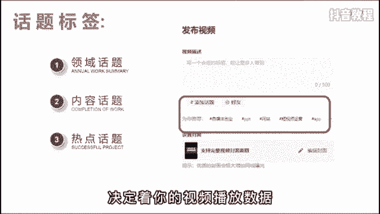
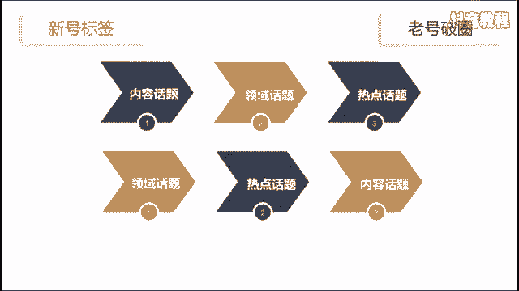

# 【2024最新抖音运营教程】分享花了2.1W买来的抖音课程，目前B站最新最完整的抖音运营教程，起号涨粉变现一条龙教学！ 小白交易收藏！ - P14：基础篇丨抖音的话题标签该怎么选择 - 老张运营 - BV16J4m157ww

话题选不好，流量少一半，很多人啊觉得话题这个功能鸡肋没啥用，不重视，但我劝你可别小看这个功能，这其中隐藏着大大的心机。

用好了能够帮助信号快速完成了启动，因为添加一个合适的话题，能够帮你带来更多的曝光机会和精准流量，一般来说啊，话题分为三类领域话题内容话题和热点话题，领域话题用来覆盖行业大类内容，话题细分识别人群。

热点话题就是蹭流量的话题，选择的优先级与正确与否，决定了你的视频播放数据。

举个例子来说，你是做萌宠吃播的账号，分别对应的话题啊，就是领域宠物日常内容，边牧直播热点，宠物出道计划这个热点话题啊，有可能是时下热点，也有可能是平台的流量扶持计划，需要你自己去找找。

但是呢你可千万别看别人用什么你就用什么，很可能那个热点已经过时了，具体方法呢就是登录电脑版的抖音服务中心，选择创作灵感，点击创作素材，再点击热门话题就可以看到了，这里面都是时下热门的话题标签。

你可以根据自己的行业来选择，比如刚才说的萌宠，你就可以选择动植物，排名第一的就是宠物出道计划，然后点击后边的发布视频，就可以自动打上该话题了，在关于话题标签啊，另外还有两种情况。

第一就是新号器则内容话题大于领域，话题大于热点，话题，原理是，让系统快速精准的知道你究竟是干什么的，盲目的蹭热点，有可能会影响你的标签，第二是老号破圈，则领域话题大于热点，话题大于内容话题。

原理呢是老号的流量比较稳定，需要突破领域的限制，破圈获得更多的流量推荐。

但是呢就算学会了这个方法，你也不要指望一定能上热门，任何的运营技巧都是锦上添花的，操作最重要的还是要打磨你的作品质量，不然就会像标题党一样虚有其表，会出现点开没两秒就立马关闭的情况，你还是涨不了粉好了。

如果你还有其他的运营问题，可以在评论区向我提问。

