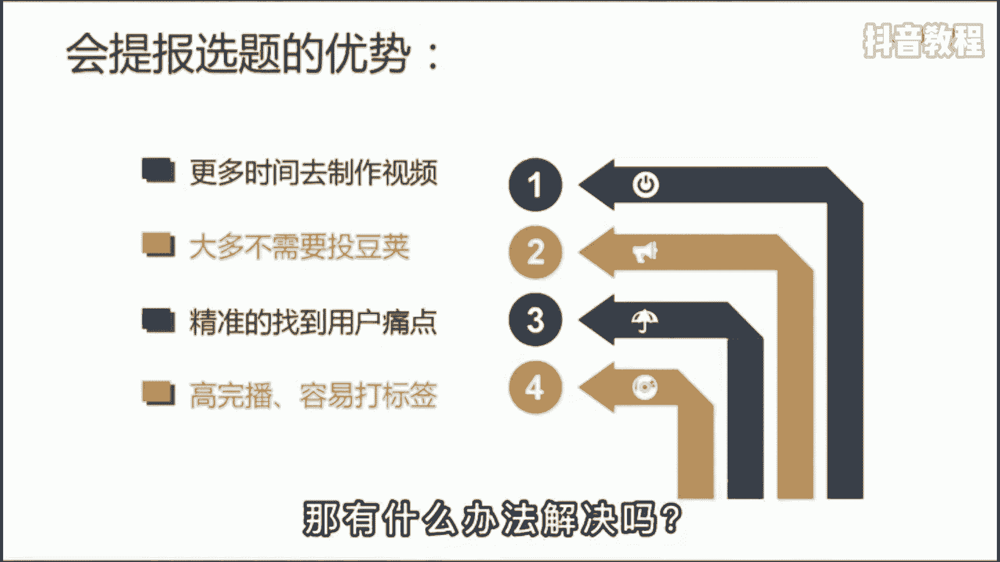
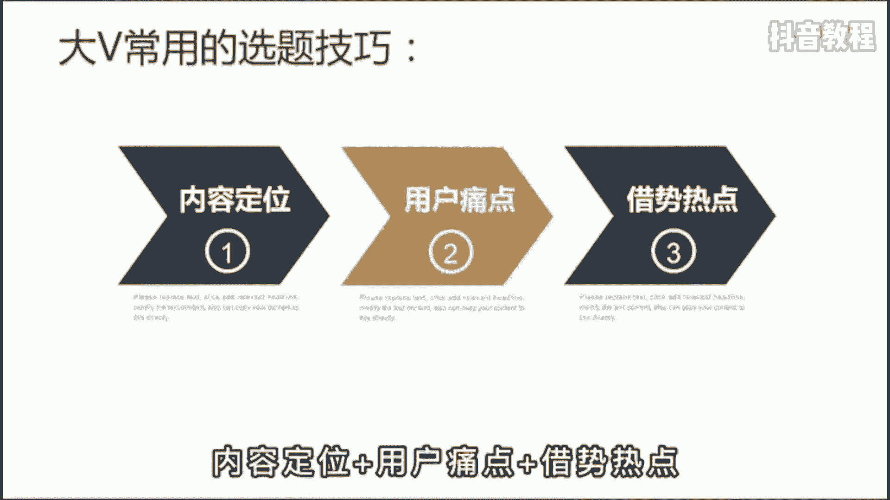
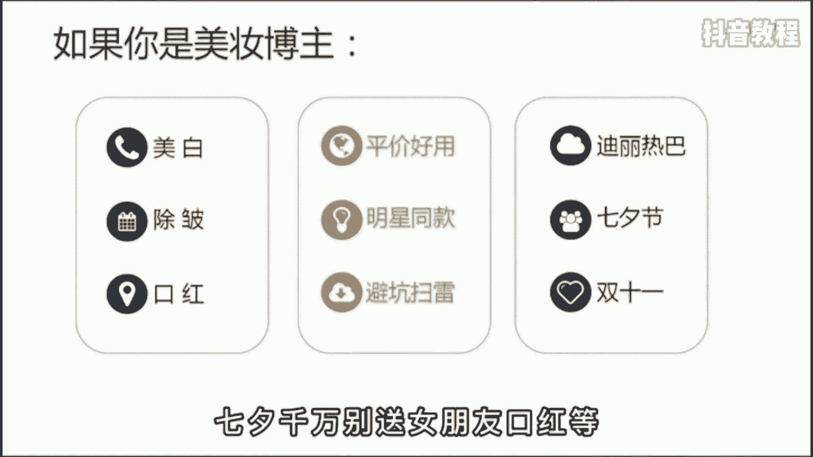
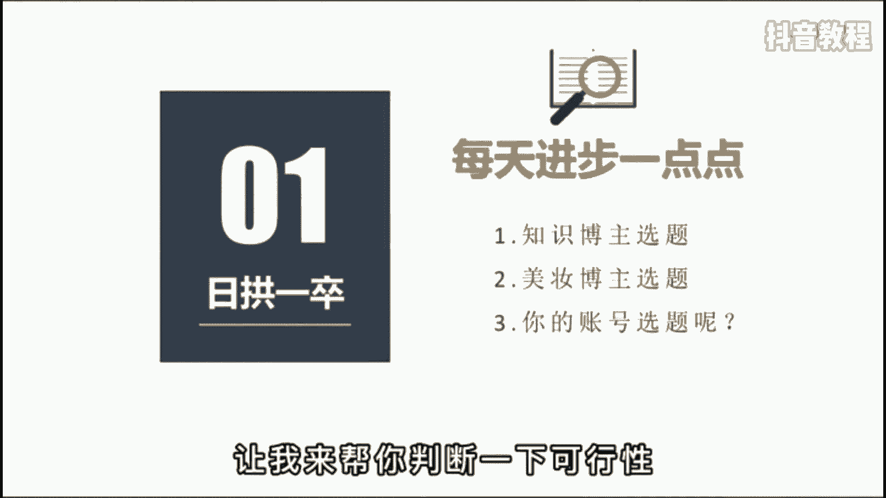

# 【2024最新抖音运营教程】分享花了2.1W买来的抖音课程，目前B站最新最完整的抖音运营教程，起号涨粉变现一条龙教学！ 小白交易收藏！ - P17：基础篇丨新手如何做好内容定位 - 老张运营 - BV16J4m157ww

你现在做抖音流的泪都是定选题，是脑子里进的水，是不是想选题，想的头都秃了，不知道明天该发啥，今天教你一套公式，一分钟帮你解决这个苦恼。

会找选题的人啊，他会有更多的时间去制作视频，每天发三条，一个月就是九条，靠堆料都能卷死，根本不需要偷偷加，而且会做选题的人啊，能比你更精准的找到用户的痛点所在，也更容易得到精准粉丝的驻足观看。

从而快速打上账号标签，那有什么办法解决吗。

当然有，这是一套啊，百万粉丝博主常用的选题技巧，为了方便理解，我把它总结成了一个公式，就是内容定位加用户痛点加解释热点。

用好这个公式，你的内容啊一定不会刀片，比如你想和我一样做一个知识博主，就得去挖掘一些行业的关键词，像播放量，粉丝量，定位选题等等，这些都是关键词，没有任何的主观描述，然后呢在这个基础上去寻找用户的痛点。

比如像便捷高效技巧教学内容输出，最后去蹭近期的热点，把它们进行任意的组合就可以了，那我们再把这个公式套在别的行业里再试一下，比如美妆行业内容定位是美白除皱口红，用户痛点呢是平价好用，明星同款避坑扫雷。

最后啊借势热点进行排列组合，比如迪丽热巴同款美白面膜推荐，七夕千万别送女朋友口红等等。

那以上啊，我已经举一反二了，至于反三就交给你了，你可以根据你的行业特性，把你的思考过程发出来。

