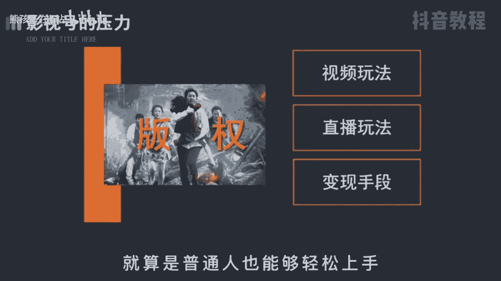
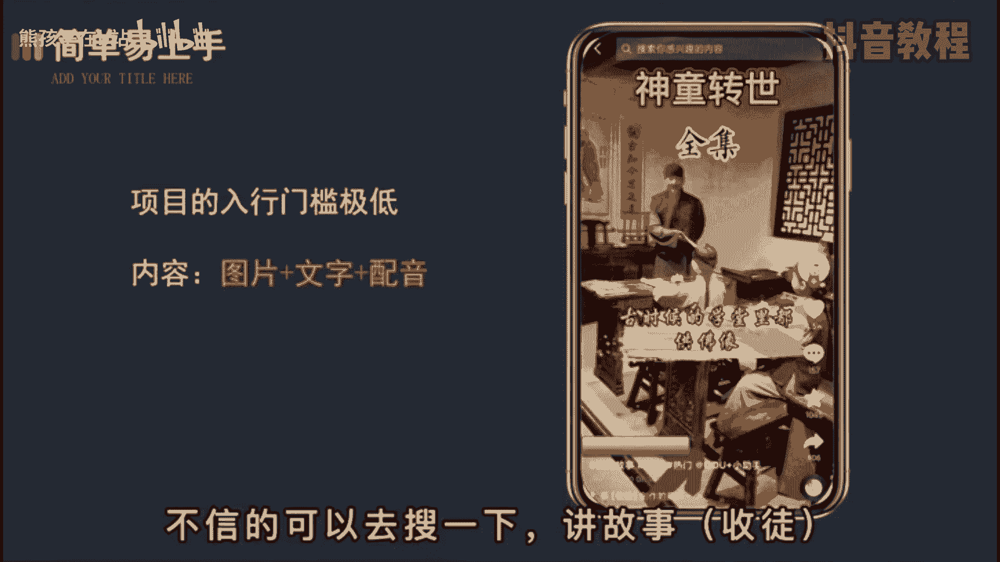
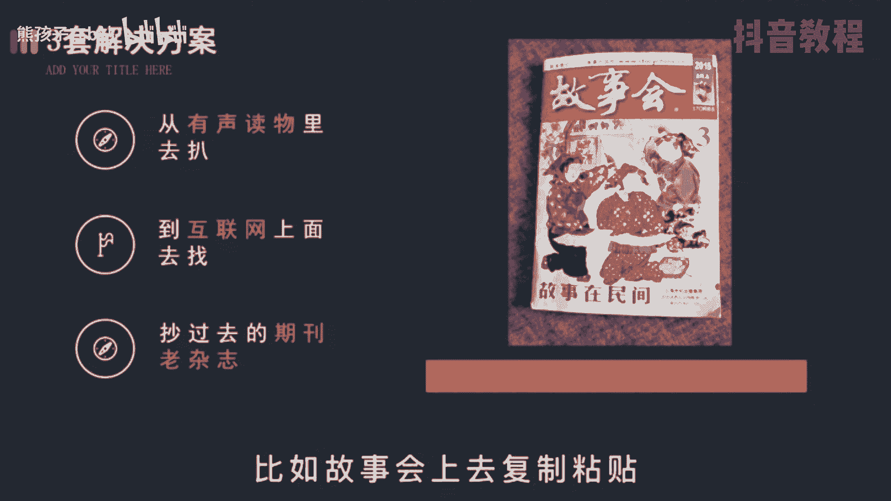
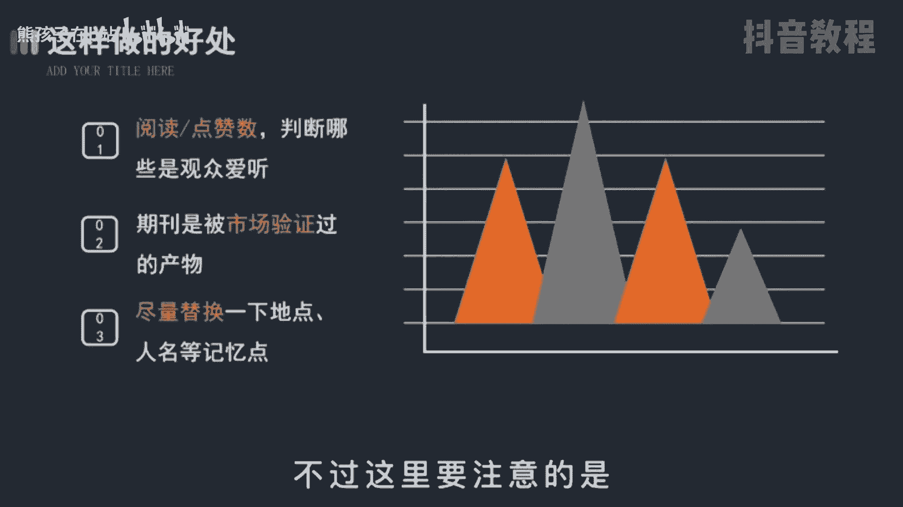
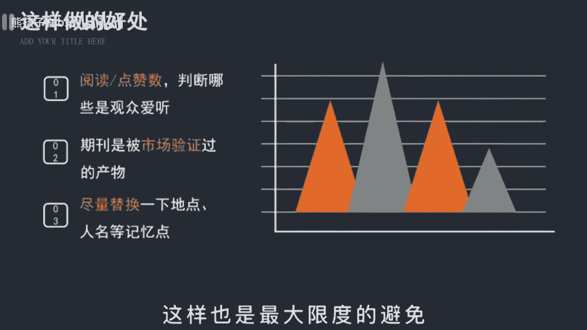

# 【2024最新抖音运营教程】分享花了2.1W买来的抖音课程，目前B站最新最完整的抖音运营教程，起号涨粉变现一条龙教学！ 小白收藏！ - P14：变现篇丨抖音故事号要怎么做 - 熊孩子在b站 - BV1wZ421E7Pj

🎼故事号是最近比较火的一个项目，类似于之前的影视号，但是收益呢比影视号要可观的多。影视号因为版权的问题，部分人啊面临着转型的压力，另外，平台给予的流量也越来越少。所以新手去做故事号会是一个很好的契机。

接下来呢我将分成三期视频，把故事号的短视频和直播的玩法以及变现的手段都拆解给你，就算是普通人也能够轻松上手。😊。

🎼首先啊这个项目的入行门槛极低，只需要一部手机，给一点时间即可。内幕上呢就是简单的图片，加文字加配音，图片甚至不用动，唯一动的只有字幕，不信的呢可以去搜一下讲故事，括号收图。

🎼在用户里面啊全欢是这类账号。😡，🎼那为什么这类账号既容易吸粉又容易变现呢？我知道人类之所以能够发展进步，就是因为有想象力。😡，🎼故事呢就是由想象而产生的。当人们听一个故事时就会想象画面。

这可比实际的影片更有看法。任何一个导演都导演不出你这版本。😡。

🎼回造项目本身要怎么做一个能变现的故事号呢？首先你需要解决故事的问题，这里呢给你三套解决方案。第一是从有声读物里面去扒，就是有些人啊听小说的地方，各种类型的情节都有，很方便。😊。

🎼第二呢是互联网上面去找各路大神曾经编过的故事，保质保量，童叟无欺。🎼第三呢是从过去的老杂志期刊上，比如故事会，上面是复制粘贴，看过的都说好。

🎼那前两种方法的好处呢是可以通过文章的阅读数点赞，判断哪些是观众爱听的东西，减少试错成本。另外呢，过去发表的杂志，比如工会，那可是被市场验证过的产物，多少人的青春都被他吸引过。🎼不过呢这要注意的是。

文章啊要尽量替换一下地名、人名等容易出现的第一点，不要直接照搬，有能力的呢就好洗下稿，这样能最大限度的避免未来的一个侵权风险的发生。

🎼当故事解决后，接着你就要去找与内容相匹配的图片，比如民间故事，就农村的图片。🎼其次呢是配音，现在啊有好多智能配音工具，比如配音家，很简单，你直接用就行了。🎼最后呢是字幕。

把做好的音频直接用简易进行文字识别，控制好算句，这样呢就省去了打字和排版的时间。

🎼而视频的发布时间一般是在中午的12点和晚上的10间以后。因为这个时间段一般是大家休息的时候，会更需要我们的故事和打发时间。😊，🎼值得注意的是啊，故事号的受众一般是中老年人，所以字幕音量都尽量大一点。

不要用浅色的字体，配音呢保持沉稳，缓慢清晰即可。这些细节啊会帮助你更快的吸引粉丝的喜爱。那以上呢就是一个完整的故事号制作流程了。😊。

