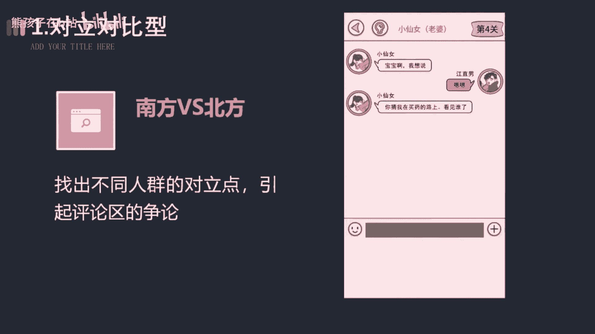

# 【2024最新抖音运营教程】分享花了2.1W买来的抖音课程，目前B站最新最完整的抖音运营教程，起号涨粉变现一条龙教学！ 小白收藏！ - P20：变现篇丨游戏号怎么提高播放量 - 熊孩子在b站 - BV1wZ421E7Pj

🎼你以为录个屏就能玩好游戏发行人计划，没收益，那是你不会编故事，大家游戏画面都一样，但你不会编故事就是发的再多也是徒劳。不同的游戏使用不同的文案，才会让流量收益最大好。为此呢我花费了3天。

看了200多条游戏视频，总结出了这套游戏文案的写法。学会后，你就能轻松抓住用户的注意，达成5秒万播，让你的作品获得更多的推荐。😊。

🎼第一种对立对比性，南方VS北方男生对女生白羊座对狮子座，找出不同人群的对立点，引起评论区的争论。你在模棱两可的占个队，进一步啊提高作品的互动数据。比如这样女生的送命题啊，没有男生能回答上来。

宝宝嗯在哪，你猜我去买药的路上看见谁了？😡。

🎼第二种请求帮助性。假装你是个菜鸟，请求大神玩家帮你通关，让观众产生想要试一试的冲动。进而呢点击游戏试玩，达成我们的目的。比如这样。

🎼哼你们骗人，红色加黄色加白色，根本就调不出皮肤的颜色。快看我按照你们的方法挑出来的颜色根本就不对。😡，🎼第三种，蹭热点型，用热门动漫或游戏主播开场，吸引扩大用户的范围，突破小学生的圈层。

🎼像一条小团团，张大仙这种人尽皆知，你完全可以拿来用。比如这样放兑换5月11大量日血航的玩家则消息刷屏，张大仙的粉丝在这游戏里有特殊福利。第四种玩法解说型装备介绍人物介绍技能介绍关卡介绍。

反正啊就是围绕着游戏的玩法去解束，最好呢能通过你的解说让大家发现游戏有趣的一面。比如这样，兄弟们兄弟们，咱们第三个SSR也是终于出了呀，这一次抽到的是工程师艾骂，单从技能不难看出这是个强力辅助。第五种。

老色批型，利用游戏衍生的cosplay去吸引眼球，毕竟啊漂亮的小姐姐人人都爱，这可是啊流量密码。😊。

🎼发作品的时候记得艾特我一下，比如这样。🎼you go。🎼第六种，警告诱惑性，通常啊用肯定和疑问的语气搭配上游戏最有看点或者可玩性最强的那一关来调取观众的胃口，是一种万能的开场方式。

比如这样你千万不要玩这个没事走两步，否则你很容易连走路都不会了。第七种，真人出尽性。在游戏原剧情的基础上进行二次创作。把自己啊带入到游戏角色中，引导观众点击试玩，这个呢是最推荐的方式。

能有效的打出差异化，避免画面的重合。比如这样游者的力量都是一路修炼来的，没玩过人者必须死配，你也玩过，那当然了，制作原创玩法，点燃战斗可槽。那以上呢就是小游戏制作的一个文案总结，相信你掌握好。

能帮助你更快速的获得视频推荐。好了，今天的内容呢就到这里结束了，我们下期再见吧。😊。

