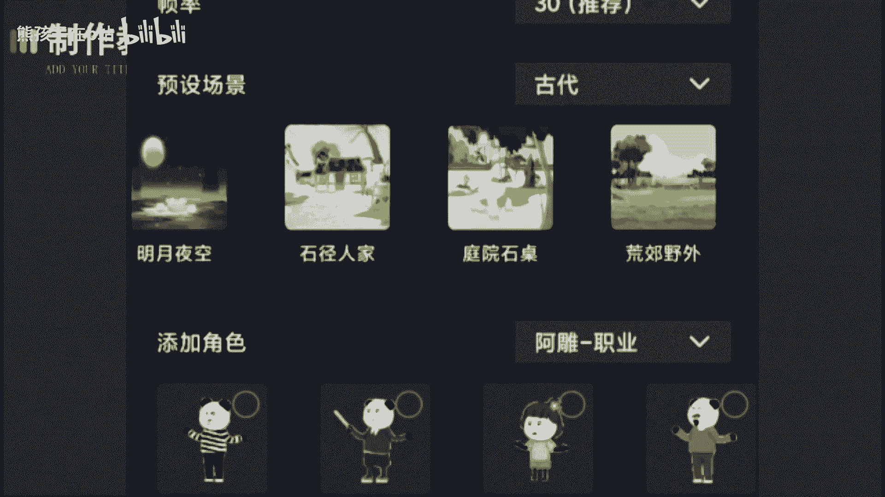

# 【2024最新抖音运营教程】分享花了2.1W买来的抖音课程，目前B站最新最完整的抖音运营教程，起号涨粉变现一条龙教学！ 小白收藏！ - P26：抖音沙雕动画玩法 - 熊孩子在b站 - BV1wZ421E7Pj

🎼这种沙雕动画的懒人做法，只有少数人才知道，不需要你会任何技术，也不用你编段子配音，就能让作品自带流量。😡，🎼虽然它看起来挺复杂的，似乎啊不是一个人就能完成的东西。但其实呢一部手机就能制作。

🎼在制作上，你只需要打开这个软件。😡，🎼选择合适的比例，抖音呢9比16，西瓜16比9，分辨率选1080P会清晰一点，帧率不动，场景里啊有4个版块。

🎼比如选个古代，再往右一拉，就能看到这个板块下全部的场景，角色啊也是一样。

🎼分类里有很多的角色模型，有沙雕的、武侠的、斗罗大陆的、奥特曼的非常丰富。

🎼当我们把这些都选择好后就可以开始制作了。它的操作方式啊跟手机剪映差不多。我们点击角色选择添加动作，点击播放看一下人物啊就会动了。如果不喜欢这个动作，你还可以更换动作，角色啊也可以再添加用来丰富情节。

然后导入音频，就可以合成出完整的动画，是不是很简单呢？😊，🎼接着啊再说一下配音，这才是沙雕动画的灵魂。教你一个懒人玩法，不需要自己编段子，也能火，还有收益值。😡，🎼这个方法呢就是开通款。

有一些聪明的博主已经开始用这个方法，你就去找一些搞笑的博主，直接用他的原声配音沙雕视频。😡，🎼这样做呀有三个好处。🎼第一是原创度极高，不会卡你的播放收益。第二就是你可以蹭这个大博主的流量。

有些人啊就喜欢到原声里看看别人的模仿视频有多好笑，这就给你带来了曝光。😊。

🎼第三呢，是省去了你的脑细胞，我用自己编段子去配音了。😡，🎼有的时间有了效率，你就能多制作一个账号，是两个号的流量缩引。🎼所以有事，你缺的不是资源，而是发现资源的眼睛。🎼好了。

今天的课程呢就到这里结束了，我们下期再见吧。😊。

