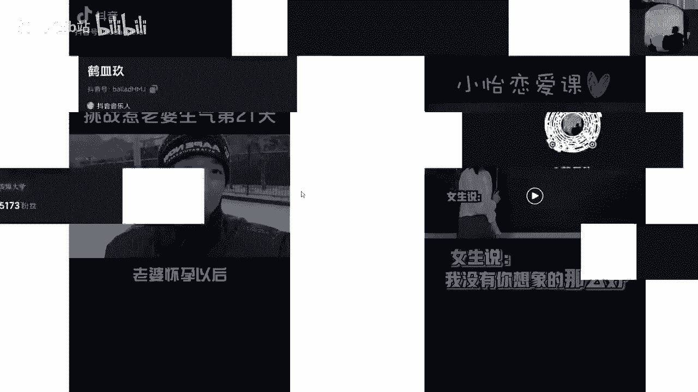

# 【2024最新抖音运营教程】分享花了2.1W买来的抖音课程，目前B站最新最完整的抖音运营教程，起号涨粉变现一条龙教学！ 小白收藏！ - P29：主题IP - 熊孩子在b站 - BV1wZ421E7Pj

什么是主题IP？我们接下来再看两个视频。

首先我们看左边这个老婆怀孕以后一直停更的惹老婆神气系列又回来了。老婆来老婆来打雪仗来来来来。😊，🎼我和孩子一块儿打一块儿打。う。

あ啊。

🎼抖音好啊，这是左边视频，我们再看右边视频。女生说我没有你想象的那么好，该怎么回复啊？没事，我不嫌弃你，人家不嫌弃你就不错了。应该说不管你好不好，我都喜欢你。😊，🎼注意，同学们，这是最容易扣分的一道题。

难就难在。接下来女生既可以明确拒绝你，也可以装作没有安全感，利用你的保护语，让你对她无条件包容，可谓是尽退自如啊。当女生说这句话时，最好的处理办法就是不表态，你只需要回复他三个字，明白了，然后果断撤退。

如果女生真想拒绝你，咱也算识趣儿，不再纠缠，但如果她对你有意思，那她心里肯定会非常不爽，她怎么不说话了，是不是误会我了。到时候女生会回来找你的。

哎，好了，这就两个视频我们都看过了。你们能有没有发现他们有一个老婆回比较共同的特点或比较相似的特点。首先我们来看啊挑战惹老婆生气的第二是1天这个视频。😊。

如果说啊你单纯不看上面这个文字啊，你就只看他跟他老婆这么嬉细打闹，好像没有什么特殊的地方啊，对不对啊，只是拍的一个日常的视频，他的镜头啊，包括说他整个画面也没有特别的好。😡，这招叫欲擒故纵。

你们总关心我们的这个视频内容。来，我们看一看啊，如果说他不加这个挑战，惹老婆生气的第21天，你可能看过之后就划走了，这是什么呀，我也看不懂，对不对？但他给了你一个主题。😊，他引导着你去看哎。

这是第21天，是不是还有第20天啊啊，是不是有更有趣的呀？这个没有趣没关系，我好想看看他的20天啊，他的19天他怎么惹老不生气的，对不对？这是他的一个主题啊，也就是说哈他现在有21天。

他接下来可能有22天、23天、24天。😡，大家能懂吧？啊，比如说之前比较火的，就是有一个嗯什么。嗯，阿拉雷的装修日记不知道大家有没有看过啊，就是阿拉雷这个人在北京租了一个买了一个什么小院儿。

完了之后他的装修。那么他通过这件事儿呢衍生出来了无数期的一个作品。那么这就是他的一个主题。啊，能懂吧？呃，围绕着惹老婆生气，围绕着装修日记这么个事儿，我们能延伸出来无数期的视频。😡。

那么这个小鱼蛋的同西也是一样的。😡，是不是小姨恋爱课，那他这个策划的就更绝了啊，这个小姨恋爱课他大概20多条视频呃，涨了多少粉丝来着，我有点忘了啊，啊，反正涨得很很厉害。因为他这个人设啊。

他整个这个账号策划的非常好。首先他的主题就什么小姨恋爱课对吧？那么其次的话呢，什么可能对于同学们来说，这个还是比较有用处的，对不对？有些啊直男他不太会追女生，对不对？还有就是特别感兴趣啊。

对于这个感情对于这个恋爱特别感兴趣，还有就是哎呀这个问题我好像之前遇到过呀，就特别有共鸣，对不对？他一举三得，那么其实这个视频拍起来也非常简单，一块小黑板放在那儿，我一天拍了个10条，对不对？

那这个啊就更绝了。那么我们现在啊主要关注的就是他的这个主题IP。😊，看到没有？其实我们会发现刚才那个啊主题IP上出现了一个什么问题，它没有一个明确的主题IP对不对啊？这个人记不太住，他的主题记不太住。

他唱了一首歌，那我听了之后觉得好听，我点个赞我就走了呗，对不对？我也不想看他昨天唱了什么，他明天再唱什么。😊，是不是那吸引不到别人。😡，所以说主题IP的存在呢是非常重要的。

好，那么主题IP我们怎么去取，这里也给到大家的方法了。😊，所以说啊大家在明确了商业定位之后，我要去做内容定位了。我选择我做医美行业了，不要着急先去拍内容，里面还有很多很多东西需要我们1。1点填充。😡。

知道吗？那我们首先来填充第一个叫叫做主题IP那这个方法加这个原则大家先来看一下，是不是有点看不懂，是不是有点看不懂。😊，是不是？他说老师为什么隔几页PPT就给我这种让我看不懂的东西。😡，好。

我们先把这个啊这个概念先看一下啊，接下来给大家举几个例子，大家就知道了。😊，好吧，这里我就不解释了啊。解释的话大家看这个文字也是啊大眼瞪小眼。😊，明白。😊，然后我们接着来看给大家举的这几个例子哈。😊。

你看我们看得懂是吧？你看我们取这个啊叫什么主题IP的时候，也就是说我们找主题的时候啊，一般都用这几种方式，名字加垂直领域、人群加垂直领域、地域加垂直领域，情景加垂直领域。😊，看到没有？

那么这里呢给大家举个例子。来首先第一个名字加垂直领域啊，第一个是某某的北漂日记02集老韩摄影教学第12期猪猪小姐姐的撩地指南之某某某某某。啊，动漫名字就是我的这个个人嘛。哎，我叫什么？我叫老韩。

是不是这个是猪猪小姐。后面的话垂直领域就是你看他的垂直领域是北漂北漂日记。那他的垂直领域呢是摄影教学。那猪猪小姐叫垂直领域呢是撩地指南，对不对？能懂是吧？然后接下来看这个人群加垂直领域。😊。

快别人家男朋友的拍照技巧。第三期，宝妈育儿的小技巧之是什么什么新手开店避坑指南。能看到吧，人群就是前面别人家的男朋友，宝妈，还有新手，这都属于人群。那么后面加垂直领域就是拍摄技巧啊，育儿技巧避坑指南。

是不是？😊，能懂吧？那么再接下来再看啊地域加垂直领域啊，西藏自驾之旅的第50天环球旅居日本站，然后广州美食之火锅片。😊，啊，这个也很容理解啦，地域就是西藏啊哈日本然后什么啊火锅啊。

是什么广州是不是都是这种地域，再加垂直领域，就是自驾环球旅居，然后美食，是不是？那接下来就是场景加垂直领域。😊，那办公室迷惑行为之。哎，为什么总有人脚臭，对不对？😡，办公室迷惑行为，还有儿童房风格装修。

以及呢婚礼现场的创意小心思。那这些都是场景在家垂直领域。那这些呢都是呃想主题的一些小方法。它这题的小方法，其实大家可以啊记一下，对不对？大家可以截个图啊啊，或者是什么呀，就是记住它啊。

以后我们再去想主题的时候呢，就比较明确了，对不对？就比较明确了。😊。

