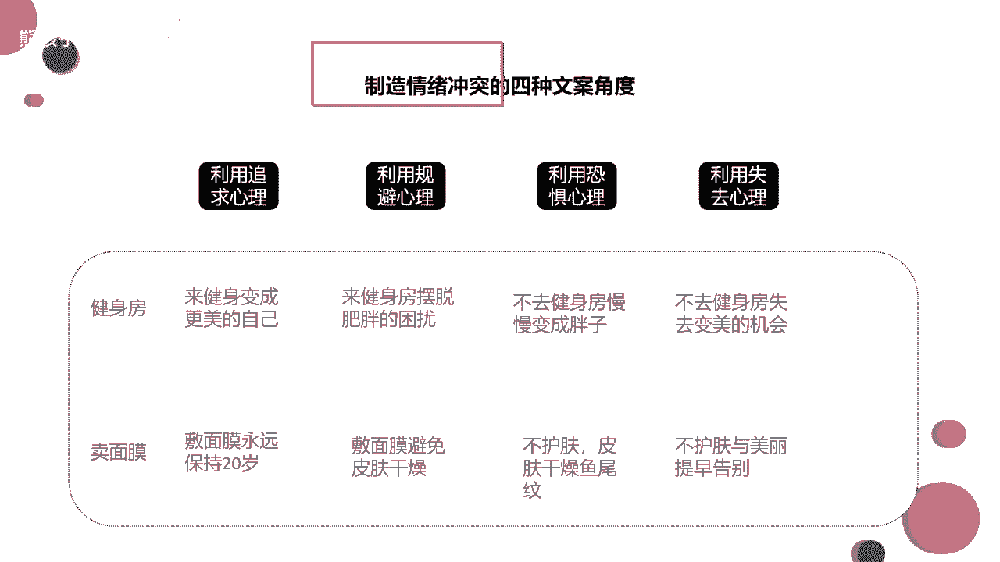
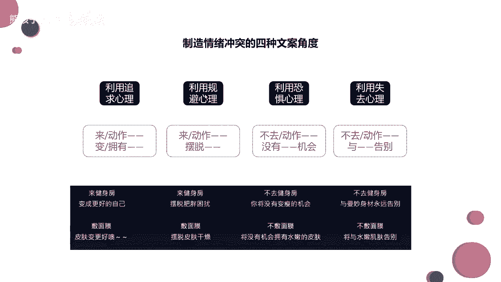
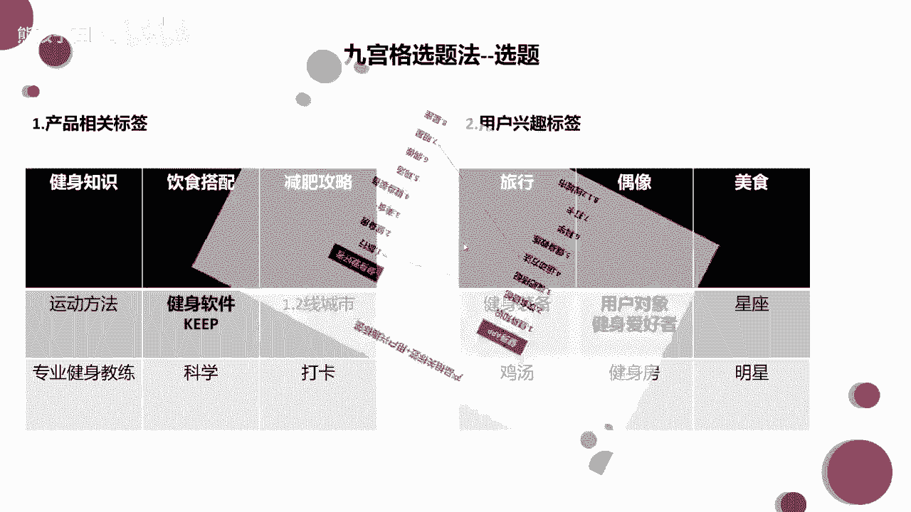
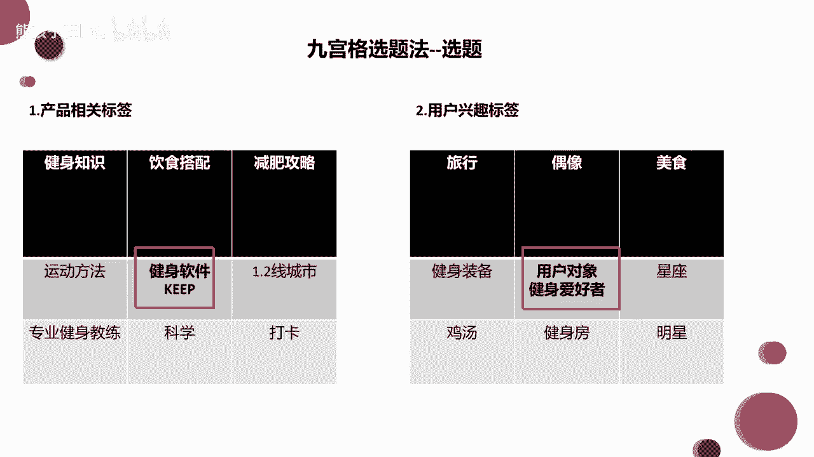
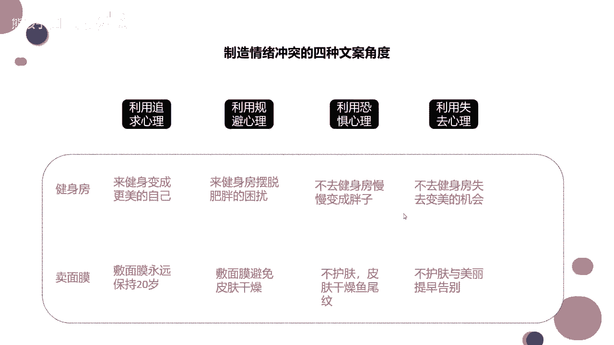

# 【2024最新抖音运营教程】分享花了2.1W买来的抖音课程，目前B站最新最完整的抖音运营教程，起号涨粉变现一条龙教学！ 小白收藏！ - P30：制造情绪冲突的十种文案角度 - 熊孩子在b站 - BV1wZ421E7Pj

来看看啊，选题很重要，选完题之后，我们才能去做这种脚本结构，去做这个什么呀，去做这个拍摄。来，我们可以看一下。来可以看一下。那么我们同样的一句话呃，用不同的方式说出来，它表达的效果其实就不太一样。对吧。

你比如说啊你比如说我想让一个人去健身，我想让他去瘦身，我直接跟他说，来健身房变成更美的自己。那其实这句话就有有一点点什么有一点点五官痛痒，对不对？来健身房变成更美的自己，你就好像跟我说说了一句广告词。

什么做沃尔沃更安全。😡，是不是做沃尔沃更安全。好，就说了一句这样的广告词。那如果你换句话说呢啊，如果你不去变健身房，你就失去了变美的机会啊，你去用这种失去心理去恐吓心理去告诉用户的话呢？😡。

他会在他的心里形成一种紧迫感，形成一种紧迫感。对不对？😡，就算你卖面膜，你告诉他敷面膜永远保持20岁，也是干干巴巴的一句话，对不对啊？什么弹弹弹弹走鱼尾纹。😡，也是相当于这样的一句广告词。

那如果你告诉他啊，你什么啊，不护肤的话，不尽早敷面膜的话，你就会长什么样的鱼尾纹啊，长什么样的痣，长什么样的斑，这个斑是永久不可去的。如果你用这种心理去跟他讲的话，哎，他可能就会重视一点了，对不对？

这个就是同样的一个选题。你用不同的话去说出来，或者你用不同的文案去表达的话啊，给到用户心里的这种暗示是不一样的。这个大家能知道吧，能懂吧？就好像说我们也是双十一在抢购的时候啊，那个呃优惠的信息说哎。

你今天买我的东西，我给你打5折啊，如果说这个时候再给你加上一个刺激，就是这个打5折的优惠仅剩下两个名额了，你就会马上下单。然后第一个你如果特别想买，你可能还等到12点啊，等到那个还差10秒钟。

12点的时候，你去买，对吧？这两种造成了刺激它是不一样的。😡，每天看大鹏的各整头一句话就是。😊，哎，我喝口水啊。😊，和主播带货是一个道理。这样拍你可以卖断货。😊，是啊，都是这样都是这样。😊。

所以说你现在大熊，你想想刚才你说的那个文案，你说的刚才那个文案是什么？如何科学的健身？😡，你就会发现，其实这样的一句话也是五关痛痒的，对不对？哎，大家心里想可能能想到，但是真的去实操的话。

大家可能有点做不到。哎如何科学的健身。就好像是刚才我说的啊，就是敷面膜永远保持20岁，它是一个道理。如果你告诉他，如果你不科学的健身，你会造成什么样的结果。😊，对吧你会造成什么样的结果啊。

你的就是如果你不健身，你过了呃过了多长时间之后啊，就是长期的劳累啊，长期坐着你就会变成一个什么叫什么啊腰间盘突出了什么的，可能没有那么夸张啊。😊，啊，对不对？来。基本上就是这个道理。

同样的一同样的一个选题，用不同的方式，不同的心理去说出来的时候，给用户造成的那种情感的冲突，情绪的冲突也是不一样的。也就是说我们在这里要制造情绪的冲突。

啊，那么这里还有啊。啊，制造这种情绪冲突呢。其实它是有几个呃就是模板可以去使用的啊，可以去使用的。其实前面几个模板这真的不是特别的好，我都拿它来做对比了啊。但是呢有些行业也是可以去使用的。

我觉看行业可以可以去使用的。而是后面的话恐惧心理，失去心理啊是会经常使用的，但是也不要特别频繁。如果特别频繁的话，也会给用户造成就是不太好的心理啊，大家能懂吗？好了啊啊。

这个的话大家其实可以稍微的记一下，稍微记一下。因为这个学会了之后呢，你可以用在呃你任何的视频里面，任何视频里面。这样健身塑造什么水蛇腰，忍受不了一时身体的疼痛，会成为你终身的疼痛。

我我觉得你们可以去那个奥美公司，奥美是一个非常有名的广告公司啊，它的嗯嗯它的名气主要来源于它的广告文案。我觉得你们都可以去了。😊，好了啊，我们现在就先暂时把这个呃选题这块先讲到这里啊，大家要。😊。

记录一下的，或者要学会的呢是我们这个九宫格选题法。你可以把这里带入任何不同的一个产品，然后不同的用户啊去把这些东西延伸开。延伸开之后呢，利用刚才连连看的方连连看的一个方式，我们去给他做一个呃选题。

做一个选题。

好吧。😊，好，那我们接着往后讲啊，还有9分钟啊，讲的东西不是特别多了。

